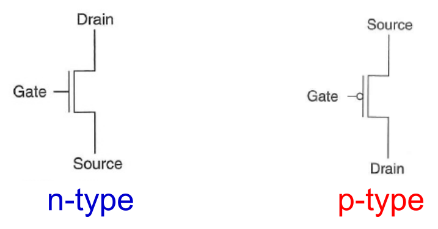
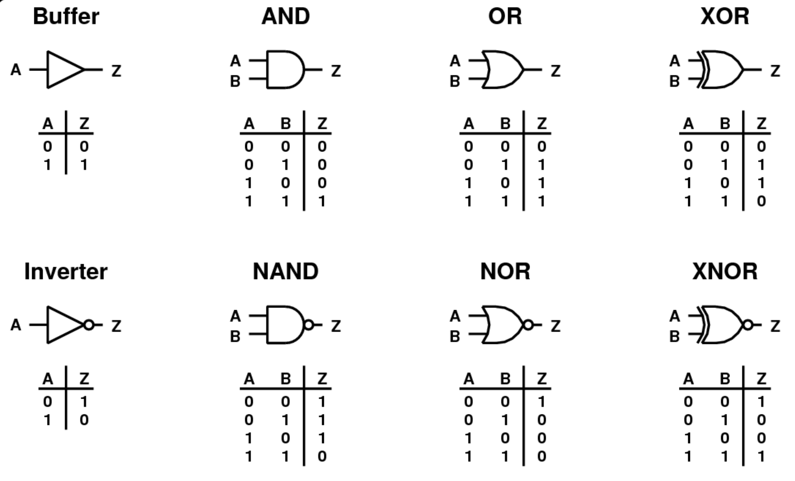
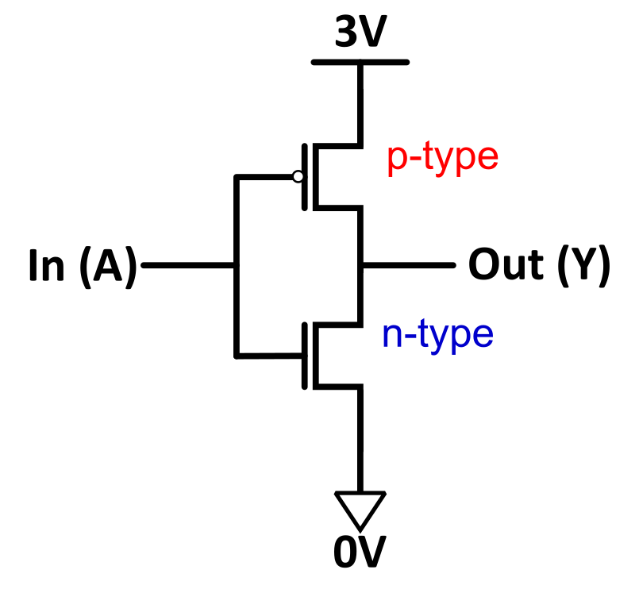
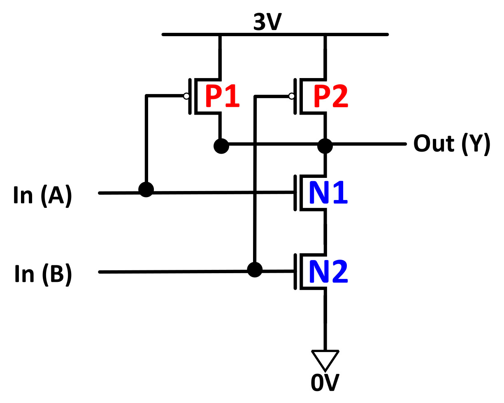
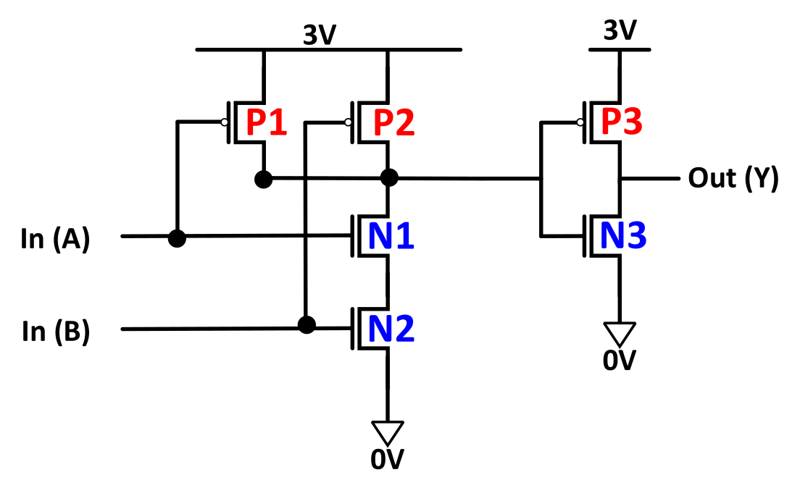
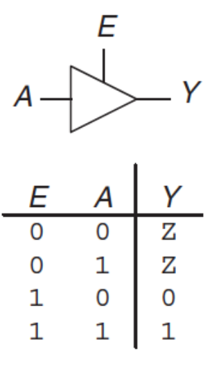
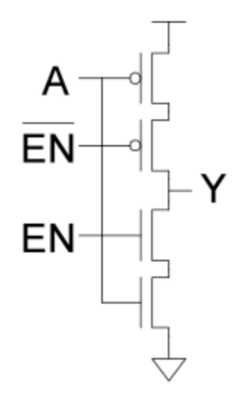

## Transistors & CMOS Logic

- **Transistors**: Fundamental building blocks of modern computers.
    - Act as simple logical switches (abstracts away complex analog physics).
- **MOS Transistor**: **Metal-Oxide Semiconductor**.
  
    - **N-type**:
        - **Gate = High Voltage (3V)** $\rightarrow$ **Circuit Closed** (Conducts/ON).
        - **Gate = Low Voltage (0V)** $\rightarrow$ **Circuit Open** (OFF).
        - Passes 0s well (**pulling down**); passes 1s poorly.
    - **P-type**: Exact opposite behavior.
        - **Gate = Low Voltage (0V)** $\rightarrow$ **Circuit Closed** (Conducts/ON).
        - **Gate = High Voltage (3V)** $\rightarrow$ **Circuit Open** (OFF).
        - Passes 1s well (**pulling up**); passes 0s poorly.
- **CMOS (Complementary MOS)**: Technology combining N-type and P-type transistors.
    - **Pull-up network (PMOS)**: Connects output to power (3V).
    - **Pull-down network (NMOS)**: Connects output to ground (0V).
- **CMOS Gate Rules**:
    - **Parallel connection**: Represents **OR logic** (only one needs to be ON).
    - **Series connection**: Represents **AND logic** (all must be ON).
    - Exactly one network must be ON at any time.
    - **Short Circuit**: Both networks ON simultaneously $\rightarrow$ burns power/damages circuit.

## Voltage & Logic States

- **Digital Abstraction**: Electrical voltages mapped to binary values.
    - **0V (Ground)** $\rightarrow$ Logical **0** (False).
    - **3V (Power)** $\rightarrow$ Logical **1** (True).
- **Floating Output (Z)**: Both CMOS networks OFF.
    - Output is undefined/disconnected (open circuit).

## Logic Gates

- **Basic Gates**:
  
    - **Buffer**: Passes input unchanged.
    - **NOT (Inverter)**: Inverts input.
    - **AND / NAND**: Output 1 if all inputs 1 / Output 0 if all inputs 1.
    - **OR / NOR**: Output 1 if any input 1 / Output 0 if any input 1.
    - **XOR / XNOR**: Output 1 if inputs differ / Output 1 if inputs match.
- **CMOS Implementations**:
    - **Inverter**: One P-type top (pulls up to 1), one N-type bottom (pulls down to 0).
      
    - **NAND Gate**: Two P-types in parallel (top), two N-types in series (bottom).
      
    - **AND Gate Inefficiency**: Built via **NAND Gate + Inverter**. CMOS is inherently **inverting logic**, making AND gates larger (6 transistors) than NAND gates (4 transistors).
      
- **Tri-State Buffer**: Gateable switch preventing short circuits on shared wires.
  
    - Inputs: Data, **Enable (E)**.
    - $E = 1 \rightarrow$ Output = Data.
    - $E = 0 \rightarrow$ Output = **Floating signal (Z)**.
- **Shared Bus**: Common communication wire connecting subsystems (e.g., CPU and Memory).
    - Tri-state buffers dictate access $\rightarrow$ ensures **at most one component is enabled** at any given time.

## Power, Latency, & Scaling

- **Latency**:
    - **Series connections** slower than **parallel connections** (increased resistance over effectively longer wire).
- **Power Consumption**:
    - **Dynamic Power**: Energy to charge capacitance during signal flips (0 $\leftrightarrow$ 1).
        - $P \propto C \cdot V^2 \cdot f$.
        - **Voltage ($V$)** has a cubic/quadratic impact $\rightarrow$ lowering saves massive power but reduces performance.
    - **Static Power**: Consumed without signal changes (caused by **leakage current**). Dominant in scaled-down chips.
    - **Energy**: Power integrated over time (dictates battery life).
    - **TDP (Thermal Design Power)**: Maximum expected heat dissipation (dictates cooling requirements).
- **Moore's Law**: Component count on an integrated circuit doubles approximately every two years.
    - Drives down manufacturing cost per component.
    - Sustained via new materials (Copper, Hafnium Oxide) and **Extreme Ultraviolet (EUV)** lithography.
