## General Logic

- **Types of Logic:**
	- **Combinational**: **Memoryless** circuits. Outputs dependent strictly on current inputs.
	- **Sequential**: Circuits with memory (history). Outputs dependent on current and past inputs.
- **Logic Circuit Specifications**:
    - **Functional Specification**: Input-to-output relationship (unique mapping, no memory).
    - **Timing Specification**: Delay between input changes and output responses.

## Logic Simplification

- **Goal**: Reduce gate/input counts $\rightarrow$ improves **hardware area, cost, latency, energy**.
- **Uniting Theorem** ($F = A\overline{B} + AB = A$): Eliminates redundant variables (input changes without affecting output).
- **Don't Care (X)**: Input state does not affect output.
- **Karnaugh Maps (K-Maps)**: Pictorial method for visual logic simplification.

## Basic Combinational Blocks

- **Decoder**: **Input pattern detector**.
  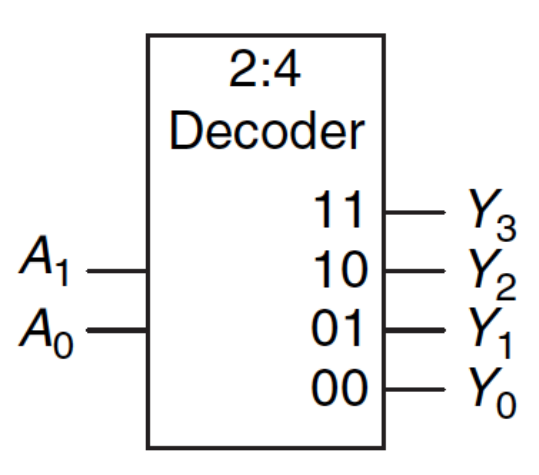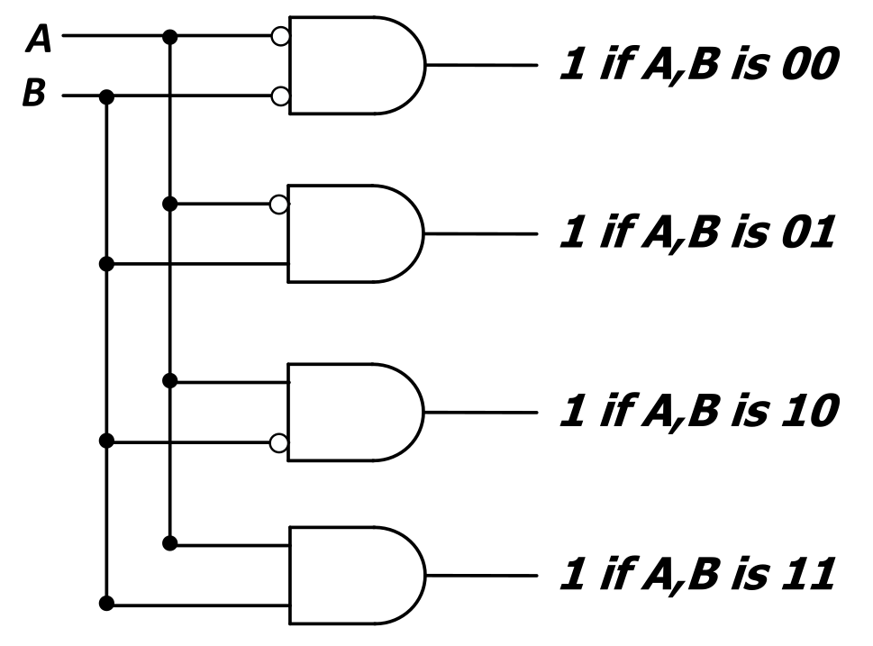
    - $N$ inputs $\rightarrow$ $2^N$ outputs.
    - **One-Hot Output**: Exactly one output is 1 (matches input pattern), rest are 0.
    - Used for: **Memory Address decoding** (row selection), **Instruction decoding** (opcode translation).
- **Multiplexer (MUX)**: **Selector**.
  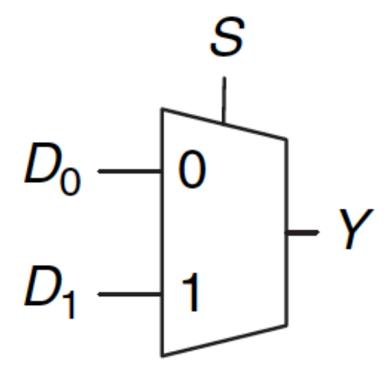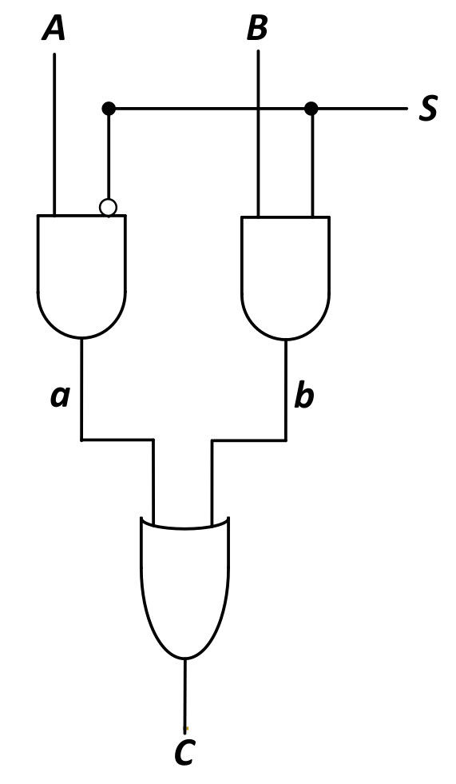
    - Routes exactly one of $N$ data inputs to a single output.
    - Requires $\log_2 N$ **select bits**.
    - Modular construction (e.g., 4:1 MUX from three 2:1 MUXes).
- **Lookup Table (LUT)**: Truth table mapped into hardware via MUX.
  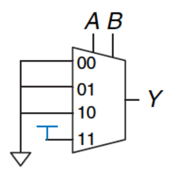
    - Data inputs hardwired to constant truth table outputs (0/1).
    - Dynamic variables act as select lines.
    - 3-input LUT (8:1 MUX) implements *any* 3-bit logic function.
    - Foundation of **FPGAs (Field Programmable Gate Arrays)**.

## Advanced Combinational Blocks

- **Full Adder**: Adds two bits ($a_i$, $b_i$) and carry-in ($carry_i$).
  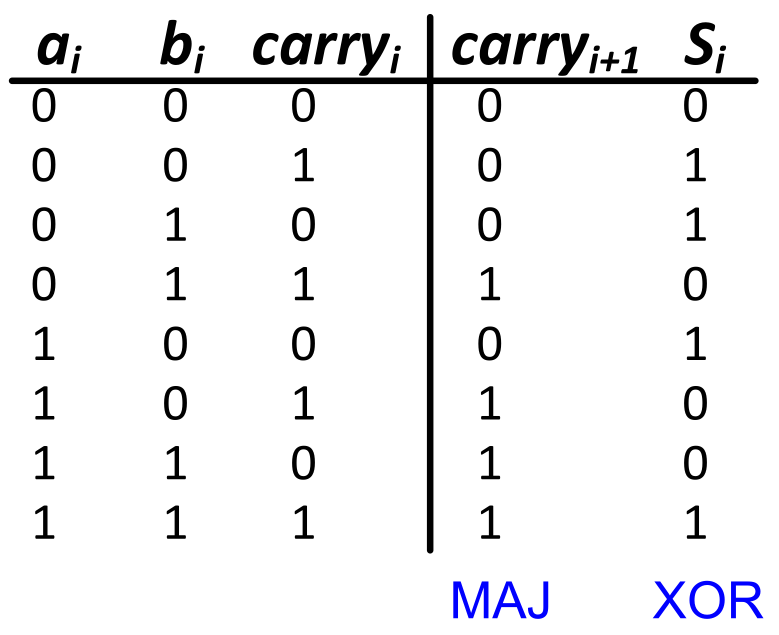
    - **Sum ($s_i$)**: **3-input XOR function**.
    - **Carry-out ($carry_{i+1}$)**: **3-input majority function** (1 if $\geq 2$ inputs are 1).
- **Adder Architectures**:
    - **Ripple Carry Adder**: Chains 1-bit full adders. High latency (carry sequentially "ripples" upwards).
    - **Carry Lookahead Adder**: Uses **logic specialization** for fast parallel carry calculation (trades larger area for higher speed).
      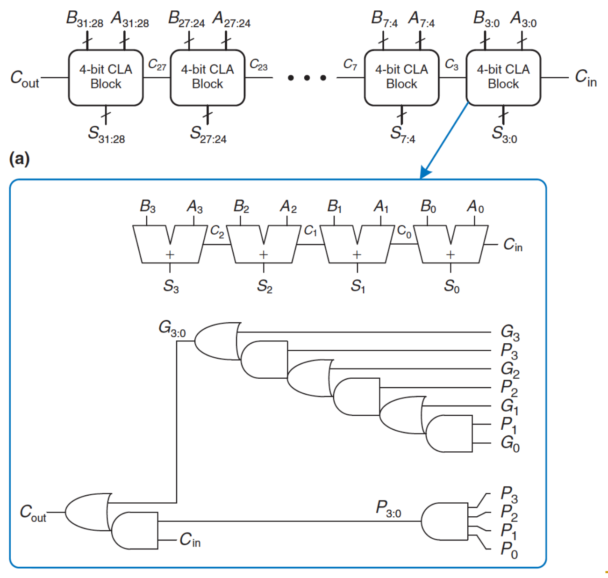
- **Programmable Logic Array (PLA)**: Generalized structure for two-level SOP ($N$-input, $M$-output).
  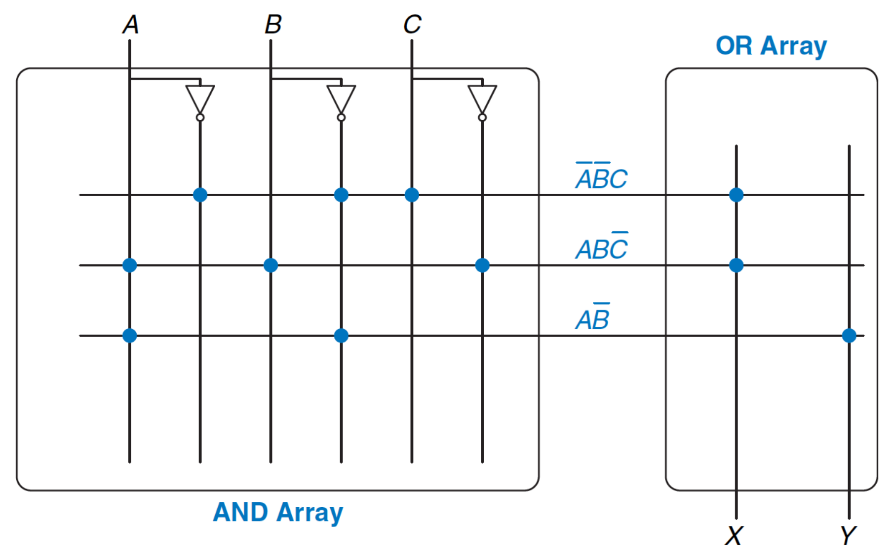
    - **Array of AND gates** (generates minterms) $\rightarrow$ **Array of OR gates** (sums minterms).
    - Requires $2^N$ AND gates.
    - Programmed by connecting specific AND outputs to OR inputs.
- **Comparator**: **Equality Checker** for two $N$-bit values.
  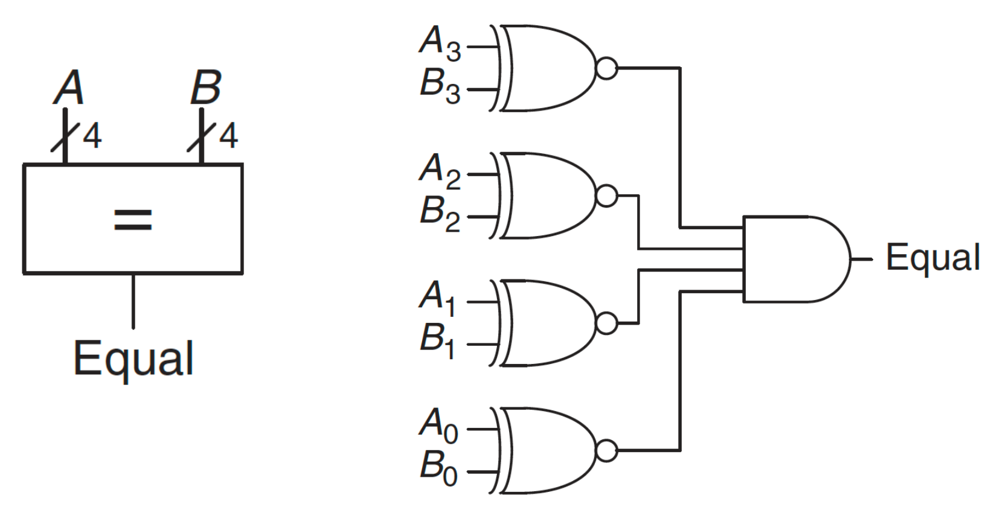
    - **XNOR gate** per bit pair (1 if matching) $\rightarrow$ combined via massive AND gate.
    - Native PLA implementation inefficient (necessitates custom blocks).
- **Arithmetic Logic Unit (ALU)**: Centralized module for arithmetic (ADD/SUB) and logical (AND/OR) operations.
  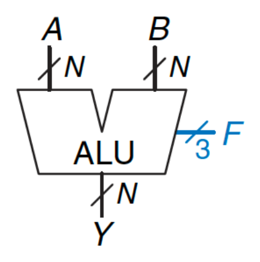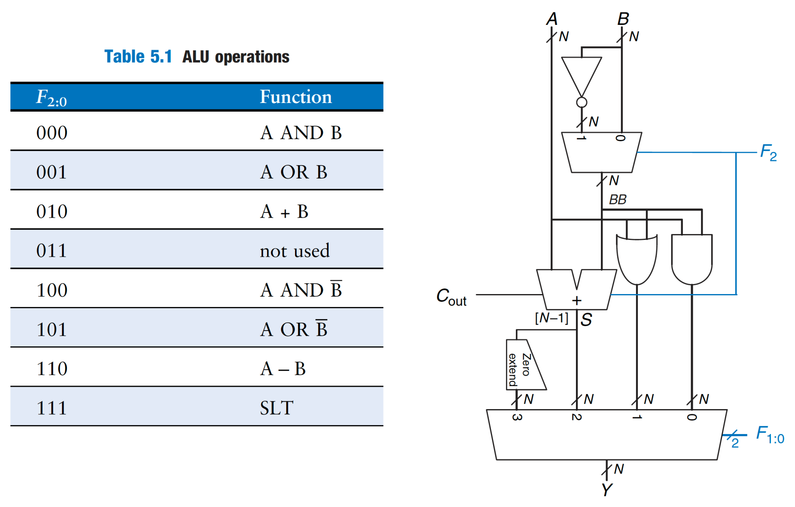
    - Internal MUX uses control input to select exactly one function at a time.
    - Enables **modular processor design**.
