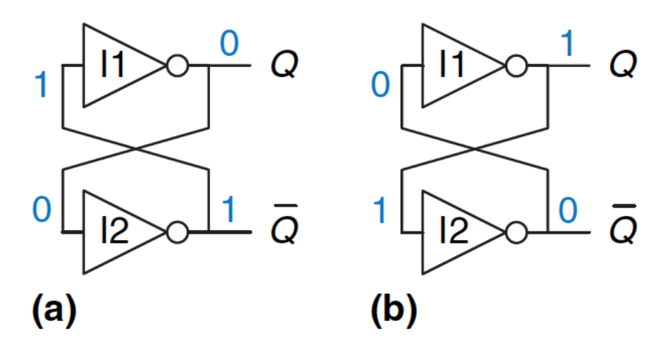
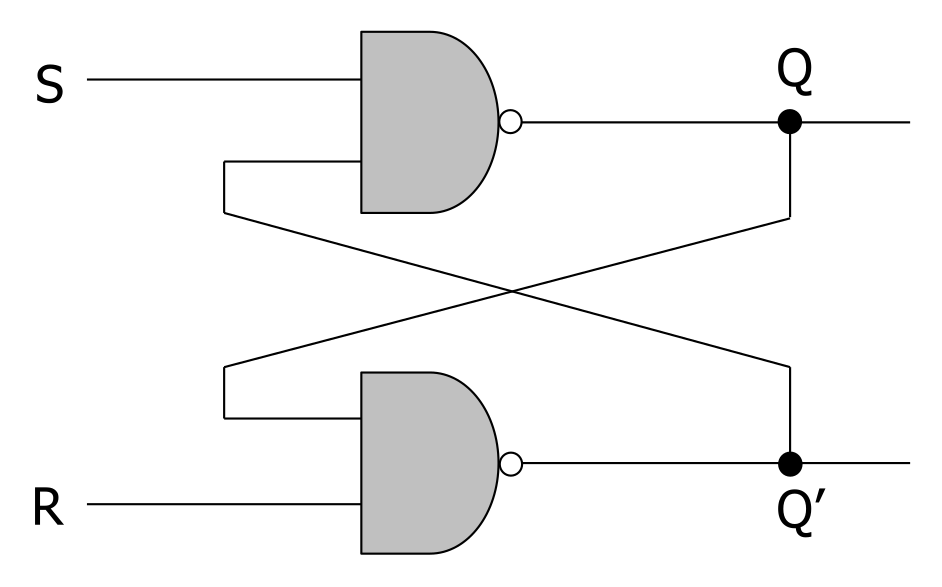
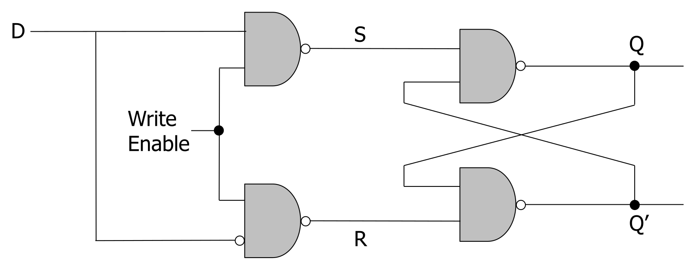
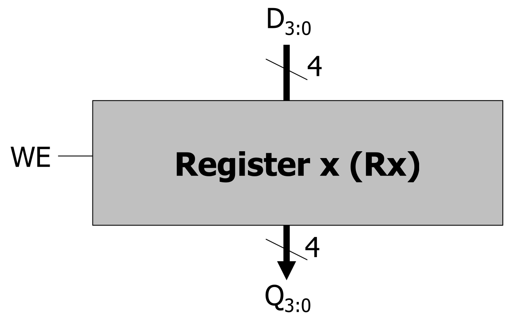
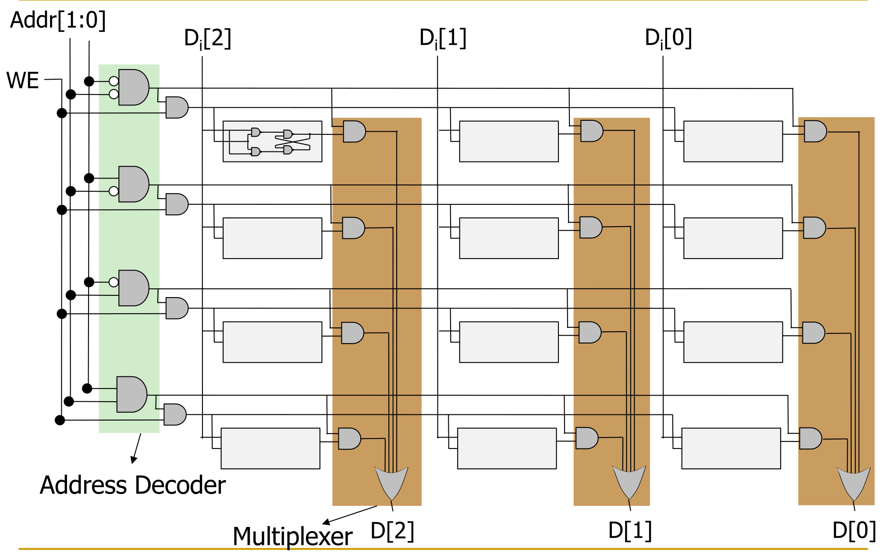
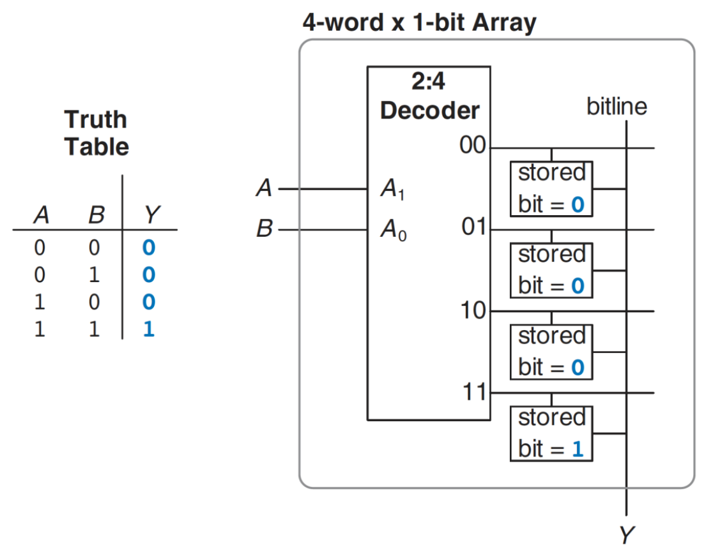
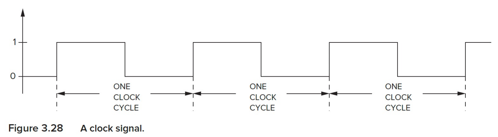
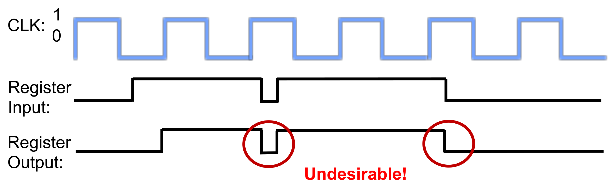
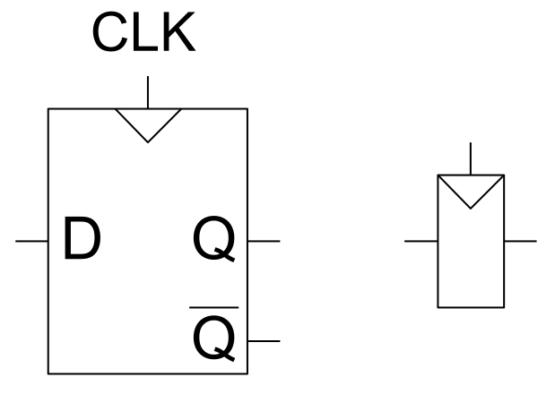
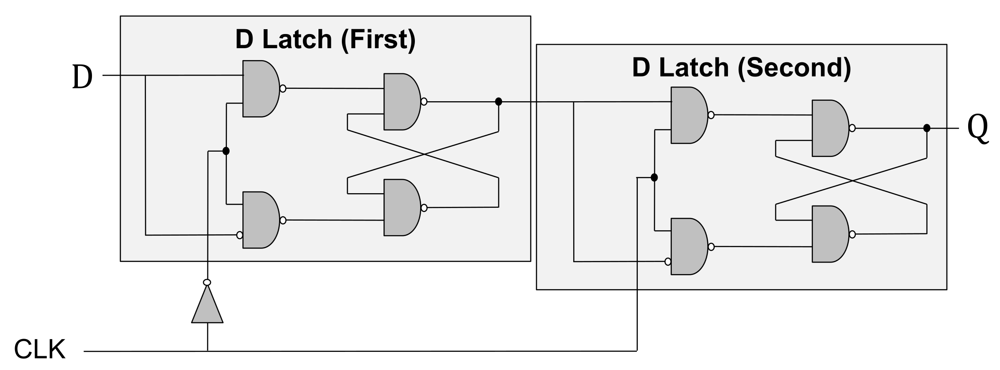

- **Sequential Logic**: Remembers past inputs.
    - **State**: Snapshot of all relevant system elements at a specific moment.
    - Invalid inputs reset the sequence to a safe baseline (e.g., **Reset State**).

## Storage Technology Overview

| Technology                   | Speed       | Cost / Size                                    | Characteristics / Use Cases                        |
| :--------------------------- | :---------- | :--------------------------------------------- | :------------------------------------------------- |
| **Latches & Flip-Flops**     | Very fast   | **Very expensive** (10s of transistors/bit)    | Parallel access                                    |
| **Static RAM (SRAM)**        | Fast        | **Expensive** ($6+$ transistors/bit)           | On-chip caches                                     |
| **Dynamic RAM (DRAM)**       | Slower      | **Cheap** ($1$ transistor + $1$ capacitor/bit) | Needs periodic **refresh** (read destroys content) |
| **Other** (Flash, HDD, Tape) | Much slower | **Very cheap**                                 | **Non-volatile** (retains data without power)      |

## Basic Storage Elements

- **Cross-Coupled Inverters**: Fundamental bistable circuit.
	
    - **Two stable states**: $Q=1$ or $Q=0$.
    - **Metastable state** (undesirable): Outputs oscillate between $0$ and $1$.
    - No built-in control mechanism to set $Q$.
- **The R-S Latch (Reset-Set)**: Built via **cross-coupled NAND gates**.
  
    - **Storage**: Data at $Q$, inverse at $Q'$.
    - **Operation** (via control inputs **S** and **R**):
        - **Quiescent (idle)**: $S=1, R=1$.
        - **Set**: Drive $S=0$ ($R=1$) $\rightarrow Q=1$.
        - **Reset**: Drive $R=0$ ($S=1$) $\rightarrow Q=0$.
    - **Forbidden State** ($S=0, R=0$):
        - Both $Q$ and $Q'$ settle to $1$ (violates $Q \neq Q'$ invariant).
        - Simultaneous return to $1$ triggers **metastability** (random oscillation before settling).
- **The Gated D Latch**: Prevents the $S=0, R=0$ forbidden state.
  
    - **Architecture**: Adds two front-end NAND gates to the R-S Latch.
    - **Inputs**: **Data (D)** and **Write Enable (WE)**.
    - $WE = 1$: $Q$ takes value of $D$.
    - $WE = 0$: Latch holds previous value (idle state).

## Registers and Memory Arrays

- **Register**: Multi-bit data storage (e.g., $4$-bit array $Q[3:0]$).
  
    - Uses multiple parallel **D latches**.
    - **Single WE signal** for simultaneous bit writes.
- **Memory Terminology**:
    - **Address**: Unique index per memory location.
    - **Addressability**: Bit capacity per location.
    - **Address Space**: Total unique memory locations.
    - Example: $4$ locations require $\log_2(4) = 2$ address bits.

- **Memory Structure**: Grid/matrix layout of storage elements.
    - **Rows**: Represent unique addresses (activated via **Wordlines**).
    - **Columns**: Represent data bits for the selected address (routed via bitlines).
- **Reading from Memory**:
    - **Address Decoder**: Translates $N$-bit address input $\rightarrow$ activates exactly one **Wordline**.
    - **Multiplexer (MUX)**: Routes data from the active row to the output.
- **Writing to Memory**:
    - Combines **Address Decoder** output with global **WE** signal.
    - External data ($D_i$) written strictly to the active row if $WE=1$.
    - Unselected rows retain previous values.

## Memory-Based Lookup Tables (LUTs)

- **Concept**: Memory arrays functioning as combinational logic.
    - $2^N$-location, $M$-bit memory block acts as **any** $N$-input, $M$-output Boolean function.
- **Mapping**:
    - **Address inputs**: Logic variables (truth table rows).
    - **Stored data**: Pre-calculated logic outputs.
- **Applications**: Core building blocks of **FPGAs** (Field Programmable Gate Arrays) for programmable/reconfigurable logic.

## Concept of Synchrony

- **Asynchronous Machines**:
    - **Behavior**: Immediate state transitions upon input changes.
    - **Trade-offs**: High performance (no clock overhead) but highly error-prone in complex systems (e.g., CPUs) due to parallel race conditions.
- **Synchronous Machines**:
    - **Behavior**: State transitions strictly at fixed, discrete time intervals.
    - **Clock**: Synchronizing signal alternating between $0$ and $1$.
      
    - **Critical Timing Constraint**: **Combinational logic delay** < **clock cycle time**.

## The Transparency Problem & D Flip-Flops

- **The Problem with Latches**: **Gated D Latch** fails as a standalone state register.
  
    - **Transparency**: High clock (Write Enable = $1$) continuously propagates inputs ($D$) to outputs ($Q$).
    - Captures intermediate logic glitches mid-cycle (violates strict synchronous boundaries).
- **Triggering Types**:
    - **Level-Triggered** (Latches): Continually captures data while clock is active.
    - **Edge-Triggered** (Flip-Flops): Captures data strictly at the clock transition.
- **The D Flip-Flop**: Edge-triggered storage element solving transparency.
  
    - **Construction**: Two series-connected **Gated D Latches** (first with inverted clock, second with normal clock).
    - **Operation**:
        - Clock low ($0$): First latch accepts $D$, second latch holds $Q$.
        - Rising edge ($0 \rightarrow 1$): First latch locks, second latch passes $D$ to $Q$.
