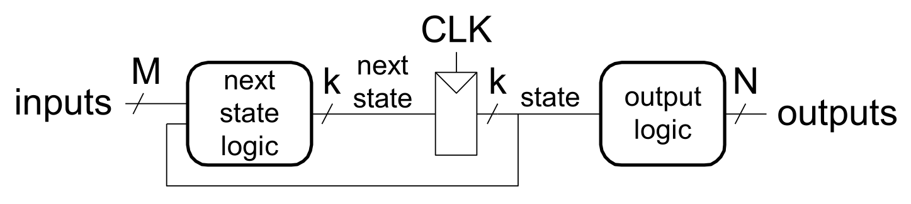
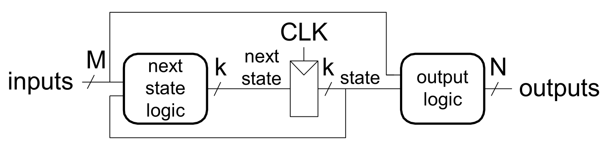
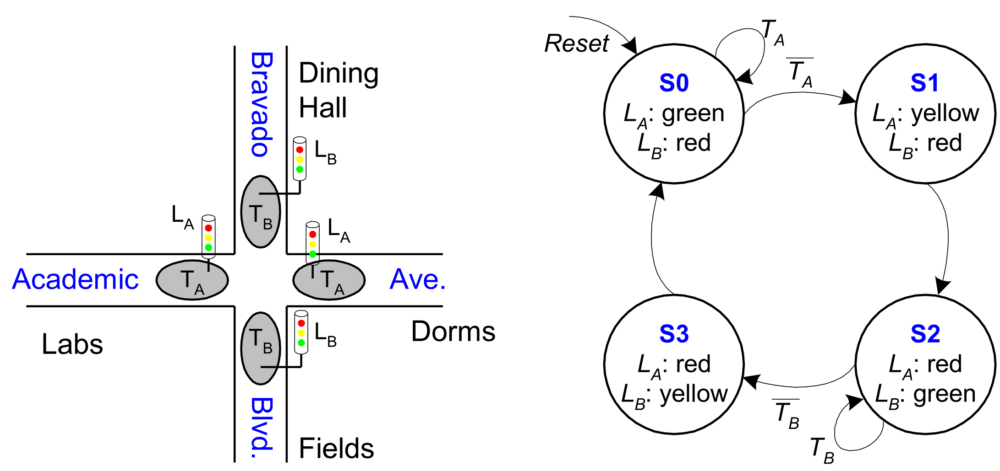

## Finite State Machines (FSMs)

- **Definition**: Discrete-time model of a stateful system.
- **Five Theoretical Elements**:
    - Finite **states**.
    - Finite **external inputs**.
    - Finite **external outputs**.
    - Explicit **state transitions** (movement between states).
    - Explicit determination of **external output values**.
- **Three Hardware Components**:
    - **State Register**: Sequential circuit storing current state (**D Flip-Flops**).
    - **Next State Logic**: Combinational circuit calculating upcoming state (based on inputs and current state).
    - **Output Logic**: Combinational circuit generating external outputs.

## Moore vs. Mealy FSMs

- **Moore FSM**: Outputs depend **only** on current state.
  
    - Diagram representation: Outputs written directly inside state circles.
- **Mealy FSM**: Outputs depend on **both** current state and current inputs.
  
    - Diagram representation: Outputs written on the transition arcs.
    - **Timing**: Outputs react immediately to input changes mid-cycle (combinational logic delay, making output changes asynchronous relative to the clock edge).

## State Encoding

- **Binary Encoding (Full Encoding)**:
    - Minimum possible bits: $\log_2(\text{num\_states})$.
    - **Trade-off**: Minimizes flip-flops; complicates next-state/output logic.
- **One-Hot Encoding**:
    - One distinct bit per state (e.g., $0001, 0010, 0100, 1000$).
    - Only $1$ bit active ("hot") simultaneously.
    - **Trade-off**: Maximizes flip-flops; massively simplifies next-state logic; highly automatable.
- **Output Encoding**:
    - State bits match desired output bits (e.g., Green = $001$, Yellow = $010$).
    - **Trade-off**: Eliminates separate output logic; restricted strictly to **Moore FSMs**.

## Design Procedure

- **1. Determine States**: Identify all conditions (start with a safe **Reset State**).
- **2. State Transition Diagram**: Map nodes (states) and directed arcs (input-triggered transitions).
    - *Example*: Snail pattern matching FSM transitioning sequentially only upon scanning exact bit sequence `1101`.
- **3. State Transition Table**: Tabulate current states/inputs against next states.
- **4. Pick Encoding**: Assign binary values to named states (e.g., $S_0 = 00$).
- **5. Derive Boolean Logic**: Extract Sum-of-Products (SOP) equations for next-state and output bits.
- **6. Draw Schematic**: Wire logic gates to D Flip-Flops.

