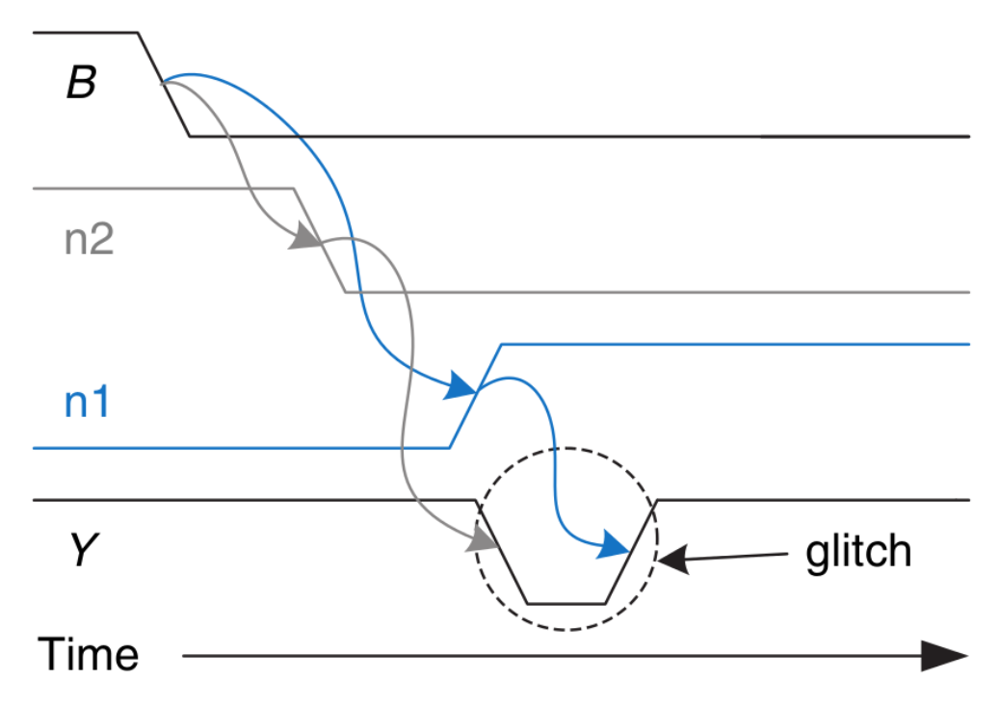
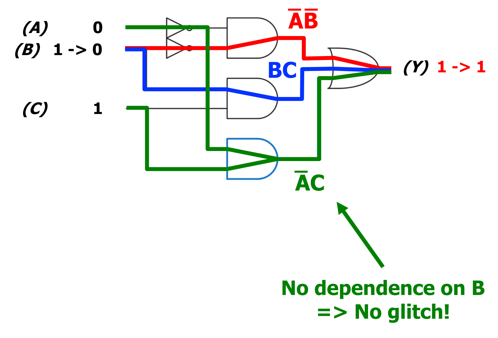
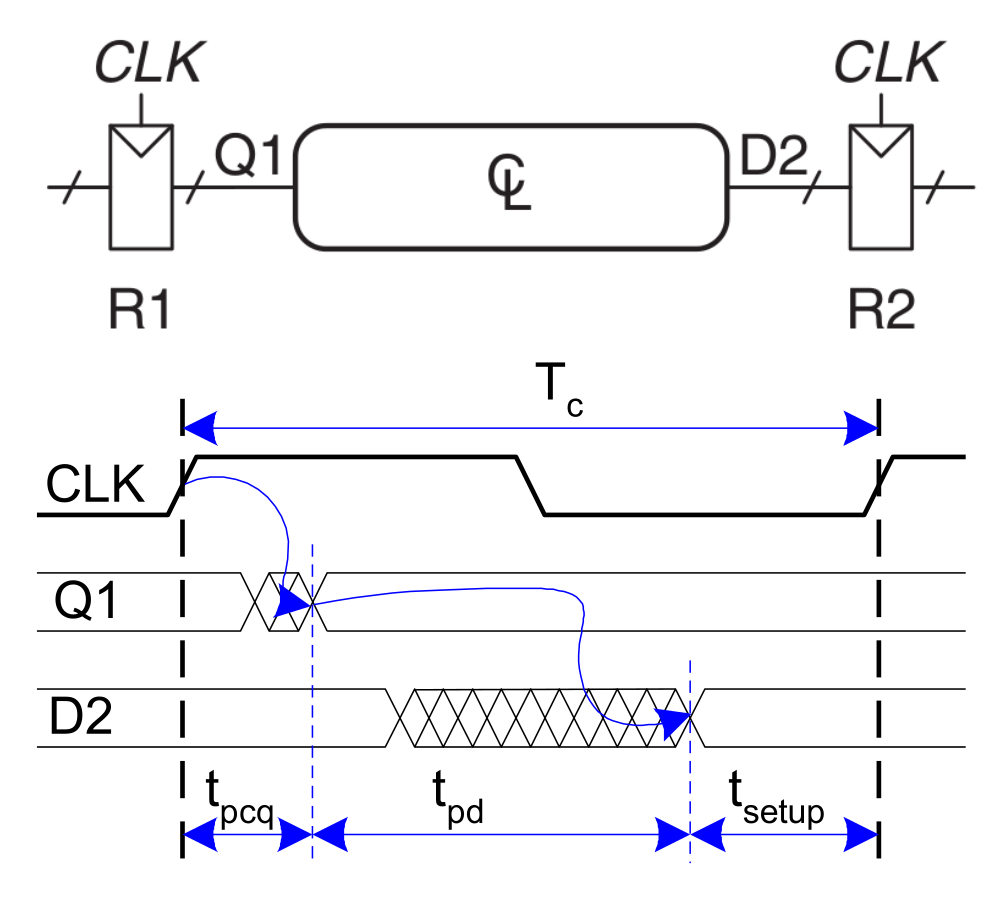
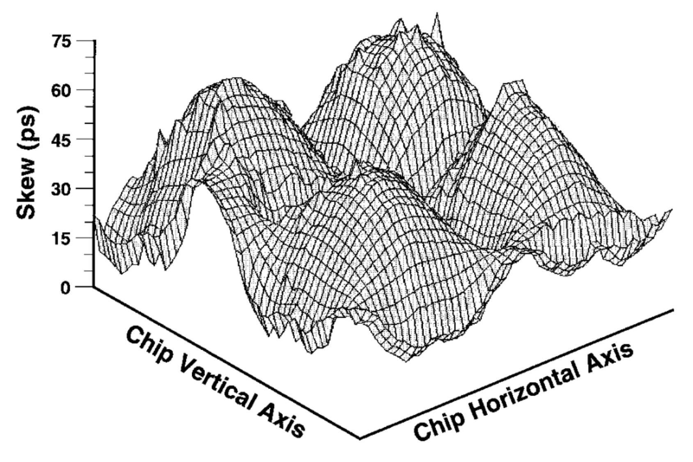

## Hardware Design Trade-offs

- **Area**: Proportional to physical device cost.
- **Speed**: Defined by latency (delay) and throughput (operations/second).
- **Power & Energy Consumption**: Critical for mobile battery life and thermal limits (heat dissipation).
- **Design Time**: Engineering cost and time-to-market constraints.

## Combinational Circuit Timing

- **Physical Delay**: Outputs change with a delay. Statistical variance based on:
    - **Capacitance and resistance** (wires/gates).
    - **Finite speed of light** (relevant at nanosecond scales).
    - **Environmental variables**: Voltage, temperature, circuit aging.
    - **Input transitions**: Rising ($0 \rightarrow 1$) vs. falling ($1 \rightarrow 0$).
- **Timing Margin**: Typically a **30% margin** added to max delay calculations due to unpredictable environmental variables.
- **Delay Metrics**:
    - **Contamination Delay ($t_{cd}$)**: *Shortest* time from input change to output *start* of change (minimum delay). Forms the **Short Path**.
    - **Propagation Delay ($t_{pd}$)**: *Longest* time from input change to output *finish* of change (maximum delay). Forms the **Critical Path**.
- **Glitches**:
  
    - **Definition**: Single input transition causes multiple erratic output transitions.
    - **Cause**: Differing parallel path delays (e.g., a "fast path" and "slow path" reaching the same gate).
    - **Fix**: Add a **consensus term** (redundant logic gate) $\rightarrow$ provides a steady parallel path to hold the output stable during the problematic input transition.
      
    - **When to care**: Often ignored in synchronous systems if settling occurs well before the clock edge (saves chip area/power).

## Sequential Circuit Timing

- **D Flip-Flop Input Constraints**:
    - **Setup Time ($t_{setup}$)**: Time *before* clock edge data ($D$) must be completely stable.
    - **Hold Time ($t_{hold}$)**: Time *after* clock edge data ($D$) must remain stable.
    - **Aperture Time ($t_a$)**: Total critical window ($t_a = t_{setup} + t_{hold}$).
    - **Metastability**: Occurs if $D$ changes during aperture time. Output stuck between 0 and 1 $\rightarrow$ settles non-deterministically.
- **D Flip-Flop Output Timing**:
    - **Clock-to-Q Contamination Delay ($t_{ccq}$)**: Earliest time after clock edge output ($Q$) *starts* changing.
    - **Clock-to-Q Propagation Delay ($t_{pcq}$)**: Latest time after clock edge output ($Q$) *finishes* changing.
- **System Timing Constraints** (between sequential registers $R1$ and $R2$):
    - **Setup Time Constraint** (Maximum Delay): $T_c > t_{pcq} + t_{pd} + t_{setup}$
        - Dictates **minimum clock period ($T_c$)** and **maximum frequency** ($f_{max} = 1 / T_c$).
        - Limited by combinational **Critical Path ($t_{pd}$)**.
    - **Hold Time Constraint** (Minimum Delay): $t_{ccq} + t_{cd} > t_{hold}$
        - Ensures $R2$ avoids capturing new data meant for the *next* cycle.
        - **Independent of clock cycle time ($T_c$)**. Cannot be fixed by slowing the clock.
        - **Fix**: Add pure delay (e.g., dual inverters/buffers) to the **Short Path ($t_{cd}$)**.

## Clock Skew

- **Definition**: Time difference between clock edges reaching different chip locations (due to physical wire delay).
- **Impact**: Effectively increases timing burden on setup and hold constraints.
    - **Skew Setup Constraint**: $T_c > t_{pcq} + t_{pd} + t_{setup} + t_{skew}$
    - **Skew Hold Constraint**: $t_{ccq} + t_{cd} > t_{hold} + t_{skew}$
- **Management**: Mitigated via intelligent **clock networks/meshes** (equalizes wire lengths).

