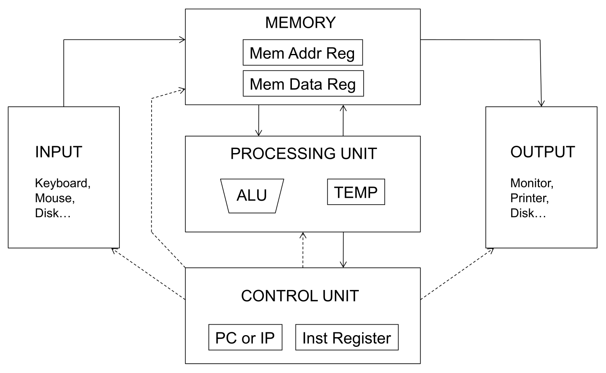
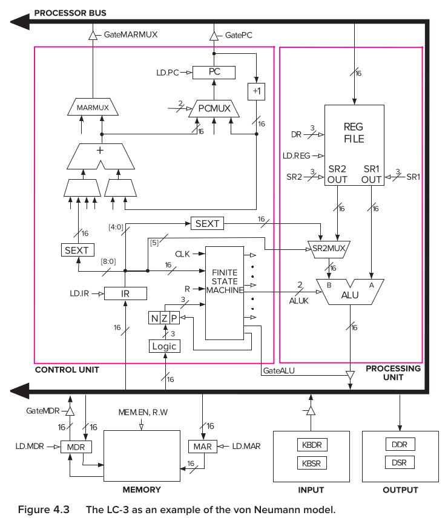
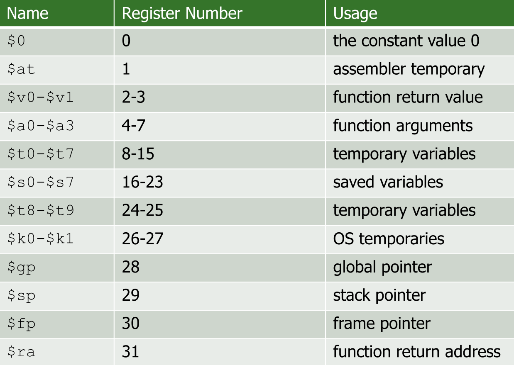
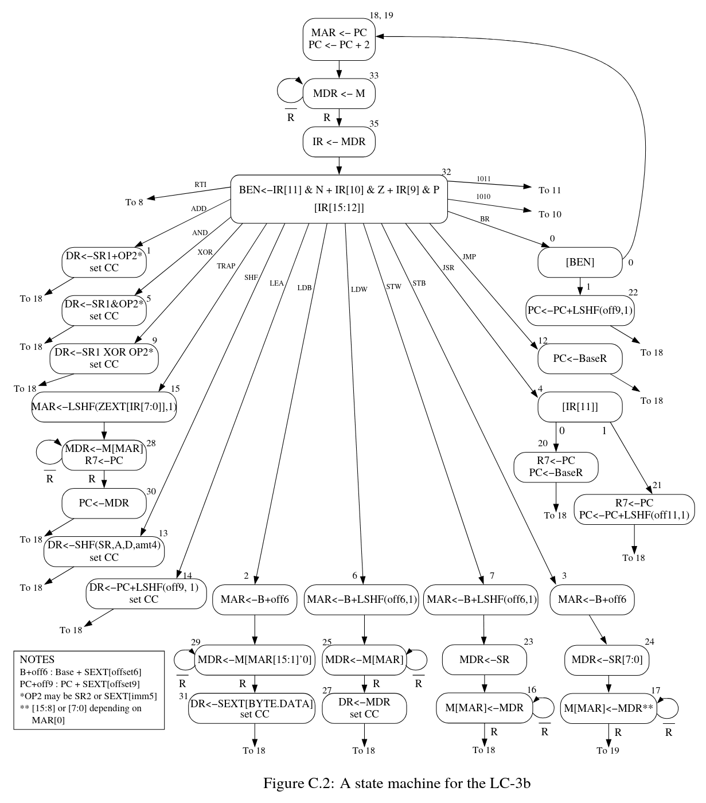

## The von Neumann Model

- **Definition**: Fundamental execution model for modern general-purpose computers (ARM, x86, RISC-V).
- **Five Components**:
    - **Memory**: Stores program and data.
    - **Processing Unit**: Performs actual computations.
    - **Control Unit**: Orchestrates step-by-step execution.
    - **Input** & **Output**: Peripherals interacting with the computer (keyboard, monitor, etc.).
- **Two Key Properties** (Hallmarks):
    1. **Stored program**: Instructions and data share unified, linear memory. Interpretation of values depends strictly on control signals (when fetched).
    2. **Sequential instruction processing**: One instruction processed at a time. **Program Counter** advances sequentially unless explicitly changed by control transfer instructions.

## Memory & Addressing

- **Address Space**: Total uniquely identifiable memory locations.
    - **LC-3**: 16-bit addresses ($2^{16}$ locations).
    - **MIPS**: 32-bit addresses ($2^{32}$ locations).
- **Addressability**: Bits stored per unique location.
    - **Word-addressable**: 1 address = 1 full data word.
    - **Byte-addressable**: 1 address = 8 bits (1 byte). MIPS uses this (requires multiplying offsets, e.g., by 4 for 32-bit words).
- **Endianness**: Byte ordering convention within a word. Only relevant when exchanging data between different systems.
    - **Big Endian**: **Most Significant Byte (MSB)** stored in lowest byte address.
    - **Little Endian**: **Least Significant Byte (LSB)** stored in lowest byte address (used by x86 and MIPS).
- **Memory Access**: Uses two dedicated registers.
    - **Memory Address Register (MAR)**: Holds target address.
    - **Memory Data Register (MDR)**: Holds data read from/written to memory.
    - **Read Operation**: Load MAR with address $\rightarrow$ memory places target data into MDR.
    - **Write Operation**: Load MAR with address $\rightarrow$ load MDR with data $\rightarrow$ activate **Write Enable**.

## Processing Unit & Fast Storage

- **Arithmetic Logic Unit (ALU)**: Executes arithmetic/logic operations (ADD, AND, NOT).
    - Processes data in chunks called **words**.
    - **Word length**: 16 bits in LC-3; 32 bits in MIPS.
- **Register File**: Fast, temporary storage close to ALU.
    - Stores intermediate results (memory access is too slow).
    - Fully programmer-visible.
    - **LC-3 Registers**: 8 **General Purpose Registers (GPRs)** (`R0` to `R7`). 3-bit identifier, 16-bit size.
    - **MIPS Registers**: 32 GPRs. 5-bit identifier, 32-bit size. Uses specific conventions (e.g., `Register 0` hardwired to `0`).

## Control Unit & State

- **Instruction Register (IR)**: Holds current instruction being processed.
- **Program Counter (PC)** (or Instruction Pointer): Holds memory address of current (or next) instruction.
- **Programmer Visible (Architectural) State**: Complete system snapshot available to programmers (**Memory**, **Registers**, **PC**).
    - Instructions explicitly transform these values.

## The Instruction Processing Cycle

- Step-by-step execution sequence. **Not all phases required** (e.g., `ADD` skips Evaluate Address; `LDR` skips Execute).
	1. **FETCH**: Obtains instruction from memory $\rightarrow$ loads into **IR**.
    2. **DECODE**: Identifies instruction (via decoder) $\rightarrow$ generates control signals.
    3. **EVALUATE ADDRESS**: Computes target memory addresses (e.g., adding offset to base register for `LDR`).
    4. **FETCH OPERANDS**: Obtains source operands from Register File or Memory (via MAR/MDR).
    5. **EXECUTE**: Performs operation inside ALU.
    6. **STORE RESULT**: Writes final computed result to designated destination.

## FSM Control & Execution (LC-3 Example)

- **FSM Orchestration**: Finite State Machine directs instruction execution via datapath control signals.
- **Sequential Execution Example: `JMP` (Jump) Instruction**
    - **FETCH Phase**:
        - **State 1**: Assert `GatePC` and `LD.MAR` (routes `PC` onto bus into `MAR`). Concurrently increment PC (`PCMUX` selects `+1`, assert `LD.PC`).
        - **State 2**: Wait for memory access.
        - **State 3**: Assert `GateMDR` and `LD.IR` (routes data from `MDR` into `IR`).
    - **DECODE Phase**:
        - **State 4**: Read opcode (top 4 bits: `IR[15:12]`). Decoder branches FSM to specific instruction execution path.
    - **EXECUTE Phase (Control Flow)**:
        - **State 63 (`JMP`)**: Unconditional branch executing **register addressing mode** (`PC` $\leftarrow$ `Base Register`).
        - **Datapath action**: Read Base Register from Register File (via `SR1` identified by IR bits) $\rightarrow$ route data directly to `PC` $\rightarrow$ assert `LD.PC`.
        - *Result*: Overwrites the sequentially incremented PC loaded during State 1.

