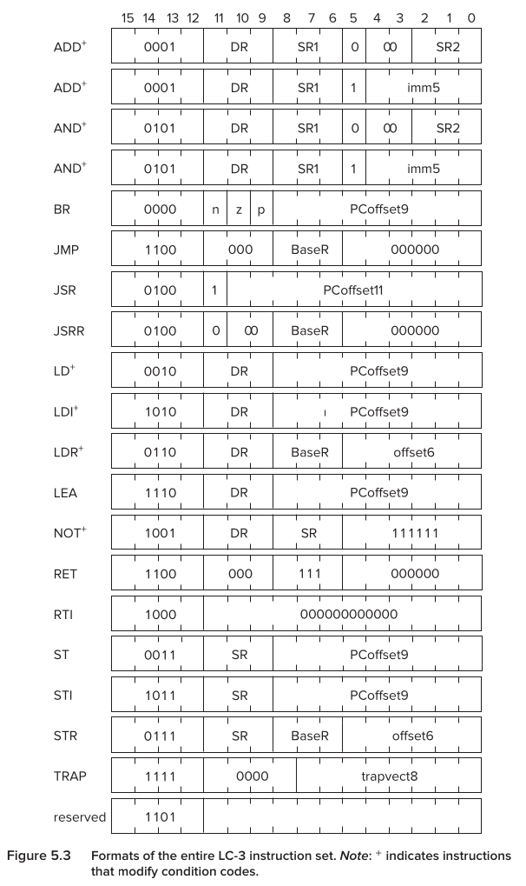
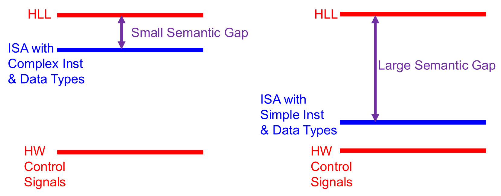

## Instruction Set Architecture (ISA) Fundamentals

- **Instruction Set Architecture (ISA)**: Software-hardware execution interface.
- **ISA Specifications**:
    - **Memory organization**: Address space, addressability, alignment.
    - **Register set**: Quantity, size (e.g., 8 in **LC-3**, 32 in **MIPS**).
    - **Instruction set**: Opcodes, data types, addressing modes, formats.

## Opcodes and Instruction Formats

- **Opcode Size Tradeoffs**:
    - **Large (Complex)**: Harder hardware design, easier software mapping (high-level constructs).
    - **Small (Simple)**: Simpler hardware (**RISC** basis), requires multiple basic instructions for complex operations.
- **MIPS Instruction Formats**:
    - **R-type (Register)**: **Opcode** always $0$. Operation defined by bottom 6 bits (**funct** field).
    - **I-type (Immediate)**: 16-bit immediate value.
    - **J-type (Jump)**: 26-bit immediate value.

## Data Types

- **Data Types**: Binary data interpretation rules.
    - **LC-3**: Only **2's complement integers** (Negative $X = NOT(X) + 1$).
    - **MIPS**: **2's complement**, **unsigned integers**, **floating point**.
    - **Binary Coded Decimal (BCD)**: Decimal digits encoded with fixed bits (e.g., digital clocks); human-readable, ALU-inefficient.
- **Data Type Tradeoffs**:
    - **More types**: Better high-level mapping (e.g., matrices), smaller code, fewer instructions.
    - **Fewer types**: Less microarchitect (hardware) workload.

## The Semantic Gap

- **Semantic Gap**: Proximity of instructions/data types to **High-Level Language (HLL)**.
    - **Small Gap (Complex ISAs)**:
        - Examples: Matrix multiply, string copy, **VAX**.
        - **Pros**: Denser encoding, smaller code, better cache hit rates, simpler compiler.
        - **Cons**: Complex hardware, limited fine-grained compiler optimization.
    - **Large Gap (Simple ISAs)**:
        - Examples: Primitives (**ADD**, **XOR**), early **RISC**.
        - **Pros**: Simple hardware implementation.
        - **Cons**: More instructions required for complex tasks.

## Addressing Modes

- **Addressing Mode**: Mechanism specifying operand location.
- **Tradeoffs**: More modes improve HLL mapping (arrays, pointers) but increase hardware complexity and compiler overhead.
- **PC-Relative Mode (LC-3 LD / ST)**:
    - Calculation: $Incremented PC + sign\_extend(PCoffset9)$.
    - **Hardware**: Dedicated address calculation adder.
    - **Limitation**: Restricted physical range ($+255$ to $-256$ memory locations away).
- **Indirect Mode (LC-3 LDI / STI)**:
    - Use case: **Pointer chasing**.
    - Calculation: $Memory[PC + sign\_extend(PCoffset9)]$.
    - **Hardware Impact**: Requires **two memory accesses** (fetches address, then fetches target data).
    - *Note*: Omitted in **MIPS** to simplify hardware.
- **Base+Offset Mode (LC-3 LDR / STR | MIPS lw / sw)**:
    - Calculation: $Base Register + sign\_extend(offset)$.
    - Offsets: 6 bits (**LC-3**), 16 bits (**MIPS**).
    - Allows addressing anywhere in memory (overcoming PC-Relative limits) via cached base register.
- **Immediate / Literal Mode**:
    - **Load Effective Address (LC-3 LEA)**: Calculates $PC + offset9$ and stores directly in register. **Does not access memory** (used for pointer arithmetic).
    - **Load Upper Immediate (MIPS lui)**: Loads 16-bit immediate into register's upper half (sets lower half to $0$); builds 32-bit constants.

## Operate Instructions Implementation

- **NOT Instruction**:
    - **LC-3**: Natively supported unary operation.
    - **LC-3b**: Replaced with **XOR** (**NOT** achieved by XORing with $1$s).
    - **MIPS**: No dedicated **NOT** (implemented via **NOR** or **XOR** with $1$s).
- **Operate with Literals (Immediate)**:
    - Avoids wasting registers for small constants ($+1$, $-1$).
    - **LC-3 Implementation**: Uses bit 5 as **steering bit**.
        - Bit $5 = 0$: Uses second source register.
        - Bit $5 = 1$: Uses **sign-extended** 5-bit immediate (**imm5**).
        - **Hardware**: Multiplexer controlled by bit 5 selects ALU input.
    - **Sign Extension**: Replicating Most Significant Bit (MSB) of a smaller value across upper bits for system-width compatibility.
    - **MIPS Implementation**: Uses **I-type** format (16-bit immediate).
- **Subtraction Tradeoff**:
    - **MIPS**: Native `sub` instruction ($1$ instruction).
    - **LC-3**: Requires $4$ instructions (NOT, ADD #1, ADD).
    - **Tradeoff**: **MIPS** yields denser encoding; **LC-3** simplifies control logic (no subtraction ALU required).

## Control Flow & Branching

- **Condition Codes (LC-3)**:
    - Three single-bit registers: **N (Negative)**, **Z (Zero)**, **P (Positive)**.
    - Updated automatically upon General Purpose Register (GPR) writes.
    - Strictly one code set ($1$) at a time.
- **Conditional Branching (LC-3 BR)**:
    - Instruction provides three test bits (**n, z, p**).
    - Branches if any test bit matches active condition code.
    - **Edge Cases**:
        - $n=z=p=1$ $\rightarrow$ **Unconditional Jump** (always branches).
        - $n=z=p=0$ $\rightarrow$ **NOP** (No Operation; proceeds to next instruction).
- **Branching Equality Tradeoffs (LC-3 vs. MIPS)**:
    - **MIPS**: `beq` (Branch if Equal) compares two source registers ($1$ instruction).
    - **LC-3**: Requires $4$ instructions for equality (NOT, ADD #1, ADD, BRz).
    - **Tradeoff Conclusion**: **LC-3** simplifies microarchitecture (branch logic only checks status bits) at software cost. **MIPS** minimizes instruction count but forces active ALU comparison inside branch routing logic.
