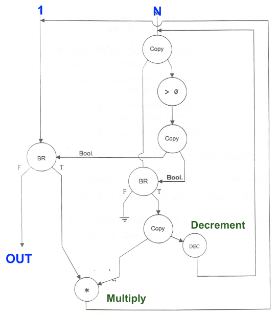

## ISA vs. Microarchitecture

- **Computer Architecture**: Combination of **ISA** and **Microarchitecture**.
- **Instruction Set Architecture (ISA)**: Hardware/software interface (programmer's view).
    - Rarely changes (requires strict **backwards compatibility**).
- **Microarchitecture (Implementation)**: Hidden hardware execution engine.
    - Internal, software-invisible choices (e.g., adder type, pipeline stages, cache sizes, cycle counts).
    - **Microarchitecture Independence**: Can execute instructions internally in any order (e.g., out-of-order, parallel), provided it **strictly obeys ISA semantics** for visible results.
    - *Analogy*: ISA = gas pedal (interface); Microarchitecture = engine internals (implementation).

## Architectural Tradeoffs and Indirection

- **Semantic Gap Tradeoffs**: Bridging complex ISAs and simple hardware using **Software or Hardware Translators**.
    - **Rosetta 2**: Software translation (x86 code to ARM).
    - **Intel and AMD**: Hardware translation (complex x86 to simple internal **Micro-operations**).
    - **NVIDIA Denver**: Dynamic software optimization (ARM to internal format).
    - **Transmeta**: Software translation (Code Morphing) to a proprietary **VLIW ISA**.
- **Register Quantity Tradeoff**:
    - **Many registers**: Better compiler allocation, fewer memory accesses (higher performance).
    - **Few registers**: Smaller instruction encoding, smaller/faster/lower-power register file.
- **Design Point**: Target goals dictating microarchitecture constraints.
    - Factors: **Cost**, **Performance**, **Energy/Thermal limits**, **Reliability**, **Time to Market**.
- **Application Space**: Target workloads influencing architecture (e.g., machine learning, genome analysis).

## The Dataflow Execution Model

- **Definition**: Data-driven alternative to the Von Neumann model.
- **Key Properties**:
    - Execution strictly in **data flow order** (no **Program Counter**).
    - Instructions "fire" immediately upon receiving all operands ("tokens").
    - **Inherently parallel** (simultaneous execution of ready instructions).
- **Dataflow Nodes**: Graphical program representation (e.g., copy, multiply, decrement, branch).
    - *Example*: Looping network of branch, decrement, and multiply nodes to compute $N!$ (factorial).

