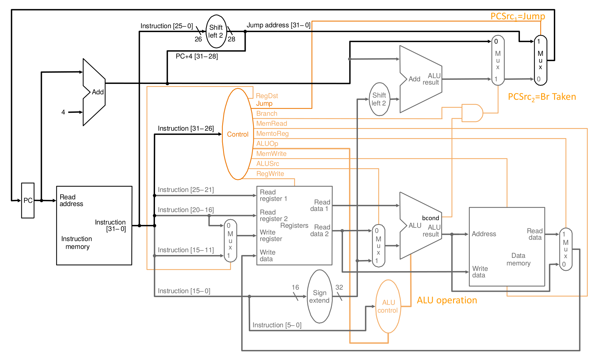
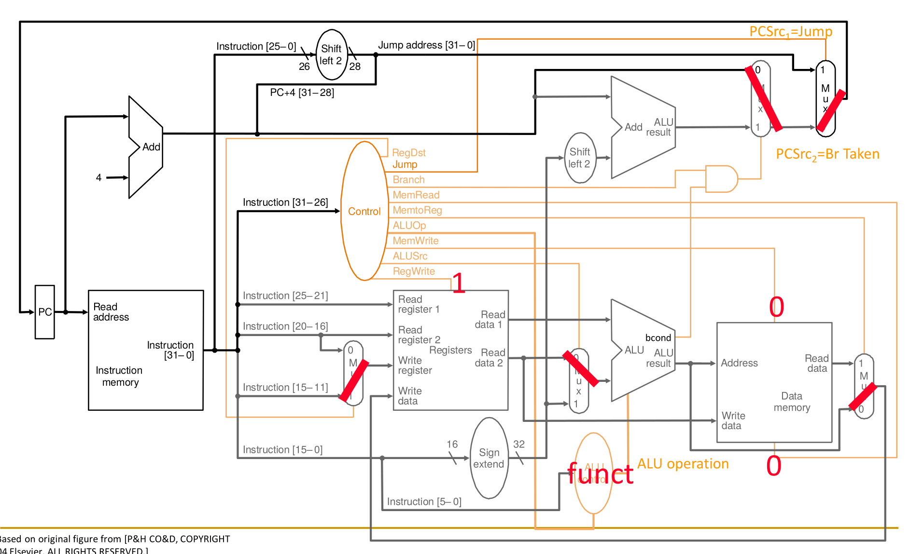
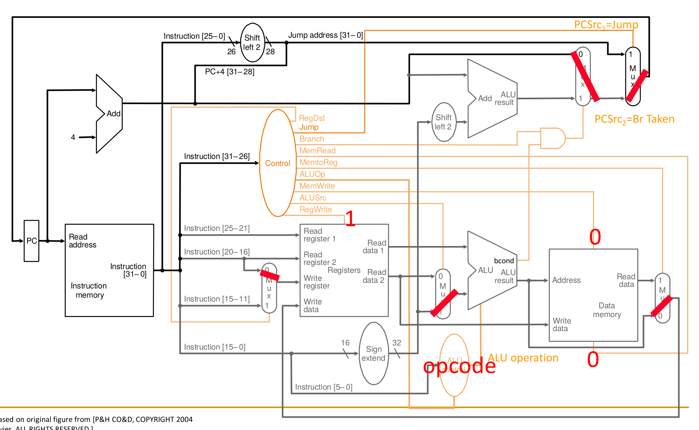
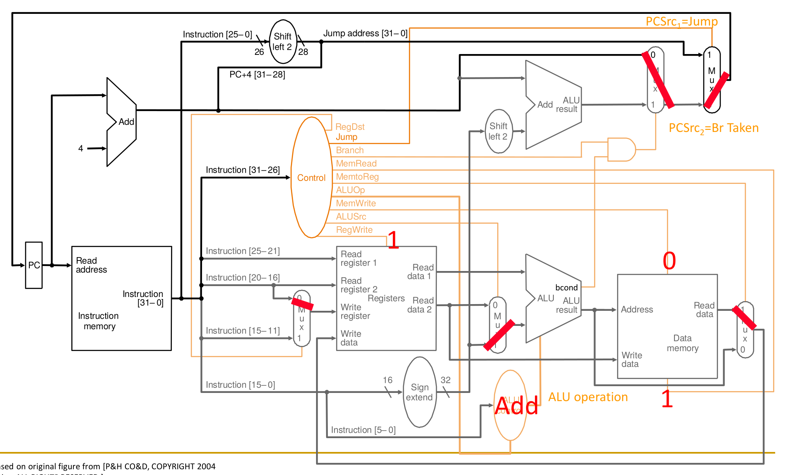
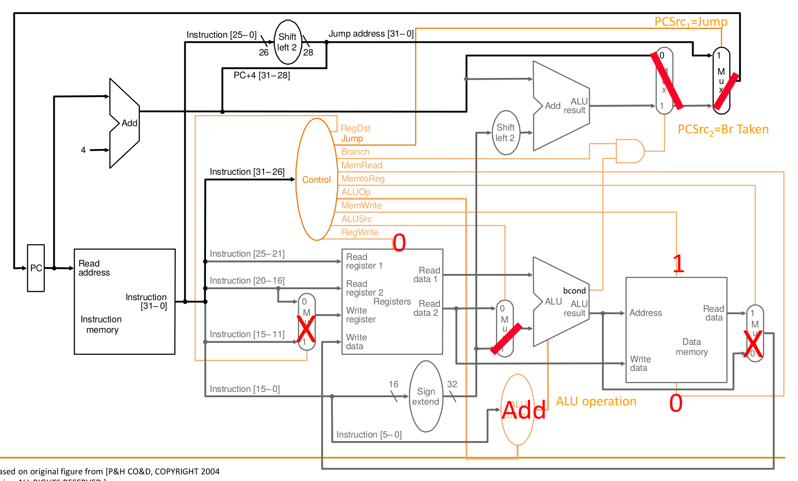
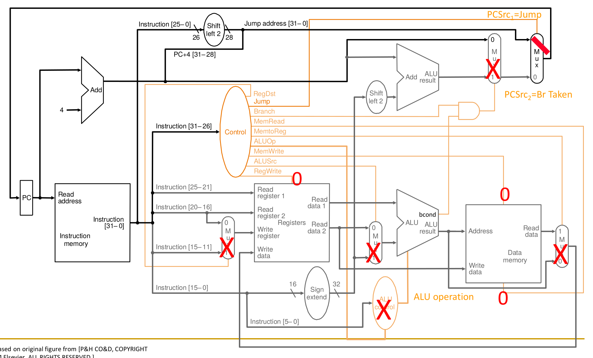

## Microarchitecture

- **Execution Engine Components**:
    - **Datapath**: Hardware transforming data signals (e.g., **ALUs**, adders, multiplexers, registers).
    - **Control Logic**: Hardware determining datapath routing/operations per instruction.
- **Performance Analysis Equation**: $Execution\ Time = N \times CPI \times T$
    - $N$: Number of instructions.
    - $CPI$: **Cycles Per Instruction** (strictly $1$ for single-cycle designs).
    - $T$: **Clock period** (determined by critical path).

## Single-Cycle Datapath Fundamentals

- **Execution Paradigm**: All 6 phases (**Fetch**, **Decode**, **Evaluate Address**, **Fetch Operands**, **Execute**, **Store Result**) execute in **one clock cycle**.
- **Hardware Assumptions** (learning foundations):
    - **Ultra-fast state elements**: Memory/register operations finish in one cycle.
    - **Combinational read**: Output data instantly available based on input address.
    - **Synchronous write**: Target locations update exactly on the positive clock edge.
- **State Elements**:
    - **Program Counter (PC)**: 32-bit current instruction address register.
    - **Instruction & Data Memory**: Separate structures (resource replication required in single-cycle).
    - **Register File**: 32-element, 32-bit storage (2 read ports, 1 write port).

## Instruction-Specific Datapath Implementation

- **R-Type ALU Instructions** (e.g., `ADD`):
  
    - Read two source registers (bits `[25:21]`, `[20:16]`), write to destination register (bits `[15:11]`).
    - ALU uses **ALU operation** control signal derived from `funct` field.
- **I-Type ALU Instructions** (e.g., `ADDI`):
  
    - **Sign Extension Unit**: Converts 16-bit immediate to 32-bit.
    - **ALUSrc Multiplexer**: Selects ALU input 2 (register data vs. sign-extended immediate).
    - **RegDst Multiplexer**: Switches write-register destination from `rd` (R-Type) to `rt` (I-Type, bits `[20:16]`).
- **Data Movement Instructions** (`LW` / `SW`):
    - **Load Word (LW)**: Address computed via ALU. **MemtoReg Multiplexer** routes Data Memory output to register writeback.
      
    - **Store Word (SW)**: Forces `RegWrite = 0`. No register write makes the `RegDst` multiplexer state a **"don't care"**, simplifying logic.
      
- **Control Flow Instructions** (`JUMP`, `BEQ`):
    - **Conditional Branch (BEQ)**:
      _Instruction.png)
        - Dedicated adder computes branch target ($PC+4 + sign\_extend(immediate) \times 4$).
        - ALU subtracts registers; asserts **Zero flag** if equal.
        - Control logic toggles **PCSrc** multiplexer via Zero flag.
        - Requires **Delayed branch semantics** (executing next sequential instruction regardless of branch outcome) for pipelining.
    - **Unconditional Jump (J)**:
      
        - Target calculated by concatenating 26-bit immediate with two trailing zeros (`00`).
        - **Common Mistake Warning**: The 4 MSBs for concatenation must strictly come from **$PC + 4$**, not the un-incremented $PC$.

## Control Logic Design

- **Implementation Types**:
    - **Hardwired Control**: Signals generated via purely combinational logic (decoders/gates) from opcodes.
    - **Sequential Control** (Microprogramming): Memory structure (**Control Store**) holds signals. Potential critical path bottleneck (e.g., CDC 5600).
- **"Do No Harm" Principle**:
    - Control signals must prevent unintended hardware state changes.
    - Example: During `JUMP`, strictly set `RegWrite` and `MemWrite` to `0` to prevent data corruption.
- **Key Single-Bit Control Signals**:
    - `RegDst`: Destination register (`rd` vs. `rt`).
    - `ALUSrc`: ALU input 2 (Register Data 2 vs. Sign-Extended Immediate).
    - `MemtoReg`: Writeback data source (ALU Result vs. Memory Read Data).
    - `RegWrite` / `MemWrite` / `MemRead`: Enables state updates/reads.

## Critical Path & Single-Cycle Limitations

- **Critical Path Bottleneck**: Clock period ($T$) dictated by the **slowest instruction** (typically `LW`: uses Instruction Memory $\rightarrow$ Register File $\rightarrow$ ALU $\rightarrow$ Data Memory $\rightarrow$ Writeback).
- **Delay Example Analysis** (Assuming Memory = 200ps, ALU = 100ps, Register File = 50ps):
    - **LW Delay** = 200 (IF) + 50 (ID) + 100 (EX) + 200 (MEM) + 50 (WB) = **600ps**.
    - **Jump Delay** = 200 (IF) = **200ps**.
    - Static 600ps clock period causes fast instructions (`Jump`) to waste 400ps.
- **Architectural Inefficiency**:
    - **Violates System Design Principles**: Optimizes for the worst-case, not the common-case.
    - Impossible to optimize effectively (speeding up fast instructions yields zero global benefit due to static clock).
    - Requires massive hardware duplication (e.g., separate instruction/data memories) for single-cycle execution.
