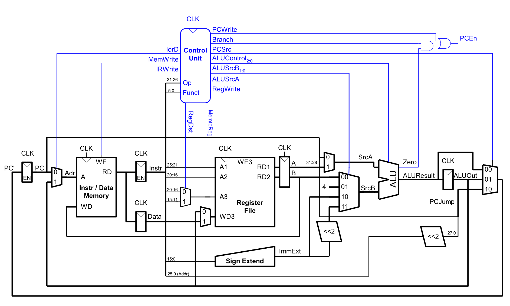
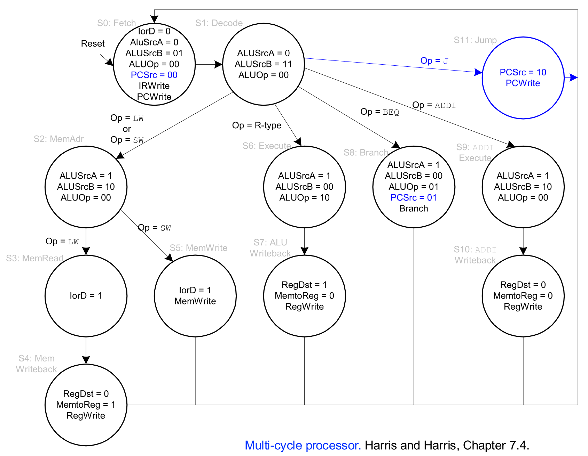

## System Design Principles

- **Three Core Design Principles**:
    1. **Critical path design**: Find and decrease maximum combinational logic delay.
    2. **Bread and butter (common case) design**: Optimize the most frequent operations.
    3. **Balanced design**: Eliminate bottlenecks; avoid unnecessary hardware duplication.
- **Keep it Simple**: Systems should be simple and low-cost. Single-cycle designs fail here by requiring resource duplication (multiple ALUs, separate memories).

## Multi-Cycle Microarchitecture Fundamentals

- **Core Concept**: Clock cycle time is independent of total instruction time. Instructions take only as many cycles as needed.
- **State Transitions**: Breaks execution into multiple state transitions per instruction.
    - **Architectural State**: Programmer-visible (Registers, PC, Memory). Updated only at instruction completion.
    - **Microarchitectural State**: Programmer-invisible. Intermediate results stored in temporary registers between cycles.
- **Benefits (Pros)**:
    - Higher clock frequency (shorter critical path).
    - Hardware reuse (achieves **Balanced design**).
    - Faster execution for simple instructions.
- **Downsides (Cons)**:
    - Additional hardware needed for intermediate state (latches).
    - **Sequencing overhead**: Register setup/hold times paid multiple times per instruction.
    - **Limited concurrency**: Only a small part of the machine is used per cycle.

## Multi-Cycle Datapath Construction

- **Hardware Consolidation**:
    - **Single Memory**: For both instruction fetches and data access (in different cycles).
    - **Single ALU**: For all arithmetic, branch calculations, and PC incrementing.
- **Intermediate Storage Registers** (Microarchitectural):
    - **Instruction Register (IR)**: Latches the fetched instruction for use across multiple cycles.
    - **Memory Data Register (MDR)**: Buffers data read from or written to memory.
    - Dedicated latches for intermediate ALU outputs (e.g., `ALUOut`).

## Multi-Cycle Control Logic (FSM)

- **Finite State Machine (FSM)**: Control unit that sequences through states.
    - Sets **Multiplexer Selects** for data routing.
    - Asserts **Register Enables** for state updates (e.g., `PCWrite`, `IRWrite`).
    - Sets **ALUControl** to define ALU operation.
- **State Breakdown Examples (MIPS FSM)**:
    - **Fetch (S0)**: `IR` $\leftarrow$ `Memory[PC]`; `PC` $\leftarrow$ `PC + 4`.
    - **Decode (S1)**: Decode opcode, read source registers. **Optimization**: Pre-calculate branch target address here to save a cycle.
    - **Execution**: FSM branches to specific paths based on opcode (memory access, R-type, etc.).
- **Full Example: `lw` Instruction (5 Cycles)**:
    - **Cycle 1 (S0: Fetch)**: Fetches instruction into `IR` and increments `PC`.
    - **Cycle 2 (S1: Decode)**: Decodes instruction, reads base register (`rs`).
    - **Cycle 3 (S2: Address Calculation)**: ALU adds `rs` and the sign-extended immediate to compute the effective memory address.
    - **Cycle 4 (S3: Memory Read)**: Reads data from the effective address in memory into the `MDR`.
    - **Cycle 5 (S4: Writeback)**: Writes the data from `MDR` back to the destination register (`rt`).

## Handling Realistic Memory

- **Real-World Memory Constraints**: Memory access is much slower than a single processor clock cycle.
- **Memory Ready Signal**: A multi-cycle FSM can simply wait in a "memory access" state until the memory asserts a **Memory Ready** control bit.

## Microprogrammed Control (Abstraction)

- **Microprogramming**: A technique to translate a high-level ISA into a sequence of simple, hardware-level microinstructions.
- **Core Components**:
    - **Microinstruction**: The set of control signals for a single FSM state. Forms a user-invisible ISA (**u-ISA**).
    - **Control Store**: A fast memory holding all microinstructions, addressed by the FSM state number.
    - **Microsequencer**: Logic that determines the address of the next microinstruction (i.e., the next state).
- **Advantages**:
    - Bridges the **Semantic Gap** between complex instructions and simple hardware.
    - **Extensibility**: New instructions can be supported by adding new microcode.
    - **Field Patching**: Hardware bugs can be fixed post-release by updating the microcode.
