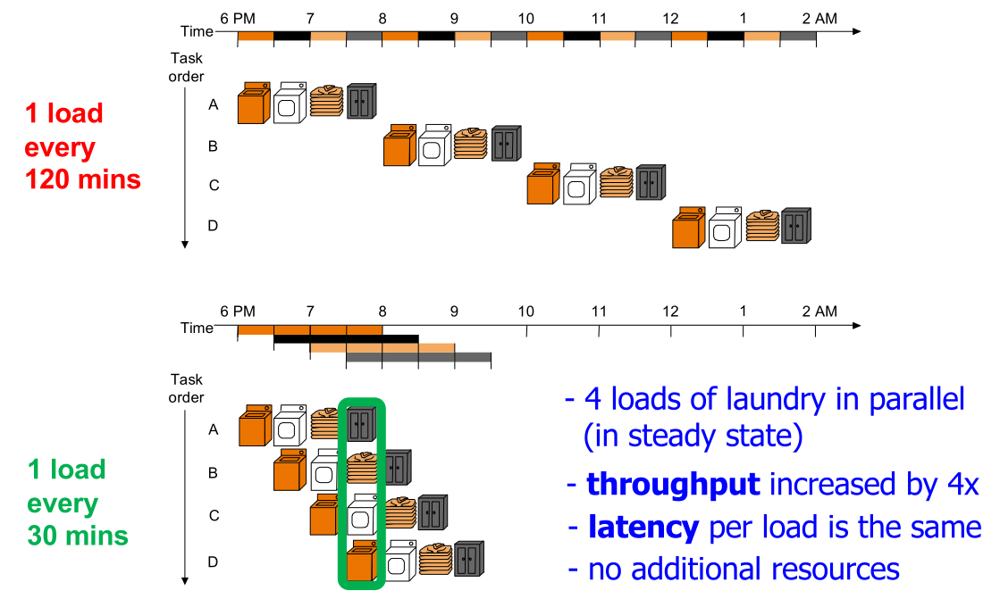
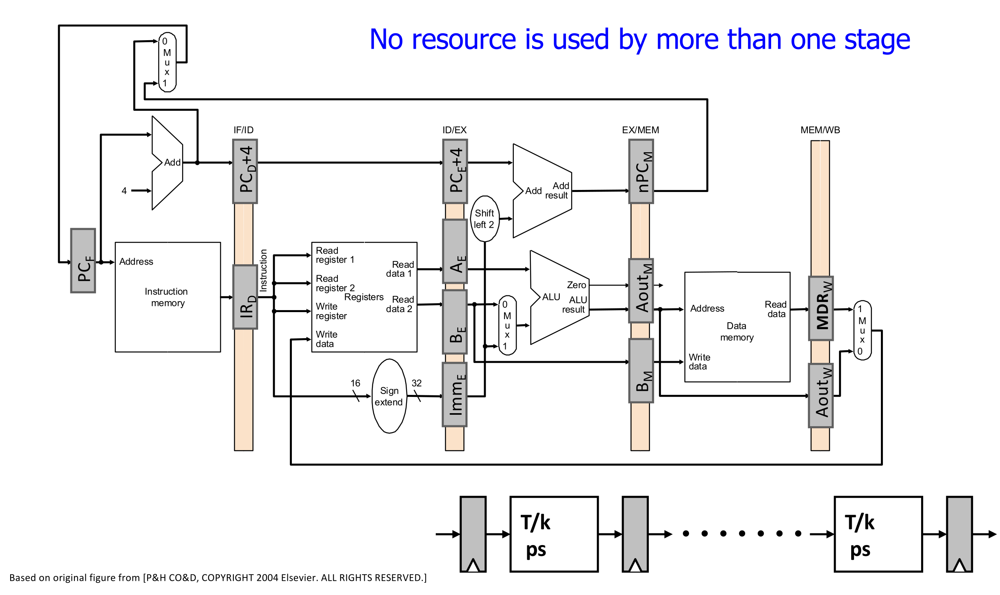

## Pipelining Fundamentals

- **Definition**: Execution paradigm overlapping multiple instructions to increase overall system **throughput**.
- **The Laundry Analogy**:
	  
    - Steps (e.g., wash $\rightarrow$ dry $\rightarrow$ fold) sequentially dependent per load.
    - No dependence between *independent* loads.
    - Simultaneous use of different resources.
    - **Throughput limit**: Slowest step strictly determines maximum pipeline throughput.
- **Ideal Pipeline Requirements**:
    - Repetition of **identical operations**.
    - Repetition of **independent operations**.
    - **Uniformly partitionable suboperations** (equal latency per stage).
- **Throughput & Cost Mathematics**:
    - **Single-cycle throughput**: $1 / (T + S)$ ($T$ = combinational delay, $S$ = sequencing/register overhead).
    - **$k$-stage pipeline throughput**: $1 / (T/k + S)$.
    - **Maximum theoretical throughput**: Limited strictly by $S$ (diminishing returns for infinite stages).
    - **Cost**: Scales with pipeline registers: Cost $= G + Rk$ ($G$ = gates, $R$ = register cost).

## Pipeline Implementation

- **5-Stage MIPS Pipeline**: Datapath chopped into
    - **Fetch (IF)**: Retrieves the next instruction from memory using the **Program Counter**.
    - **Decode (ID)**: Identifies the operation and reads source operands from the **Register File**.
    - **Execute (EX)**: Performs arithmetic/logic operations or calculates memory addresses via the **ALU**.
    - **Memory (MEM)**: Performs data memory accesses for **Load** or **Store** instructions.
    - **Writeback (WB)**: Commits the final result back into the **Register File**.
    - Sub-5x speedup due to uneven stage latencies and pipeline overhead.
- **Pipeline Registers**:
    - Buffers (e.g., `IF/ID`, `ID/EX`) between stages to prevent younger instructions overwriting older data.
    - **Crucial requirement**: Data needed later (e.g., `WriteReg` address) must explicitly propagate through pipeline registers.
- **Control Signal Propagation**:
    - **Option 1 (Typical)**: Decode once in `ID` stage; propagate control signals down pipeline.
    - **Option 2**: Propagate raw instruction word; decode locally per stage.

## Pipeline Hazards

- **Pipeline Inefficiencies**:
    - **External fragmentation**: Idle pipeline stages (instructions needing different/fewer stages).
    - **Internal fragmentation**: Fast stages waiting for worst-case clock cycle time.
- **Resource Contention (Structural Hazard)**:
    - Simultaneous demand for the exact same hardware resource by multiple stages.
    - **Solution 1**: Duplicate resources (e.g., separate Instruction/Data caches).
    - **Solution 2**: Stall one contending stage.
    - **Register File Design**: Write in first half of clock cycle, read in second half.

## Handling Data Dependences

- **Data Dependences**:
    - **Flow dependence (RAW - Read-After-Write)**: **True data dependence** (consumer strictly needs producer's value).
    - **Anti (WAR)** & **Output (WAW) dependences**: **Name dependences** existing only due to limited architectural registers (not true data links).
- **Interlocking (Stalling)**:
    - Hardware-based dependence detection pausing pipeline until data readiness.
    - Disables **Program Counter (PC)** and `IF/ID` register updates.
    - Inserts invalid instructions (**bubbles** / **nops**) downstream (via `CLR` / `INV` signals).
    - *Trivia*: **MIPS** = "**Microarchitecture without Interlocked Pipeline Stages**" (originally relied purely on compiler scheduling).
- **Data Forwarding / Bypassing**:
    - Resolves flow dependences without stalling by routing data from later stages to earlier ones.
    - **Paths**: `ALUOut` (end of `EX`) or `MEM` output $\rightarrow$ `ALU` inputs.
    - **Priority Rule**: **`MEM` stage** has priority over `WB` stage for matching registers (holds *most recent* definition).
    - **Load-Use Stall**:
        - Limitation: Cannot forward immediately after a Load (`lw`) instruction.
        - Data unavailable until end of `MEM` stage; forwarding to start of `EX` breaks **critical path** (strictly requires 1-cycle stall).

## Handling Control Dependences

- **Branch Prediction**: Processor guesses next **PC** before branch outcome resolution.
- **Branch Misprediction Penalty**: Hardware must **flush** (invalidate) incorrectly fetched instructions upon wrong prediction.
- **Early Branch Resolution**:
    - Moves target calculation and condition evaluation to **Decode (`ID`) stage**.
    - **Pros**: Reduces flush penalty to 1 cycle; lowers **CPI (Cycles Per Instruction)**.
    - **Cons**: Adds hardware/forwarding complexity; can lengthen **critical path** and hurt overall clock frequency.

## Advanced Pipeline Concepts

- **Fine-Grained Multithreading (FGMT)**
    - Fetches instruction from a completely different, independent thread every cycle.
    - **Pros**: Masks control/data dependences (no forwarding/stalling/prediction needed); high system throughput.
    - **Cons**: Drastically reduced single-thread performance; requires massive register duplication per thread.
    - **Examples**: Modern **GPUs** (NVIDIA Warps hiding memory latencies), CDC 6600.
