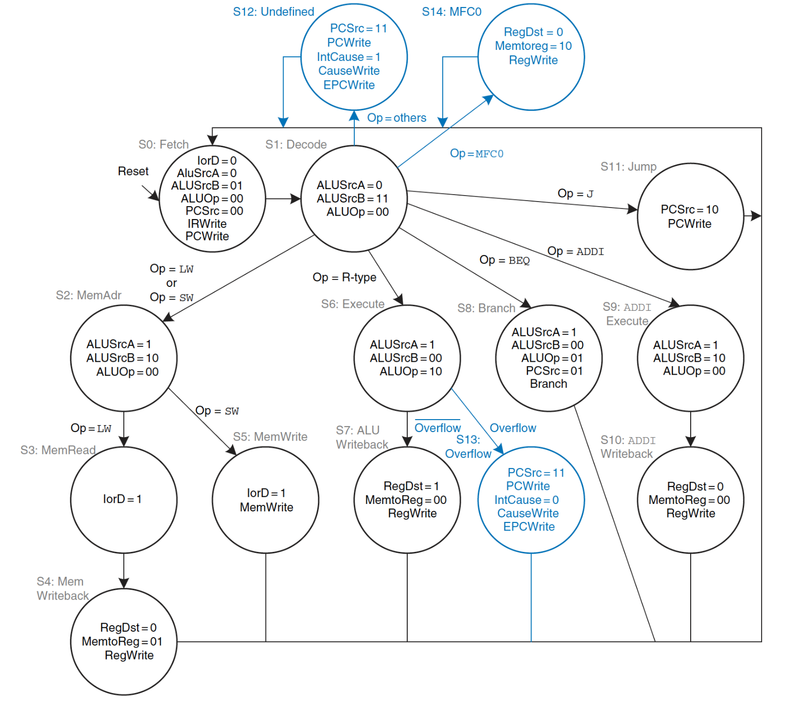
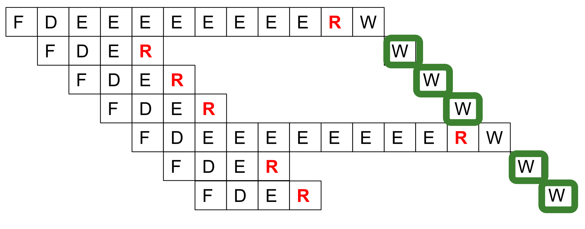
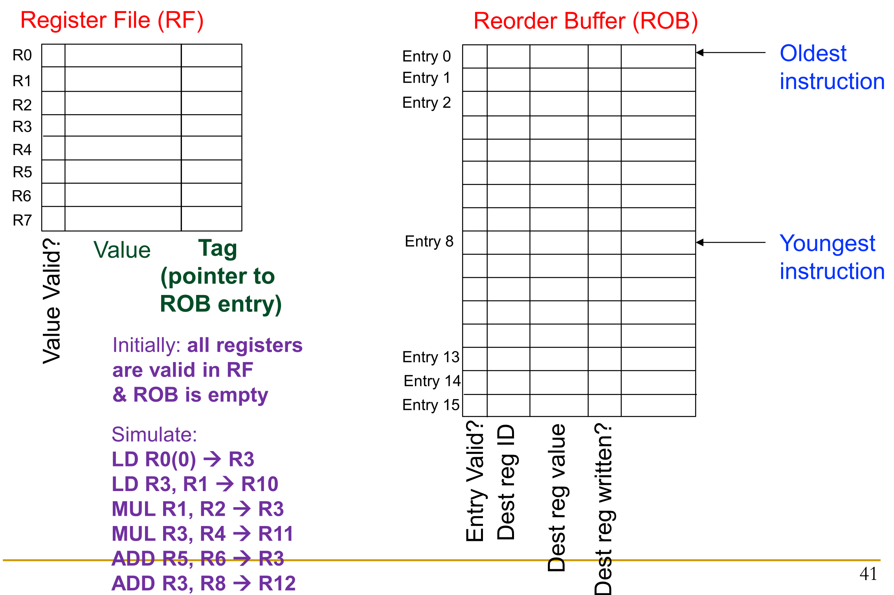

## Exceptions vs. Interrupts

- Force program stop to switch to handler routine (requires architectural state preservation).
- **Exceptions**:
    - **Source**: Internal to running program (e.g., divide by zero, page fault, undefined opcode).
    - **Handling**: Processed immediately upon detection (if non-speculative).
- **Interrupts**:
    - **Source**: External events (e.g., I/O requests, timers, power failures).
    - **Handling**: Processed when convenient (except critical hardware failures).

## Precise Exceptions

- **Definition**: Strict requirement ensuring perfectly consistent processor state before exception handling.
- **Two Rules for Precise State**:
    - All older instructions completely **retired** (finished and committed).
    - No younger instructions retired or allowed to modify state.
- **Purpose**:
    - Preserves **Von Neumann sequential execution model**.
    - **Crucial for software debugging** (breakpoints show predictable, sequentially accurate register values).
    - Enables seamless recovery, restartable processes, and software-emulated traps.
- **Handling in Pipelining**:
    - Out-of-order completion destroys precise state if older instructions throw exceptions.
    - Hardware waits until exception-causing instruction is the **oldest instruction ready to retire**.
    - Hardware flushes younger instructions, saves **PC** to **EPC (Exception PC)**, saves cause, and jumps to handler.

## Reorder Buffer (ROB) & Register Renaming

- **Reorder Buffer (ROB)**:
    - Hardware circular queue allowing out-of-order completion but forcing **in-order retirement**.
    - **Lifecycle**:
        - **Decode**: Allocate next sequential ROB entry.
        - **Execute**: Complete out-of-order; write result to assigned ROB entry.
        - **Retire**: Commit value to architectural register file once instruction is oldest in ROB and exception-free.
- **Register Renaming**:
    - Mapping architectural register IDs to physical ROB entries via tags/pointers.
    - **Effect**: Eliminates **Anti (WAR)** and **Output (WAW)** name dependences.
- **ROB Access via Indirection (Tags)**:
    - Register file uses **Tags** instead of slow **Content Addressable Memory (CAM)** for ROB searches.
    - Invalid registers point directly to specific producing ROB entry IDs (enables fast, direct access).

## Alternative State Recovery Mechanisms

- **History Buffer (HB)**:
    - **Optimistic**: Updates architectural register file immediately upon completion.
    - Logs *old* register values in HB.
    - Unwinds HB tail-to-head on exception to restore precise state (increases recovery latency).
- **Future File (FF) + ROB**:
    - Maintains two register files: **Future File** (speculative, updated ASAP) and **Architectural File** (updated in-order via ROB).
    - Architectural File overwrites Future File upon exception.
- **Checkpointing**:
    - Full snapshots of frontend register state at critical points (e.g., branches).
    - Extremely fast branch misprediction recovery by restoring checkpoint.
