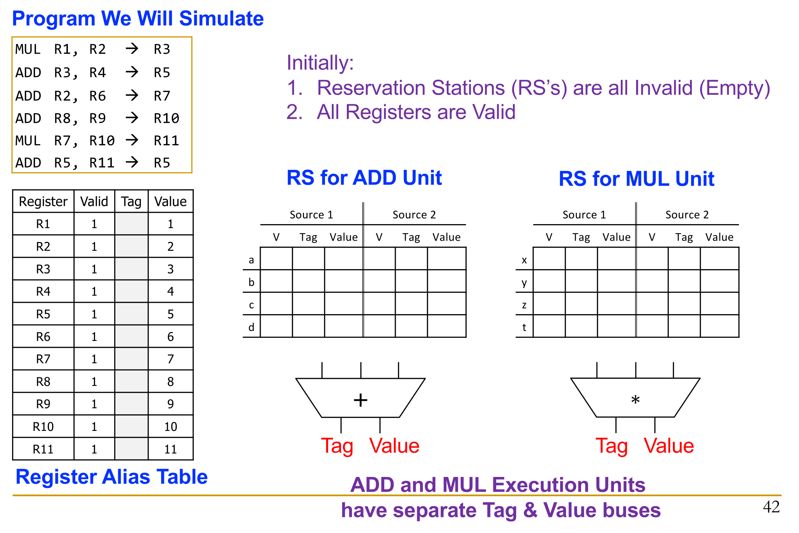
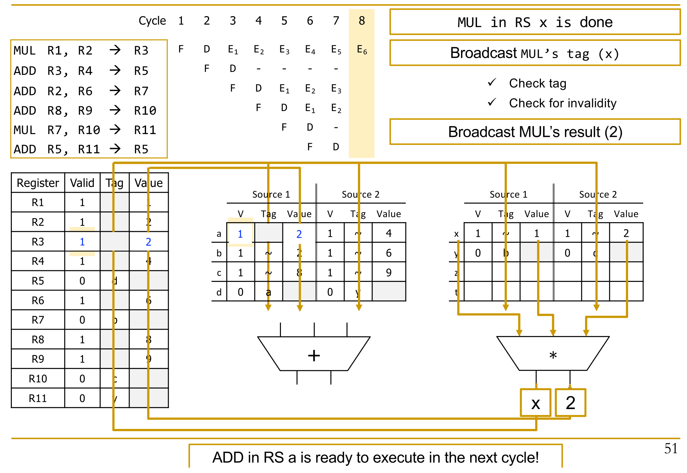

## The Bottleneck of In-Order Execution

- **Dispatch Stall**: Non-ready instruction (e.g., waiting for memory) blocks dispatch of all younger, potentially independent instructions.
    - **Variable Latency**: Memory Loads (`LD`) have unpredictable delays ($4$ cycles for cache hit vs. $100+$ for cache miss). Purely software-based solutions inadequate.
- **Alternative Solutions** (and flaws for single-thread performance):
    - **Compile-time scheduling**: Hard to optimize without runtime knowledge (e.g., cache misses).
    - **Value prediction**: Hardware guesses stalled instruction outcomes. Extremely high performance penalty for mispredictions.
    - **Fine-grained multithreading**: Fetches from different threads every cycle. Maximizes system throughput but ruins single-thread performance.

## Out-of-Order (OoO) Execution Fundamentals

- **Definition**: **Dynamic scheduling** paradigm. Instructions fire based strictly on data availability, not program order.
    - Maintains **programmer illusion** of sequential **Von Neumann model** externally.
    - Executes internally as a **Dataflow machine**.
- **Dataflow Execution Model**:
    - **ISA-Level Dataflow**: Forcing software into explicit dataflow graphs.
        - **Pros**: Perfectly exposes parallel operations.
        - **Cons**: Massive programmer barrier, huge hardware tag-matching overhead, highly difficult **precise state semantics** and mutable data structures.
    - **Microarchitecture-Level Dataflow**: Translating standard sequential ISA code into internal dataflow logic (OoO Execution). Extremely successful approach.
- **Primary Benefits**:
    - **Latency tolerance**: Hides multi-cycle operation delays by executing independent operations concurrently. Limited by **Instruction Window Size**.
    - **Irregular parallelism**: Dynamically exploits parallel operations missed by static compilers.
- **Tradeoffs**: Higher hardware complexity, increased power consumption, potential critical path lengthening (slower clock cycle).

## Tomasulo's Algorithm Mechanics

- **Hardware Components**:
    - **Register Alias Table (RAT)**: Maps architectural registers to microarchitectural locations/tags.
    - **Reservation Stations (RS)**: Rest areas buffering operations, missing operand tags, and ready values.
    - **Common Data Bus (CDB)**: Broadcasts completed values and unique tags to entire machine.
- **Core Operations**:
    1. **Link**: Map consumers to producers via **Register Renaming**. Eliminates false **Anti (WAR)** and **Output (WAW)** dependencies.
        - **Double Renaming**: If an architectural register (e.g., `R5`) is overwritten multiple times, RAT strictly points to newest producing RS tag. Older dependents safely retain older tags in their RS.
    2. **Buffer**: Move stalled instructions into temporary holding areas (**Reservation Stations**).
    3. **Track Readiness**: Listen to bus for required source operands.
        - **Tag Broadcast & Wake-up**: Most power-hungry phase, typical critical path. Execution units broadcast tag/value on CDB. All RS and RAT entries simultaneously compare this tag.
    4. **Dispatch**: Wake up and select instruction for execution once all operands ready.

## OoO Execution with Precise Exceptions

- **Tomasulo's Flaw**: Original 1967 IBM 360/91 lacked precise exceptions, severely hindering debugging.
- **Modern Pipeline Structure**:
    - **Frontend**: Out-of-order execution engine (**Reservation Stations**).
    - **Backend**: In-order retirement engine (**Reorder Buffer (ROB)**).
- **Two Register Maps**:
    - **Frontend Register Map (Speculative)**: Updated immediately at execution completion. Used for renaming newly fetched instructions.
    - **Architectural Register Map (Precise)**: Updated strictly in-order as instructions retire from ROB.
- **Exception Handling**: Hardware flushes pipeline. Perfectly restores **Frontend Register Map** by copying **Architectural Register Map** over it.

## Physical Register File (PRF) Optimization

- **Value Replication Problem**: Naive OoO implementations copy $64$-bit values into RAT, Reservation Stations, and ROB. Wastes massive silicon area and power.
- **Centralized PRF**: Modern processors store values exactly once in single, large **Physical Register File**.
    - Speculative and architectural register maps only store small **Pointers** (e.g., $12$ bits) referencing the PRF.
    - Reservation Stations hold pointers, not values. Instructions read actual data directly from PRF right before entering execution unit.
- **PRF Maintenance & Reclamation**:
    - Physical registers dynamically allocated from a **Free List** during decode.
    - Safely freed (reclaimed) only when the *next* instruction writing to the *same* architectural register safely retires.
    - Immediately freed if allocated speculatively on a mispredicted path (pipeline flush).

## Handling Memory Operations in OoO

- **Registers vs. Memory**: Register dependencies static, known at decode. Memory addresses dynamic, unknown until partial execution, map to massive space, shared across threads.
- **Memory Disambiguation (Unknown Address Problem)**:
    - Younger Load (`LD`) computes address before older Store (`ST`) computes address. Overlap unknown.
- **Scheduling Approaches**:
    1. **Conservative**: Stall `LD` until all older `ST` addresses fully known. Destroys performance.
    2. **Aggressive**: Assume `LD` independent, execute immediately. Requires complex recovery logic to flush pipeline if later `ST` address matches.
    3. **Predictive / Intelligent**: Hardware learns past behaviors (e.g., **Store Sets**) to predict dependencies. If `LD` historically dependent on unknown `ST`, it waits; otherwise, fires immediately.

## Store-to-Load Forwarding

- **Requirement**: Younger `LD` must receive exact data written by most recent older `ST` to same address, bypassing main memory.
- **Hardware Queues**: Memory instructions buffer in **Load Queue (LQ)** and **Store Queue (SQ)**.
    - `LD` computing address searches SQ to catch dependencies on pending `ST`s.
    - `ST` computing address searches LQ to catch `LD`s that aggressively fetched incorrect data.
- **Search Complexity (CAM)**:
    - Requires massive **Content Addressable Memory (CAM)** search mechanism.
    - Match based on **Address**, **Size** (e.g., $4$-byte load overlapping multiple $1$-byte stores), and **Age** (must pick *youngest older* store).
    - Data potentially stitched together from SQ and Cache.
    - Limits SQ size (e.g., $24$ entries); most complex, unscalable logic structure in modern processors.
