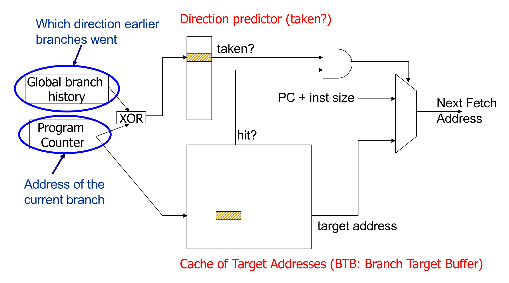

## The Branch Problem & Performance Impact

- **Control Dependences**: Next **Program Counter (PC)** unknown for $N$ pipeline stages until branch resolution.
- **Cost of Misprediction**: Penalty scales with pipeline depth ($N$) and fetch width ($W$).
    - **Wasted Slots**: $N \times W$ instruction slots wasted per misprediction (e.g., 20 stages $\times$ 5-wide = 100 slots).
    - **Performance Drop**: 10% accuracy drop plummets superscalar **IPC** (e.g., from $5.0$ down to $1.66$).
    - **Pipeline Flush**: Mandatory invalidation of all wrong-path instructions.

## Alternatives to Branch Prediction

- **Stalling**: Pause pipeline until exact next PC known (~50% wasted cycles; performance-prohibitive).
- **Fine-Grained Multithreading (FGMT)**: Fetch from independent thread every cycle. Masks dependencies; hurts single-thread performance.
- **Multipath Execution**: Fetch both paths after conditional branch.
    - **Fatal Flaw**: Causes **exponential hardware explosion** ($2^k$ paths for $k$ unresolved branches).
- **Delayed Branching**: Execute next $N$ instructions (**Delay Slots**) regardless of branch outcome.
    - **Filling the Slot**: Compiler schedules independent, safe instructions from before the branch into the delay slot.
    - **Squashing**: Advanced variants (e.g., **SPARC**) nullify delay slot if branch falls through.
    - **Cons**: Difficult compiler scheduling; ties software ISA strictly to specific hardware pipeline depth.
- **Predicated Execution (If-Conversion)**: Convert **Control Dependence** into **Data Dependence**, eliminating branches.
    - **Implementation**: Assign **predicate bit** based on condition (e.g., **CMOV** - Conditional Move). Execute all instructions, but only commit results if predicate is `TRUE` (else act as `NOP`).
    - **Example**: `if (a == 5) b = 4; else b = 3;` $\rightarrow$ `CMPEQ cond, a, 5; CMOV cond, b, 4; CMOV !cond, b, 3;`
    - **Pros**: Eliminates hard-to-predict branches; creates larger straight-line basic blocks for compiler optimization.
    - **Cons**: **Useless Work** (discarded instructions); lowers performance if misprediction cost $<$ useless work cost. Requires heavy ISA/hardware support (e.g., **ARM**, **Intel Itanium**).

## Branch Prediction Fundamentals

- **Core Goal**: Guess next fetch address in next cycle for zero wasted cycles on correct guess.
- **Three Prediction Requirements** (Fetch stage):
    1. **Branch Identification**: Determine if fetched instruction is actually a branch.
    2. **Branch Direction**: Predict Taken (T) or Not Taken (NT).
    3. **Branch Target Address**: Predict destination address if Taken.

## Target Address Prediction

- **Branch Target Buffer (BTB)**: **PC**-indexed hardware cache storing last computed target address (fulfills requirements 1 & 3).
- **Indirect Branches**: Branches with multiple possible runtime targets (e.g., `switch-case`, virtual functions, returns).
- **Return Address Stack (RAS)**: Specialized hardware stack. `CALL` pushes sequential PC; `RETURN` pops it (>95% accuracy for returns).
- **History-Based Target Prediction**: XOR **GHR** with **Indirect Branch PC** to index BTB for non-return indirect jumps.
    - **Limitation**: Causes severe BTB capacity/conflict misses (one branch maps to many entries based on history).

## Static Branch Prediction

- **Always Not-Taken**: Simple (no BTB/direction logic); low accuracy (~30-40%). Optimized by compilers placing likely path sequentially in memory.
- **Always Taken**: Better accuracy (~60-70%); backward loop branches mostly taken.
- **BTFN (Backward Taken, Forward Not Taken)**: Predicts backward branches (loops) as taken, forward branches as not taken.
- **Profile-Based Prediction**: Compiler sets **hint bit** via training runs. Accurate only if profile matches real-world execution.
- **Program-Based (Heuristics)**: Compiler analysis guesses direction (e.g., branch `<= 0` usually error handler $\rightarrow$ Not Taken; pointers rarely equal $\rightarrow$ Not Equal).
- **Programmer-Based (Pragmas)**: Manual code hints (e.g., `if (likely(x))`). Burdens programmer but leverages semantic knowledge.
- **Common Disadvantage**: Cannot dynamically adapt to runtime branch behavior changes.

## Dynamic Branch Prediction

- **Last-Time Predictor**: 1-bit predictor per branch (stored in BTB).
    - **Logic**: Guess exact same outcome as last execution.
    - **Loop Accuracy**: $(N-2)/N$ for $N$ iterations (mispredicts first and last).
    - **Hysteresis Issue**: Flip-flops prediction instantly on single different outcome.
- **Two-Bit Counter (2BC) / Bimodal Predictor**:
    - **Logic**: 2-bit saturating counter (11 Strongly Taken, 10 Weakly Taken, 01 Weakly Not Taken, 00 Strongly Not Taken).
    - **Hysteresis**: Requires two consecutive mistakes to flip strong prediction.
    - **Loop Accuracy**: $(N-1)/N$ for $N$ iterations.
    - **General Accuracy**: ~85-90% (insufficient for deep, wide superscalar pipelines).

## Two-Level Branch Prediction

- **Concept**: Branch outcomes correlate globally (other branches) or locally (own past outcomes).
- **Pattern History Table (PHT)**: Shared table of 2-bit counters indexed by history registers (used in both global and local prediction).
- **Global Branch Correlation**:
    - **Global History Register (GHR)**: $N$-bit shift register tracking exact T/NT history of recent dynamic branches program-wide.
    - **Function**: Indexes PHT to learn global patterns (e.g., if A and B taken, C is Not Taken).
- **Local Branch Correlation**:
    - **First Level**: PC-indexed **Local History Registers** tracking specific branch history (excellent for short, repeating loops).
    - **Second Level**: Shared PHT indexed by specific local history.
    - **Challenge**: Storing millions of local histories; PC hashing causes interference.

## Reducing Interference

- **PHT Interference**: Multiple branches mapping to same PHT entry (positive, negative, or neutral impact).
- **Gshare Predictor**:
    - **Optimization**: XOR **GHR** with **Branch PC** to index PHT.
    - **Pros**: Adds context (distinguishes branches sharing global history), effectively utilizes PHT, drastically reduces interference.
    - **Cons**: Slight access latency (XOR gate).
- **Branch Filtering**: Route highly biased branches (e.g., 99% taken) to simple static/last-time predictors; prevents PHT pollution.
- **Agree Predictor**: PHT counters track *agreement* with a static bias bit (stored in BTB); converts negative interference into positive/neutral.
- **Gskew Predictor**: Multiple PHTs indexed with different hash functions; final prediction via majority vote. Randomizes interference.

## Advanced Branch Predictors

- **Hybrid / Tournament Predictors**:
    - **Concept**: Combine multiple algorithms; no one-size-fits-all predictor.
    - **Choice Predictor**: Meta-predictor dynamically tracking and selecting most accurate sub-predictor (e.g., Global vs. Local) per branch.
- **Perceptron Predictor**:
    - **Concept**: Simple neural network (binary classifier) applied to branch prediction.
    - **Math**: Output $= Weight \cdot X + Bias > 0$ ($X$ = branch history mapped to $1$ or $-1$).
    - **Pros**: Scales to extremely long histories; highly accurate (used in **AMD Zen**).
    - **Cons**: High latency (adder tree); limited to **linearly separable functions** (fails on XOR correlations).
- **TAGE Predictor (Tagged Geometric History Length)**:
    - **Concept**: Multiple PHTs indexed by GHRs of geometrically increasing lengths (e.g., 2, 4, 8... up to thousands of bits).
    - **Pros**: Dynamically selects absolute "best" history length per branch (used in **AMD Zen 2** alongside Perceptrons).
    - **Cons**: High hardware complexity (hash functions, tag matching).
- **Convolutional Neural Nets (BranchNet)**:
    - **Concept**: CNNs parsing extremely deep, noisy global histories to expose hidden correlations for hardest branches.

## Branch Confidence Estimation

- **Concept**: Hardware mechanism estimating correct prediction likelihood based on recent correct/incorrect patterns.
- **Pipeline Gating**:
    - **Application**: Halt fetching on low-confidence paths.
    - **Benefit**: Massive power/energy savings by preventing useless speculative execution (risks pipeline stalls).
