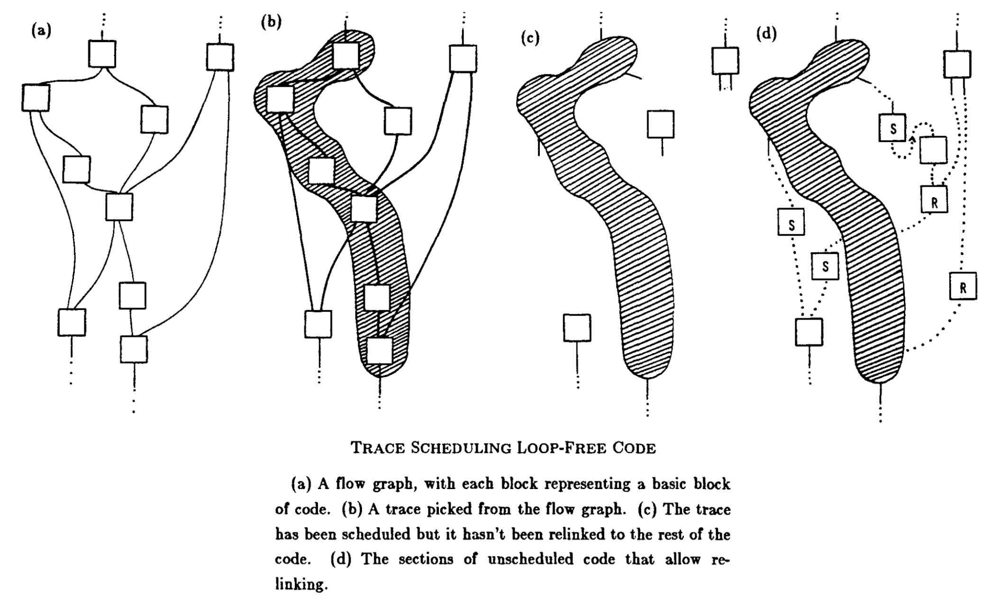

## VLIW Architectures Fundamentals

- **Very Long Instruction Word (VLIW) Concept**: **Compiler** packs independent instructions into one large **instruction bundle**. Hardware fetches/executes bundle concurrently.
- **Philosophy**: Simple hardware; compiler handles all dependency-checking.
- **Characteristics**:
    - **No hardware dependency checking**: Assumes bundled operations are guaranteed independent.
    - **Single Program Counter (PC)**: Points to entire bundle; compiler maps instructions to specific execution units (e.g., slot 1 = multiplier).
    - **Lock-step execution**: Synchronous bundle execution. One operation stall (e.g., memory wait) $\rightarrow$ entire bundle stalls.

## VLIW Tradeoffs

- **Hardware Advantages**:
    - Simplified microarchitecture (no dynamic scheduling, register renaming, or complex issue logic).
    - Higher clock frequencies, easier design, lower power consumption.
- **Compiler Disadvantages**:
    - **NOP Insertion**: Must find $N$ independent operations per cycle. Fills gaps with **NOPs** (lost parallelism, increased code size).
    - **Recompilation**: Executables strictly tied to specific hardware. Changing execution width ($N$) or unit latencies requires complete software recompilation.
- **Variable Latency Vulnerability**:
    - Unpredictable **memory operations** (e.g., **cache misses**) stall the entire wide bundle due to **lock-step execution**.
    - Catastrophic for pure VLIW performance.

## VLIW Compiler Techniques

- **VLIW Compiler Legacy**: Optimizations originally for VLIW now standard in **superscalar** processors.
- **Trace Scheduling**:
	  
    - Profilers identify high-probability execution paths (**hot paths**).
    - Combines basic blocks into one **Trace** for cross-instruction optimization.
    - **Limitation**: Traces have **side entrances** (multiple entry/exit points), hindering optimization.
- **Superblocks**:
    - Upgraded structure: frequently executed basic blocks merged into a **single-entry, multiple-exit** block.
    - **Tail Duplication**: Duplicating basic blocks post-side entrance. Completely eliminates side entrances from main hot path.
    - **Optimization Example**: Enables **Common Subexpression Elimination** (e.g., replacing redundant multiplications with simple register moves).
