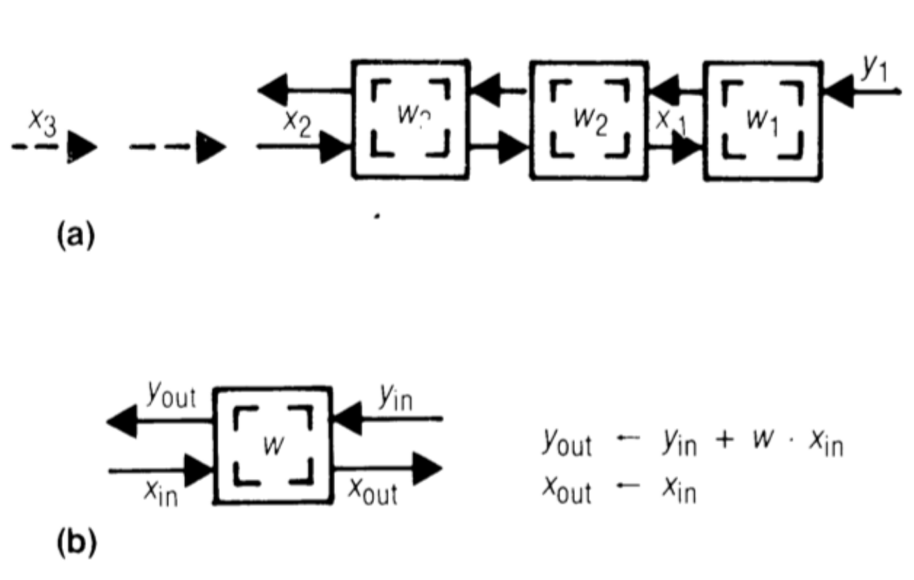
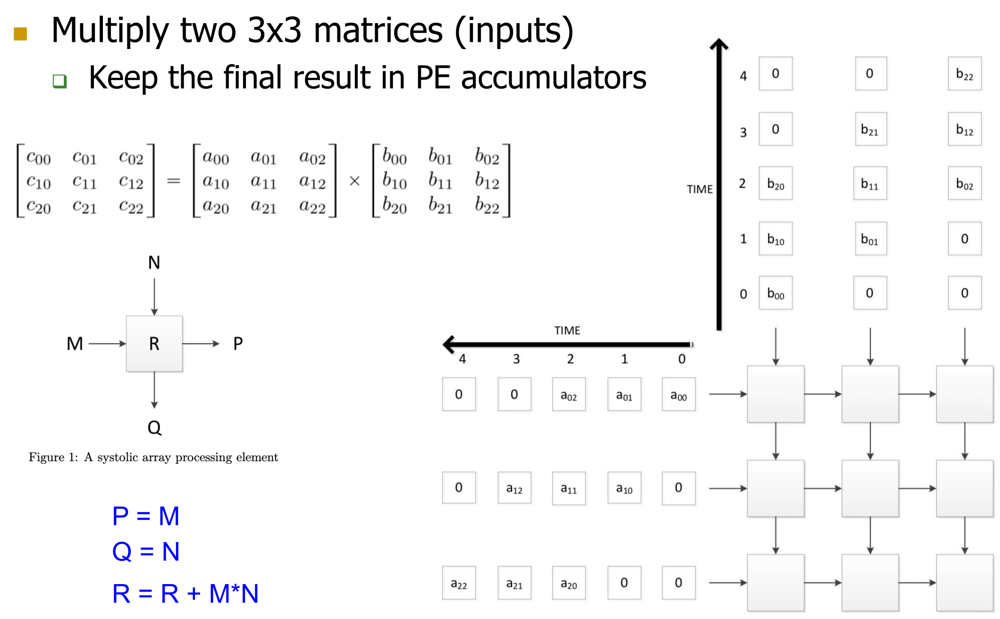

## Systolic Arrays Fundamentals

- **Systolic Array Core Principle**: Replaces single **Processing Element (PE)** with massive, regular PE array. Orchestrates strictly timed **data flow** between them.
- **Primary Goal**: Balance computation with **memory (I/O) bandwidth**. Maximizes mathematical operations per data element before memory return (**data reuse**).
- **Tradeoffs**:
    - **Pros**: High efficiency, massive concurrency, drastically reduced memory bandwidth pressure.
    - **Cons**: Restricted to specific mathematical topologies; poor at irregular parallelism.
- **Differences from Pipelining**:
    - Non-linear, multi-dimensional structures (e.g., 2D grids).
    - Data flows in multiple directions at different speeds.
    - PEs execute fixed mathematical kernels, not fetched instructions.

## Systolic Arrays Execution Model

- **Convolution Application**: Crucial for image processing and **Machine Learning** (e.g., **Convolutional Neural Networks / CNNs** like AlexNet, ResNet).
- **1D/2D Hardware Design**:
  
    - Utilizes specialized **Multiply and Accumulate (MAC)** hardware instead of standard ALUs.
    - **Weights ($W$)**: Pre-loaded, remain **stationary** inside each PE.
    - **Inputs ($X$)**: Flow unaltered through PEs ($X_{out} = X_{in}$).
    - **Outputs ($Y$)**: Accumulate mathematically passing through ($Y_{out} = Y_{in} + W \times X_{in}$).
    - **Opposing Data Flow**: Inputs ($X$) and partial sums ($Y$) flow in opposite directions (or at staggered speeds) so each input aligns sequentially with the correct partial sum at the exact right PE. Avoids massive global data broadcasting.
- **2D Matrix Multiplication**:
  
    - Requires staggered (delayed) inputs cycle-by-cycle ensuring correct rows/columns align at the specific PE simultaneously.
    - Computed matrices can remain directly in PE **accumulators**.
