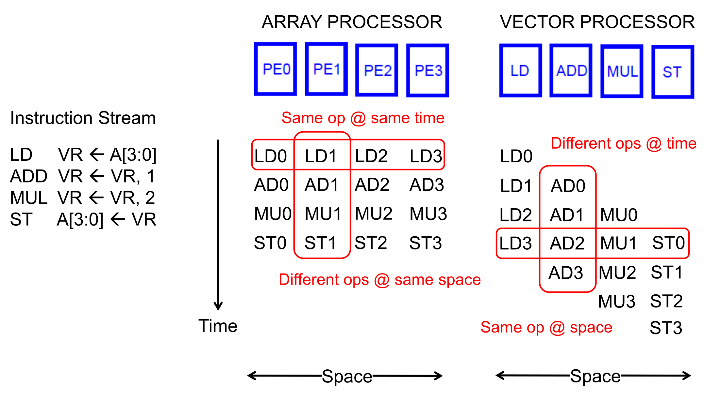

## Loop Unrolling & Code Vectorization

- **Loop Unrolling**: Replicating loop body multiple times per iteration.
    - **Purpose**: Eliminates branch instructions (prevents stalls in **DAE**, **VLIW**, **Systolic Arrays**).
    - **Advantages**:
        - Reduces maintenance overhead (fewer index increments/condition tests).
        - Enlarges **basic blocks** for better compiler scheduling.
    - **Disadvantages**:
        - Edge-case handling required for odd iteration counts.
        - Increased code size.
- **Automatic Code Vectorization**: Compile-time operation reordering into vector instructions.
    - Requires extensive loop dependence analysis.
    - **Limitation**: Code fundamentally hard for humans to vectorize is equally hard for compilers.

## Execution Paradigms & Flynn's Taxonomy

- **Flynn's Taxonomy (1966)**: Categorization by instruction/data streams.
    - **SISD**: Standard scalar processors.
    - **SIMD**: **Array processors** and **Vector processors**.
    - **MISD**: Rare; **Systolic Arrays** / streaming processors.
    - **MIMD**: Multiprocessors, multithreaded processors.
- **Data Parallelism**: Same operation concurrently applied to different data (e.g., dot products).
    - vs. **Data Flow**: Operations parallelized via data readiness.
    - vs. **Thread Parallelism**: Control threads parallelized.

## SIMD Processing Paradigm

- **Time-Space Duality**:
    - **Array Processor**: Multiple data elements processed at **same time** across **different spaces** (distinct Processing Elements / PEs).
    - **Vector Processor**: Multiple data elements processed in **consecutive time steps** using **same space** (deeply pipelined units).
- **Modern SIMD architectures** (GPUs) combine both time (pipelining) and space (lanes).
- **SIMD vs. VLIW**:
    - **VLIW**: Packs multiple *independent, different* operations.
    - **SIMD Array**: Packs multiple *identical* operations (amortizes fetch/decode overhead).

## Vector Processors Fundamentals

- **Vector Registers**: Hold $N$ $M$-bit values (1D array, not single scalar).
- **Control Registers**:
    - **Vector Length Register (VLEN)**: Active element count (max $N$).
    - **Vector Mask Register (VMASK)**: Bitmask for conditional execution.
    - **Vector Stride Register (VSTR)**: Memory distance between consecutive elements.
- **Stride Calculation Example (Matrix Multiply)**:
    - Matrices stored in **row-major order**.
    - Fetching **Row**: Consecutive addresses $\rightarrow$ **Stride = 1**.
    - Fetching **Column**: Skipping addresses based on row width (e.g., 10 columns) $\rightarrow$ **Stride = 10**.

## Vector Processor Tradeoffs

- **Advantages**:
    - **Deep Pipelines**: No intra-vector dependencies; zero interlocking/branch flushing. Allows $20+$ stage pipelines.
    - **Energy Efficiency**: One instruction yields many operations; low fetch/decode power.
    - **Regular Access**: Known strides enable perfectly predictable prefetching.
    - Native loop handling (no software branches).
- **Disadvantages**:
    - Strictly requires **regular parallelism**.
    - **Programming Difficulty**: Data must rigidly map to hardware (fixed by modern GPUs).
    - Terrible performance on **irregular parallelism** (**pointer chasing** / linked lists).

## Vector Memory & Banking

- **The Memory Bottleneck**: Fast functional units starve if memory bandwidth $< 1$ element/cycle.
- **Memory Banking**:
    - Dividing a single memory into independent sub-arrays (**banks**).
    - Each bank processes requests concurrently.
    - Shares global buses (saves physical pins).
    - Cost-efficiently simulates expensive multi-port memory.
- **Interleaving**: Mapping consecutive memory addresses to different, consecutive banks (e.g., Addr $0 \rightarrow$ Bank $0$, Addr $1 \rightarrow$ Bank $1$).
- **Throughput Conditions** ($1$ element/cycle sustained):
    1. **Stride = 1** (accessing sequential addresses).
    2. **Interleaved** layout (sequential addresses hit idle banks, avoiding wait times).
    3. $Number\ of\ banks \ge Bank\ access\ latency$ in cycles.
- **Bank Conflicts**:
    - Simultaneous requests to the same busy bank (e.g., strides matching bank count multiples).
    - **Minimization**: More banks/ports, randomized address mapping, or optimized data layout.
    - **Software Impact**: GPU programmers extensively optimize shared (**scratchpad**) memory layouts to avoid conflicts.

## Advanced Vector Processing Techniques

- **Vector Chaining**:
    - Hardware **data forwarding** across functional units.
    - Bypasses waiting for entire vector register completion (massive speedups).
- **Vector Stripmining**:
    - Compiler technique for arrays exceeding physical VREG capacity.
    - E.g., 527 elements in 64-element VREGs: 8 loops at $VLEN=64$, 1 loop at $VLEN=15$.
- **Gather / Scatter Operations**:
    - Handles **indirect memory accesses** and **sparse matrices**.
    - Load/store via **index vector** + base register ($A[i] = B[i] + C[D[i]]$).
- **Masked Operations (Predicated Execution)**:
    - Replaces conditional logic (`if-else`) inside loops.
    - Control dependences become data dependences via **VMASK**.
    - **Simple Implementation**: Executes all ops, disables register writeback for masked bits (best if mostly $1$s).
    - **Density-Time Implementation**: Hardware skips execution of $0$s (best if mostly $0$s).
