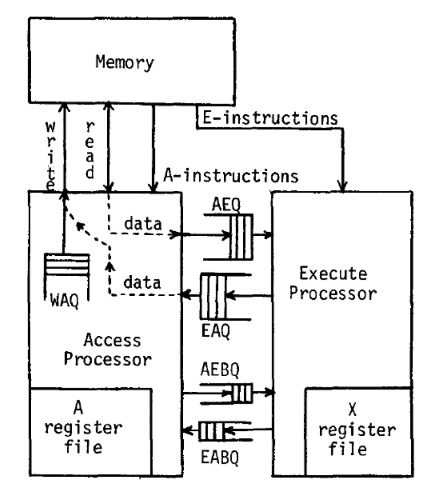

## Decoupled Access/Execute (DAE)

- **Motivation**: **Tomasulo's algorithm** too complex for 1980s hardware.
- **Core Idea**: Decoupling memory access from execution via separate instruction streams and **ISA-visible queues**.
- **Instruction Streams**:
    - **Stream A (Access Processor)**: Fetches memory, supplies execution stream.
    - **Stream E (Execute Processor)**: Computes data, supplies memory addresses back.
    - Synchronized purely on control flow (**branch queues**).
- **Queues**:
    - **Access-to-Execute (AEQ)**: Buffers data fetched from memory for the execute stream.
    - **Execute-to-Access (EAQ)**: Buffers memory addresses calculated by the execute stream for the access stream.
    - Queue length dictates hardware latency tolerance.
    - Scalable alternative to massive physical register files or tag-matching logic.
- **Advantages**:
    - Asynchronous execution: Streams run ahead of each other (e.g., E computes while A waits for memory).
    - Achieves limited **out-of-order execution** without wakeup/select complexity.
    - Modern use: **Google TPU** and ML accelerators.
- **Disadvantages**:
    - Heavy reliance on **compiler support** for partitioning.
    - Branches disrupt streams (E must signal A to halt wrong-path fetching).
