## Execution Models

- **Programming vs. Execution Model**: Decouples how a programmer writes code from how physical hardware executes it.
    - **Sequential Code**: Written linearly; dynamically parallelized by **Out-of-Order (OoO)** CPUs.
    - **Data Parallel Code**: Explicitly vectorized by compilers for traditional **SIMD** hardware.
- **SPMD (Single Program Multiple Data)**:
    - Programming model where the developer writes simple scalar code for a *single* thread.
    - Millions of independent thread instances are spawned.
    - Hardware entirely abstracts the parallelization.
- **SIMT (Single Instruction, Multiple Thread)**:
    - Execution model mapping the **SPMD** programming model onto a **SIMD** hardware backend.

## GPU Microarchitecture

- **Warps (NVIDIA) / Wavefronts (AMD)**:
  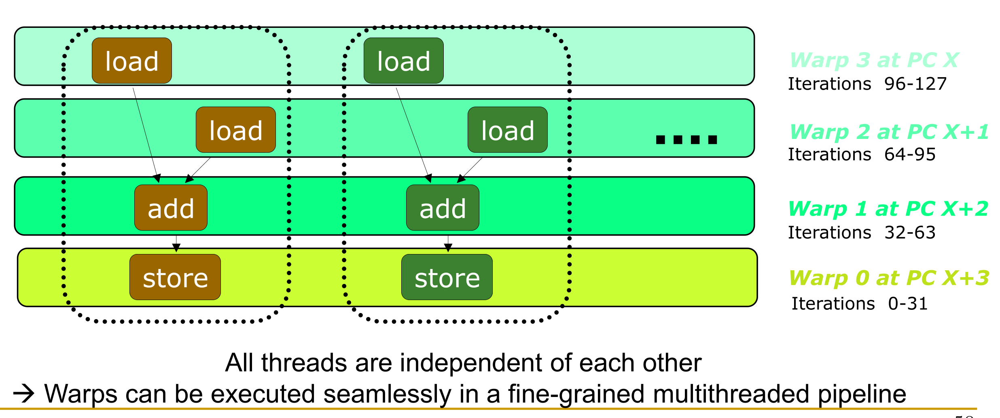
    - **Logical grouping** of independent threads (e.g., 32) formed dynamically by the hardware, not a physical hardware piece.
    - Grouped strictly because they execute the exact same **Program Counter (PC)** simultaneously.
    - Governed by an **Active Mask** (bit vector) tracking which threads are currently valid/active for the executed instruction.
- **Hardware Units**:
  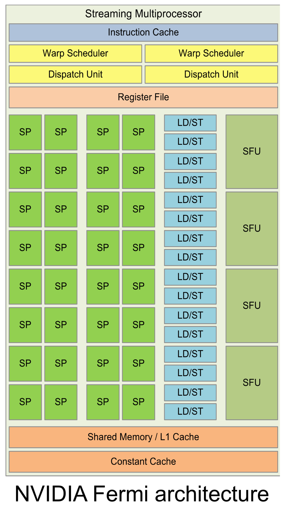
    - **Streaming Multiprocessor (SM)**: The actual physical "core" of the GPU (e.g., 160 in Blackwell B200). Fetches instructions, schedules warps, and holds local caches/registers.
    - **Streaming Processor (SP) / CUDA Core**: An individual vector lane / ALU inside the SM. Computes math for exactly *one* thread of a warp per cycle.
- **Tensor Cores**:
    - Specialized execution units for AI/ML matrix math ($D = A \times B + C$).
    - Support mixed-precision computing (e.g., FP16/FP8 inputs, FP32 accumulation).
    - Modern iterations support **Sparsity** (compressing matrices to skip calculations on zero values).
- **Memory Hierarchy**:
  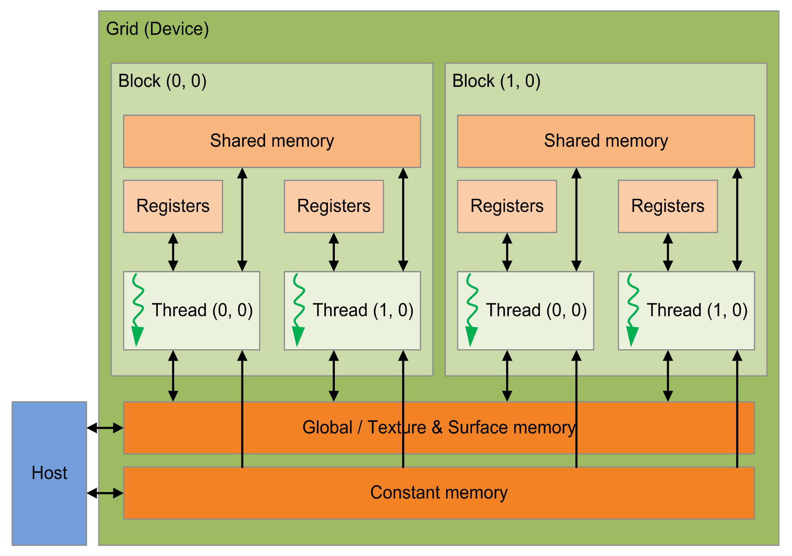
    - **Registers**: Fastest memory. Private to each individual thread. Excessive register use limits maximum concurrent warps.
    - **Shared Memory**: Software-programmable scratchpad cache. Shared among all threads *within a single block*. Requires local synchronization barriers (`__syncthreads()`).
    - **Global Memory (DRAM)**: Large, high-latency memory accessible by all threads globally and the Host. Includes Read-Only (Constant) and Texture memory.

## Managing GPU Resources

- **Latency Hiding via Fine-Grained Multithreading (FGMT)**:
    - Warps seamlessly interleave on the pipeline with zero interlocking overhead.
    - If a warp stalls (e.g., cache miss), the **warp scheduler** instantly swaps it for a ready warp.
    - Masks massive memory latencies purely through continuous computation.
- **Control Flow / Branch Divergence**:
  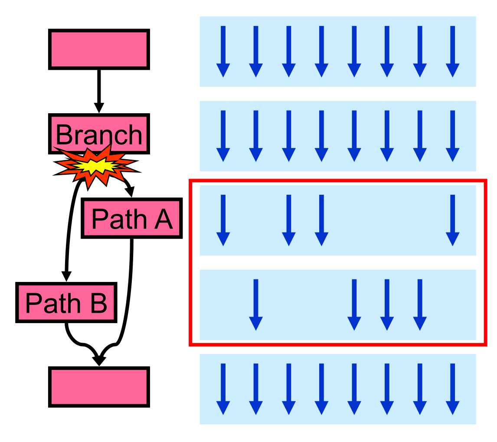
    - Threads within a single warp evaluate a branch (`if/else`) differently.
    - Logically splits the single warp into two sequential passes.
    - Hardware executes paths sequentially, using the **Active Mask** to enable/disable specific threads per path.
    - Drops **SIMD Utilization** (e.g., 50/50 split halts half the lanes, dropping efficiency by 50%).
- **Dynamic Warp Formation / Merging**:
  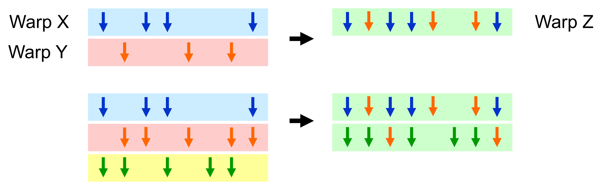
    - Hardware scheduler scans for waiting, divergent warps stalled at the exact same **PC**.
    - Merges partially empty warps into a single full warp (restoring the active mask).
    - **Constraint**: Threads cannot map to arbitrary lanes. The physical **Register File** is strictly partitioned by lane ID.
- **Two-Level Warp Scheduling**:
  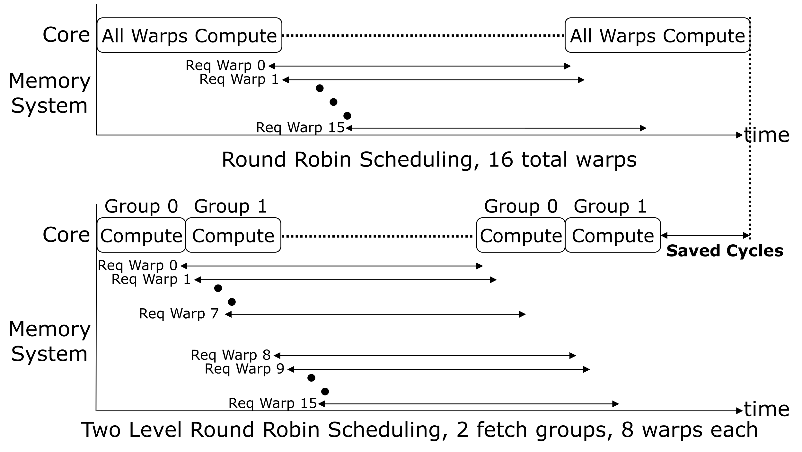
    - **Problem**: Standard round-robin scheduling of 1000 warps causes simultaneous long-latency memory loads, stalling the entire **SM**.
    - **Solution**: Group warps into smaller subgroups. Process one subgroup rapidly until it stalls, then compute the next subgroup while the first fetches memory.

## GPU Programming Model (CUDA/OpenCL)

- **Host and Device Paradigm**:
    - **Host**: CPU (handles sequential/branchy setup logic).
    - **Device**: GPU (handles massively parallel compute kernels).
    - Explicit data transfers between Host RAM and Device DRAM via **PCIe**.
- **Bulk Synchronous Parallel Model**:
    - GPU code spawns a **Grid** $\rightarrow$ divided into **Blocks** $\rightarrow$ divided into **Threads**.
    - **No Global Synchronization**: No hardware barrier exists across all blocks mid-kernel.
    - To truly globally sync, the Host must explicitly **terminate the kernel** and launch a new one.
    - Ensures **Transparent Scalability**: Hardware schedules blocks arbitrarily based on available **SMs**.
- **Thread Indexing**:
    - Maps unique thread IDs to data array indices.
    - **1D Index**: `Index = blockIdx.x * blockDim.x + threadIdx.x`
    - **2D Index**: Relies on row-major math (`Row * Width + Column`).

```cpp
// 1. Kernel Definition (Executes on GPU)
__global__ void vecAdd(int *a, int *b, int *c) {
    // Calculate global thread ID using 1D indexing
    int tid = blockIdx.x * blockDim.x + threadIdx.x; 
    c[tid] = a[tid] + b[tid];
}

int main() {
    int *h_a, *h_b, *h_c; // Host pointers (CPU)
    int *d_a, *d_b, *d_c; // Device pointers (GPU)
    int size = 1024 * sizeof(int);

    // 2. Allocate memory & copy data (Host -> Device)
    /* ... malloc and initialize host arrays h_a, h_b ... */
    cudaMalloc(&d_a, size);
    cudaMalloc(&d_b, size); 
    cudaMalloc(&d_c, size);
    cudaMemcpy(d_a, h_a, size, cudaMemcpyHostToDevice);
    cudaMemcpy(d_b, h_b, size, cudaMemcpyHostToDevice);

    // 3. Launch Kernel (Asynchronous: CPU continues immediately)
    vecAdd<<<numBlocks, threadsPerBlock>>>(d_a, d_b, d_c);

    // CPU can execute concurrent work here...

    // 4. Sync & retrieve results (Device -> Host)
    cudaDeviceSynchronize(); // Block CPU until GPU finishes
    cudaMemcpy(h_c, d_c, size, cudaMemcpyDeviceToHost);

    // 5. Cleanup
    cudaFree(d_a); cudaFree(d_b); cudaFree(d_c);
    return 0;
}
```

## Performance Optimizations

- **Occupancy**:
    - Ratio of active warps to the theoretical maximum warps per **SM**.
    - Hard-limited by partitioned resources: **Program Counters**, **Registers**, and **Shared Memory**.
- **Global Memory Coalescing**:
  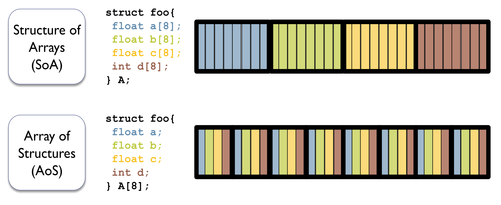
    - Goal: Concurrent threads in a warp access contiguous memory locations within the same cache line (e.g., 128 bytes).
    - **AoS (Array of Structures)**: Scatters thread accesses with large strides. Generates uncoalesced transactions $\rightarrow$ destroys bandwidth. **Never use on GPUs**.
    - **SoA (Structure of Arrays)**: Ensures contiguous threads hit contiguous data $\rightarrow$ maximizes bandwidth.
- **Shared Memory Bank Conflicts**:
  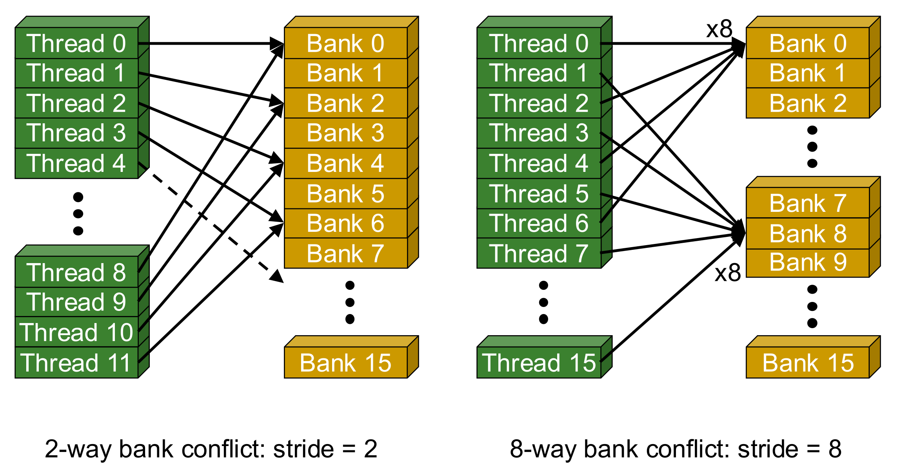
    - **Banks**: Interleaved memory modules servicing exactly one address per cycle.
    - **Mapping**: Successive 32-bit words map to successive banks (`Bank = Address % 32`).
    - **Conflict**: Multiple threads in *one warp* request *different* addresses mapping to the *same* bank.
    - Forces **serialization** (e.g., 2-way conflict halves memory bandwidth).
    - **Padding**: Adding empty, unused bytes at row ends to shift modulo-32 math, purposefully misaligning data to prevent conflicts.
- **Control Flow Optimization**:
  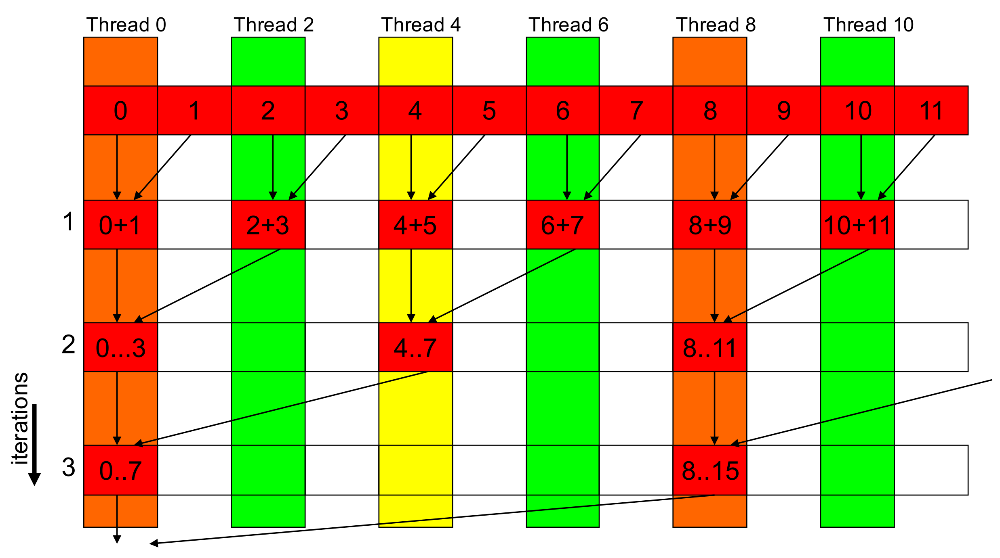
  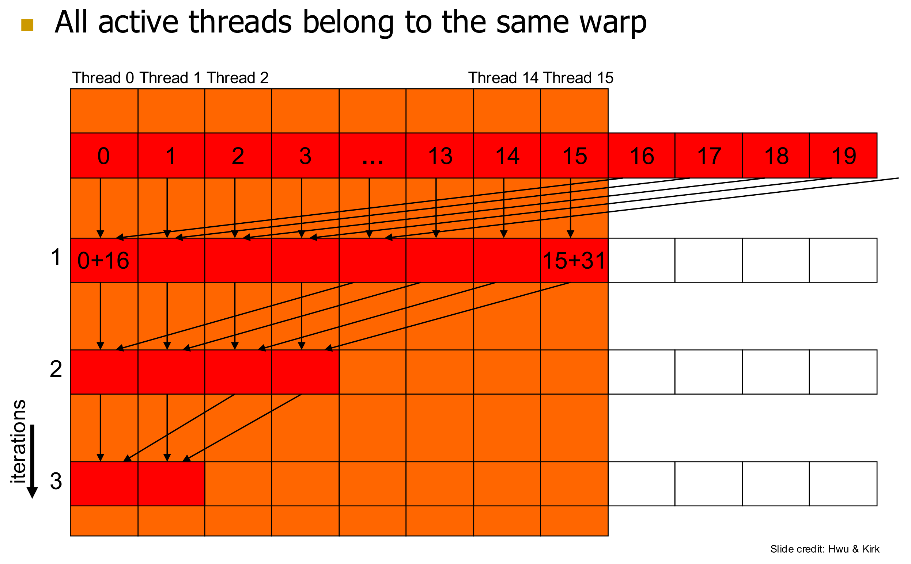
    - Rewriting algorithms (e.g., tree reductions) to ensure active threads remain sequentially adjacent.
    - Prevents intra-warp divergence and maintains 100% active masks.
- **Atomic Operations**:
  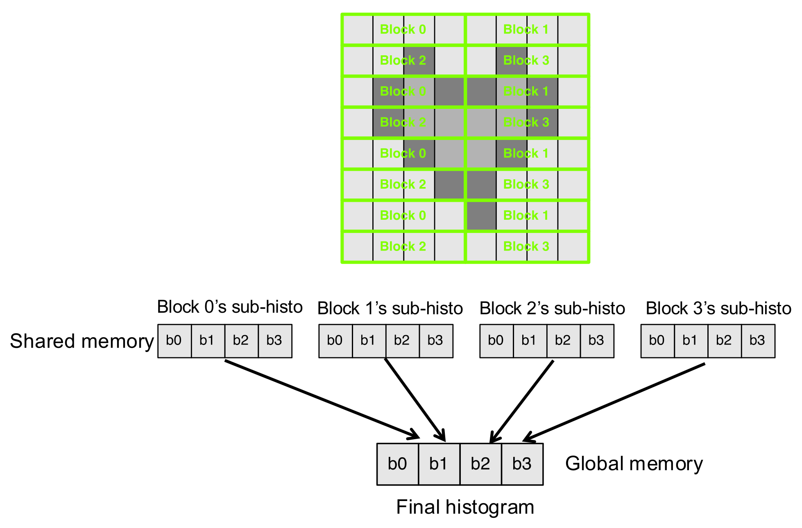
    - Native hardware instructions safely updating the exact same memory address across threads. Forces strict serialization.
    - **Privatization**: Blocks compute local sub-results entirely in fast **Shared Memory**, eliminating global contention. Merged into **Global Memory** once via atomics at the end.

## Collaborative Computing

- **Asynchronous Transfers (Streams)**:
  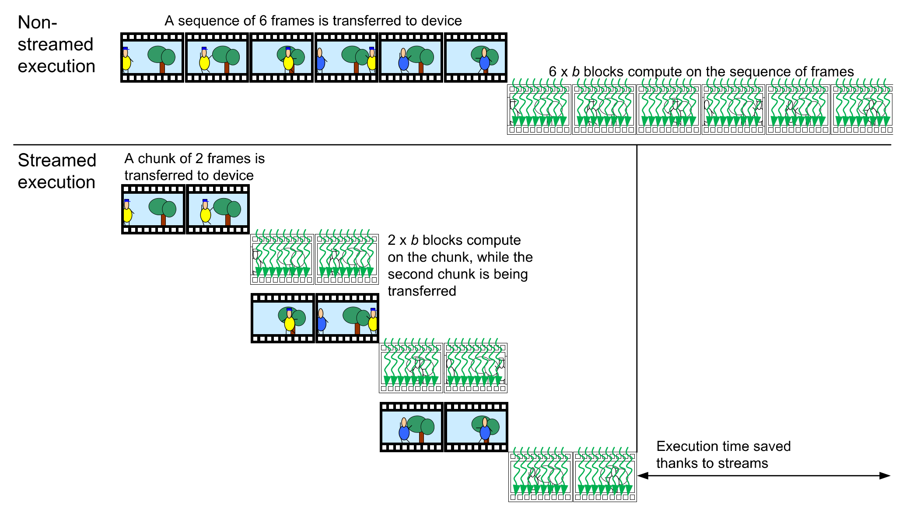
    - **Streams**: Independent command queues executed sequentially.
    - Overlaps CPU-GPU communication (`cudaMemcpyAsync`) with computation (kernel execution). Crucial for streaming video/data.
- **Unified Memory**:
    - CPU and GPU share identical virtual memory space (`cudaMallocManaged`), eliminating explicit `cudaMemcpy` calls.
    - **Implementation**: Handled via **GPU page faults**. System intercepts faults and dynamically migrates 4KB memory pages between Host RAM and GPU VRAM over the PCIe bus on demand.
- **Task Partitioning**:
    - **Coarse-grained**: Distributing entirely distinct algorithms between CPU and GPU.
    - **Fine-grained**: CPU and GPU concurrently processing different chunks of the exact same data structure (enabled via Unified Memory system-wide atomics).
- **Persistent Thread Blocks**:
    - Launching exactly enough blocks to fill the **SMs** once.
    - Blocks execute infinite loops, dynamically pulling new work from queues.
    - Bypasses CUDA limitations, allowing custom global synchronization without kernel termination overhead.
