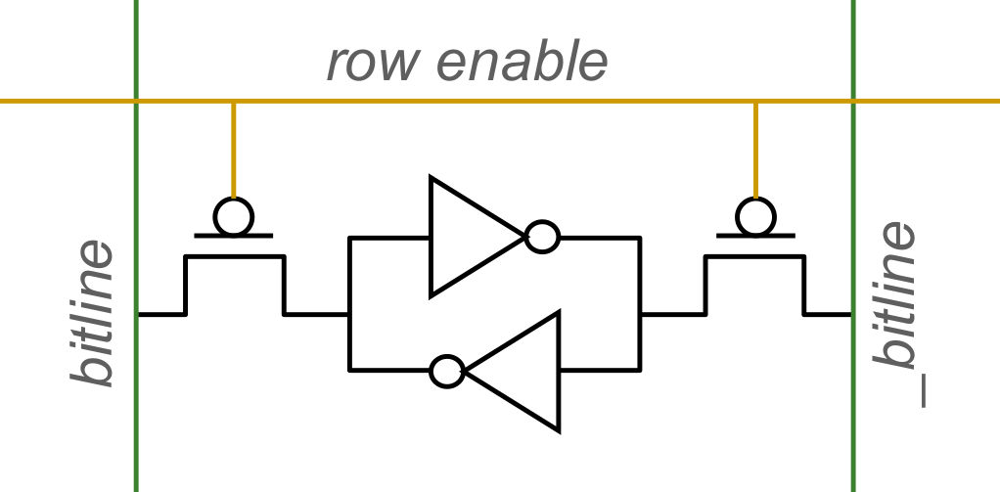
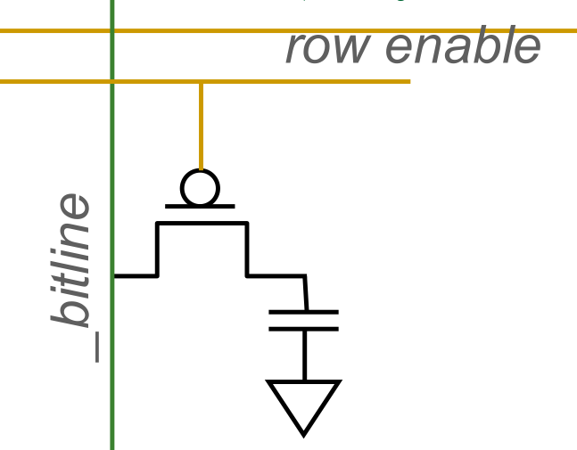
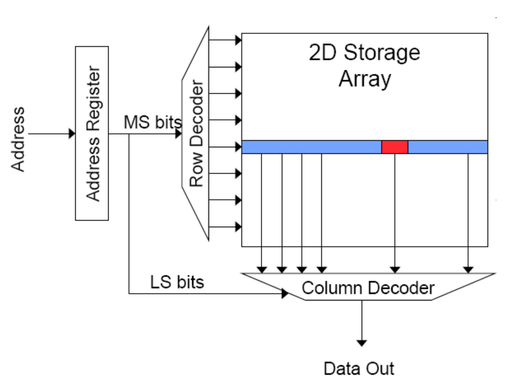
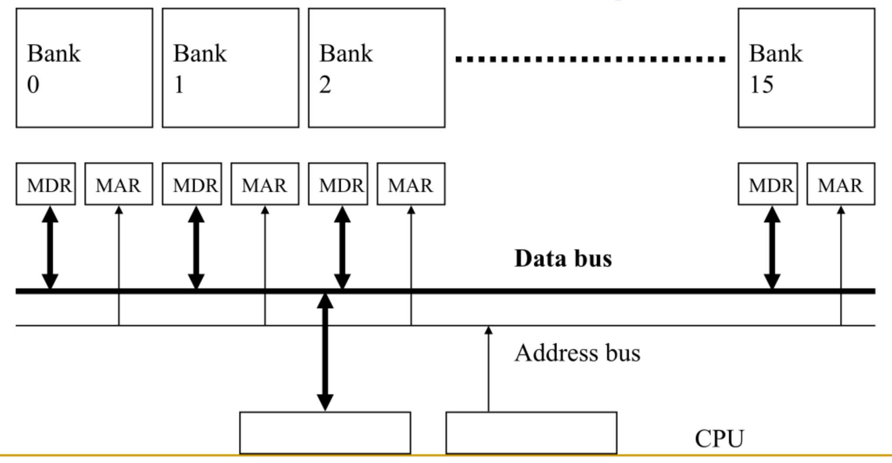
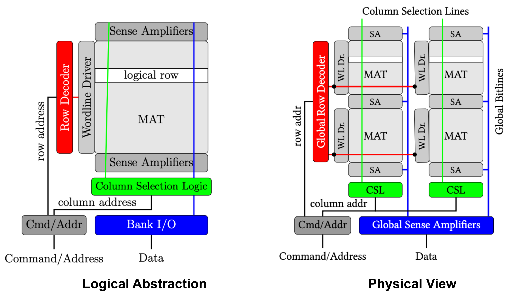

## Memory Fundamentals & Bottlenecks

- **Memory Criticality**: Impacts key system metrics:
    - **Performance**: **Data bottleneck**. Computation (e.g., ML/AI, genomics, databases) stalled waiting for data. Processors spend majority of cycles idle.
    - **Energy**: **Communication dominates arithmetic**. Moving off-chip data consumes ~100x to 6400x more energy than complex math. $>60\%$ (up to $>90\%$ in large ML models) of total system energy wasted on **data movement**.
    - **Robustness** (Reliability/Security): Dense memory prone to physical errors (e.g., bitflips).
    - **Cost**, **Form Factor**, and **Predictability**.

## Ideal Memory & Physical Trade-offs

- **Ideal Memory Parameters**:
    - **Zero access time** (latency)
    - **Infinite capacity**
    - **Zero cost**
    - **Infinite bandwidth**
    - **Zero energy**
- **Physical Limitations**: Requirements inherently oppose each other.
    - **Bigger is slower**: Larger arrays take longer to decode and route signals.
    - **Faster is more expensive**: Low-latency technology costs more per byte and takes up larger physical chip area.
    - **Higher bandwidth is expensive**: Requires physically more pins, channels, and buses.
- **Memory Hierarchy**: Fundamental solution. Combines small/fast memory with large/slow memory to simulate ideal conditions.

## Storage Technologies

- **Flip-Flops / Latches**:
    - Extremely fast.
    - Extremely expensive (tens of transistors per single bit).
- **Static RAM (SRAM)**:
  
    - Stores data using two **cross-coupled inverters**.
    - Typically uses **6 transistors (6T cell)** (4 for storage, 2 for access).
    - Fast access, lower density, higher cost ($< \$0.3$ per MB).
    - **Logic-compatible**: Easily manufactured directly on processor die.
    - Retains data indefinitely as long as powered (no refresh needed).
- **Dynamic RAM (DRAM)**:
  
    - Stores data as electrical charge inside a **capacitor** (Empty = `0`, Charged = `1`).
    - Uses **1 transistor, 1 capacitor (1T1C cell)**.
    - Slower access, high density, very low cost ($< \$0.006$ per MB).
    - Requires **refresh**: Capacitor charge leaks naturally via RC paths over time.
    - Requires specialized manufacturing processes (incompatible with standard logic chips).
- **Flash Memory**:
    - Non-volatile.
    - Slow access (~$50$-$100 \mu s$).
    - Very cheap ($< \$0.00008$ per MB).
- **Hard Disk Drive (HDD)**:
    - Non-volatile.
    - Extremely slow (~$10 ms$).
    - Extremely cheap ($< \$0.00003$ per MB).

## Charge vs. Resistive Memory

- **Charge Memory** (e.g., DRAM, Flash):
    - Writes data by capturing charge ($Q$).
    - Reads data by detecting voltage ($V$).
- **Resistive Memory** (e.g., STT-MRAM, Memristors):
    - Writes data by pulsing current ($dQ/dt$).
    - Reads data by detecting resistance ($R$).
    - **Phase Change Memory (PCM)**: Resistive memory using **chalcogenide glass** existing in amorphous state (high resistance) or crystalline state (low resistance).
        - Higher density than DRAM (scales better, multiple bits per cell).
        - Non-volatile, no refresh needed.
        - Slower access, higher write energy (requires heating/cooling).
        - **Endurance problems**: Cells wear out after millions of writes.
        - Cost: $< \$0.004$ per MB.

## Memory Array Organization

- **2D Array Structure**: Logically organized as $2^N$ rows and $M$ columns for efficient storage/access.
- **Address Decoder**: Receives address, activates exactly one row.
- **Wordline**: Horizontal wire controlled by decoder. Activates access transistors for an entire row simultaneously.
- **Bitline**: Vertical wire connecting storage nodes in a column to sensing logic.
- **Multiplexer (MUX)**: Readout circuitry. Selects specific requested bits from the entirely activated row using column address.

## DRAM Subsystem Architecture

1. **Channel**: Independent memory bus connecting CPU memory controller to memory modules.
2. **DIMM (Dual In-line Memory Module)**: Physical printed circuit board (stick of RAM).
3. **Rank**: Collection of memory chips (e.g., 8 chips) operating simultaneously.
    - Shares Address and Command buses.
    - Uses **Chip Select (CS)** signal for differentiation (e.g., Front Rank vs. Back Rank).
    - Distributes data bus across chips (e.g., 64-bit bus formed by 8 chips outputting 8 bits each). Keeps individual chips cheap/low-pin.
4. **Chip**: Individual integrated circuit on the DIMM.
   
5. **Bank**: Independent 2D memory array within a chip.
6. **Subarray**: Internal logical partitions within a bank. Shortens bitlines/wordlines to minimize electrical latency.
7. **Row/Column**: Lowest level addressing coordinates.

## Internal DRAM Operation

- **Sense Amplifier**: Built from cross-coupled inverters.
    - Detects tiny voltage deviations ($\delta$) on bitline when capacitor connects (bitline initially precharged to $1/2 V_{DD}$).
    - Amplifies voltage to full $V_{DD}$ (`1`) or $0$ (`0`).
    - **Destructive Read**: Reading drains capacitor. Sense amplifier must actively drive full charge back to restore cell state.
- **Row Buffer**: Array of sense amplifiers holding an entire row of data. Acts as temporary fast cache within DRAM bank.
- **Access Sequence**:
    1. **ACTIVATE**: Opens target row, moves data into row buffer (slow operation).
    2. **READ / WRITE**: Accesses specific columns from active row buffer (fast operation).
    3. **PRECHARGE**: Closes row, writes data back to capacitors, resets bitline voltages to $1/2 V_{DD}$ for next access.
- **Row Buffer Hit**: Requested row already open in row buffer. Requires only fast READ/WRITE column command.
- **Row Buffer Conflict**: Requested row differs from currently open row. Requires slow sequence: PRECHARGE (close old row) $\rightarrow$ ACTIVATE (open new row) $\rightarrow$ READ/WRITE.

## Interleaving and Banking

- **Problem**: Single monolithic memory array extremely slow, handles zero parallel requests.
- **Banking (Interleaving)**: Dividing memory into multiple independent **Banks**.
- **Shared Buses**: Banks share address and data buses. Drastically reduces pin count on memory chips.
- **Parallelism (Overlapped Accesses)**: Independent banks enable concurrent operations (e.g., start access in Bank 0, start access in Bank 1 while waiting for Bank 0 latency).
- **Data Mapping**: Sequential memory addresses mapped to successive banks. Ensures sequential software accesses distribute evenly across different banks, preventing bottlenecks.

## Read Disturbance Errors

- **RowHammer**: Physical hardware failure mechanism. Creates severe system security vulnerabilities (e.g., arbitrary privilege escalation).
- **Read Disturbance Errors**: Repeatedly reading same DRAM row ("hammered row") causes electromagnetic interference and rapid charge leakage in adjacent rows ("victim rows").
- **Bitflips**: High-frequency accessing induces predictable data corruption in adjacent rows before memory controller natural refresh.
- **Scaling Impact**: Vulnerability increases as chips scale down (higher density, smaller cells, shorter distances).
