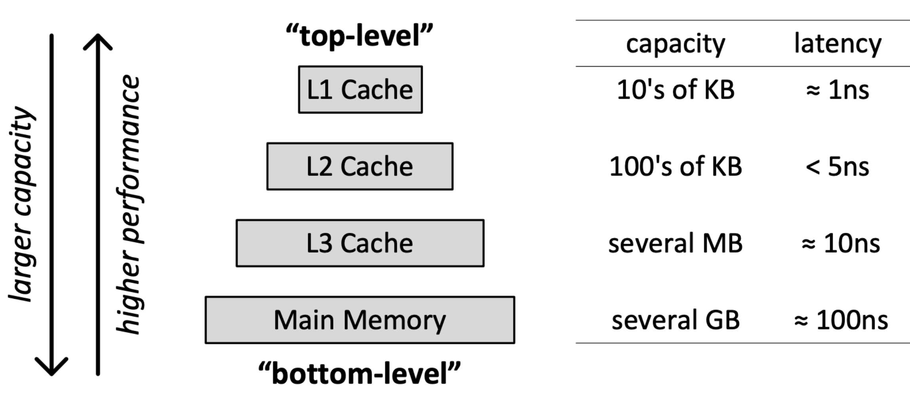
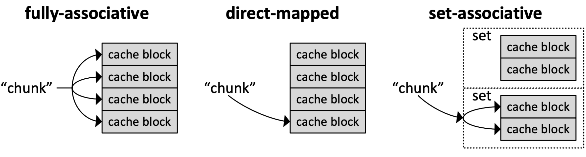
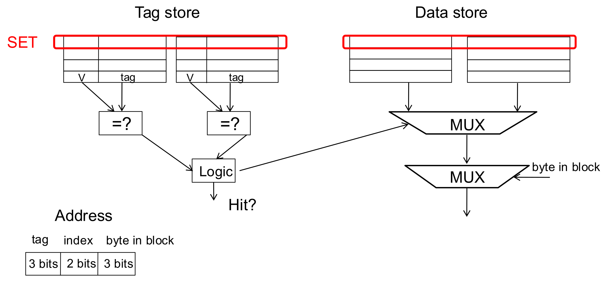
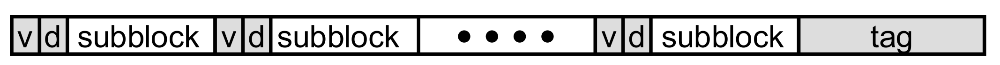
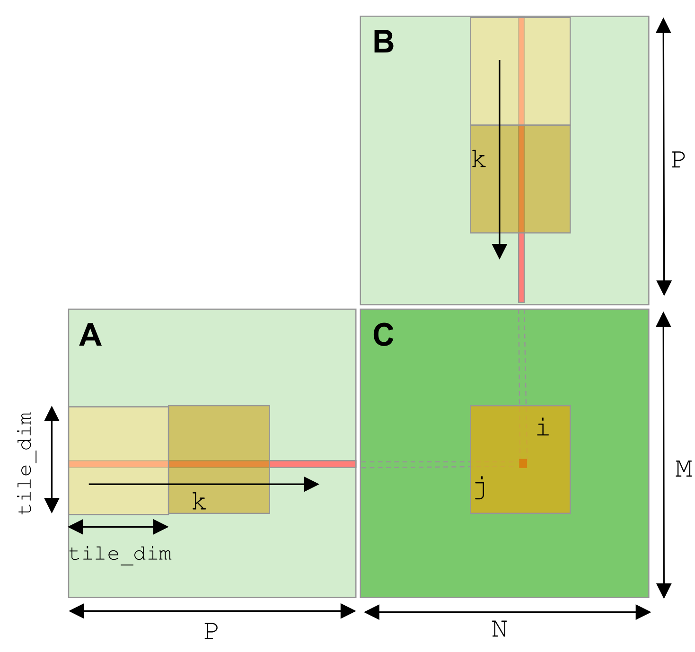
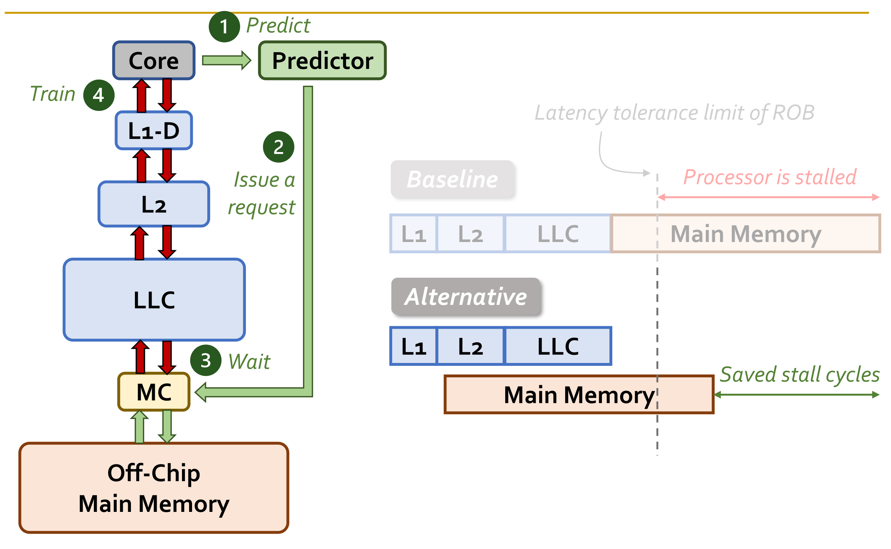
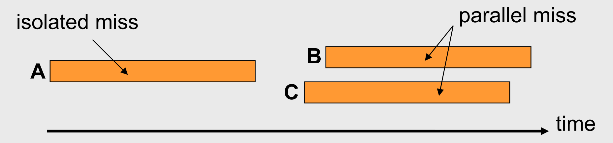
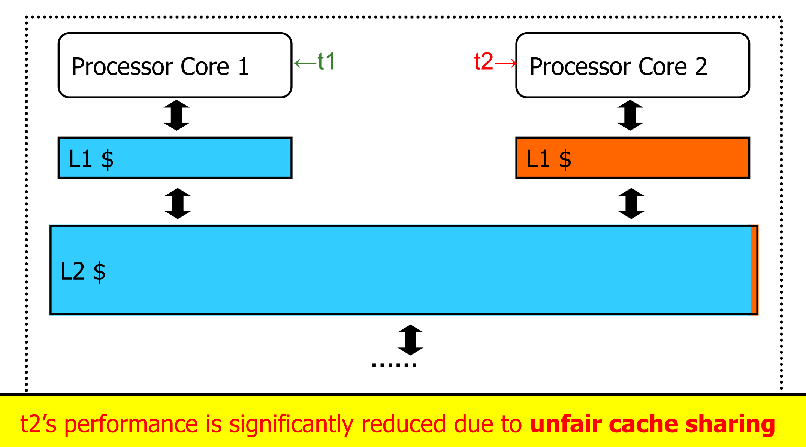

## Memory Hierarchy

- **Memory Hierarchy Principle**: Combines multiple memory levels. Exploits **locality** to create illusion of a memory system as fast as top level and as large as bottom level.
    - **Temporal Locality**: Accessing exact same memory location repeatedly in short timeframe (e.g., loop counters).
    - **Spatial Locality**: Accessing adjacent memory locations sequentially (e.g., array traversals, sequential instructions).
- **Tail Latency**: High cache hit rates hide average latency. Critical systems must actively account for rare maximum latency spikes (**tail latency**) for reliability.

## Hierarchical Latency Analysis

- **Recursive Formula**: $T_i = t_i + m_i \cdot T_{i+1}$
    - $T_i$: Perceived access time at level $i$.
    - $t_i$: Intrinsic access time at level $i$.
    - $m_i$: Miss rate at level $i$.
- **Calculation Rule**: Hit rate ($h_i$) and miss rate ($m_i$) at level $i$ are strictly calculated *only* from requests missing at level $L_{i-1}$.
- **Balancing Levels**: Weaker **L1 Cache** (e.g., 95% vs. 99% hit rate) demands highly aggressive **L2 Cache** to maintain comparable overall access latency.

## Cache Organization and Addressing

- **Cache Structure**: Automatically managed hardware structure memoizing frequently/recently accessed blocks.
- **Address Breakdown**: Reinterpretation of the 64-bit address bits into three contiguous fields:
    - **Index**: Row/set location. Maps memory blocks via modulo.
    - **Tag**: Unique identifier. Resolves modulo collisions by verifying *which* specific block currently occupies that index.
    - **Byte Offset**: Identifies the exact byte location within the cache block.
- **Mapping Strategies**:
    - **Direct-Mapped**: 1 block $\rightarrow$ 1 set. Only **one** block per modulo equality class cached concurrently; highly susceptible to **Conflict Misses**.
    - **Set-Associative**: 1 block $\rightarrow$ 1 set, but placed in $N$ different **ways**. Up to **$N$** blocks per modulo equality class cached concurrently; balances conflicts and latency.
    - **Fully-Associative**: 1 block $\rightarrow$ any location (no index bits used). No modulo conflict limits exist; requires power-hungry parallel tag comparators.
- **Associativity Flexibility**: No power-of-2 requirement (e.g., **Intel Lion Cove** uses 3-way or 12-way caches to maximize physical die area utilization).

## Cache Management Policies

- **Replacement Policies**: Determines block eviction on cache miss.
    - **Random**: Evicts any block. Effective against **set thrashing** (working set $>$ cache associativity).
    - **LRU (Least Recently Used)**: Evicts oldest accessed block.
        - **Implementation Complexity**: Tracking exact LRU order in highly associative caches mathematically too complex (requires $O(N!)$ states). Modern processors use approximations (**Not MRU**, **Hierarchical LRU**).
    - **Belady's OPT**: Theoretical optimal policy replacing block needed furthest in future. Minimizes *miss rate* but **not optimal for execution time** (ignores variable fetch latency/cost).
- **Write Policies**:
    - **Write-Through**: Immediate writes to next level. Bandwidth-intensive; simplifies **cache coherence**.
    - **Write-Back**: Writes deferred until block eviction (flagged via **Dirty Bit**). Saves massive bandwidth via write combining.
- **Allocation Policies**:
    - **Allocate**: Brings block into cache upon write miss.
    - **No-Allocate**: Writes directly to main memory. Saves cache space if data lacks spatial/temporal locality.

## Advanced Cache Structures

- **Unified vs. Split Caches**:
    - **L1 Cache**: Almost always split (Instruction/Data) due to **pipeline constraints** (fetch and execution occur at opposite physical ends of processor).
    - **Outer Caches (L2/L3)**: Almost always unified for dynamic capacity sharing.
- **Subblocked (Sectored) Caches**: Divides cache block into smaller sectors.
  
    - Uses $1$ shared **Tag** per block, but tracks separate **Valid/Dirty bits** per subblock.
    - **Benefit**: Avoids transferring full 64B blocks for small operations. Allows fetching/writing specific chunks, saving bus bandwidth.
- **Hierarchy Inclusivity**:
    - **Inclusive**: L1 blocks must reside in L2. Simplifies coherence; wastes capacity.
    - **Exclusive**: L1 blocks cannot reside in L2. Maximizes effective capacity.
    - **Non-Inclusive**: No strict rules. Relaxes hardware design constraints.
- **Critical-Word First**: Fetch optimization pulling specific requested word from main memory first. CPU resumes execution immediately while rest of block fills in background.
- **Cache Compression**: Shrinks stored data to increase effective capacity.
    - Exploits **Low Dynamic Range** (small numerical differences between adjacent values) and common patterns (**Zero/Repeated/Narrow Values**).
    - **Base-Delta-Immediate (BΔI) Compression**: Stores 4-byte base + 1-byte deltas. Uses two bases (first element and $0$). Fast decompression via **vector addition**; achieves ~2X capacity with low hardware overhead.

## Miss Classification

- **Compulsory Miss**: First reference to an address. Unfixable natively by caching.
- **Capacity Miss**: Cache too small for active working set. Fixed via software tiling.
- **Conflict Miss**: Eviction forced by limited associativity. Fixed via more ways or memory hashing.
- **Coherence Miss**: Block invalidated by another processor in multi-core system.

## Software and Software-Hardware Optimizations

- **Restructuring Access Patterns**: Aligning nested loops to memory layout (**Loop Interchange** for column-major data).
- **Blocking / Tiling**: Dividing massive array loops into smaller computation chunks fitting entirely into cache/scratchpad to prevent thrashing.
  
- **Restructuring Data Layout**: Separating **hot** (frequently accessed) and **cold** (rarely accessed) data into different structs avoiding cache pollution (e.g., separating linked-list keys from heavy payload data).
- **Bypassing**: Modern GPUs allow direct L2 $\rightarrow$ scratchpad copies, bypassing L1/register files entirely to save internal bandwidth.

## Memory Level Parallelism (MLP)

- **MLP Definition**: Concurrent generation and servicing of multiple memory accesses (driven heavily by out-of-order execution engines).
- **Breaking Traditional Assumptions**: Minimizing overall cache miss count $\neq$ maximizing performance.
    - Eliminating one **isolated miss** saves significantly more time than eliminating one **parallel miss** (parallel miss stall latency hidden behind other ongoing misses).
    - **MLP-Aware Cache Replacement**: Hybrid policy. Retains isolated miss blocks; intentionally evicts parallel miss blocks. Improves execution time despite higher total miss count.
- **Off-Chip Prediction**: Uses predictors (e.g., machine learning perceptrons) identifying long-latency loads early. Routes predicted misses immediately to main memory overlapping latency with ongoing computations.
  

## Multi-Core Caching and Coherence

- **Private vs. Shared Caches**:
    - **Private Cache**: Dedicated exclusively to one core. Fast; underutilizes system space.
    - **Shared Cache**: Used by multiple cores. Improves utilization and lowers inter-thread latency. Introduces severe resource contention; destroys **performance isolation** (causing unfairness/QoS degradation).
      
- **Cache Coherence Necessity**: Hardware cache coherence **absolutely necessary** in shared-memory multi-core processors. Software coherence management destroys performance.
- **Broadcast-Based (Snoopy Bus)**: Cores broadcast writes/updates. Other caches snoop bus invalidating/updating local copies. Scales poorly to high core counts.
- **Directory-Based**: Central directory tracks cache block locations using $P+1$ bits ($P$ processors + $1$ **Exclusive bit**).
    - **Exclusive Bit**: Indicates single cache holds only valid copy. Allows silent data modification avoiding slow broadcast traffic across network.
