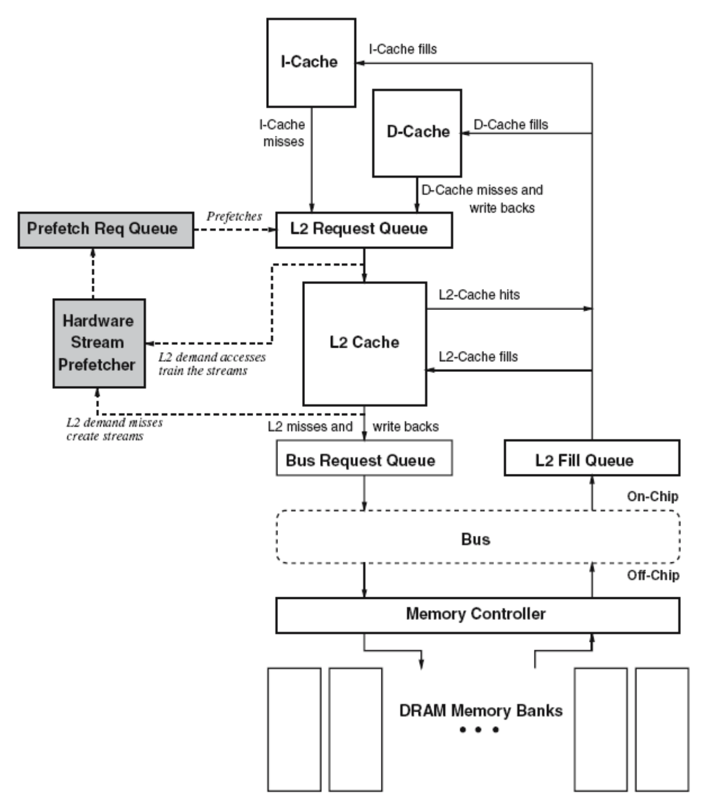
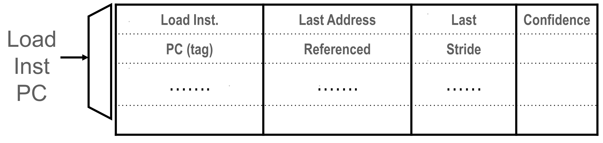
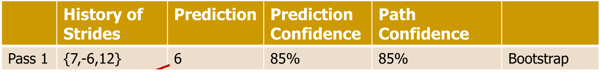
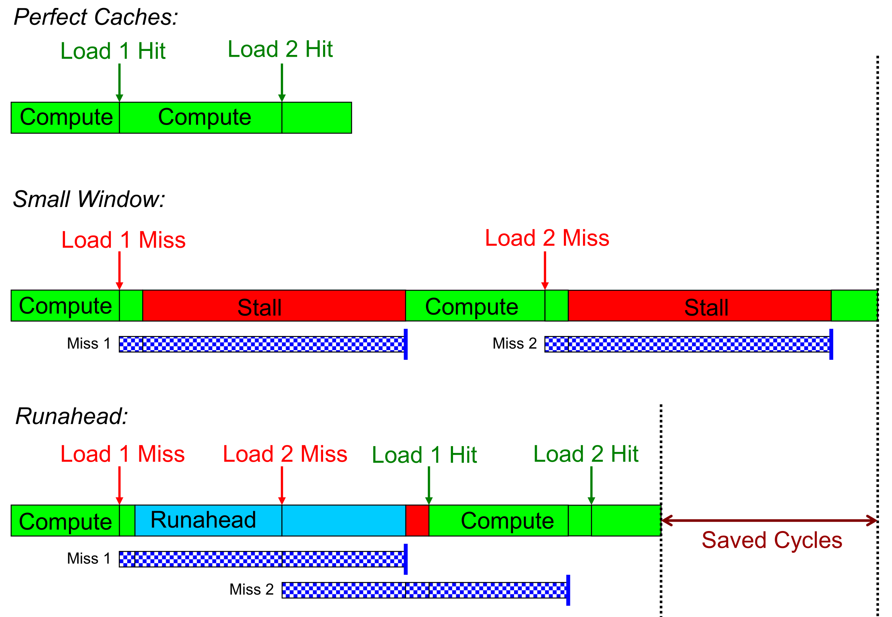

## Fundamentals

- **Definition**: Fetching data into the cache hierarchy before explicit program request.
- **Primary Goal**: Hide high memory latency and eliminate **compulsory cache misses**.
- **Granularity**: Typically operates at **cache block granularity**.
- **Implementation Mechanisms**:
    - **Software**: **ISA** instructions inserted by compiler/programmer (hard to optimize dynamically).
    - **Hardware**: Dedicated logic learning memory access streams.
    - **Execution-Based**: Speculative hardware thread pre-executing code to trigger misses.
- **Cache Placement Strategy**:
    - **Target Level**: Usually L1, L2, or **LLC** (**Last Level Cache**, e.g., L3).
        - Closer to L1: Sees all access streams, demands high bandwidth.
        - Closer to LLC: Sees filtered streams, catches broader patterns.
    - **Replacement Skewing**: High-confidence prefetches placed at **MRU** (**Most Recently Used**). Low-confidence placed at **LRU** (**Least Recently Used**) to prevent **cache pollution** (wasting space).
- **Timeliness**: Crucial balancing act.
    - **Too early**: Evicted before actual use.
    - **Too late**: Fails to hide full memory latency.
    - Higher aggressiveness improves timeliness but risks hurting accuracy.
- **Correctness Guarantee**: Purely opportunistic.
    - Mispredictions do not affect program correctness.
    - Mispredicted data simply unused; **no state recovery** needed (unlike branch mispredictions).
- **Motivation**: >80% of cached data unused before eviction (prefetching highly beneficial if accurate).

## Prefetcher Performance Metrics

- **Primary Metrics**:
    - **Accuracy**: Used prefetches / Sent prefetches.
    - **Coverage**: Prefetched misses / All misses (100% accuracy with 0% coverage is useless).
    - **Timeliness**: On-time prefetches / Used prefetches.
- **Secondary Metrics**:
    - **Bandwidth Consumption**: Consumed memory bandwidth with vs. without prefetching.
    - **Cache Pollution**: Extra demand misses caused by useful data being evicted by useless prefetches.

## Hardware Prefetching Algorithms

- **Target Access Patterns**:
    - **Simple Regular**: Linear strides (e.g., $A, A+N, A+2N$).
    - **Complex Regular**: Repeating delta sequences (e.g., $+2, +3, +4, +2, +3, +4$).
    - **Irregular**: Linked list traversals, indirect array accesses, or random accesses.
- **Stream Prefetcher**: Sequentially fetches adjacent cache blocks ($N+1, N+2...$) upon accessing block $N$.
- **Stride Prefetchers**: Detects stable distance ($N$) between accesses.
  
    - **Instruction-Based**: Indexed by **PC** (Program Counter). Tracks the specific stride generated by *one individual memory instruction* over time (e.g., a loop load).
    - **Memory-Region-Based**: Indexed by **Cache Block Address**. Tracks strides within a specific physical memory area, detecting patterns even if generated by *multiple interleaved instructions*.
- **Complex Pattern Prefetching**:
  
    - **Path Confidence Based Lookahead**: Records stride history sequence (e.g., $\{-6, 12, 6\}$). Bootstraps predictions repeatedly until cascaded **path confidence** drops below a hardware threshold.
- **Self-Optimizing Prefetchers (e.g., Pythia)**:
    - Uses **Reinforcement Learning** (Q-learning) directly in hardware.
    - **State**: Vector of features (e.g., PC + recent address deltas sequence).
    - **Action**: Chosen **prefetch offset** (e.g., $-6$ to $+32$, $0$ = no prefetch).
    - **Reward**: Calculated via **prefetch usefulness** (accuracy) and **system-level feedback** (memory bandwidth usage).
    - **Benefit**: Consistently high performance via dynamic adaptation (e.g., highly selective prefetching when DRAM bandwidth is saturated).

## Multi-Core and Hybrid Prefetching

- **Hybrid Hardware Prefetchers**: Real systems combine multiple specialized prefetchers (e.g., 6-7 per core) to maximize **coverage**.
- **Multi-Core Challenges**:
    - Exhausting shared memory bandwidth hurts prefetches and actual demand requests.
    - **Interference**: One core's aggressive prefetching (e.g., simple slideshow) destroys another core's performance via **cache conflicts** and **bus contention**.
- **Solution**: Requires dynamic **throttling** and coordinated control of prefetchers across the entire chip.

## Execution-Based Prefetching & Runahead Execution

- **The Bottleneck (Full-Window Stalls)**:
    - Long-latency L2/Memory misses block the oldest instruction in the **Reorder Buffer (ROB)**.
    - Younger instructions cannot be dispatched; entire processor strictly stalls.
    - Drastically scaling the window (e.g., 2048 entries) is impossible due to **power consumption**, **cycle time constraints**, and **complexity**.
- **Runahead Execution Mechanism**: Uses a simple core to achieve **Memory-Level Parallelism (MLP)** of a massive window.
    - **Checkpointing**: Saves architectural state on a long-latency miss.
    - **Speculation**: Pre-executes future instructions purely to generate data prefetches.
    - **Invalidation**: Drops instructions dependent on the missing data (marked **INV**).
    - **Restoration**: Upon data return, hardware restores checkpoint, flushes pipeline, and resumes normal execution.
- **Advantages**:
    - **Highly accurate** prefetches (strictly follows actual program path).
    - No wasted hardware context (utilizes idle main thread resources).
    - Achieves **512-entry window** performance using only a **128-entry window**.
- **Disadvantages**:
    - **Energy Inefficiency**: Executes instructions twice (speculatively, then for real).
    - Cannot prefetch **dependent cache misses** (e.g., pointer chasing / linked lists).
- **Enhancements**:
    - **Address-Value Delta (AVD) Prediction**: Hardware predicts the *value* of the missing pointer to unblock dependent nested loads.
    - **Wrong-Path Events**: Misspeculated branches during Runahead still often prefetch useful blocks for the correct execution path.
