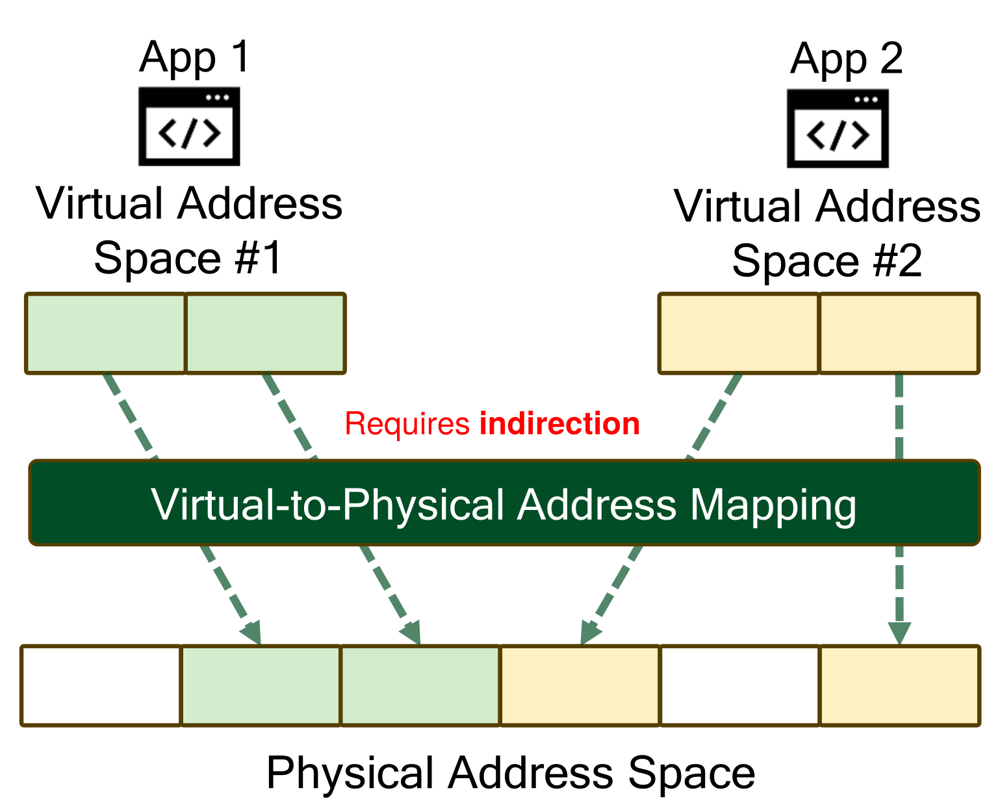
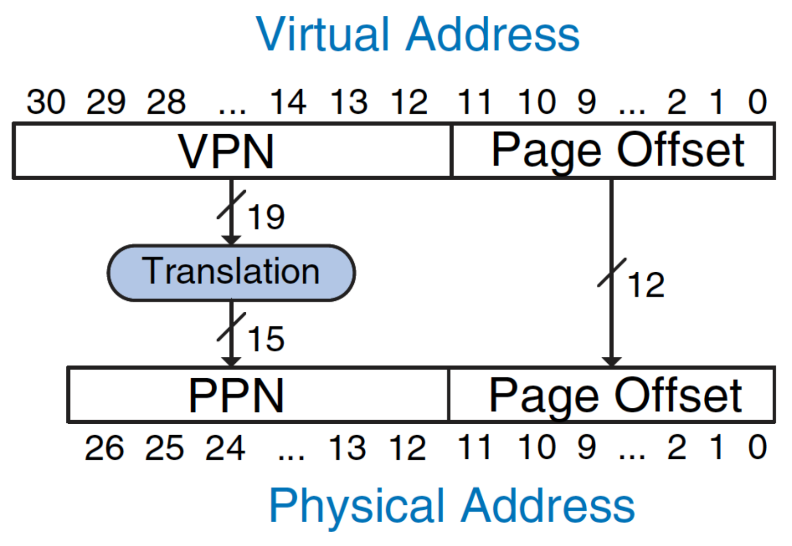
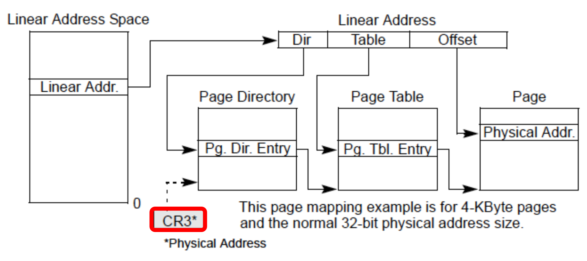
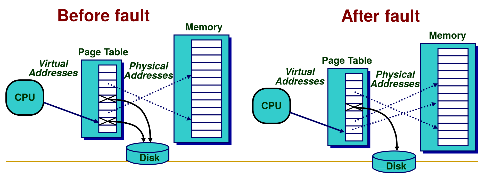
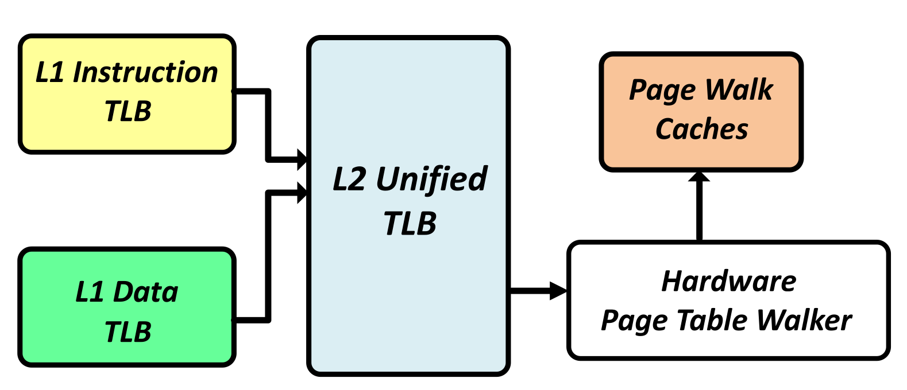
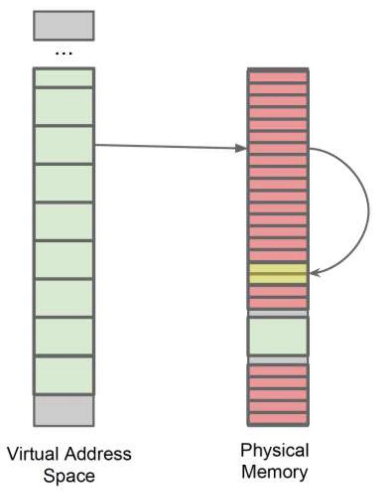

## Fundamentals

- **Core Abstraction**: Programmer illusion: memory with **zero access time**, **infinite capacity**, and **zero cost**.
- **System Reality**: Hardware and **Operating System (OS)** cooperatively map large **Virtual Address (VA)** to smaller **Physical Address (PA)** space.
- **Primary Benefits**:
    - **Relocation**: Flexible code/data placement in physical memory.
    - **Protection and Isolation**: Prevents processes from overwriting each other's memory.
    - **Sharing**: Multiple processes mapping to same physical memory (e.g., shared read-only libraries) saving space.
- **Pages and Frames**:
    - **Virtual pages**: Virtual address space chunks (typically $4\text{KB}$, sometimes $16\text{KB}+$ ).
    - **Physical frames**: Corresponding physical memory chunks.
    - *Concept*: Physical memory acts as a fully-associative cache for disk data.

## Address Translation

- **Address Split**:
  
    - **Virtual Address**: **Virtual Page Number (VPN)** + **Page Offset**.
    - **Physical Address**: **Physical Page Number (PPN)** + **Page Offset**.
    - **Crucial Rule**: **Page Offset** bits strictly *never change/translate*.
- **Page Table**: In-memory dictionary mapping VPNs to PPNs.
- **Page Table Base Register (PTBR)**: Hardware register (e.g., `CR3` in x86) holding physical base address of active process's page table.
- **Page Table Entry (PTE)**: Per-page tag store entry containing:
    - **Valid bit**: Page presence in physical memory.
    - **Tag bits (PPN)**: Physical translation target.
    - **Dirty bit**: Write-back caching support.
    - **Protection bits**: Access control (read/write/execute).
    - **Replacement bits**: Usage tracking for eviction.

## Page Table Size Limitations

- **The Size Problem**: 64-bit VA flat page table needs immense contiguous physical memory per process (e.g., ~$2^{54}$ bytes).
- **Multi-Level (Hierarchical) Page Tables**:
    - Tree-based organization (e.g., 4 levels in x86-64).
    - Only first-level table strictly requires permanent physical memory allocation.
    - Unused VA ranges left unallocated, saving physical memory.
    - **Trade-off**: $N$ sequential memory accesses per translation (e.g., 4 accesses for 4 levels).

## Page Faults and Replacement

- **Page Fault**: Triggered on VA access with PTE **Valid bit** = `0` (halts execution).
- **Minor Page Fault**: OS instantly finds and allocates free physical memory.
- **Major Page Fault**: Data entirely missing (resides on disk).
    - OS exception handler invokes disk fetch.
    - Handled via **Direct Memory Access (DMA)** (disk $\rightarrow$ RAM) saving CPU cycles.
    - Stalls faulting application (~milliseconds); CPU context switches to other processes.
- **Page Replacement**:
    - Strictly OS-handled (software); high disk latency allows complex algorithms.
    - **True LRU** (Least Recently Used) unfeasible (millions of pages to track).
    - **CLOCK Algorithm**: Approximation via circular physical frame list and scanning pointer ("hand").
        - Checks hardware-set **Reference (R) bit**.
        - Replaces first frame with `R = 0`.
        - Clears `R` bit (`R -> 0`) during traversal ("second chance").

## Accelerating Translation (TLBs)

- **Translation Lookaside Buffer (TLB)**: Small, fast hardware cache storing recent PTEs bypassing full page table walks.
- **Hardware-Managed TLB** (e.g., x86):
    - Hardware strictly handles page table walk on miss.
    - **Pros**: Fast, overlaps with computation, no OS exceptions.
    - **Cons**: High complexity, OS locked into static hardware-defined page table layout.
- **Software-Managed TLB** (e.g., MIPS):
    - Hardware raises fault exception on miss; OS manually walks table and inserts PTE.
    - **Pros**: Total OS flexibility over layout and replacement.
    - **Cons**: Massive performance penalty (pipeline flushes, context switching).
- **Hardware Page Table Walker (PTW)**: Per-core hardware state machine resolving TLB misses transparently (no context switches).
- **Page Walk Caches (PWC)**: Low-latency caches storing intermediate non-leaf page table pointers, drastically accelerating repetitive walks.

## Multiple Page Sizes

- **Multiple Page Sizes**: Supported by modern ISAs (e.g., $4\text{KB}$, $2\text{MB}$, $1\text{GB}$) to reduce total PTE count.
    - **Drawback**: High tail latency zeroing-out large $2\text{MB}$ pages for security vs. $4\text{KB}$.
- **L1 Data TLB**: Separate hardware structures per page size.
    - **Parallel Lookup**: Simultaneous probing of all L1 TLBs (actual page size and offset bits unknown beforehand).
- **L2 Unified TLB**: Caches translations (instructions + data) across different page sizes in one structure.
    - **N-Step Index Re-Calculation (Pseudo-Associativity)**: Assumes $4\text{KB}$ first (calculates index, checks tag). On miss, assumes $2\text{MB}$ (recalculates index, checks tag).
    - **Pros**: Simple hardware implementation.
    - **Cons**: Variable hit latency (slower $2\text{MB}$ hits); sequential testing lengthens critical path on misses.

## Memory Protection & Security

- **Page-Level Protection**: Access control via privilege **Rings** (Ring 0 = Supervisor/Kernel, Ring 3 = User).
    - **Page Directory Entry (PDE)**: Protects all 1024 downstream pages simultaneously.
    - **Page Table Entry (PTE)**: Protects a single specific page.
- **RowHammer Page Table Exploit**:
  
    - Attack exploiting physical DRAM unreliability.
    - Rapid memory accesses (via `clflush`) induce bit flips in adjacent DRAM rows.
    - **Spraying**: Attacker heavily fills physical memory with own PTEs.
    - Flips PPN bit inside a PTE, mapping it to *another* page table.
    - Grants user process read/write access to page tables, yielding **kernel privileges**.

## Cache-VM Interaction

- **Cache Addressing**: Caches tagged/indexed via Virtual Addresses (VA) or Physical Addresses (PA).
- **Homonym Problem**:
    - **Definition**: Same VA mapping to different PAs (e.g., two programs using identical VAs).
    - **Solution**: Virtually-addressed cache lines tagged with unique **Process ID (PID)**.
- **Synonym Problem**:
    - **Definition**: Different VAs mapping to exact same PA (e.g., shared libraries).
    - **Risk**: Same physical data existing in multiple virtually-addressed cache locations (causes data inconsistency on modification).

## Future Trends

- **Emerging Workload Overheads**:
    - **Short-Running Workloads** (e.g., Function-as-a-Service): Suffer massive **Memory Allocation** overheads (OS setup time unamortized over short runtime).
    - **Long-Running Workloads** (e.g., Graph Analytics): Suffer massive **Address Translation** overheads (irregular accesses cause constant TLB misses).
- **Future Scaling Trends**:
    - **Unified Virtual Memory**: Spanning high-bandwidth GPU memory and high-capacity CPU memory.
    - **Direct Storage Access**: Bypassing OS for hardware byte-addressable SSD access.
    - **Memory Disaggregation**: Network-accessed independent memory nodes in data centers.
