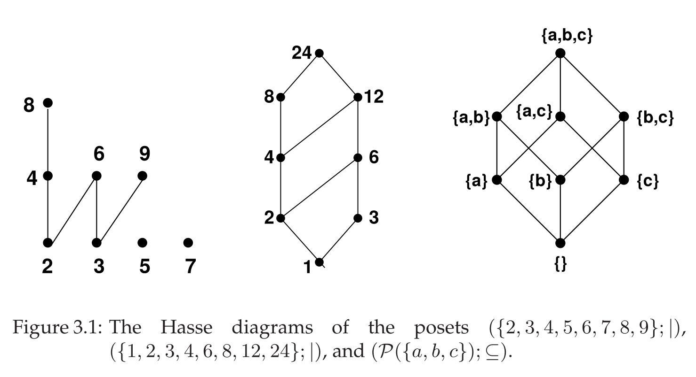

## Equivalence Relations

- **Equivalence relation**: A relation that is **reflexive**, **symmetric**, and **transitive**.[^def3.19]
- **Equivalence Class** $[a]_\theta$: The set of all elements equivalent to $a$ under the relation $\theta$.[^def3.20]
    - Notation: $[a]_\theta = \{b \in A \mid b \ \theta \ a\}$
- **Partitions & Quotient Sets**:
    - An equivalence relation **partitions** a set $A$ into its equivalence classes.[^thm3.11]
    - These classes are **mutually disjoint**, and their union is the set $A$.[^def3.21]
    - Any two equivalence classes are either **identical** ($[a]=[b]$) or **disjoint** ($[a] \cap [b] = \emptyset$).
    - The **quotient set** $A/\theta$ is the set of all these equivalence classes.[^def3.22]
- **Intersection**: The intersection of two equivalence relations is also an equivalence relation.[^lem3.10]
    - **Example**: The intersection of $\equiv_3$ and $\equiv_5$ on $\mathbb{Z}$ is the relation $\equiv_{15}$.
- **Example: Construction of Rational Numbers ($\mathbb{Q}$)**
    1. Start with set $A = \mathbb{Z} \times (\mathbb{Z} \setminus \{0\})$.
    2. Define relation $\sim$ on $A$: $(a,b) \sim (c,d) \stackrel{\text{def}}{\iff} ad = bc$.
    3. This relation is an **equivalence relation** (reflexive, symmetric, transitive).
    4. The set of **rational numbers** $\mathbb{Q}$ is the quotient set $A/\sim$. Each class $[(a,b)]$ corresponds to the fraction $\frac{a}{b}$.

## Partial Orders (Posets)

- **Definition and Properties**:
    - **Partial Order** (or **Order Relation**): A relation $\preceq$ that is **reflexive**, **antisymmetric**, and **transitive**.[^def3.23]
        - Differs from an equivalence relation by replacing symmetry with antisymmetry.
    - **Poset (Partially Ordered Set)**: A pair $(A; \preceq)$ of a set $A$ and a partial order relation $\preceq$ on it.[^def3.23]
- **Order Types**:
    - **Partial Order**: Not all element pairs are necessarily comparable.[^ex3.36]
        - **Comparable** vs. **Incomparable**: Two elements are comparable if one is related to the other, otherwise they are incomparable.[^def3.24]
    - **Total Order**: All element pairs are comparable (e.g., $(\mathbb{Z}; \le)$).[^def3.25]
    - **Well-Ordered**: A total order where every non-empty subset has a **least element** (e.g., $(\mathbb{N}; \le)$).[^def3.30]
        - Intuitively, guarantees a "starting point" for any chosen collection of elements. Crucial for proofs like in Theorem 3.17.
- **Visualizing Posets**:
    - **Hasse Diagrams**: Simplified graphs for finite posets.[^def3.27]
    - An edge from $a$ up to $b$ exists only if $b$ **covers** $a$.[^def3.26]
        - $b$ **covers** $a$ if $a \prec b$ (i.e., $a \preceq b$ and $a \neq b$) and no element $c$ exists such that $a \prec c \prec b$.
    - Edges imply upward direction; reflexivity and transitivity are implied by paths.
    
- **Special Elements**
    - **For the entire poset $A$**:
        - **Minimal / Maximal**: No element is strictly smaller / larger; can be multiple. [^def3.29]
        - **Least / Greatest**: Smaller / larger than or equal to **all** elements. Unique if it exists. [^def3.29]
            - **Key Difference**: A **least** element is below *everything*; a **minimal** element just has nothing below it.
    - **For a subset $S \subseteq A$**:
        - **Lower / Upper Bound**: Element in $A$ (not necessarily $S$) that is $\le$ / $\ge$ all elements in $S$. [^def3.29]
        - **Infimum (glb) / Supremum (lub)**: The greatest lower bound / least upper bound. [^def3.29]
            - Also called **meet** ($\land$) / **join** ($\lor$).[^def3.31]
            - Example ($(\mathbb{N}^+; |)$): $12 \land 18 = \text{gcd}(12, 18) = 6$.
    - **Connections**:
        - Least element of $A$ = $\inf(A)$.
        - Greatest element of $A$ = $\sup(A)$.
        - `inf`/`sup` generalize `least`/`greatest` to any subset.
- **Lattices**:
    - A **lattice** is a poset where every pair of elements has both a **meet** and a **join**.[^def3.32]
    - Example: $(\mathcal{P}(A); \subseteq)$, where meet is $\cap$ and join is $\cup$.
- **Combining Posets**:
    - **Direct Product**: Poset on $(A \times B)$ where $(a_1, b_1) \le (a_2, b_2) \iff a_1 \preceq a_2 \land b_1 \sqsubseteq b_2$.[^def3.28][^thm3.12]
    - **Lexicographical Order**: "Dictionary" order on $(A \times B)$ where $(a_1, b_1) \le_{lex} (a_2, b_2) \iff (a_1 \prec a_2) \lor (a_1 = a_2 \land b_1 \sqsubseteq b_2)$.[^thm3.13]

## Functions

- **Definition**:
    - A **function** $f: A \to B$ is a relation from a **domain** $A$ to a **codomain** $B$ that is:[^def3.33]
        1. **Total**: Every element in $A$ is mapped.
        2. **Well-defined**: Every element in $A$ maps to a *unique* element in $B$.
    - $B^A$ denotes the set of all functions from $A$ to $B$.[^def3.34]
    - **Image of a subset** $S \subseteq A$: $f(S)$, the set of elements in $B$ mapped from $S$.[^def3.36]
    - **Image (Range)** of the function: $Im(f) = f(A)$.[^def3.37]
- **Types of Functions**:
    - **Partial Function**: Well-defined but not necessarily total.[^def3.35]
    - **Injective** (one-to-one): Distinct inputs map to distinct outputs. $f(a_1) = f(a_2) \implies a_1 = a_2$.[^def3.39]
    - **Surjective** (onto): Every element in the codomain is reached. $Im(f) = B$.[^def3.39]
    - **Bijective**: Both injective and surjective.[^def3.39]
- **Operations on Functions**:
    - **Composition**: $(g \circ f)(a) = g(f(a))$.[^def3.41]
        - Note: Notation is reverse of relation composition.
        - Associative but not commutative.[^lem3.14]
        - Property (e.g., injectivity) is preserved under composition.
    - **Inverse Function**:
        - Exists only for **bijective** functions, denoted $f^{-1}: B \to A$.[^def3.40]
        - **Preimage** $f^{-1}(T)$ for a subset $T \subseteq B$ is always defined, even if $f^{-1}$ does not exist as a function.[^def3.38]

[^def3.19]: **Definition 3.19.** An equivalence relation is a relation on a set $A$ that is reflexive, symmetric, and transitive.
[^def3.20]: **Definition 3.20.** For an equivalence relation $\theta$ on a set $A$ and for $a \in A$, the set of elements of $A$ that are equivalent to $a$ is called the equivalence class of $a$ and is denoted as $[a]_\theta$. $[a]_\theta \stackrel{\text{def}}{=} \{b \in A \mid b \ \theta \ a\}$.
[^thm3.11]: **Theorem 3.11.** The set $A/\theta$ of equivalence classes of an equivalence relation $\theta$ on $A$ is a partition of $A$.
[^def3.21]: **Definition 3.21.** A partition of a set $A$ is a set of mutually disjoint subsets of $A$ that cover $A$, i.e., a set $\{S_i \mid i \in I\}$ of sets $S_i$ (for some index set $I$) satisfying $S_i \cap S_j = \emptyset$ for $i \ne j$ and $\bigcup_{i \in I} S_i = A$.
[^def3.22]: **Definition 3.22.** The set of equivalence classes of an equivalence relation $\theta$, denoted by $A/\theta \stackrel{\text{def}}{=} \{[a]_\theta \mid a \in A\}$, is called the quotient set of $A$ by $\theta$, or simply $A$ modulo $\theta$, or $A$ mod $\theta$.
[^lem3.10]: **Lemma 3.10.** The intersection of two equivalence relations (on the same set) is an equivalence relation.
[^def3.23]: **Definition 3.23.** A **partial order** (or simply an **order relation**) on a set $A$ is a relation that is **reflexive, antisymmetric, and transitive**. A set $A$ together with a partial order $\preceq$ on $A$ is called a **partially ordered set** (or simply **poset**) and is denoted as $(A; \preceq)$.
[^ex3.36]: **Example 3.36.** The division relation (|) is a partial order on N \ {0} or any subset of N \ {0}.
[^def3.24]: **Definition 3.24.** For a poset $(A; \preceq)$, two elements $a$ and $b$ are called **comparable** if $a \preceq b$ or $b \preceq a$; otherwise they are called **incomparable**.
[^def3.25]: **Definition 3.25.** If any two elements of a poset $(A; \preceq)$ are comparable, then $A$ is called **totally ordered** (or **linearly ordered**) by $\preceq$.
[^def3.30]: **Definition 3.30.** A poset $(A; \preceq)$ is **well-ordered** if it is totally ordered and if every non-empty subset of $A$ has a least element.
[^def3.27]: **Definition 3.27.** The **Hasse diagram** of a (finite) poset $(A; \preceq)$ is the directed graph whose vertices are labeled with the elements of $A$ and where there is an edge from $a$ to $b$ if and only if $b$ covers $a$.
[^def3.26]: **Definition 3.26.** In a poset $(A; \preceq)$ an element $b$ is said to **cover** an element $a$ if $a \prec b$ and there exists no $c$ with $a \prec c$ and $c \prec b$ (i.e., between $a$ and $b$).
[^def3.29]: **Definition 3.29.** Let $(A; \preceq)$ be a poset, and let $S \subseteq A$ be some subset of $A$. Then
    1. $a \in A$ is a **minimal (maximal) element** of $A$ if there exists no $b \in A$ with $b \prec a$ ($b \succ a$).
    2. $a \in A$ is the **least (greatest) element** of $A$ if $a \preceq b$ ($a \succeq b$) for all $b \in A$.
    3. $a \in A$ is a **lower (upper) bound** of $S$ if $a \preceq b$ ($a \succeq b$) for all $b \in S$.
    4. $a \in A$ is the **greatest lower bound (least upper bound)** of $S$ if $a$ is the greatest (least) element of the set of all lower (upper) bounds of $S$.
[^def3.31]: **Definition 3.31.** Let $(A; \preceq)$ be a poset. If $a$ and $b$ (i.e., the set $\{a,b\} \subseteq A$) have a greatest lower bound, then it is called the **meet** of $a$ and $b$, often denoted $a \land b$. If $a$ and $b$ have a least upper bound, then it is called the **join** of $a$ and $b$, often denoted $a \lor b$.
[^def3.32]: **Definition 3.32.** A poset $(A; \preceq)$ in which every pair of elements has a meet and a join is called a **lattice**.
[^def3.28]: **Definition 3.28.** The **direct product** of posets $(A; \preceq)$ and $(B; \sqsubseteq)$, denoted $(A; \preceq) \times (B; \sqsubseteq)$, is the set $A \times B$ with the relation $\le$ (on $A \times B$) defined by $(a_1, b_1) \le (a_2, b_2) \stackrel{\text{def}}{\iff} a_1 \preceq a_2 \land b_1 \sqsubseteq b_2$.
[^thm3.12]: **Theorem 3.12.** $(A; \preceq) \times (B; \sqsubseteq)$ is a partially ordered set.
[^thm3.13]: **Theorem 3.13.** For given posets $(A; \preceq)$ and $(B; \sqsubseteq)$, the relation $\le_{lex}$ defined on $A \times B$ by $(a_1, b_1) \le_{lex} (a_2, b_2) \stackrel{\text{def}}{\iff} a_1 \prec a_2 \lor (a_1 = a_2 \land b_1 \sqsubseteq b_2)$ is a partial order relation.
[^def3.33]: **Definition 3.33.** A **function** $f: A \to B$ from a **domain** $A$ to a **codomain** $B$ is a relation from $A$ to $B$ with the special properties (using the relation notation $a f b$):
    5. $\forall a \in A \ \exists b \in B \ \ a f b$ ($f$ is **totally defined**),
    6. $\forall a \in A \ \forall b, b' \in B \ (a f b \land a f b' \to b = b')$ ($f$ is **well-defined**).
[^def3.34]: **Definition 3.34.** The set of all functions $A \to B$ is denoted as $B^A$.
[^def3.36]: **Definition 3.36.** For a function $f: A \to B$ and a subset $S$ of $A$, the **image** of $S$ under $f$, denoted $f(S)$, is the set $f(S) \stackrel{\text{def}}{=} \{f(a) \mid a \in S\}$.
[^def3.37]: **Definition 3.37.** The subset $f(A)$ of $B$ is called the **image** (or **range**) of $f$ and is also denoted $Im(f)$.
[^def3.35]: **Definition 3.35.** A **partial function** $A \to B$ is a relation from $A$ to $B$ such that condition 2. above holds.
[^def3.39]: **Definition 3.39.** A function $f: A \to B$ is called
    7. **injective** (or one-to-one or an injection) if for $a \ne a'$ we have $f(a) \ne f(a')$,
    8. **surjective** (or onto) if $f(A)=B$,
    9. **bijective** (or a bijection) if it is both injective and surjective.
[^def3.41]: **Definition 3.41.** The **composition** of a function $f: A \to B$ and a function $g: B \to C$, denoted by $g \circ f$ or simply $gf$, is defined by $(g \circ f)(a) = g(f(a))$.
[^lem3.14]: **Lemma 3.14.** Function composition is associative, i.e., $(h \circ g) \circ f = h \circ (g \circ f)$.
[^def3.40]: **Definition 3.40.** For a bijective function $f$, the **inverse** (as a relation, see Definition 3.11) is called the **inverse function** of $f$, usually denoted as $f^{-1}$.
[^def3.38]: **Definition 3.38.** For a subset $T$ of $B$, the **preimage** of $T$, denoted $f^{-1}(T)$, is the set of values in $A$ that map into $T$: $f^{-1}(T) \stackrel{\text{def}}{=} \{a \in A \mid f(a) \in T\}$.
