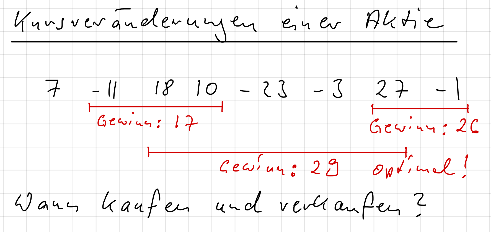
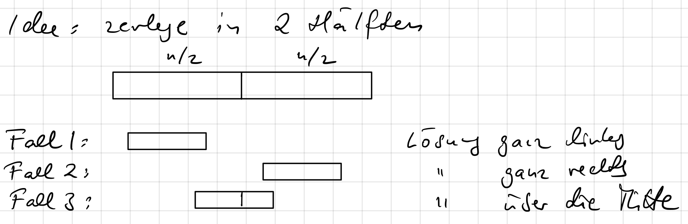
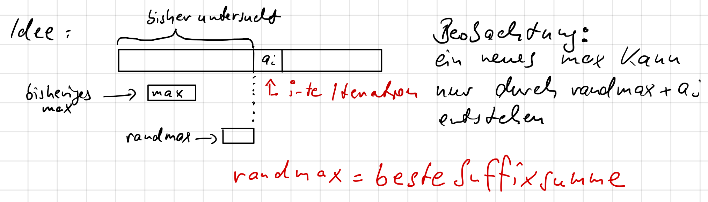

## Problemstellung: Maximum Subarray Sum

- **Motivation**: Finde den Zeitraum mit dem maximalen **Gewinn** bei gegebenen täglichen **Kursveränderungen einer Aktie**.
- **Formale Definition**:
    - **Gegeben**: Eine Folge ganzer Zahlen $a_1, ..., a_n$.
    - **Gesucht**: Die maximale **Teilsumme** $S_{i,j} = \sum_{k=i}^{j} a_k$ für $1 \le i \le j \le n$.
- **Spezialfall**: Bei nur negativen Zahlen ist die Lösung 0 ("nicht kaufen").
- **Elementare Operation**: **Addition**.
- **Untere Schranke**: $\Omega(n)$, da jedes Element mindestens einmal betrachtet werden muss.

## Algorithmen & Analyse

### Algorithmus 1: Naiver Ansatz

- **Idee**: Berechne alle möglichen Teilsummen $S_{i,j}$ und speichere das Maximum.
- **Umsetzung**: Zwei geschachtelte Schleifen für alle Start- (`i`) und Endpunkte (`j`); innerste Schleife summiert $a_i$ bis $a_j$.
- **Analyse**:
    - Berechnung von $S_{i,j}$ benötigt $j-i$ Additionen.
    - Gesamtkosten: $A(n) = \sum_{i=1}^{n} \sum_{j=i}^{n} (j-i)$.
    - Abschätzbar durch $\sum k^2$.
    - **Laufzeit**: $A(n) = \Theta(n^3)$.

### Algorithmus 2: Effizientere Summenberechnung

- **Idee**: **Wiederbenutzung von Berechnungen**; Summe aus vorheriger erweiterbar.
- **Umsetzung**: $S_{i,j+1} = S_{i,j} + a_{j+1}$.
    - Pro Startpunkt `i` werden Summen iterativ (Schleife über `j`) mit je 1 Addition berechnet.
- **Analyse**:
    - Gesamte Additionen: $A(n) = \sum_{i=1}^{n} (n-i) = \frac{(n-1)n}{2}$.
    - **Laufzeit**: $A(n) = \Theta(n^2)$.

### Algorithmus 3: Divide and Conquer

- **Idee**: Problem rekursiv in Hälften zerlegen.
    1. **Divide**: Array in linke/rechte Hälfte teilen.
    2. **Conquer**: Rekursiv max. Teilsumme für linke ($M_L$) und rechte ($M_R$) Hälfte finden.
    3. **Combine**: Max. Teilsumme $M_C$ über die Mitte finden; Gesamtlösung: $\max(M_L, M_R, M_C)$.

- **Combine-Schritt**:
    - Lösung über Mitte = **grösste Suffixsumme** (links) + **grösste Präfixsumme** (rechts).
    - Beide in $\Theta(n)$ findbar (Iteration von Mitte nach aussen).
- **Analyse**:
    - **Rekurrenzgleichung**: $T(n) = 2T(n/2) + \Theta(n)$.
    - **Lösung** (via "**Teleskopieren**", Annahme $n=2^k$):
        - $T(n) = n \cdot T(1) + a \cdot n \log_2(n)$
    - **Laufzeit**: $O(n \log n)$.
- **Annahme $n=2^k$**: Vereinfacht Analyse, ändert asymptotische Laufzeit nicht. Eingabe kann auf nächste Zweierpotenz erweitert werden (max. Verdopplung $\implies$ konstanter Faktor).

### Algorithmus 4: Induktiver Ansatz (Kadane's Algorithm)

- **Idee**: Array von links nach rechts durchlaufen; zwei Werte merken:
    1. `max`: Global beste gefundene Teilsumme.
    2. `randmax`: Beste Teilsumme, die am **aktuellen Element endet** (beste Suffixsumme).
- **Beobachtung**: Beste Suffixsumme bei `i` (`randmax_i`) = $\max(a_i, \text{randmax}_{i-1} + a_i)$.

- **Umsetzung**:
    - Initialisiere `max = 0` und `randmax = 0`.
    - Iteriere `i` von 1 bis `n`:
        1. `randmax = randmax + a_i`
        2. `max = max(max, randmax)`
        3. Wenn `randmax < 0`, setze `randmax = 0`.
            - **Begründung**: Negatives Suffix kann nie Anfang einer optimalen Summe sein.
- **Analyse**: Eine Schleife.
- **Laufzeit**: $O(n)$.
