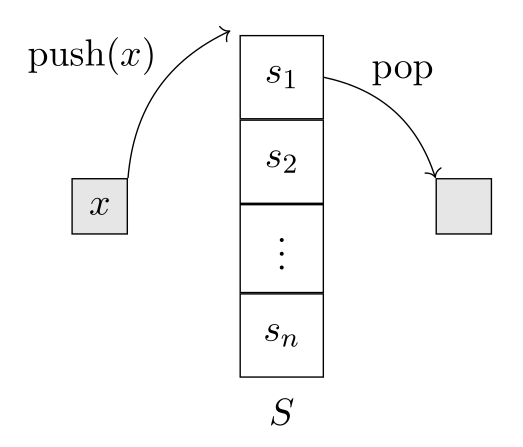
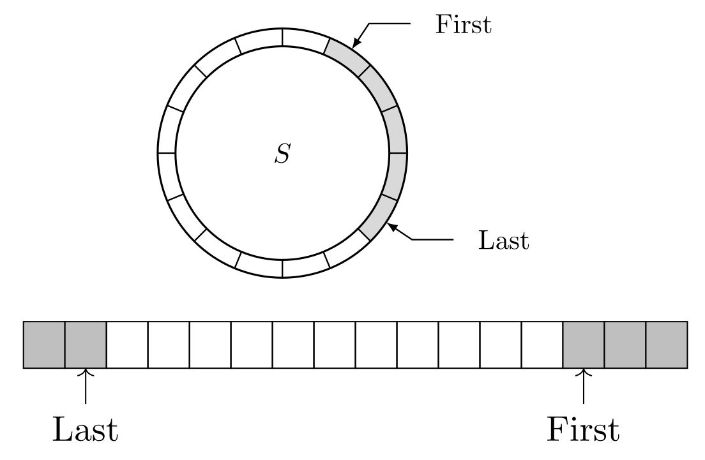
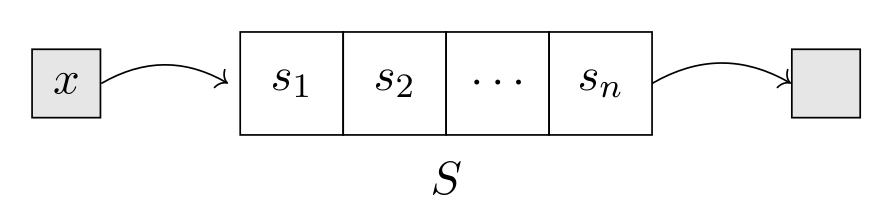
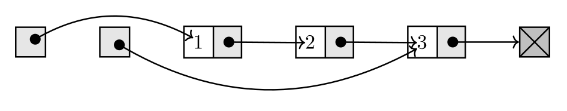
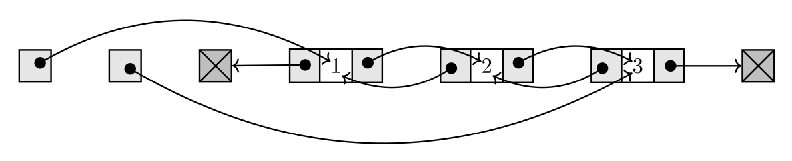
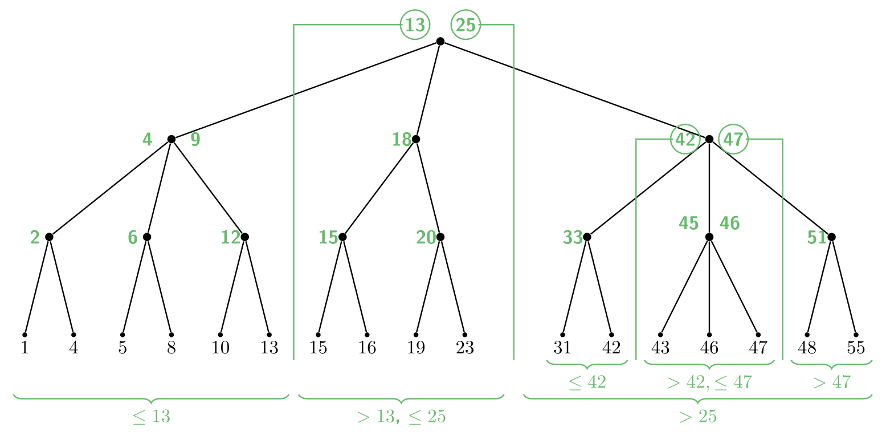

## Grundlagen: ADT vs. Datenstruktur

- **Abstrakter Datentyp (ADT)**: Definiert eine Menge von Objekten und die darauf erlaubten **Operationen** (das **Was**).
    - Beispiel: Studentendatensatz (Objekt) mit Matrikelnummer als **Schlüssel**.
- **Datenstruktur**: Die konkrete Implementierung eines ADT im Speicher (das **Wie**).
    - Verschiedene Implementierungen haben unterschiedliche Laufzeit-Profile.

## Abstrakte Datentypen (ADTs)

### Liste (List)

- **Konzept**: Geordnete Sammlung von Elementen in **fester Reihenfolge**. Werte können mehrfach vorkommen.
- **Operationen**:
    - `insert(K, L)`: Fügt K am Ende an.
    - `get(i, L)`: Gibt i-tes Element zurück.
    - `delete(O, L)`: Löscht Objekt O.
    - `insertAfter(O, K, L)`: Fügt K hinter Objekt O ein.
- **Laufzeitvergleich**:

| Operation | Array | Einfach verk. Liste | Doppelt verk. Liste |
| :--- | :--- | :--- | :--- |
| `get(i)` | $O(1)$ | $O(n)$ | $O(n)$ |
| `insert` (Ende) | $O(1)$ | $O(n)$ | $O(1)$ |
| `delete(O)` | $O(n)$ | $O(n)$ | $O(1)$ |
| `insertAfter(O)` | $O(n)$ | $O(1)$ | $O(1)$ |

### Stapel (Stack)

- **Prinzip**: **LIFO (Last-in, First-out)**; wie ein Tellerstapel.
- **Operationen**:
    - `push(k, S)`: Legt k oben auf.
    - `pop(S)`: Entfernt & liefert oberstes Element.
- **Laufzeitvergleich**:

| Operation | Array | Verkettete Liste |
| :--- | :--- | :--- |
| `push` | $O(1)$ | $O(1)$ |
| `pop` | $O(1)$ | $O(1)$ |

### Schlange (Queue)

- **Prinzip**: **FIFO (First-in, First-out)**; wie eine Warteschlange.
- **Operationen**:
    - `enqueue(k, S)`: Fügt k hinten an.
    - `dequeue(S)`: Entfernt & liefert vorderstes Element.
- Mit **Array** als **Ringpuffer (Ring Buffer)**
  
- **Laufzeitvergleich**:

| Operation | Array (Ringpuffer) | Verkettete Liste |
| :-------- | :----------------- | :--------------- |
| `enqueue` | $O(1)$             | $O(1)$           |
| `dequeue` | $O(1)$             | $O(1)$           |

### Prioritätswarteschlange (Priority Queue)

- **Konzept**: Elemente haben eine **Priorität**. Entnahme erfolgt nach höchster Priorität.
- **Operationen**:
    - `insert(k, p, P)`: Fügt k mit Priorität p ein.
    - `extractMax(P)`: Entfernt & liefert Element mit höchster Priorität.
- **Laufzeitvergleich**:

| Operation    | Unsortiertes Array | Sortiertes Array | (Max-)Heap  |
| :----------- | :----------------- | :--------------- | :---------- |
| `insert`     | $O(1)$             | $O(n)$           | $O(\log n)$ |
| `extractMax` | $O(n)$             | $O(1)$           | $O(\log n)$ |

### Wörterbuch (Dictionary)

- **Konzept**: Sammlung von **eindeutigen Schlüsseln**.
- **Operationen**:
    - `search(x, W)`: Prüft, ob x vorhanden ist.
    - `insert(x, W)`: Fügt x hinzu.
    - `delete(x, W)`: Entfernt x.
- **Laufzeitvergleich**:

| Operation | Unsort. Array | Sort. Array | Verk. Liste | Balanc. Suchbaum | Hashmap (avg.) |
| :-------- | :------------ | :---------- | :---------- | :--------------- | :------------- |
| `search`  | $O(n)$        | $O(\log n)$ | $O(n)$      | $O(\log n)$      | $O(1)$         |
| `insert`  | $O(1)$        | $O(n)$      | $O(1)$      | $O(\log n)$      | $O(1)$         |
| `delete`  | $O(n)$        | $O(n)$      | $O(n)$      | $O(\log n)$      | $O(1)$         |

## Datenstrukturen

### Lineare Datenstrukturen

#### Array

- **Vorteile**:
    - **Direktzugriff (Random Access)**: `get(i)` in $O(1)$.
- **Nachteile**:
    - **Unflexibel**: `insertAfter`/`delete` erfordern Verschieben von Elementen ($O(n)$).
    - **Feste Grösse**: Länge muss a priori bekannt sein.

#### Verkettete Listen (Linked Lists)

- **Struktur**: Elemente (**Knoten**) sind durch **Zeiger (Pointer)** verbunden; liegen verstreut im Speicher.
- **Einfach verkettete Liste**: Jeder Knoten hat Zeiger auf Nachfolger.
    - `delete(O)` ist $O(n)$, da Vorgänger gefunden werden muss.
    
- **Doppelt verkettete Liste**: Jeder Knoten hat Zeiger auf Nachfolger **und Vorgänger**.
    - `delete(O)` ist $O(1)$ (bei bekanntem Ort).
    
- **Vorteile**:
    - **Flexibel**: `insert`/`delete` sind $O(1)$ (wenn Position bekannt).
    - **Dynamische Grösse**.
- **Nachteile**:
    - **Langsamer Zugriff**: `get(i)` ist $O(n)$, da kein Direktzugriff möglich ist.

### Baum-basierte Datenstrukturen

#### Binärer Suchbaum (Binary Search Tree)

- **Suchbaumbedingung**: Links <= Knoten < Rechts.
- **Laufzeit**: Operationen sind $O(h)$ ($h$ = Baumhöhe).
- **Problem**: Kann zu einer Liste **entarten** ($h \in O(n)$), wenn Schlüssel sortiert eingefügt werden.

#### 2-3-Baum

- **Konzept**: Ein Typ **balancierter Suchbaum**, der eine garantierte Baumhöhe von $h \in O(\log n)$ durch Rebalancierungs-Strategien sicherstellt.
    - **Grundidee**: Mehr **Flexibilität** in der Knotenstruktur (2 oder 3 Kinder), um die starre, ineffizient zu wartende Form eines vollständigen Binärbaums zu vermeiden.
    - Es existieren auch andere Varianten balancierter Suchbäume (z.B. AVL-Bäume, Rot-Schwarz-Bäume).
- **Struktur**:
    - Innere Knoten haben **2 oder 3 Kinder**.
    - **Alle Blätter auf derselben Ebene** $\implies$ perfekt balanciert, $h \in O(\log_2 n)$.
- **Externe Variante**:
    - **Schlüssel**: Nur in den Blättern.
    - **Innere Knoten**: Enthalten **Separatoren** zur Steuerung der Suche.
- **Operation `insert(x)` - $O(\log n)$**:
    1. **Suchen & Einfügen**: Blatt einfügen, Separator zum Elternknoten hinzufügen.
    2. **Rebalancieren (bei Überlauf)**: Hat ein Knoten 4 Kinder, wird er **aufgespalten (Split)**.
        - Zwei neue Knoten mit je 2 Kindern werden gebildet.
        - Der mittlere Separator **wandert eine Ebene nach oben**.
        - Prozess wiederholt sich ggf. rekursiv bis zur Wurzel.
        - **Wurzel-Split**: Erzeugt neue Wurzel; Baumhöhe +1.
- **Operation `delete(x)` - $O(\log n)$**:
    1. **Suchen & Löschen**: Blatt und zugehörigen Separator entfernen.
    2. **Rebalancieren (bei Unterlauf)**: Hat ein Knoten nur 1 Kind, wird reagiert:
        - **Fall 1 (reicher Nachbar)**: Nachbar hat 3 Kinder $\implies$ **Adoption** eines Kindes.
        - **Fall 2 (armer Nachbar)**: Nachbar hat 2 Kinder $\implies$ **Verschmelzen (Merge)** beider Knoten. Der trennende Separator wandert vom Elternknoten nach unten. Problem kann nach oben wandern.
        - **Wurzel-Merge**: Hat Wurzel nur 1 Kind, wird sie entfernt; Baumhöhe -1.
- **Zusätzliche Operationen**:
    - `findMin/findMax`: $O(\log n)$ (links/rechts absteigen).
    - `findKthSmallest`: $O(\log n)$ (wenn Knoten die Grösse ihrer Teilbäume speichern).

