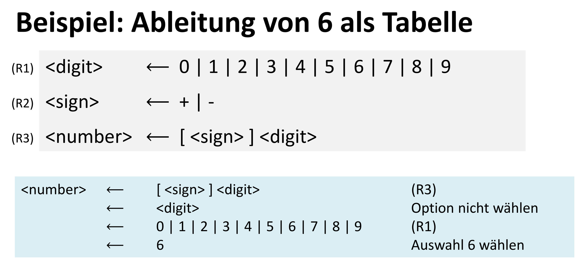
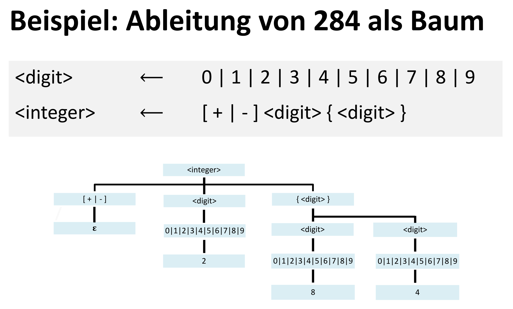
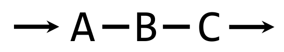
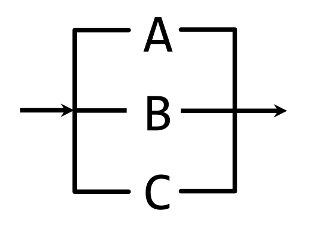
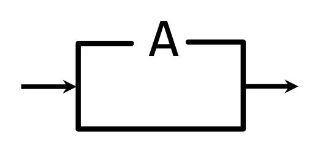
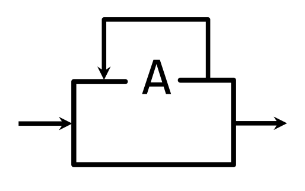
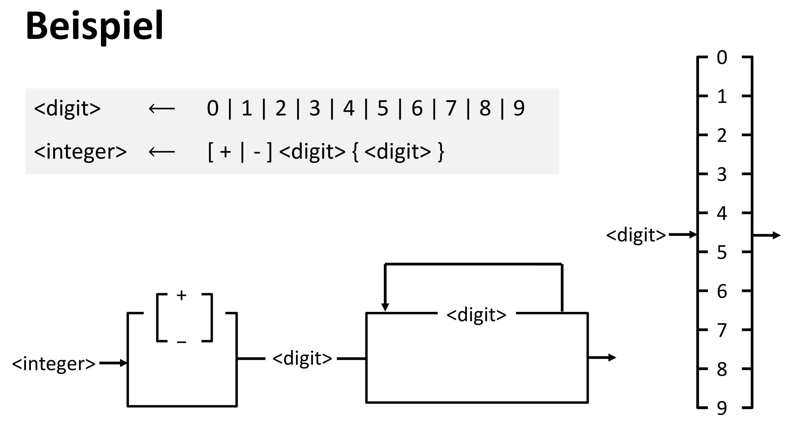

## Einführung und Motivation

- Präzise Beschreibungen: wichtiges Thema der Informatik.
    - Beispiele: Zahlenliterale (`3.14`, `1.5E10`), Texteingabeformate (`XX-XXX-XXX`), Programmiersprachen.
- **Sprache**: Menge aller erlaubten Zeichenfolgen.
- **Wort**: Einzelne erlaubte Zeichenfolge einer Sprache.
    - Beispiel: Die Sprache der ganzen Zahlen enthält unendlich viele Wörter (`-1`, `0`, `123`,...).

## EBNF (Extended Backus-Naur Form)

- **EBNF**: Formalismus zur Beschreibung der **Syntax** (Form/Struktur) einer Sprache.
    - Keine Aussage über die **Bedeutung** (**Semantik**).
- Ermöglicht automatische Prüfung von Zeichenfolgen (z.B. durch einen **Parser**).
- Anwendungsgebiete: Beschreibung von Programmiersprachen, komplexe Eingabeformate.

## EBNF-Beschreibung und Regeln

- **EBNF-Beschreibung**: Formale Beschreibung der Sprachstruktur; besteht aus einer Menge von **EBNF-Regeln**.
    - Die Reihenfolge der Regeln ist unwichtig.
- **EBNF-Regel**: Form: `LHS ← RHS`.
    - `←`: "ist definiert als".
    - **LHS** (left-hand side): Name der Regel (`<name>`); ein **Nonterminal**.
    - **RHS** (right-hand side): Definition, woraus der LHS-Teil besteht.
- **RHS** besteht aus:
    - **Terminalen**: Feste Zeichen (auch **Literal** genannt), z.B. `D` oder `2`.
    - **Nonterminalen**: Namen anderer EBNF-Regeln, z.B. `<digit>`.
    - Kombinationen der **Kontrollformen**.

## Kontrollformen

- **Aufreihung** (Sequence): `E1 E2 E3`
    - Folge von Elementen; die Reihenfolge ist wichtig.
    - Beispiel für "D28": `<room1> ← <letter_D> <digit_2> <digit_8>`
- **Auswahl** (Selection): `E1 | E2 | E3`
    - Alternativen, getrennt durch `|`.
    - **Genau eine** Alternative muss gewählt werden.
    - Beispiel: `<digit> ← 0 | 1 | 2 | 3 | 4 | 5 | 6 | 7 | 8 | 9`
- **Option**: `[E]`
    - Das Element in `[]` ist optional.
    - **Kann** gewählt werden, muss aber nicht.
    - Beispiel: `<number> ← [<sign>] <digit>`
- **Wiederholung** (Repetition): `{ E }`
    - Das Element in `{}` kann **0, 1, 2,... Mal** wiederholt werden.
    - Beispiel für eine ganze Zahl: `<integer> ← [+ | -] <digit> { <digit> }`
- **Gruppierung**: `()`
    - Klammern zur Priorisierung, um Mehrdeutigkeiten aufzulösen.
    - Beispiel: `(A | B) C` bedeutet "(A oder B), gefolgt von C".

## Ableitungen (Derivations)

- Ein **Wort** ist **legal**, wenn eine formale **Ableitung** ("derivation") dafür existiert.
- **Ableitung**: Sequenz von **Ableitungsschritten**; von der **Startregel** bis zur finalen Zeichenfolge (nur Terminale).
    - **Startregel** ("entry rule"): Konventionsgemäss die letzte Regel der Beschreibung.
- **Ableitungsschritt** ("derivation step"): Ersetzen eines Nonterminals (LHS) durch seine Definition (RHS).
- Darstellungsformen:
    - **Ableitungstabelle**: Schrittweise Ersetzung von der Startregel bis zum fertigen Wort.
      
    - **Ableitungsbaum**: Hierarchische Darstellung (Wurzel = Startregel, Blätter = Terminale).
      

## Grafische Darstellung (Syntax-Graphen)

- EBNF-Regeln können als **Syntax-Graphen** visualisiert werden.
- Ein gültiges Wort entspricht einem Pfad durch den Graphen von links nach rechts.
- Darstellung der Kontrollformen:
    - **Aufreihung**: Serielle Anordnung der Elemente.
      
    - **Auswahl**: Parallele Pfade, von denen einer gewählt wird.
      
    - **Option**: Ein Pfad mit Umgehungsmöglichkeit für ein Element.
      
    - **Wiederholung**: Eine Schleife (Loop) zurück zum Anfang des Elements.
      

## Rekursion

- Eine Regel ist **rekursiv**, wenn ihr Name (LHS) auch auf der rechten Seite (RHS) vorkommt.
- **Direkte Rekursion**: Der Name erscheint direkt in der eigenen RHS.
    - Beispiel: `<A> ← a | [<A>]`
- **Indirekte Rekursion**: Eine Regel ruft eine andere auf, welche schlussendlich wieder auf die erste Regel verweist.
    - Beispiel: `<A> ← a | <B>` und `<B> ← [<A>]`
- Sinnvolle Rekursion benötigt eine **Abbruchsoption** (einen nicht-rekursiven Pfad), um eine endliche Ableitung zu ermöglichen. Ohne Abbruchsoption können keine gültigen Wörter erzeugt werden.

### Rekursion vs. Wiederholung

- Viele Probleme können sowohl mit Rekursion als auch mit Wiederholung gelöst werden.
    - Natürliche Zahlen: `<positive_int> ← <digit> { <digit> }` (Wiederholung) vs. `<positive_int> ← <digit> [<positive_int>]` (Rekursion).
- In **EBNF** ist die **Rekursion mächtiger** als die Wiederholung.
    - Es gibt Sprachen, die nur mit Rekursion beschrieben werden können.
    - Beispiel: Die Sprache `{ A^nB^n | n ∈ N }` (gleich viele A's gefolgt von gleich vielen B's) kann nur mit Rekursion beschrieben werden: `<equalAB> ← [A <equalAB> B]`.
- In Programmiersprachen sind Rekursion und Wiederholung (Iterationen/Schleifen) gleich mächtig.

## Weitere Konzepte

- **Äquivalenz**: Zwei EBNF-Beschreibungen sind **äquivalent**, wenn sie exakt dieselbe Sprache definieren.
- **Syntax vs. Semantik**:
    - **Syntax** (Form, Struktur) wird von EBNF beschrieben.
    - **Semantik** (Bedeutung, Interpretation) wird nicht erfasst (z.B. haben `1` und `+1` unterschiedliche Syntax, aber dieselbe Semantik).
- **Sonderzeichen**: Zeichen der EBNF-Notation (`< > ← | [] { } ε`) erscheinen nicht im Ergebnis. Um sie als Literal zu verwenden, müssen sie umrandet werden.
- **Leeres Element**: `ε` bezeichnet das leere Element (z.B. `ε | 1` ist equivalent zu `[ 1 ]`)
- **Geschichte (BNF)**:
    - **BNF** (Backus-Naur Form) hatte ursprünglich nur Aufreihung, Auswahl und Rekursion.
    - **Niklaus Wirth** erweiterte BNF zur **EBNF** mit **Option** (`[]`) und **Wiederholung** (`{}`) für bessere Lesbarkeit.
