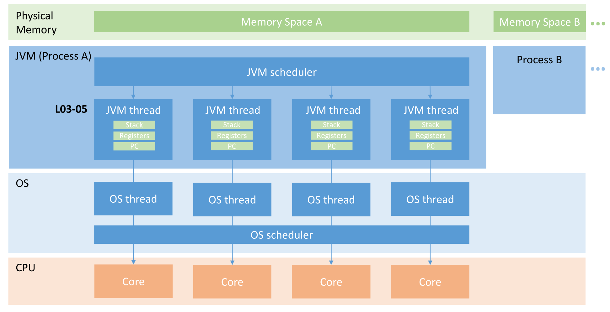
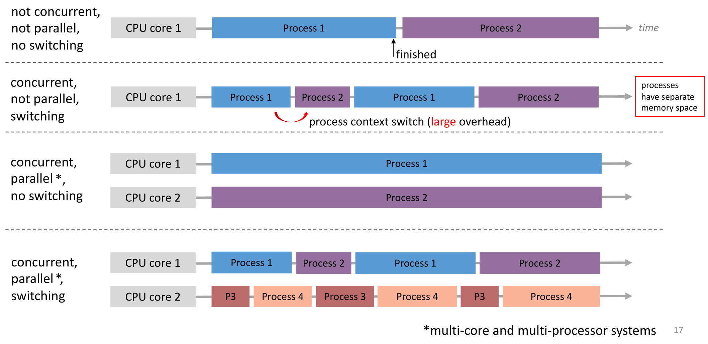

## Prozesse und Threads

- **Prozesse**: Laufende OS-Programme.
    - Getrennte Speicherbereiche (**Isolation**).
    - Kommunikation via **IPC (Inter Process Communication)**.
    - OS-Trennung durch **Memory Barriers**.
- **Threads**: Unabhängige Ausführungssequenzen im selben Prozess.
    - **Geteilter Speicher**: Gemeinsamer Adressraum (**Heap**).
    - **Vorteil**: Effizienteres **Context Switching** (weniger Overhead, kein Speicherwechsel).
    - **Gefahr**: Fehleranfällig bei geteilten Ressourcen (fehlender gegenseitiger Schutz).
- **Thread-Ebenen**:
    - **User-Level Thread**: Verwaltung durch Applikation/JVM.
    - **Kernel-Level Thread**: OS-Verwaltung (oft $1:1$-Mapping Java- zu Kernel-Threads).
    - **CPU-Level Thread**: Hardware-Ebene (z.B. Hyperthreading).

## Parallelität vs. Nebenläufigkeit (Concurrency)

- **Grundkonzepte**:
    - **Parallelism (Parallelität)**: Gleichzeitige physische Ausführung auf verschiedenen CPU-Cores.
    - **Concurrency (Nebenläufigkeit)**: Mehrere Aufgaben aktiv und machen Fortschritt (nicht zwingend physisch gleichzeitig).
- **Single-Core Management**:
    - **I/O-Problematik**: CPU-Leerlauf (*idle*) beim Warten auf Peripherie (z.B. Festplatte).
    - **Multitasking**: OS-Wechsel zwischen Prozessen (via **CPU Scheduler**) zur Nutzung von Wartezeiten.
    - **Context Switch (Prozess)**: Prozesswechsel erzeugt **grossen Overhead**.
        - Speichern/Laden des **Prozess-Kontexts** (**PCB - Process Control Block**: Memory, CPU-Register, offene Dateien).
- **Kategorisierung der Ausführung**:
    - **Sequentiell**: Weder Concurrency noch Parallelität (strikte Ausführung nacheinander).
    - **Concurrent (Single Core)**: Switching aktiv. Concurrency ja, Parallelität nein.
    - **Parallel (Multi-Core, ohne Switching)**: Kontinuierliche Ausführung auf getrennten Cores.
    - **Concurrent & Parallel**: Multi-Core plus OS-Switching (optimale Auslastung).

