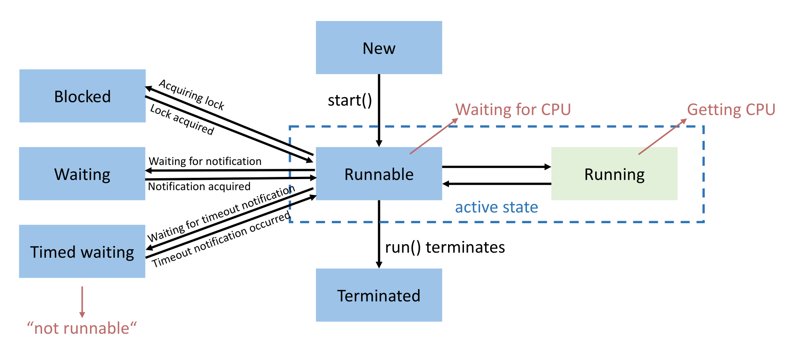

## Java Threads: Grundlagen und Erstellung

- Jeder Java-Programmstart erzeugt einen **JVM Prozess** mit mindestens einem **Main Thread**.
- **Speicheraufteilung in Java**:
    - **Heap**: Von allen Threads geteilt (Objekte, statische Variablen).
    - **Stack**: Eigener Stack pro Thread (lokale Variablen, Methodenaufrufe, Instruction Stream).
- **Erstellungs-Optionen**:
	- **Option 1: `extends Thread`**: Erbt von `java.lang.Thread`, überschreibt `run()`.
	- **Option 2: `implements Runnable`** (Bevorzugt):
	    - Klare Trennung von Aufgabe (**Task**) und Ausführendem (**Executor**).
	    - Erlaubt Teilen desselben Task-Objekts unter mehreren Threads.
- Programm terminiert erst nach Beendigung aller (Nicht-Daemon) Threads.

## Thread-Lebenszyklus und Eigenschaften

- **Threads starten**:
    - Immer **`start()`** aufrufen (weist JVM an, neuen Call-Stack zu erstellen).
    - Niemals `run()` direkt aufrufen (startet keinen neuen Thread).
- **Lifecycle-Zustände**:
    - **New**: Erstellt (`new Thread()`), noch nicht gestartet.
    - **Runnable**: Aktiv nach `start()` (beinhaltet "wartet auf CPU" und "läuft auf CPU").
    - **Blocked / Waiting / Timed Waiting**: Inaktiv (wartet auf Lock, Notification oder `sleep`).
    - **Terminated**: `run()`-Methode beendet.
- **Thread Attribute**:
    - **ID**: Eindeutig, abfragbar (`getId()`), unveränderlich.
    - **Name**: Veränderbar (`setName()`).
    - **Priority**: Priorität ($1$ bis $10$).
	     - Setzen via `setPriority()`.
	     - **Nur ein Wunsch** an den OS-Scheduler (**keine Ausführungsgarantie**).
    - **Status**: Abfragbar (`getState()`).

## Warten, Exceptions und Abbruch

- **Warten auf Threads**:
    - **Busy Waiting**: Endlose Status-Abfrage via Schleife (**ineffizient**, blockiert CPU).
    - **`join()`**: Aufrufender Thread blockiert (**Waiting**), bis Ziel-Thread terminiert (minimaler Context-Switch-Overhead).
	- Zuerst **alle** Threads starten, danach alle joinen (verhindert sequenzielle Ausführung).
- **Exceptions in Threads**:
    - Unbehandelte Exception beendet Worker-Thread.
    - **Main-Thread läuft unbeeinflusst weiter** (bemerkt Abbruch nicht).
    - **Lösung**: **UncaughtExceptionHandler** implementieren (fängt Exceptions pro Thread, Gruppe oder global ab).
- **Threads abbrechen (Interrupts)**:
    - Threads **können nicht von aussen beendet werden** (nur kooperativ).
    - **`thread.interrupt()`**: Setzt **Interrupt Flag**.
    - Blockierter Thread muss reagieren: `sleep()` oder `wait()` werfen bei gesetztem Flag eine **InterruptedException** und wecken den Thread.
