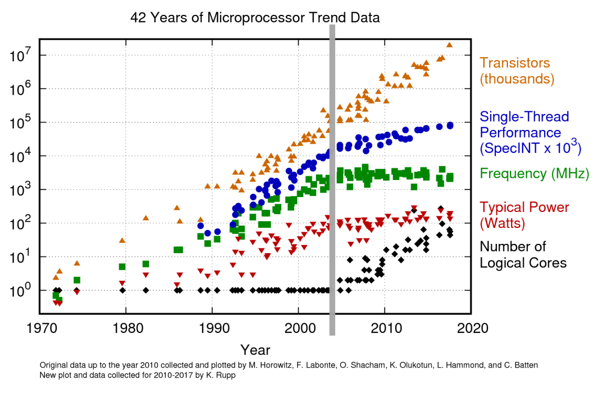
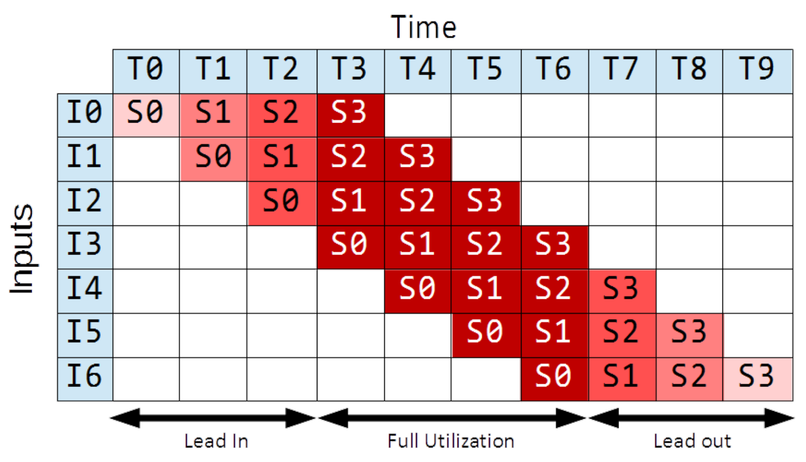

## Einführung

- **Code-Effizienz**: Optimale Hardware-Auslastung (auch auf **Single Core**).
- **Keine direkte Kontrolle**: Hardware-Optimierungen (Pipelining, SIMD, Caching) nicht manuell erzwingbar.
- **Design-Verantwortung**: **Code-Struktur** (z.B. simple Loops, günstige Datenstrukturen) ermöglicht CPU-interne Mechanismen.

## Paradigmenwechsel

- **Bis frühe 2000er**:
    - **Effekt**: Kleinere Transistoren $\rightarrow$ mehr Transistoren (**Moore's Law**), höhere Taktfrequenzen.
    - **Resultat**: Sequenzielle Programme automatisch schneller.
- **Grenzen der Architektur (Hit Walls)**:
    - **Power / Heat Wall**: Zu hoher Energieverbrauch, Überhitzung.
    - **ILP Wall**: Grenzen bei der automatischen Extraktion von Parallelität.
    - **Memory Wall**: CPU-Geschwindigkeit überholte Hauptspeicher-Zugriffszeit massiv.
- **Multi-Core Ära (Post-2003)**:
    - Leistungssteigerung durch **Multi-Core Architectures**.
    - **Independent Execution**: Unabhängige Cores mit eigenem **Instruction Stream**.
    - **Konsequenz**: Sequenzieller Code profitiert nicht mehr; manuelle Parallelisierung (Threads/Tasks) zwingend.

## Memory Wall und Caching

- **CPU Caches**: Schneller, kleiner Zwischenspeicher (Hierarchie: **L1, L2, L3**).
    - Speichern partielle Kopien des Speichers.
    - L1 z.B. $5$x schneller als L2, L2 $30$x schneller als Hauptspeicher.
- **Zweck (Problem der Latenz)**:
    - Code und Daten liegen im selben Speicher (**Von Neumann Architektur**).
    - Langsame Zugriffe erzeugen **Stalls** (CPU-Leerlauf). Caches überbrücken dies.
- **Funktionsweise**:
    - **Cache Hit**: Angefragte Daten im Cache gefunden.
    - **Cache Miss**: Daten fehlen $\rightarrow$ ganzer Datenblock (**Cache Line**) wird geladen.
- **Data Locality (Datenlokalität)**: Räumliche/zeitliche Nähe von Datenzugriffen.
    - **Stride = 1** (sequenziell): Viele Cache Hits $\rightarrow$ maximale Performance.
    - **Stride > 1** (grosse Sprünge): Ständige Cache Misses $\rightarrow$ massive Laufzeiteinbussen.
    - **Regel**: Die Datenstruktur diktiert die Caching-Effizienz.
- **Multi-Core Synchronisation**: Hardware/OS gleicht Caches ab. Java `synchronized` erzwingt **Cache-Flush** in den Hauptspeicher.

## Vectorization (SIMD)

- **Definition**: **SIMD** (Single Instruction, Multiple Data).
- **Mechanismus**: Einzelne Instruktion dekodieren, auf mehrere **Execution Units (ALUs)** verteilen, parallel berechnen (z.B. Vektor-Addition).
- **Code-Ebene**: Automatische Compiler-Übersetzung von einfachen Loops in **Vector Instructions** (z.B. `movdqa`, `paddd`).
- **Limitation**: Rein **opportunistisch**. Bei komplexer Logik (z.B. `if` im Loop) bricht Vektorisierung ab $\rightarrow$ Code zwingend simpel halten.

## Instruction Level Parallelism (ILP)

- **Konzept**: CPU extrahiert unabhängige Instruktionen aus dem **Instruction Stream**.
- **Mechanismen**:
    - **Superscalar Execution**: Zuteilung auf mehrere ALUs im selben Taktzyklus.
    - **Instruction Prefetching**: Vorausschauendes Laden von Instruktionen in Cache.
    - **Speculative Execution**: Verdachtsbasiertes Ausführen von Bedingungs-Zweigen (z.B. `if`/`else`).
    - **Reordering**: Umordnen der Ausführungsreihenfolge durch Compiler/CPU.
- **Multithreading-Gefahr (Reordering)**:
    - Zerstört logische Korrektheit bei geteilten Ressourcen (z.B. "Done"-Flag wird vor Resultat auf `true` gesetzt).
    - **Zwingend**: Zugriffsschutz via **Synchronisation** (z.B. `synchronized`).

## Pipelining

- **Konzept**: Fliessbandartige Verarbeitung von Instruktionen.
- **Die 5 Pipeline-Stages**:
    1. **Instruction Fetch**: Instruktion laden.
    2. **Instruction Decode**: Bit-Sequenz übersetzen & verteilen.
    3. **Execution**: Berechnung auf ALUs.
    4. **Memory Access**: Speicher lesen/schreiben.
    5. **Writeback**: Resultate in Register speichern.
- **Metriken**:
    - **Throughput (Durchsatz)**: Abgeschlossene Instruktionen pro Zeit (höher = besser).
    - **Latency (Latenz)**: Dauer einer einzelnen Instruktion (tiefer = besser).
- **Pipeline-Balancierung**:
    - **Balanced Pipeline**: Alle Stufen gleich lang $\rightarrow$ konstante Latenz.
    - **Unbalanced Pipeline**: Langsame Stufen erzeugen Rückstaus (**Stalls**) $\rightarrow$ Latenz wächst unendlich.
    - **Lösung**: Aufteilung langsamer Stufen in feingranulare Sub-Stufen.
- **Trade-off**: Pipelining maximiert **Throughput**, erhöht aber durch ständigen Übergabe-Overhead die **Latenz** eines einzelnen Durchlaufs.

