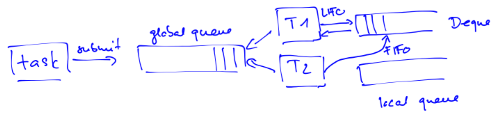

## Limitierungen manueller Java Threads

- **Grundproblem**: Manuelles **Thread Assignment** und Partitionieren ist fehleranfällig und skaliert schlecht.
- **Schwächen des naiven Ansatzes** (z.B. Array statisch in 4 Teile splitten):
    - **Plattform-Abhängigkeit**: Fixe Thread-Anzahl ignoriert Hardware-Gegebenheiten.
    - **Statische Zuweisung**: Keine Anpassung an dynamisch verfügbare Cores zur Laufzeit.
    - **Load Imbalance**: Unterschiedliche Task-Dauern erzeugen Leerlauf auf einzelnen Cores.
- **Start/Join Reihenfolge**: Zuerst alle starten, dann alle joinen. Sofortiges `start()` gefolgt von `join()` erzwingt reine sequenzielle Ausführung.
- **Ressourcen-Limitierung (Heavyweight)**:
    - 1:1 Mapping von Java- zu OS-Threads.
    - Zu viele kleine Tasks erzeugen extremen Overhead $\rightarrow$ unweigerlicher **`OutOfMemoryError`**.
- **Ziel-Paradigma**: Code definiert lediglich maximale Parallelität $\rightarrow$ Framework übernimmt **Work Distribution** und **Scheduling** automatisch.

## Divide and Conquer (Recursive Splitting)

- **Konzept**: Rekursive Aufteilung eines Problems in kleinere, unabhängige Teilprobleme.
- **Algorithmus-Struktur**:
    - **Base Case**: Falls unteilbar, Lösung direkt berechnen/retournieren.
    - **Recursive Case**: Problem in Hälften teilen, rekursiv lösen, Resultate kombinieren.
- **Performance**:
    - Setzt meist assoziative Operationen voraus (z.B. Addition).
    - Bei genug Cores verhält sich die Laufzeit proportional zur Aufruf-Baumhöhe: $O(\log n)$ (statt sequenziell $O(n)$).

## Executor Service

- **Konzept**: Trennung von Aufgabe (**Task**) und Ausführendem. Beinhaltet Task-Queue und **Thread Pool** (z.B. `ThreadPoolExecutor`).
- **Task-Typen**:
    - **`Runnable`**: `void run()`, liefert kein Resultat.
    - **`Callable<T>`**: `T call()`, liefert Resultat vom Typ `T` (essenziell für Divide & Conquer).
- **Ablauf**:
    - Einreichen via `submit()`.
    - Rückgabe eines **`Future`** (Platzhalter für asynchrones Resultat).
    - Resultat-Abruf via `future.get()` (blockiert aufrufenden Thread bis Resultat da ist).
    - Beenden via `shutdown()` (keine neuen Tasks, restliche Queue-Abarbeitung).
- **Rekursions-Deadlock**:
    - Threads blockieren bei `get()` komplett durch Warten auf Sub-Tasks.
    - Sub-Tasks in globaler Queue finden keine freien Threads (**Starvation**).
    - **Regel**: Executor Service **niemals** für rekursive Probleme nutzen! Nur für **flache Strukturen** (z.B. Web-Requests, isolierte Transaktionen).

## Fork/Join Framework (Architektur)

- **Konzept**: Framework speziell für Divide & Conquer. Wartende Tasks legen Threads nicht komplett lahm.
- **Queue-Architektur**:
    - Globale Queue für initiale Tasks.
    - Pro Worker-Thread eine eigene **lokale Double-Ended Queue (Deque)**.
- **LIFO und FIFO Prinzip**:
    - **LIFO (eigene Tasks)**: Thread legt neue Sub-Tasks oben auf eigenen Stack und arbeitet von oben ab (ideal für Rekursion, maximale **Cache-Lokalität**).
    - **Work Stealing / FIFO (fremde Tasks)**: Bei Leerlauf stiehlt Thread von **unten** aus fremder Deque. Erwischt älteste Tasks (grosser verbleibender Teilbaum) $\rightarrow$ minimaler Overhead, perfektes **Load Balancing**.

## Implementierung und Optimierung mit Fork/Join

- **Mapping von Thread-Konzepten**:
    - Klasse: `RecursiveTask<V>` (mit Return Value) oder `RecursiveAction` (ohne Return Value).
    - Logik: `compute()` statt `run()` überschreiben.
    - Start: `fork()` statt `start()` (legt Task in eigene Deque).
    - Warten: `join()` liefert Resultat. **WICHTIG**: Blockiert den OS-Thread **nicht** untätig! Der Thread arbeitet in der Wartezeit intern andere Tasks der Queue ab (verhindert Deadlocks).
    - Initialisierung (Main-Thread): `ForkJoinPool` erstellen, Start-Task per `invoke()` ausführen.
- **Essenzielle Hand-Optimierungen**:
    1. **Sequential Cutoff (Threshold)**:
        - Kleinst-Tasks (z.B. $1$ Array-Element) erzeugen mehr Verwaltungs-Overhead als Rechennutzen.
        - Basis-Tasks ausreichend gross wählen (ca. $100$ bis $10'000$ OPs), Berechnung dann sequenziell (z.B. per `for`-Loop).
    2. **Thread-Overhead halbieren**:
        - Niemals beide Teilaufgaben forken (unnötiger Queue-Overhead).
        - **Besser**: Eine Hälfte forken (`left.fork()`), andere Hälfte **direkt berechnen** (`right.compute()`), danach erste joinen (`left.join()`).
