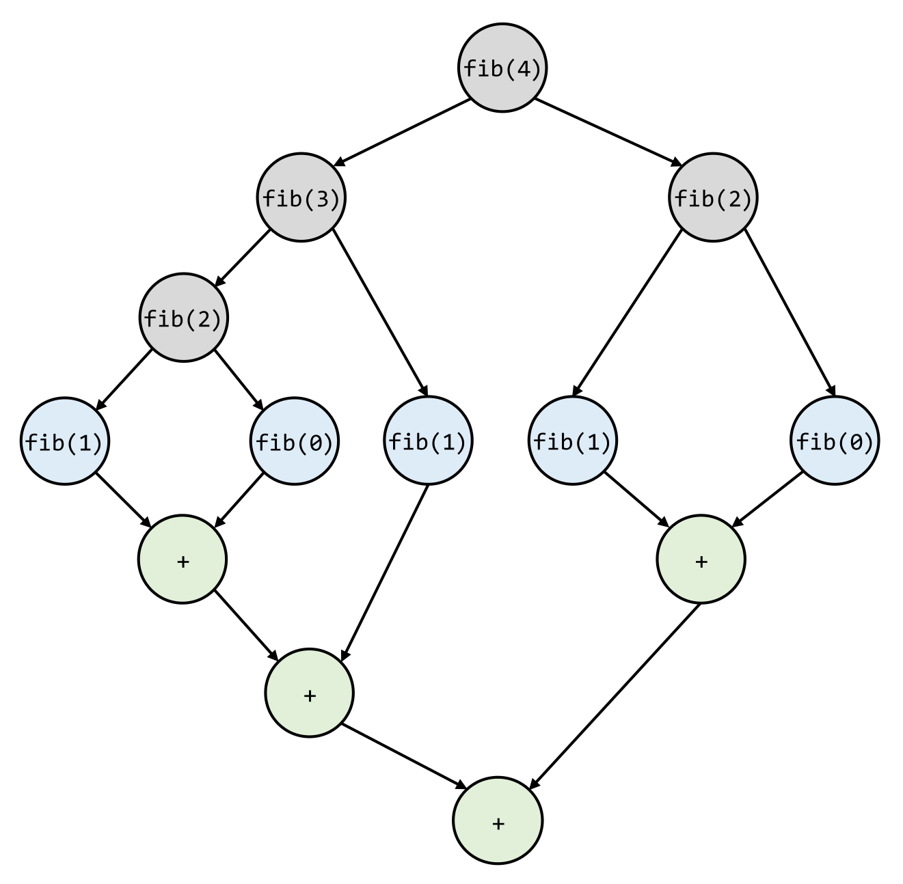
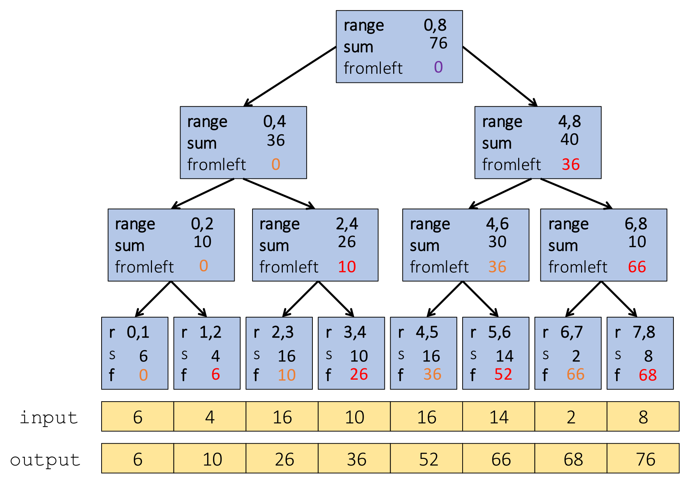

## Task Graphen und Performance-Modelle

- **Erweiterte Metriken**:
    - **$T_1$ (Work)**: Gesamtarbeitsaufwand (Ausführungszeit auf 1 Thread, Summe aller Knoten).
    - **$T_p$ (Parallel Time)**: Ausführungszeit auf $p$ Threads (Hardware-/Scheduler-abhängig).
    - **$T_\infty$ (Span / Critical Path)**: Längster sequenzieller Pfad (Laufzeit bei unendlich vielen Kernen).
- **Directed Acyclic Graph (DAG)**: Dynamisches Laufzeit-Modell für parallele Ausführungen.
    - **Nodes (Knoten)**: Arbeitseinheiten (Tasks).
    - **Edges (Kanten)**: Gerichtete Abhängigkeiten (Quell-Task vor Ziel-Task zwingend).
- **Parallelism** ($T_1 / T_\infty$): Maximal mögliches Speedup.
    - **Breiter Graph**: Hoher Parallelismus (kurzer $T_\infty$).
    - **Tiefer Graph**: Viele sequenzielle Abhängigkeiten (langer $T_\infty$, geringes Speedup).

## Schranken und Zuständigkeiten

- Theoretische Limits für Ausführungszeit ($T_p$):
    - **Work Law** ($T_p \ge T_1 / p$): Arbeit maximal durch $p$ teilbar.
    - **Span Law** ($T_p \ge T_\infty$): Limitiert durch längsten sequenziellen Pfad.
    - **Absolute Untergrenze** ($T_p \ge \max(T_1 / p, T_\infty)$): Absolutes Limit für jeden Scheduler.
- **Zuständigkeitstrennung**:
    - **Framework (ForkJoin)**: Effiziente Thread-Zuweisung, minimiert Leerlauf ($T_p$ nahe am Optimum).
    - **Programmierer**: Minimierung von **$T_\infty$** beim Algorithmus-Design (ohne $T_1$-Explosion).

## Parallele Entwurfsmuster (Patterns)

- **Reductions (Reduktion)**: Verdichtung einer Datensammlung auf ein Einzelresultat (z.B. Summe, Maximum).
    - **Zwingend**: Operator **muss assoziativ sein**.
    - **Gefahr**: Nicht-assoziative Operatoren (z.B. Subtraktion, Median) erzeugen Fehler oder langsame Synchronisierung.
    - Paralleler Span: $O(\log n)$.
- **Map**: 1:1 Funktionsanwendung pro Element (Output-Grösse = Input-Grösse).
- **Zip Map**: Map mit mehreren Inputs (z.B. Vektor-Addition).
- **Stencil**: Output abhängig von Input-Nachbarschaft (z.B. Glättungsfilter/Kantenerkennung in Bildverarbeitung).
- **Datenstrukturen**:
    - **Arrays / Balancierte Bäume**: Erlauben paralleles Aufteilen ($O(\log n)$ Zugriff).
    - **Linked Lists**: Erzwingen sequenzielles Durchschliessen ($O(n)$) $\rightarrow$ vernichten Parallelisierbarkeit (Amdahl's Law Flaschenhals).

## Algorithmus: Prefix-Sum Problem

- **Ziel**: Array mit fortlaufenden Summen ($output[i] = \sum_{k=0}^i input[k]$).
- **Naiv**: Sequenzielle Schleife $\rightarrow$ Work $O(n)$, Span $O(n)$ (kein Speedup).
- **Zwei-Pass-Algorithmus** (Work $O(n)$, Span $O(\log n)$):
    - **1. Up-Pass (Bottom-up)**: Rekursiver Binärbaum-Aufbau. Knoten speichern Bereichssummen (Blätter = Array-Werte).
    - **2. Down-Pass (Top-down)**: Baum-Traversierung mit Korrekturwert (**`fromLeft`**, Root = $0$).
        - **Linkes Kind**: Erhält `fromLeft` des Parents.
        - **Rechtes Kind**: Erhält `fromLeft` des Parents **+** Bereichssumme des linken Geschwisters (aus Pass 1).
        - **Blattebene**: Resultat-Schreiben ($output[i] = fromLeft + input[i]$).

## Algorithmus: Pack (Filter)

- **Ziel**: Extraktion aller Elemente, die eine Bedingung erfüllen.
- **Drei parallele Schritte** (Work $O(n)$, Span $O(\log n)$):
    1. **Parallel Map**: Bit-Vektor-Erstellung ($1$ bei erfüllter Bedingung, sonst $0$).
    2. **Parallel Prefix-Sum**: Anwendung auf Bit-Vektor $\rightarrow$ liefert exakte Ziel-Indizes für neues Array.
    3. **Parallel Map**: Wenn Bit-Vektor an Stelle $i$ gleich $1$ $\rightarrow$ schreibe Input-Element an Position `PrefixSum[i] - 1`.

## Algorithmus: Parallel Quicksort

- **Problem bei Standard-Quicksort**: Rekursive Aufrufe parallelisierbar, aber **Partitionieren** (Pivot-Aufteilung) ist sequenziell $\rightarrow$ Span-Limit $O(n)$.
- **Paralleles Partitionieren**:
    - Nutzt doppeltes **Pack-Pattern**: Ein Pack für Elemente **< Pivot**, eines für Elemente **> Pivot**.
    - Erfordert Zusatzspeicher (nicht *in-place*).
    - Reduziert Partitionierungs-Span drastisch auf $O(\log n)$.
- **Resultat**:
    - Totaler Quicksort-Span sinkt auf $T(n) = O(\log^2 n)$.
    - Massiv höherer Parallelismus ($O(n / \log n)$), ideal für riesige Datensätze.
