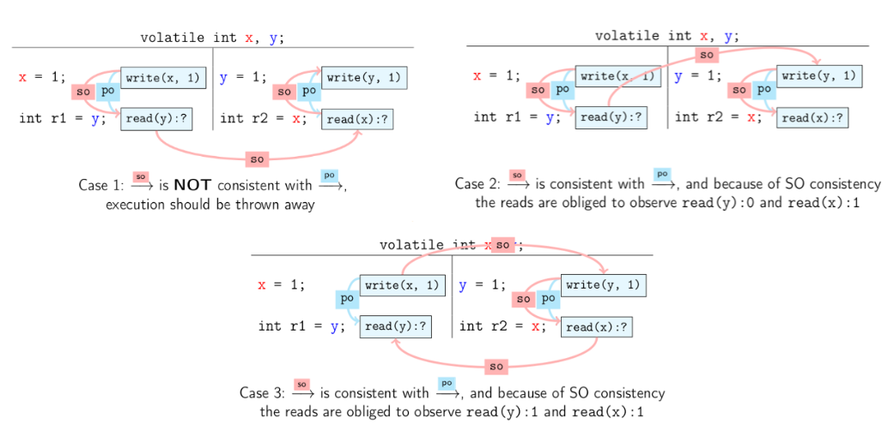
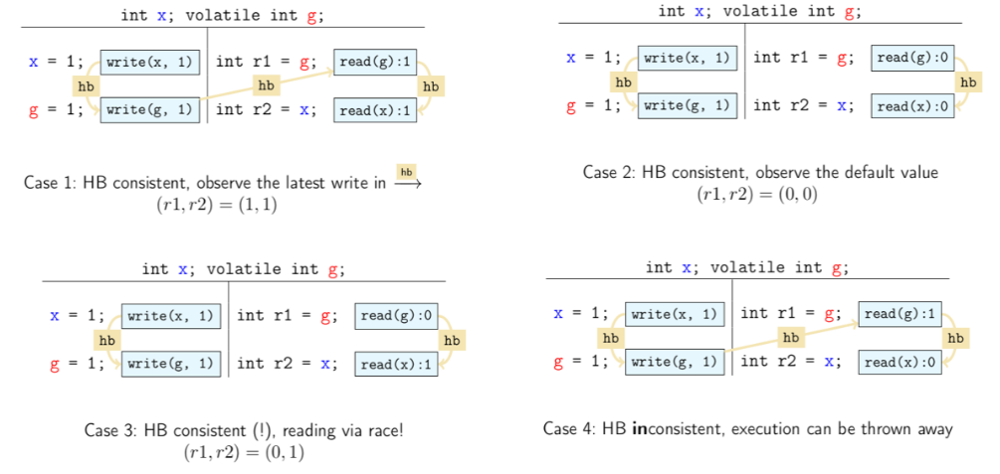

## Sequenziellen Ausführung & Heisenbugs

- Unvorhergesehene Fehler bei simplem, ungeschütztem Parallel-Code (z.B. verschränkter Zugriff auf Variablen `x` und `y`).
- **Theoretische Beweisbarkeit (Sequenzielle Welt)**:
    - **Beweis durch Erschöpfung (Exhaustion)**: Manuelle Evaluation *aller* möglichen Ausführungsreihenfolgen.
        - **Formel für Interleavings**: Bei $2$ Threads à $k$ Statements existieren $2k \choose k$ Kombinationen (Ziehen ohne Zurücklegen).
        - *Erkenntnis*: In der Praxis durch Kombinationsexplosion unmöglich.
    - **Beweis durch Widerspruch (Contradiction)**: Logische Deduktion der Unmöglichkeit eines Fehlers.
        - *Beispiel*: Thread 1 (`x=1; y=1;`), Thread 2 (`a=y; b=x; assert(b>=a);`).
        - *Annahme (Fehlerfall)*: `b < a` (somit `a=1`, `b=0`).
        - *Folgerung*: `y=1` passierte vor `a=y` (da `a=1`) UND `b=x` passierte vor `x=1` (da `b=0`).
        - *Widerspruch (Zyklus)*: Nach sequenzieller Ordnung (`a=y` vor `b=x` und `x=1` vor `y=1`) ergibt sich durch Transitivität: `a=y` $\rightarrow$ `b=x` $\rightarrow$ `x=1` $\rightarrow$ `y=1` $\rightarrow$ `a=y`. Ein logischer Kreisschluss.
- **Praxis-Realität (Heisenbugs)**:
    - **Heisenbugs**: Stochastische/zufällige Fehler. Verschwinden oft bei Beobachtung (Debugger, `-O0` Compiler-Flag).
    - Unerwartete Abstürze erst unter aggressiver Optimierung (z.B. `-O3`).

## Memory Reordering (Speicherumordnung)

- **Grundregel**: Beliebige Code-Veränderung durch Compiler/Hardware erlaubt, solange **sequenzielle Semantik** erhalten bleibt.
- **Software-Sicht (Compiler-Optimierungen)**:
    - **Dead Code Elimination**: Entfernen effektloser Befehle.
    - **Register Hoisting**: Caching von Werten in CPU-Registern (kein RAM-Update).
    - **Locality Optimizations**: Anpassung für bessere Cache-Nutzung.
    - *Gefahr*: `while(x==1)`-Warten auf globale Variable wird zu **Infinite Loop** (z.B. unbedingter Sprung `jmp always`), da Compiler von lokaler Unveränderlichkeit ausgeht.
- **Hardware-Sicht (CPU-Architektur)**:
    - **Pipelined Architecture**: Instruktionen überholen sich zur Laufzeit.
    - **Caches**: Privat pro Kern (Register, L1), geteilt (L2, System Memory).
    - **Store Buffers**: Enormer Performance-Boost, vertauschen aber hardwareseitig Lese- und Schreiboperationen.

## Hardware-Speichermodelle (Architectural Memory Models)

- **Speichermodell (Memory Model)** = **Vertrag (Contract)** zwischen System und Programmierer.
    - Erlaubt System-Optimierungen $\leftrightarrow$ Fordert explizite Programmierer-Synchronisation.
- **Architektur-Unterschiede**:
    - **Stark (z.B. x86 - Intel/AMD)**: Hohe Vorhersehbarkeit. Ausnahme: Reads dürfen nach Writes umgeordnet werden (wegen **Store Buffers**).
    - **Schwach (z.B. ARM)**: Maximale Umordnungs-Erlaubnis. Hohes Performance-Potenzial, aber komplexe Programmierung.

## Das Java Memory Model (JMM)

- Plattformübergreifende Abstraktion. Evaluation via **Traces** (Ausführungspfade), nicht via Quellcode.
- **Aktionen und Ordnungen im JMM**:
    - **Program Order (PO)**: Totale Ordnung **innerhalb eines einzelnen Threads**.
        - Keine Garantie für geteilten Speicher. Register-Zuweisungen (`r1 = y`) passieren exklusiv hier.
    - **Synchronization Actions (SA)**: Besondere Aktionen (Read/Write `volatile`, Lock/Unlock `synchronized`, Thread-Lifecycle).
        - *Eigenschaft*: Fungieren als globale Ankerpunkte. Erzeugen Speichersichtbarkeit und verhindern Reordering über die SA-Grenze hinweg.
    - **Synchronizes-With (SW)**: Paarung korrespondierender SAs über Thread-Grenzen hinweg (z.B. Thread A schreibt `volatile x` $\rightarrow$ Thread B liest exakt dieses `volatile x`).
    - **Happens-Before (HB)**: Transitive Hülle (Verkettung) aus PO und SW.
        - **HB Consistency**: Ein Read sieht zwingend den letzten Write auf der HB-Zeitachse oder einen komplett ungeordneten Write.
	- **Synchronization Order (SO)**: Globale, totale Ordnung **aller SAs**.
        - Alle Threads sehen sämtliche SAs in exakt derselben Reihenfolge. (Intra-Thread SAs folgen der PO).
        - Davon werden SW relationen hergeleitet.
        - *Trade-off*: Konsistenz auf Kosten massiver Performance-Einbussen (so wenig wie möglich nutzen).
- **Data Races in Java**:
    - Read einer Variable ohne gültige HB-Beziehung = **Data Race**.
    - **Explizit erlaubt** (im Gegensatz zu C++: *Undefined Behavior* / Absturz).
    - **Dringende Warnung**: Niemals absichtlich nutzen! Immer **einfachste Lösung** (`synchronized`) präferieren, `volatile` nur bei extremer Performance-Kritikalität.

