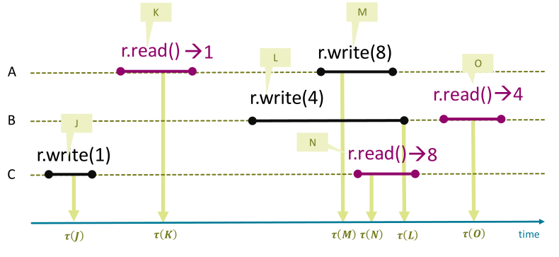

## Definitionen und Annahmen

- **Bedingungen für Critical Sections (CS)**:
    - **Mutual Exclusion** (Wechselseitiger Ausschluss): Maximal 1 Thread in CS.
    - **Freedom from Deadlock** (Deadlock-Freiheit): Mindestens 1 wartender Thread betritt CS irgendwann.
    - **Freedom from Starvation** (Starvation-Freiheit): Jeder wartende Thread betritt CS irgendwann.
- **Fairness-Definition**:
    - Protokoll-Aufteilung: **Doorway** (Interesse anmelden, endliche Schritte) & **Waiting** (Blockieren).
    - **First-Come-First-Served**: Doorway A vor B ($D_A \rightarrow D_B$) erzwingt CS-Eintritt A vor B ($CS_A \rightarrow CS_B$).
- **Theoretische Annahmen** (für formelle Beweise):
    - Read/Write primitiver Typen atomar (in Java durch Natural Alignment).
    - Kein Memory Reordering (simuliert durchgehendes `volatile`).
    - Threads **verlassen CS garantiert** (kein Absturz/Endlosschleife in CS).
    - Keine Fortschritts-Garantie ausserhalb der CS.

## Mutual Exclusion für 2 Threads (Fehlschläge)

- **Versuch 1 (Warten, dann Flag)**:

    ```java
    while(wantq);
    wantp = true;
    // Critical Section
    wantp = false;
    ```

    - *Fehler*: **No Mutual Exclusion** (Gleichzeitiges Lesen von `false` $\rightarrow$ beide betreten CS).
- **Zustandsdiagramm (State Space Diagram)**:
    - Modelliert Zustandspfade (X-Achse: Thread P, Y-Achse: Thread Q).
    - *Optimierung*: Unwichtige Zustände zusammenfassen (reduziert Zustandsraum-Explosion).
    - Visualisiert Traces und beweist fehlerhafte Interleavings formell.
- **Versuch 2 (Flag, dann Warten)**:

    ```java
    wantp = true;
    while(wantq);
    // Critical Section
    wantp = false;
    ```

    - *Fehler*: **Deadlock** (Beide setzen Flag, endloses Warten aufeinander).
- **Versuch 3 (Staffelstab / Turn)**:

    ```java
    while(turn != 1);
    // Critical Section
    turn = 2;
    ```

    - *Fehler*: **Starvation** (Absturz ausserhalb CS blockiert `turn`-Übergabe permanent).

## Funktionierende Algorithmen für 2 Threads

- **Decker's Algorithm** (Kombination Versuch 2 & 3):

    ```java
    wantp = true;
    while (wantq) {
        if (turn == 2) { // Prüfung auf Vorrang (preference)
            wantp = false;
            while (turn != 1);
            wantp = true;
        }
    }
    // Critical Section
    turn = 2;
    wantp = false;
    ```

    - Konzept: Verlierer zieht Flag bei Konflikt temporär zurück.
    - Eigener Vorrang nicht erzwingbar, nur eigene Niederlage erkennbar.
- **Peterson Lock** (Kompakter):

    ```java
    flag[P] = true;
    victim = P;
    while (flag[Q] && victim == P);
    // Critical Section
    flag[P] = false;
    ```

    - Letzter Schreiber deklariert sich als **Victim** und muss warten.
- **Gefahr in Java (Volatile Array)**:
    - `volatile boolean[]` schützt **nur Array-Referenz**, nicht Inhalte (lautlose Bugs).
    - *Lösung*: Zwingend **`AtomicIntegerArray`** nutzen.

## Formelle Beweisführung (Peterson)

- **Intervall-Notation & Atomare Register**:
  
    - Befehls-Dauer = Intervall zwischen Start und Antwort.
    - **Ordnung (Precedence)**: $I_A \rightarrow I_B$ (Intervall A endet vor Start B).
    - Überlappende Intervalle = **concurrent**.
    - **Atomic Register**: Lese-/Schreib-Effekt exakt zu unteilbarem Zeitpunkt $\tau(J)$.
- **Beweis Mutual Exclusion** (Widerspruch):
    - *Annahme*: Beide Threads (P & Q) in CS.
    - *Deduktion*: P schrieb zuletzt ($W_Q \rightarrow W_P$) $\rightarrow$ liest zwingend `victim = P`.
    - P muss `flag[Q] == false` für CS-Eintritt gelesen haben.
    - *Widerspruch*: Q hat `flag[Q] = true` wegen zeitlicher Abfolge längst gesetzt.
- **Beweis Starvation Freedom** (Exhaustive Contradiction):
    - *Annahme*: P steckt endlos in `while` fest.
    - Q-Zustände (Non-CS, endlos iterierend, ebenfalls in `while` blockiert) führen logisch zwingend zu P's Weiterkommen $\rightarrow$ *Widerspruch*.

## Mutual Exclusion für $n$ Threads

- **Filter Lock**:

    ```java
    for (int i = 1; i < n; ++i) {
        level[me] = i;
        victim[i] = me;
        while (∃k ≠ me: level[k] >= i && victim[i] == me);
    }
    // Critical Section
    level[me] = 0;
    ```

    - Erweitert Peterson auf $n-1$ Level (max. 1 Thread pro Level blockiert).
    - *Filter Lock nicht fair*: Überholen auf höheren Leveln möglich.
    - **Problem**: Extrem schlechte Skalierung ($\mathcal{O}(n)$). Alle Level zwingend durchlaufen, auch ohne Konkurrenz (**Contention**).
- **Bakery Algorithm (1974)**:

    ```java
    flag[me] = true;
    label[me] = max(label[0], ..., label[n-1]) + 1;
    while (∃k ≠ me: flag[k] && (label[k], k) <_l (label[me], me));
    // Critical Section
    flag[me] = false;
    ```

    - Ticket-System: Kleinste Nummer (`label`) gewinnt.
    - **Symmetry Breaking** (Tie-Breaker): Bei gleicher Nummer gewinnt kleinere Thread-ID (lexikografische Ordnung $<_l$).
    - Garantiert Fairness (First-Come-First-Served).
    - *Probleme*: Integer-Overflow Gefahr, schlechte $\mathcal{O}(n)$-Skalierung (Array-Scans).

## Fundamentale Limitierungen von Registern

- **Theorem (Lynch & Burns)**:
    - Software-Systeme (nur Read/Write) benötigen für $n$ Prozesse zwingend $\geq n$ Variablen.
- **Beweis-Intuition**:
    - Lesen offenbart nur letzten Schreibvorgang.
    - Verdeckte Zwischenzustände von anderen Threads werden spurlos überschrieben.
- **Fazit für die Praxis**:
    - Reine Software-Locks zu ineffizient (Laufzeit/Speicher).
    - Hardware-Erweiterungen (Atomic CPU-Befehle) zwingend notwendig.
