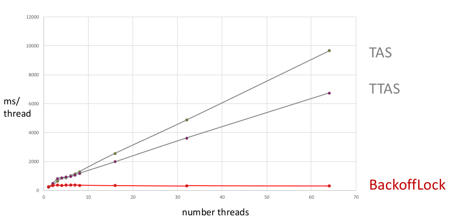

## Hardware-Unterstützung (Atomare Befehle)

- **Read-Modify-Write (RMW)**: Lesen, Verändern und Schreiben **strikt ununterbrechbar (atomar)**.
    - **Vorteil**: $\mathcal{O}(1)$ Speicherbedarf (unabhängig von Thread-Anzahl), essenziell für **Lock-free Programming**.
    - **Nachteil (Performance)**: 10x bis 100x langsamer als normale Lese-/Schreibzugriffe.
- **Arten von RMW-Befehlen**:
    - **Test-And-Set (TAS)**: Prüft Wert auf $0$, setzt ihn atomar auf $1$.
    - **Compare-And-Swap (CAS)**: Vergleicht mit Erwartungswert, überschreibt nur bei Übereinstimmung. **Mächtiger als TAS**.
    - **Load-Linked / Store-Conditional (LL/SC)**: Mächtigste Variante (kein Fehlschlag bei simplen Inkrementen).
- **Hardware-Spezifika**:
    - **x86 (Intel/AMD)**: **`CMPXCHG`** (Compare and Exchange) mit `LOCK`-Präfix (effizienter Cache-Lock).
    - **ARM (Smartphones, Uhren)**: **`LDREX`** (Load Register Exclusive) & **`STREX`** (Store Register Exclusive). Konzeptuell besser, in der Praxis oft CAS wegen x86-Kompatibilität.

## Atomare Operationen in Java

- **High-Level API**: Ab JDK 5 via `java.util.concurrent.atomic` (z.B. **`AtomicBoolean`**, **`AtomicInteger`**).
- **Kern-Operationen**:
    - `get()`: Liest aktuellen Wert.
    - `set()`: Überschreibt mit neuem Wert (nicht atomar bedingt).
    - `compareAndSet(expect, update)`: Ändert zu `update` **nur**, wenn aktueller Wert `expect` ist (gibt `true` bei Erfolg).
    - `getAndSet(newValue)`: Setzt `newValue` und retourniert den vorherigen Wert.
- **Interne Funktionsweise**:
    - Java-Bytecode ohne native CAS-Befehle.
    - JVM nutzt interne Klasse **`sun.misc.Unsafe`** für OS-/Hardware-Mapping (umgeht sicheres Java-Memory-Management).
    - Direkter Hardware-Support nicht garantiert (möglicher lautloser Fallback auf interne Locks).

## Spinlocks und Skalierung

- **1. TAS Spinlock (Test-And-Set)**:
    - **Konzept**: `while(state.getAndSet(true)) {}` (Warten), `state.set(false)` (Freigabe).
    - **Problem**: Katastrophale Performance bei vielen Threads (**logarithmischer Slowdown**).
    - **Grund**: **Sequential Bottleneck** und physische **Contention** auf dem Datenbus. Schreibversuche im Spin-Loop invalidieren ständig Caches anderer Prozessoren (**"Barking Dogs Problem"**).
- **2. TTAS Spinlock (Test-and-Test-and-Set)**:
    - **Lösung für TAS-Problem**: Billiger **Concurrent Read**. Reine Leseschleife (`while(state.get()) {}`), CAS-Versuch erst bei Gelesen-Wert `false`.
    - **Problem**: Bei Lock-Freigabe massiver **Contention-Sturm** (alle ausbrechenden Threads versuchen gleichzeitig CAS).
    - **Double-Checked Locking**: Generalisierung dieses Ansatzes (erst ungeschützt prüfen, bei Treffer locken und erneut prüfen).
        - **Explizite Warnung**: Wegen Memory Reordering im Java Memory Model (JMM) **kaputt (broken)**. Erzeugt lautlose Heisenbugs.
- **3. Spinlock mit Exponential Backoff**:
    - **Lösung für TTAS-Problem**: Bei CAS-Fehlschlag pausiert Thread kurz (`Thread.sleep()`).
    - **Mechanismus**: Zufällige Wartezeit. Obere Grenze verdoppelt sich bei jedem weiteren Fehlschlag (**exponentielles Wachstum**).
    - **Starvation Freedom (Fairness)**: Absolute Obergrenze (**`MAX_DELAY`**) zwingend, sonst verhungern Pechvögel.
    - **Resultat**: Sehr flache Performance-Kurve (exzellente Skalierung). Konzept weit verbreitet (WLAN, verteilte Systeme).

## Deadlocks (Verklemmungen)

- **Definition**: $\geq 2$ Prozesse blockieren sich gegenseitig endlos (Warten auf bereits gehaltene Ressourcen).
- **Bedeutung**: **Dominantes Problem** komplexer Systeme (Beispiel: Banküberweisung $x \rightarrow y$ vs. $y \rightarrow x$). In Sicherheitsbereichen (Flugzeuge) oft komplett verboten.
- **Formelle Graphen-Modellierung**:
    - **Knoten**: Threads ($T$) und Ressourcen ($R$).
    - **Kanten**: Warten ($T \rightarrow R$) oder Gehalten ($R \rightarrow T$).
    - **Zyklus**: Ein Kreis im Graphen = **mathematischer Beweis** für Deadlock.
- **Deadlock Detection (Erkennung)**: Graphen zur Laufzeit nach Zyklen absuchen.
    - Heilung meist unmöglich (erfordert inkonsistenten System-Reset).
- **Deadlock vs. Starvation**:
    - **Deadlock**: Niemand macht Fortschritt.
    - **Starvation**: Einzelner Prozess verliert permanent (Unfairness).

## Deadlock-Vermeidung (Avoidance)

- **Fokus**: System-Design, welches Deadlock-Zyklen von vornherein verunmöglicht.
- **Ansatz 1: Two-Phase Locking mit Retry**:
    - Transaktion bei Konflikt abbrechen/Ressourcen freigeben (Datenbanken).
    - Im RAM (Software-Locks) oft zu teuer wegen Speicherung der Zwischenzustände.
- **Ansatz 2: Resource Ordering (Globale Ordnung)**:
    - **Standard-Lösung** der parallelen Programmierung.
    - **Regel**: Zwingende **globale Ordnung** aller Ressourcen. Threads fordern Locks **immer** in gleicher (z.B. aufsteigender) Reihenfolge an.
    - **Vorteil**: Zyklen im Graphen sind mathematisch komplett ausgeschlossen.
    - **Beispiele**: Sortieren nach Account-Nummer, Unique ID oder Baumstruktur-Ebenen.
    - **Programmier-Trick**: Bei ID-losen Objekten dynamisch via `AtomicLong.incrementAndGet()` eindeutige `index`-Variable bei Instanzierung vergeben.
