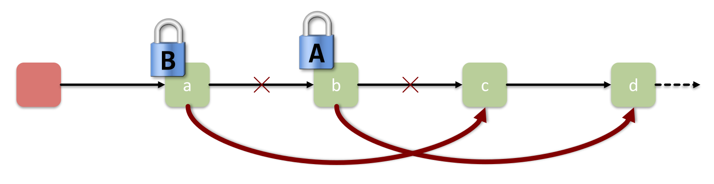
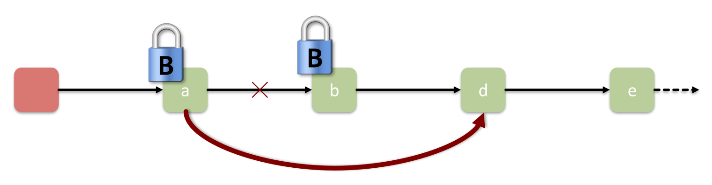
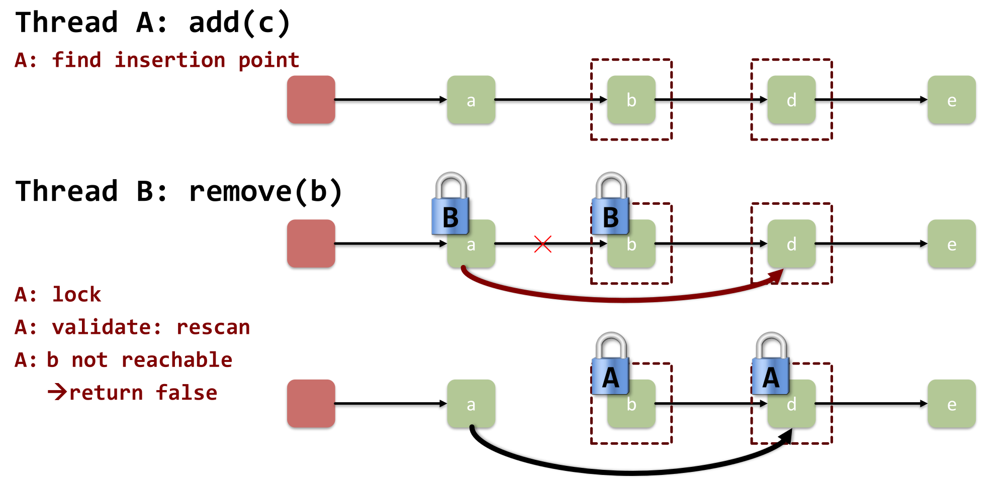
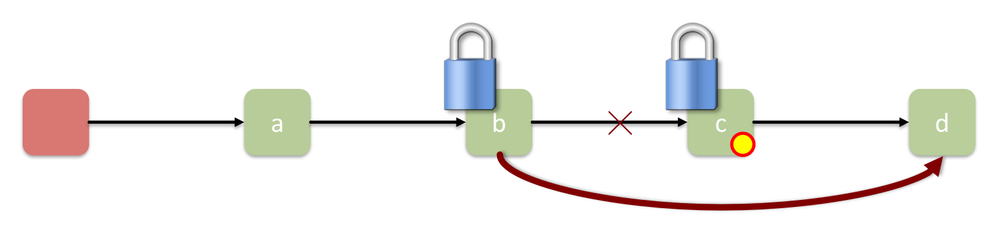
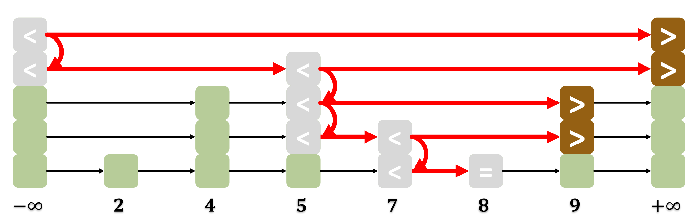

## Einführung in Lock Granularity

- **KISS-Prinzip (Keep It Simple, Stupid)**: Einfachste Locks bevorzugen, Anzahl gleichzeitig genutzter Variablen minimieren.
- **The Five-Fold Path** (Stufen der Synchronisation): **Coarse-grained**, **Fine-grained**, **Optimistic**, **Lazy**, **Lock-free**.
- **Laufbeispiel (Sequential List Based Set)**:
    - Set als sortierte, verlinkte Liste (nur zur Anschauung, Praxis: Hashtables).
    - **Spezialknoten**: Zwingend **Head** ($-\infty$) und **Tail** ($+\infty$) zur Vermeidung von Rand-Exceptions.

## Coarse-Grained Locking

- **Konzept**: Ein einziges grosses Lock (**Big Fat Lock**) schützt gesamte Datenstruktur.
- **Vorteil**: Extrem simple Implementierung.
- **Nachteil**: Extremer **Sequential Bottleneck** (Flaschenhals).
    - Gesamte Struktur während Traversierung (Erwartungswert $O(n/2)$ Elemente) physisch blockiert.
- **Amdahl's Law Limitation**: Massive Speedup-Einschränkung (z.B. $20\%$ Zeit im Lock = max. Speedup $5x$, unabhängig von Thread-Anzahl).

## Fine-Grained Locking (Hand-over-hand)

- **Idee**: Objekt-Aufteilung in kleine Teile mit **separaten Locks**.
- **Lösch-Gefahr**: Naives Locken einzelner Knoten führt zu Elementverlust (z.B. Thread A löscht `c`, Thread B zeitgleich `b`).
  
    - Ursache: Zeitgleiches Schreiben eines Knotens und Lesen des nächsten.
- **Lösung: Hand-over-hand locking**:
  
    - Listen-Durchlauf ("Hangeln") mit **immer** zwei gelockten Knoten.
    - Lock-Paar: Vorgänger (**Pred**) und aktueller Knoten (**Curr**).
- **Nachteile**:
    - Potenziell sehr lange `acquire()`/`release()`-Sequenzen ($O(n)$ Locks pro Suche).
    - **Überholen unmöglich**: Langsamer Thread am Listenanfang blockiert alle nachfolgenden physisch.

## Optimistic Synchronization

- **Idee**: Komplett ungelockte Suche (`find()`), anschliessendes Locken und **Validieren** der Zielknoten.
- **Validierungs-Bedingungen** (beide zwingend):
    - **Reachable**: Knoten ungelöscht (vom Head aus erreichbar).
    - **Connected**: Kein Element dazwischen eingefügt (`pred.next == curr`).
- **Sicherheit**: Bei Erfüllung aller Bedingungen kein Einfügen/Löschen durch Dritte möglich.
- **Vorteile**:
    - Traversieren ohne **Contention** (Datenstau).
    - Suche komplett **wait-free** (wartefrei).
- **Nachteile**:
    - Zwingend **doppeltes Traversieren** (Suche + Validierung ab Head).
    - **Not starvation-free**: Endloses Pech bei anhaltenden Validierungs-Konflikten möglich.
    - `contains()` erfordert weiterhin Locks.

## Lazy Synchronization (Lazy List)

- **Idee**: Vermeidung doppelter Traversierung via **Atomic Markers**. Entkopplung von strukturellem Update und Thread-Erkennung.
- **Mark-Bit**: Flag zur Signalisierung der **logischen Löschung** eines Knotens.
- **Zentrale Invariante**: Jeder **unmarkierte** Knoten ist garantiert vom Head und Vorgänger erreichbar.
- **Ablauf Löschvorgang (`remove(c)`)**:
    1. Locken von Vorgänger (`b` bzw. `pred`) und Zielknoten (`c` bzw. `curr`).
    2. **Validierung**: Zwingende Prüfung, ob `b` oder `c` bereits markiert sind.
    3. Falls **nicht markiert** (Löschung sicher zulässig):
        - **Logical delete**: Mark-Bit von `c` setzen (`mark c`).
        - **Physical delete**: Knoten `c` physisch entfernen (`delete c`, Pointer umhängen, kann auch später "lazy" durch andere Threads passieren).
- **Vorteile**:
    - Nur noch **einmaliges** Listen-Scannen.
    - Automatischer Schleifen-Neustart bei Konflikt/Markierung.
    - `contains()` **komplett wait-free** (Marker als Serialisierungspunkt, gänzlich ohne Locks).

## Skip Lists

- **Motivation**: Globales **Rebalancing** balancierter Bäume (AVL, Red-Black) parallel extrem schwer umsetzbar.
- **Lazy Skip Lists** (Bill Pugh): Elegante Praxis-Datenstruktur.
- **Funktionsweise (Las Vegas Style Algorithmus)**:
    - Probabilistische Lösung des Rebalancing-Problems (korrekt, Laufzeit zufällig).
    - **Sorted multi-level list**: Obenliegende Level mit exponentiell weniger Knoten.
    - **Node-Höhe**: Zufällige Ziehung beim Einfügen (z.B. $\mathbb{P}(height = n) = 0.5^n$).
    - **Skip list property**: Höhere Level als strikte Teillisten der tieferen Level.
- **Operationen**:
    - **Searching**: Logarithmische Suche ($O(\log n)$ erwartungsgemäss), Level-Sprünge nach unten.
    - **Add**: Ungelockte Vorgänger-Suche, Locken **aller** Vorgänger bis Zielhöhe, Validierung, Einfügen.
    - **Contains**: Sequenzielle Iteration, Prüfung auf fehlende Markierung & vollständige Verlinkung. Ist **wait-free**.
- **Praxis-Hinweise**:
    - Sehr fehleranfällige Implementierung.
    - Hoher Speicherbedarf (Arrays von Turm-Pointern pro Knoten).

