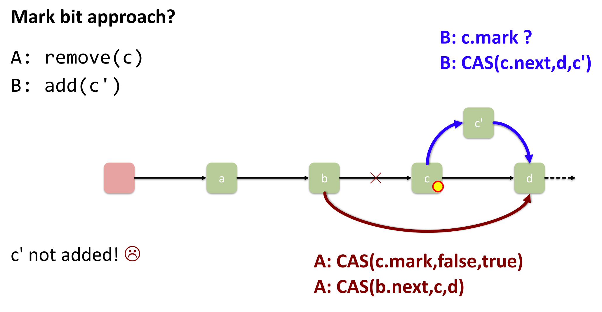
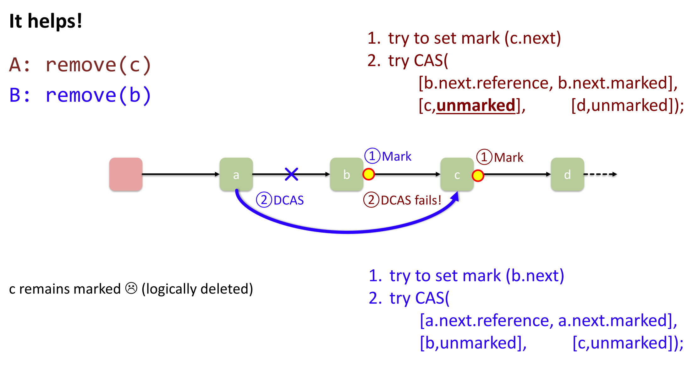
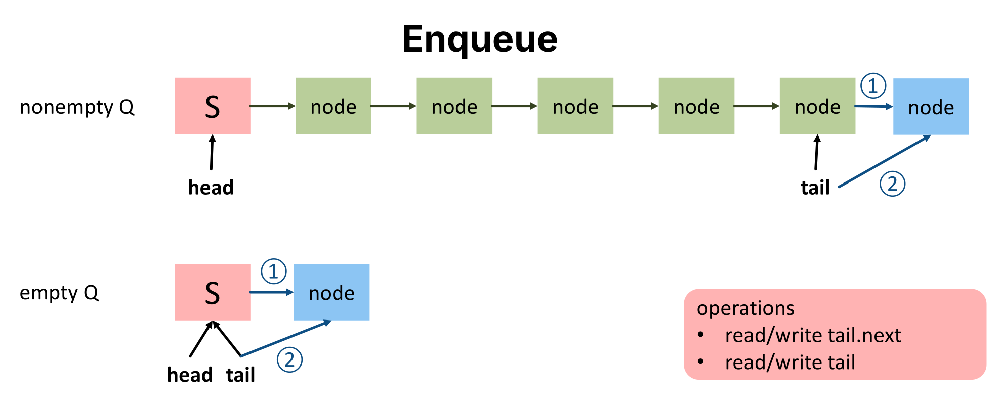

## Nachteile von Locks (Motivation für Lock-Free)

- **Absolutes Lock-Verbot in sicherheitskritischen Systemen** (**ABS-Bremsen**, Flugzeuge, **Tesla**):
    - **Blocking Semantics**: Thread-Tod im Lock $\rightarrow$ kompletter Systemstillstand (**Resilienz Null**).
    - **Interrupt-Handler**: Lock-Nutzung strikt verboten (sofortiger **Deadlock**).
    - **Priority Inversion**: Lock-induzierte Ausfälle (Beispiel: Absturz des **Mars Rovers**).
- **OS-Abhängigkeit**: OS-Funktionen (z.B. `wait()`) nutzen intern oft eigene Locks ("Turtles all the way down"). API-Doku zwingend prüfen.
- **Performance-Probleme**:
    - **Spinlocks**: Massive Ressourcenverschwendung (CPU-Last, blockiert Energiesparmodus). Keine FIFO-Fairness (Lösung: Queue Locks).
    - **Scheduled Locks**: Hohe Aufwach-Latenz (Context Switch ca. $5-6$ Mikrosekunden).
    - **Lösungsansatz (Competitive Spinning)**: Hybrides Modell (kurzer Spinlock, danach OS-Schlafmodus via `rescheduling`).
    - **Amdahl's Law Limitation**: Fixer Flaschenhals (z.B. $20\%$ Lock-Zeit = max. $5x$ Speedup, unabhängig der Thread-Anzahl).

## Definitionen der Synchronisation

- **Blocking (Blockierende Synchronisation)**:
    - **Deadlock**: $\ge 2$ Prozesse blockieren sich gegenseitig endlos.
    - **Livelock**: Ständige Zustandsänderung ohne echten Fortschritt.
    - **Starvation**: Einzelner Prozess verhungert bei Ressourcenzugriff.
- **Non-Blocking (Nicht-blockierende Algorithmen)**:
    - *Grundregel*: Thread-Ausfall/Pause blockiert niemals System/andere Threads.
    - **Lock-freedom**: Mindestens **ein** Thread macht zwingend Fortschritt. Garantiert **deadlock-free**, erlaubt Starvation.
    - **Wait-freedom**: **Alle** Threads machen nach limitierter Schrittzahl garantiert Fortschritt. Schliesst Deadlock & Starvation aus.
        - *Eigenschaften*: Impliziert immer Lock-free. Echtzeitfähig, aber extrem komplex zu implementieren.

## Compare-And-Swap (CAS) & Performance

- **Compare-And-Swap (CAS)**: Atomare CPU-Operation (vergleicht Zieladresse mit Erwartungswert, überschreibt nur bei Übereinstimmung).
- In moderner Hardware echt **wait-free**.
- **Trugschluss der CAS-Exklusivität**: Positives CAS garantiert nicht, dass zwischenzeitlich *nicht* geschrieben wurde. Gefahr: **ABA-Problem** (identischer Werteaustausch bleibt unbemerkt).
- **Performance-Falle**: Unter **Contention** oft massiv langsamer als Locks (parallele CAS-Fehlschläge $\rightarrow$ Endlosschleifen).
    - **Lösung (Exponential Backoff)**: Ansteigende Pausen bei Fehlschlägen macht Lock-Free erst performant.

## Lock-Free Stack

- LIFO-Speicher ohne `synchronized` via `AtomicReference<Node> top`.
- **Mechanismus**:
    1. Aktuellen Zustand merken (`head = top.get()`).
    2. Zustand lokal vorbereiten (neuen Knoten an `head` hängen).
    3. Atomares Update via CAS.
    4. Bei Fehlschlag: Neustart in `do-while`-Schleife.
- Algorithmisch **lock-free** (deadlock-free by design).

```java
public void push(Long item) {
    Node newi = new Node(item);
    Node head;
    do {
        head = top.get();
        newi.next = head;
    } while (!top.compareAndSet(head, newi));
}

public Long pop() {
    Node head, next;
    do {
        head = top.get();
        if (head == null) return null;
        next = head.next;
    } while (!top.compareAndSet(head, next));
    return head.item;
}
```

## Lock-Free List-Based Set

- **Problem nativer CAS-Listen**: Gleichzeitiges Löschen benachbarter Knoten führt zu lautlosem Elementverlust.
  
- **Die Java-Lösung (`AtomicMarkableReference`)**:
    - *Erfordernis*: Atomares Update von Mark-Bit und Next-Pointer (natives **DCAS** fehlt in normaler Hardware).
    - **Bit-Klau Hack**: 64-Bit Pointer nutzt real nur 48 Bit physischen Speicher.
    - Freie Bits als **Mark Bit** missbraucht $\rightarrow$ Referenz und Flag in einem einzigen atomaren 64-Bit Wert.
- **Zweistufiger Löschvorgang (`remove`)**:
  
    - **Logical Delete**: Mark-Bit auf Next-Pointer setzen.
    - **Physical Delete**: Vorgänger-Pointer via CAS umhängen.
- **Das Helper-Prinzip ("Helping")**:
    - Zentrales Lock-Free Konzept. Iterierender Thread findet *logisch gelöschten* Knoten $\rightarrow$ löscht ihn sofort physisch.
    - **Vorteil**: Repariert Inkonsistenzen (niemand wartet auf andere).
    - *Praxis-Tipp*: Probabilistisches Helfen (z.B. nur bei $50\%$ der Konflikte) verhindert extremen Datenstau beim Aufräumen.
- **Wait-Free Contains**: Kein Lock/CAS. Iteriert sequenziell und prüft auf fehlendes Mark-Bit.

```java
// Stark vereinfachter Pseudo-Code
public Window find(int key) {
    // Iteriert durch Liste. Falls Knoten mit Mark-Bit gefunden wird:
    // HILFT SOFORT: pred.next.compareAndSet(curr, succ, false, false)
    // Bei Fehlschlag Neustart ab Head.
    // Retouniert Vorgänger (pred) und Zielknoten (curr).
}

public boolean remove(T item) {
    while (true) {
        Window window = find(key);
        if (curr.key != key) return false;
        Node succ = curr.next.getReference();
        
        // 1. Logical Delete (Mark Bit setzen)
        boolean snip = curr.next.attemptMark(succ, true);
        if (!snip) continue; // Bei Konflikt Neustart
        
        // 2. Physical Delete (Vorgänger umhängen)
        pred.next.compareAndSet(curr, succ, false, false);
        return true;
    }
}
```

## Lock-Free Unbounded Queue

- **Motivation OS-Kernel**:
    - OS = Ressourcen-Scheduler. Verarbeitet Queue-Zustandswechsel (`run`, `ready`, `wait`).
    - **KISS-Prinzip**: Kernel-Code zwingend simpel/robust.
    - Alte Locks (*Linux Big Kernel Lock*) verursachten massive Skalierungsprobleme.
- **Problem simpler Queues**: `head` (Dequeue) und `tail` (Enqueue) überlappen bei leerer Queue. Lock-free Simultan-Update unmöglich.
- **Lösung (Sentinel-Knoten)**:
    - Persistenter **Dummy-Knoten** an der Front. Wird **niemals** entfernt.
    - Folge: `head` und `tail` nie `null` $\rightarrow$ Operationen komplett entkoppelt.
- **Enqueue (Hinzufügen) & Helping**:
    - Berechnet Knoten lokal, CAS auf `last.next`.
    - **Gefahr**: Thread stirbt *nach* `last.next` Erfolg, aber *vor* Update des globalen `tail`.
    - **Helping beim Tail**: Bemerkt Thread A, dass `last.next != null` (Thread B war unfertig), schiebt Thread A das globale `tail` für B vorwärts.
- **Dequeue (Entnehmen)**:
    - Liest Wert *nach* dem Sentinel, rückt `head` vor.
    - Alter Sentinel $\rightarrow$ Garbage Collector, entnommener Knoten $\rightarrow$ neuer Sentinel.



```java
public void enqueue(T item) {
    Node node = new Node(item);
    while (true) {
        Node last = tail.get();
        Node next = last.next.get();
        if (next == null) {
            // Versuche an letztes Element anzuhängen
            if (last.next.compareAndSet(null, node)) {
                tail.compareAndSet(last, node); // Tail updaten
                return;
            }
        } else {
            // Helping: Jemand war langsamer, wir schieben Tail für ihn vorwärts
            tail.compareAndSet(last, next);
        }
    }
}

public T dequeue() {
    while (true) {
        Node first = head.get(); // Sentinel
        Node last = tail.get();
        Node next = first.next.get(); // Echtes Element
        
        if (first == last) {
            if (next == null) return null; // Queue echt leer
            tail.compareAndSet(last, next); // Helping: Tail hing zurück
        } else {
            T value = next.item;
            // Sentinel entfernen, next wird neuer Sentinel
            if (head.compareAndSet(first, next)) return value;
        }
    }
}
```
