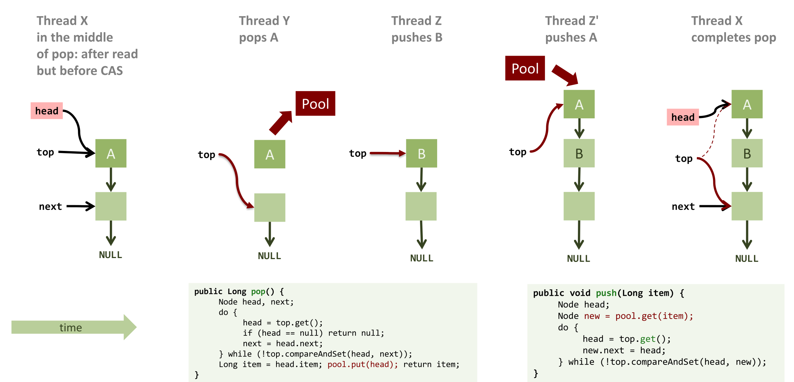
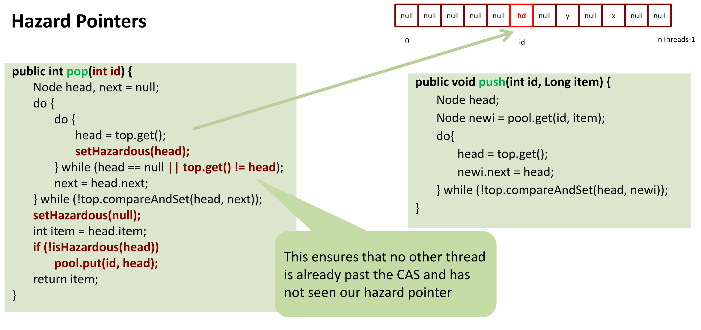

## Motivation für Memory Reuse

- **Fehlende Garbage Collection (GC)**: Manuelle Speicherverwaltung in Betriebssystem-Kerneln oder unmanaged Sprachen (C/C++).
- **Node Pool**: Eigene Datenstruktur (z.B. Stack) zur Knoten-Wiederverwendung statt ständiger Neuallokation (`new Node()`).
- **Performance**: Massiver Speedup (ca. 2x schneller im Experiment).
- **Gefahr**: Unerklärliche Abstürze/Endlosschleifen durch das **ABA-Problem**.

## Das ABA-Problem

- **Definition**: Variable ändert sich von $A \rightarrow B \rightarrow A$. Thread liest erneut $A$ und nimmt fälschlicherweise unveränderten Gesamtzustand an.
- **Voraussetzung**: Tritt **ausschliesslich bei Compare-And-Swap (CAS)** auf.
- **Chronologischer Ablauf (am Beispiel eines Stacks)**:
    1. Thread X startet `pop()`, liest `head` (Knoten $A$), pausiert vor CAS.
    2. Thread Y führt `pop()` aus. $A$ landet im **Node Pool**.
    3. Thread Z pusht neuen Knoten $B$ (neues `top`).
    4. Thread Z' pusht erneut, holt exakt $A$ aus dem Pool $\rightarrow$ $A$ ist wieder `top`.
    5. Thread X wacht auf. CAS (`top == A`) erfolgreich.
    6. **Resultat**: X setzt veralteten `next`-Pointer. Knoten $B$ überschrieben (lautloser Datenverlust).

## Lösungsansätze

- **Garbage Collection (GC)**:
    - Speicherfreigabe erst ohne aktive Referenzen (verhindert Problem bei Pointern).
    - *Nachteile*: Pausiert alle Threads (zu langsam für OS/Echtzeitsysteme).
    - **Achtung**: Schützt **nicht** vor dem ABA-Problem bei reinen **Werten** (z.B. Integer-Counter).
- **Pointer Tagging**:
    - **Konzept**: Unterste freie Bits (z.B. 5 Bits bei 32-Byte-Alignment) als Zähler (**Tag**).
    - Inkrement bei jedem Speichern.
    - Adress-Zugriff via Maskierung: $Adresse = x - (x \pmod{32})$.
    - **Gefahr**: Keine 100% Lösung (reine Wahrscheinlichkeitsreduktion). Benötigt exakt 32 Überschreibungen für denselben Fehler. Extrem effizient.
- **Transactional Memory**: (Späteres Vorlesungsthema).
- **Hazard Pointers**: Einzige 100% sichere Software-Lösung.

## Hazard Pointers

- **Konzept**: Thread markiert Pointer vor Verarbeitung als **gefährlich (hazardous)**.
- **Struktur**: Globales Array mit $n$ Slots ($n =$ Thread-Anzahl).
- **Regeln & Ablauf**:
    - Jeder Thread schreibt **exklusiv** in eigenen Slot, liest aber gesamtes Array.
    - Thread trägt Ziel-Knoten ein (`setHazardous(head)`).
    - **Zwingende Überprüfung**: Erneute `top`-Prüfung nach Eintrag (via `do-while`).
        - *Grund*: Man muss den Wert erst lesen, bevor man ihn als *hazardous* eintragen kann. Zwischen Lesen und Eintragen kann er bereits von Dritten verändert worden sein.
    - Nach CAS-Erfolg: Zwingendes Löschen des Eintrags (`setHazardous(null)`).
    - **Memory Leak Gefahr**: Verpasstes Löschen führt zu Leaks (Knoten in Systemtreibern blockiert).
- **Freigabe in den Pool**:
    - Vor Pool-Rückgabe: Prüfung des gesamten Arrays. (*Nachteil*: Teure $\mathcal{O}(n)$ Operation).
    - **Kein Memory Leak bei Mehrfach-Nutzung**: Haben mehrere Threads den Knoten im Hazard Array, wird er vorerst ignoriert. Der **letzte** Thread, der den Eintrag löscht, bemerkt das leere Array und legt den Knoten sicher in den Pool zurück (solange kein Thread stirbt).

## Schutz des Node Pools

- **Node Pool** selbst oft Stack $\rightarrow$ ebenfalls anfällig für ABA-Problem.
- **Ansatz 1: Thread-lokale Pools**: Kein Schutz nötig, aber schlechte Skalierung bei unbalanciertem Workload (z.B. reine Push- / Pop-Threads).
- **Ansatz 2: Globale Pools mit Hazard Pointers**: Zu langsam für ständige Knoten-Wiederverwendung.
- **Hybride Praxis-Lösung**:
    - Kleiner thread-lokaler Pool als Cache (z.B. 10 Elemente).
    - Bei vollem/leerem Cache: Fallback auf globalen Pool (mit Hazard Pointers gesichert).
