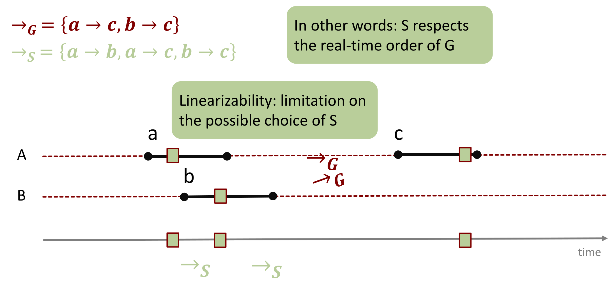
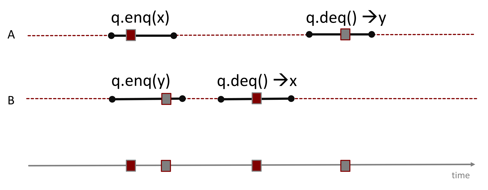
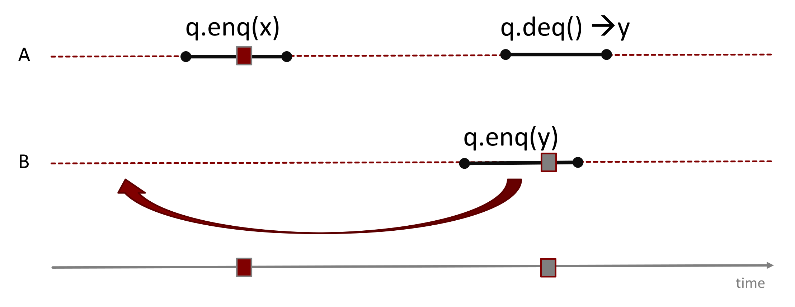

## Sequenzielle vs. Nebenläufige Ausführung

- **Sequenzielle Ausführung**:
    - Sinnvoller Objekt-Zustand existiert **nur zwischen Methodenaufrufen**.
    - Methoden komplett **isoliert** analysierbar.
    - **Globale Uhr** (Global clock).
- **Nebenläufige Ausführung (Concurrent)**:
    - Methodenaufrufe **überlappen** zeitlich.
    - Objekt eventuell **nie** im Ruhezustand (**Quiescence**).
    - Berücksichtigung **aller** Interaktionen zwingend.
    - Individuelle **Objekt-/Thread-Uhren**.

## Formelle Historien (Histories)

- **Methodenaufruf (Method Call)**:
    - Intervall zwischen **Aufruf (Invocation)** und **Rückkehr (Response)**.
    - Dazwischen: Aufruf gilt als **Pending** (ausstehend).
- **History $H$**: Sequenz korrespondierender Invocations und Responses (Übereinstimmung bei Thread-ID und Objekt-Name).
- **Projektionen (Projections)**:
    - **Object projection $H|q$**: Beschränkt Historie $H$ exklusiv auf Events des Objekts $q$.
    - **Thread projection $H|B$**: Beschränkt Historie $H$ exklusiv auf Events des Threads $B$.
- **Complete subhistory**: Historie $H$ ohne jegliche **Pending**-Aufrufe.
- **Eigenschaften von Historien**:
    - **Sequential**: Keinerlei Überlappung von Methoden (ein einzelnes Pending am Ende erlaubt).
    - **Well formed**: Jede Thread-Projektion ist sequenziell (keine Überlappung innerhalb desselben Threads; strikter Wechsel von Invocation und Response).
    - **Equivalent**: Zwei Historien $H$ und $G$ sind äquivalent bei identischen Thread-Projektionen ($H|A = G|A$).
    - **Legal**: Jede Objekt-Projektion respektiert die sequenziellen Spezifikationen (Pre-/Postconditions).
- **Precedence ($\to_H$)**:
    - Methode $m_0$ **geht voraus (precedes)** $m_1$ ($m_0 \to_H m_1$): *Response* von $m_0$ geschieht vor *Invocation* von $m_1$.
    - Impliziert **partielle Ordnung** (total bei sequenzieller Historie). Ohne diese Ordnung **überlappen** Methoden.

## Linearisierbarkeit (Linearizability)

- **Definition**: Methode erscheint **instantan (atomar)** zu einem exakten Zeitpunkt *zwischen* Invocation und Response.
- **Formelle Erweiterung**:
    - Historie $H$ ist linearisierbar bei möglicher Erweiterung zu Historie $G$.
    - *Erweiterungs-Regeln für Pending-Aufrufe*:
        - **Took effect (Effekt erzielt)**: Zustandsänderung wurde für andere sichtbar (z.B. eingefügtes Element von anderem Thread gelesen) $\rightarrow$ **fiktive Response ergänzen**.
        - **Did not take effect (Kein Effekt)**: Keine sichtbare Änderung $\rightarrow$ **verwerfen** (simuliert Thread-Absturz).
    - $G$ muss äquivalent zu einer **legalen sequenziellen Historie $S$** sein.
- **Zwingende Bedingung (Echtzeitordnung)**: $\to_G \subset \to_S$
  
    - $S$ respektiert die absolute **Echtzeitordnung** (Real-time order) von $G$ strikt (kein Umdrehen realer Abläufe).
- **Linearisierungspunkte (Linearization Points)**:
    - Logischer Zeitpunkt, an dem der Effekt einer Methode für alle anderen Threads **global sichtbar** wird.
    - *Beispiel Lock-basiert*: `lock.unlock()`.
    - *Beispiel Lock-free*: Erfolgreicher `compareAndSet()` (CAS) oder `return null`.
    - **Essenzielle Regel**: Genau **eine atomare Instruktion** pro Ausführungspfad macht den Gesamteffekt sichtbar (garantiert Atomizität der Methode).
- **Prüfungsrelevanz (Traces analysieren)**:
  
    - Korrektheit via überlappenden Linien-Diagrammen bewerten.
    - *Wichtig*: Semantik der Datenstruktur beachten (z.B. bei FIFO-Queue muss Element zuerst raus, dessen `enqueue` in Echtzeit zuerst via Response **abgeschlossen** war).

## Kompositionalität (Composability)

- **Composability Theorem**: Historie $H$ exakt dann linearisierbar, wenn jede Objekt-Projektion $H|x$ linearisierbar ist.
- **Konsequenz (Modularität)**:
    - Linearisierbarkeit komplett **isoliert** pro Objekt beweisbar.
    - Gefahrloses **Kombinieren (Composing)** unabhängiger Objekte (verhindert System-Deadlocks im Gegensatz zu Standard-Locks).

## Sequenzielle Konsistenz (Sequential Consistency)

- **Motivation**: Linearisierbarkeit für Hardware/Caches zu teuer und ineffizient. Sequenzielle Konsistenz erlaubt Hardware-Optimierungen und modelliert Multiprozessor-Architekturen besser.
- **Definition**: Historie $H$ ist sequenziell konsistent bei Äquivalenz zu einer legalen sequenziellen Historie $S$.
- **Unterschied zur Linearisierbarkeit**:
  
    - **Keine Echtzeitordnung** ($\to_G \subset \to_S$ entfällt).
    - Operationen **verschiedener Threads** auf Zeitachse gedanklich beliebig verschiebbar.
    - **Einschränkung**: Programmordnung (Program order) **innerhalb desselben Threads** bleibt zwingend erhalten (kein Vertauschen eigener Befehle).
- **Fehlende Kompositionalität (Not a local property)**:
    - Sequenzielle Konsistenz ist **nicht modular**.
    - *Problem*: Isoliert korrekte Objekte (z.B. zwei FIFO-Queues) erzeugen bei Kombination und Verschiebung oft **Kreisabhängigkeiten (Zyklen)** $\rightarrow$ Gesamtsystem inkorrekt.
    - *Historie*: Basis für Korrektheitsbeweis des Peterson-Locks.

## Quiescent Consistency

- **Definition**: Echtzeitordnung gilt **nur** zwischen absoluten Ruhephasen (**Periods of Quiescence**, Zeiten ohne aktive Methodenaufrufe).
- **Eigenschaft**: Beliebige Umordnung von Operationen *zwischen* Ruhephasen erlaubt (auch innerhalb desselben Threads).
- Theoretisch **inkomparabel** zur sequenziellen Konsistenz (weder strikt stärker noch schwächer).

## Hardware-Speichermodelle & Praxis

- **Problem realer Hardware**:
    - Strikte Konsistenz in moderner Hardware **zu teuer/langsam**.
    - CPU nutzt **Caches** statt direktem RAM-Zugriff.
    - Verzögerte Writes in Hauptspeicher (Analogie: *Brief einwerfen* $\rightarrow$ sofortiges Weiterarbeiten statt Warten auf Zustellung).
- **Erzwingen von Synchronisation**:
    - Hardware ordnet Zugriffe für Performance standardmässig um.
    - **Explizite Synchronisation**: Hardware-Befehle (**Memory Barriers**), leeren Caches und erzwingen Ordnung.
    - **Implizite Synchronisation**: High-Level Sprachmittel (z.B. **`volatile`** in Java). Garantiert Aktualität und verbietet Compiler-Reorderings/Schleifen-Optimierungen.
