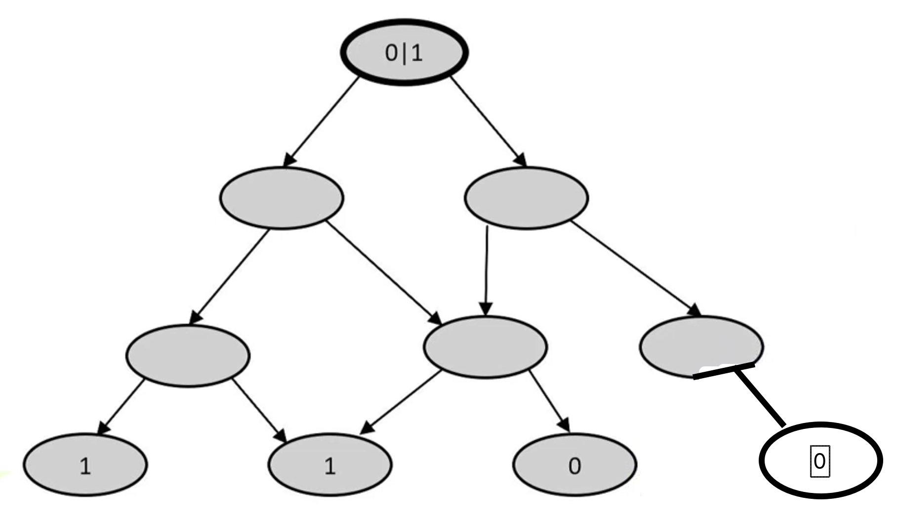

## Grundlagen des Konsensus

- **Ziel**: Koordination mehrerer Threads zur Einigung auf exakt denselben Wert (Fundament aller non-trivialen parallelen Algorithmen).
- **Interface**: `public interface Consensus<T> { T decide(T value); }`
- **Anforderungen an ein Konsensus-Protokoll** (alle zwingend):
    - **Wait-free**: Rückkehr der Methode für jeden Thread in endlicher Zeit (kein Blockieren bei Thread-Absturz).
    - **Consistent**: Exakt dasselbe Resultat für alle Threads (Gewinner-Wert).
    - **Valid**: Entschiedener Wert zwingend aus den ursprünglichen Input-Werten (keine erfundenen Werte).

## Konsensus-Zahl und Hierarchie

- **Definition Consensus Number**: Maximale Anzahl $n$ an Threads, die mit Objektklasse $C$ (plus beliebig vielen Read/Write-Registern) **wait-free** synchronisierbar sind.
- **Die Konsensus-Hierarchie**:
    - **Konsensus-Zahl 1**: Standard Read/Write Register (atomares Lesen/Schreiben einzelner Variablen).
    - **Konsensus-Zahl 2**: FIFO Queues, LIFO Stacks, `getAndSet()`, `getAndIncrement()`, `Test-And-Set`.
    - **Konsensus-Zahl $\infty$**: `Compare-And-Set` (CAS), `Load-Linked/Store-Conditional` (LL/SC), Multiple Assignment (atomares gleichzeitiges Zuweisen mehrerer Variablen).

## Mächtigkeit von Operationen (Beweise)

- **Beweis: CAS hat Konsensus-Zahl $\infty$ (By Construction)**:
    - *Setup*: Shared `AtomicIntegerArray proposed` und globales `AtomicInteger r = -1`.
    - *Ablauf*: Thread schreibt eigenen Wert in `proposed[id]`.
    - *Entscheidung*: Ausführung von `r.compareAndSet(-1, id)`.
    - *Resultat*:
        - **Gewinner** (`true`): Retourniert eigenen Wert aus `proposed[id]`.
        - **Verlierer** (`false`): Liest Gewinner-ID aus `r`, retourniert `proposed[Gewinner-ID]`.
    - *Erfüllt*: **Wait-free** (kein Warten), **Valid** (nur Array-Werte), **Consistent** (gleicher Gewinner für alle).
- **Beweis: Wait-free FIFO Queue unmöglich aus Registern (Widerspruch)**:
    - *Annahme*: Existenz einer Wait-free Queue basierend auf Registern.
    - *Konstruktion*: 2-Thread Consensus via Queue (2 Bälle: rot, schwarz).
    - *Protokoll*: Ball ziehen. Rot gewinnt (entscheidet eigenen Wert), Schwarz verliert (liest Gewinner-Wert aus Shared Array).
    - *Widerspruch*: Erfolgreicher 2-Thread Consensus nur mit Registern. Register besitzen jedoch strikt Konsensus-Zahl 1.

## Unmöglichkeitsbeweis: Atomare Register (Konsensus-Zahl 1)

- **Ziel**: Mathematischer Beweis: Atomare Read/Write Register synchronisieren maximal 1 Thread **wait-free**.
- **Vereinfachung des Problems (Reduktion)**:
    - Limitierung auf $2$ Threads (A und B). Scheitern bei 2 impliziert Scheitern bei $n$.
    - Reduktion auf **Binary Consensus** (Input/Output strikt $0$ oder $1$).
    - *Äquivalenz*: 2-Thread Binary Consensus nachweislich gleich mächtig wie 2-Thread Integer Consensus (via Shared Array abbildbar).

### Zustandsmodell und Valenz

- **Zustands-Baum (Execution Tree)**:
    - Ausführungs-Modellierung als Binärbaum.
    - **Knoten**: Globaler Zustand (lokale/globale Variablen, Program Counter).
    - **Kanten**: Schritt von Thread A (links) oder Thread B (rechts).
- **Valenz (Valency)**:
    - **Univalent** ($0$-valent / $1$-valent): Endgültige Protokoll-Entscheidung unveränderlich fixiert, unabhängig vom Scheduling (Baum-Blätter sind zwingend univalent).
    - **Bivalent**: Resultat ($0$ oder $1$) noch offen, abhängig vom weiteren Scheduling.
- **Theorem 1: Der Initialzustand ist zwingend bivalent**:
    - *Beweis*: Start A(0) und B(1). Bei alleinigem Lauf von A zwingend Resultat $0$ (**Wait-free**). Bei alleinigem Lauf von B zwingend Resultat $1$. Entscheidung offen $\rightarrow$ bivalent.

### Der kritische Zustand (Critical State)

- **Definition Critical State**: Letzter bivalenter Zustand. **Alle** direkten Folgezustände (Kinder) univalent $\rightarrow$ Ort der finalen Entscheidung.
- **Theorem 2: Es gibt immer mindestens einen kritischen Zustand**.
    - *Beweis*: Baum zwingend von endlicher Tiefe (**Wait-freedom**). Abstieg über bivalente Knoten stösst unausweichlich auf univalente Grenze.

### Widerspruchsbeweis (Fallunterscheidung im Critical State)

- *Ausgangslage*: Im kritischen Zustand. Schritt A $\rightarrow$ Entscheidung $0$. Schritt B $\rightarrow$ Entscheidung $1$.
- *Analyse der möglichen Operationen (Schritte) von A und B*:
- **Ausschluss von rein lokalen Variablen**:
    - A rechnet rein lokal, stirbt sofort. B läuft solo weiter.
    - Lokale Änderung für B unsichtbar. Globaler Zustand für B identisch zu Zustand vor As Schritt.
    - B entscheidet blind $1$, obwohl Pfad $0$ verlangt $\rightarrow$ **Widerspruch**. (Nutzung geteilter Register zwingend).
- **Ausschluss von Read-Operationen**:
    - A liest Shared Register, stirbt sofort.
    - *Problem*: Reines Lesen ändert globalen Zustand nicht. Zustand für B unverändert.
    - B entscheidet blind $1$, obwohl Pfad $0$ verlangt $\rightarrow$ **Widerspruch**. (Symmetrisch für B).
- **Ausschluss von Write-Operationen auf verschiedene Register**:
    - A schreibt Register 1, B schreibt Register 2.
    - *Problem*: Ausführungs-Reihenfolge irrelevant. Endzustand identisch (beide Register beschrieben).
    - Aufwachender Thread kann Reihenfolge nicht erkennen, Gewinner unbestimmbar $\rightarrow$ **Widerspruch**.
- **Ausschluss von Write-Operationen auf dasselbe Register**:
    - A schreibt Register 1, B schreibt Register 1.
    - *Problem*: B überschreibt A komplett. Bei As Tod sieht Zustand nach alleinigem Schreiben durch B aus.
    - Zustände "B überschreibt A" und "B schreibt als Erster" ununterscheidbar $\rightarrow$ **Widerspruch**.
- **Schlussfolgerung**:
    - Keine Read/Write-Kombination löst bivalenten Zustand verlässlich auf (unter **Wait-freedom**).
    - Reines Shared Memory (Konsensus-Zahl 1) mathematisch unzureichend für 2-Thread Consensus.
