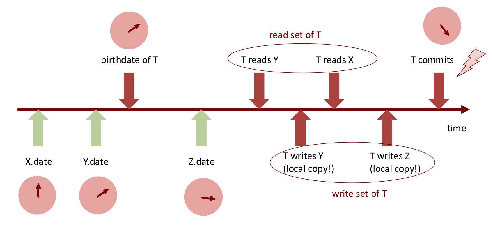

## Motivation für Transactional Memory (TM)

- **Schwächen von herkömmlichen Locks:**
    - **Deadlocks:** Zirkuläres Warten durch inkonsistente Lock-Reihenfolge.
    - **Convoying:** Datenstau durch pausierte, ressourcenhaltende Threads.
    - **Priority Inversion:** Niedrig priorisierter Thread hält Lock $\rightarrow$ wird von mittel-priorisiertem Thread von CPU verdrängt $\rightarrow$ hoch-priorisierter Thread (wartet auf Lock) hängt endlos fest (Beispiel: Mars Rover).
    - **Fehlende Kompositionalität:** Sichere Einzeloperationen lassen sich nicht zu grösseren sicheren Operationen verknüpfen.
    - **Pessimistischer Ansatz:** Permanenter Performance-Overhead, auch ohne effektive Konkurrenz (**Contention**).
    - **Fehlende Assoziation:** Bindung zwischen Lock und Variable basiert meist nur auf ungeschützter Programmierkonvention.
- **Schwächen von Lock-Free / CAS:**
    - **Unbounded Queues:** Erfordern zwingend mehrere Pointer-Updates (Element einfügen + Tail verschieben).
    - **CAS:** Ändert immer nur eine Variable $\rightarrow$ temporär inkonsistenter Zwischenzustand für andere sichtbar.
    - **DCAS** (Double-Compare-And-Swap): Löst das Problem, existiert in moderner Hardware jedoch nicht.
- **Das Bank-Account Problem (Transfer):**
    - Gleichzeitiges Abheben (`withdraw`) und Einzahlen (`deposit`).
    - Naive Locks $\rightarrow$ Deadlocks bei gekreuzten Transfers.
    - Globale ID-Sortierung zur Deadlock-Vermeidung $\rightarrow$ massive **Code Duplication** (10 Zeilen Synchronisation für 2 Zeilen Logik).

## Transactional Memory: Konzept & Eigenschaften

- **Grundidee:** Explizite Definition **atomarer Code-Blöcke** (z.B. `atomic { ... }`).
- **Deklarativer Ansatz:** Definition des **Was** (Atomarität), System bestimmt das **Wie** $\rightarrow$ kein manuelles Lock-Management.
- **Vorteile von TM:**
    - **Kompositionalität:** Gefahrenlose Verschachtelung atomarer Blöcke.
    - **Optimistisch:** Fokus auf konfliktfreien Fall, Overhead primär bei echten Konflikten.
    - **Analogie zur Garbage Collection:** Auslagerung komplexer Systemverwaltung an das Framework.
- **Semantik & ACID-Eigenschaften:**
    - Angelehnt an Datenbanken, jedoch **ohne D (Durability)** (RAM-basiert, Datenverlust bei Stromausfall).
    - **Atomarität:** Alle Block-Änderungen global in einem einzigen, unteilbaren Schritt sichtbar.
    - **Isolation:** Komplett isolierte Ausführung (Simulation eines globalen **Snapshots**).
    - **Serialisierbarkeit:** Parallele Ausführungen wirken nach aussen strikt sequenziell (Linearisierbarkeit).

## TM Semantik & Konfliktmanagement

- **Concurrency Control (CC):**
    - Permanentes System-Tracking aller Lese-/Schreiboperationen.
    - **Konflikt:** Gelesener Wert wird vor eigenem Commit durch andere Transaktion überschrieben.
    - **Lösung:** Transaktion bricht sofort/beim Commit ab (**Abort**) und startet automatisch neu (**Retry**).
- **Das Zombie-Problem:**
    - Lesen teilweise unfertiger Zustände (z.B. veraltetes `a` und bereits modifiziertes `b`).
    - Folge: Schwerwiegende Logikfehler im Code (z.B. **Division by Zero** bei `1 / (a-b)`) $\rightarrow$ Programmabsturz.
    - Lösung: TM-System garantiert zwingend stets konsistente Datensicht (z.B. via sofortigem **Early Abort** bei Konflikt).

## Design-Entscheidungen & Implementierungsarten

- **Hardware TM (HTM):**
    - Nutzung von CPU-Caches (L1/L2) für Snapshots und Konflikterkennung.
    - Sehr schnell, aber strikte Ressourcenlimits $\rightarrow$ permanente Aborts bei grossen Transaktionen.
    - Beispiel: **Intel RTM** (wegen Bugs/Komplexität oft wieder deaktiviert).
- **Software TM (STM):**
    - Implementierung via Programmiersprache/Bibliothek.
    - Unlimitierte Transaktionsgrösse, aber spürbarer Performance-Overhead.
- **Isolationstiefe:**
    - **Strong Isolation:** System schützt Zugriffe auch *ausserhalb* von atomaren Blöcken (langsam, schwer implementierbar).
    - **Weak Isolation:** Ungeschützte Zugriffe ausserhalb von Blöcken sind strikt verboten/undefiniert (Praxis-Standard).
- **Nesting (Verschachtelung):**
    - **Flat Nesting:** Ignoriert innere Blöcke $\rightarrow$ Fehler erzwingt Komplett-Abort der äussersten Transaktion.
    - **Closed Nesting:** Erlaubt isolierten Abort und Retry innerer Blöcke ohne Zerstörung der Haupttransaktion.

## Funktionsweise eines Clock-based STM

- **Grundkomponenten:**
    - Thread-Status: *active*, *aborted*, *committed*.
    - Globale, monoton steigende **logische Uhr** (Zähler).
    - Variablen-**Versionsnummern** (Timestamp der letzten Modifikation).
- **Lokale Sets & Start:**
    - Speicherung der globalen Startzeit (**Birthdate**).
    - **Read-Set / Write-Set:** Unsichtbare Protokollierung zur Konflikterkennung und als lokaler Zwischenspeicher für noch nicht committete Änderungen.
- **Ablauf während der Transaktion:**
    - **Read:**
        1. Im lokalen **Write-Set**? $\rightarrow$ Eigene, noch nicht publizierte Version retournieren.
        2. Sonst: Timestamp $\le$ Birthdate? $\rightarrow$ in **Read-Set** kopieren und retournieren.
        3. Timestamp jünger (fremde Änderung)? $\rightarrow$ **Abort Exception**.
    - **Write:** Modifikation exklusiv in lokaler Kopie (**Write-Set**).
- **Der Commit-Vorgang:**
    - *Hinweis:* Nutzt intern ironischerweise **zwingend wieder Locks**.
    1. **Lock** aller betroffenen Objekte im Read-/Write-Set (in globaler Reihenfolge zur Deadlock-Verhinderung).
    2. Validierung: Sind alle Timestamps immer noch $\le$ Birthdate?
    3. Konflikt $\rightarrow$ Locks freigeben, **Abort**.
    4. Erfolg $\rightarrow$ Globale Uhr inkrementieren.
    5. Lokales Write-Set in globalen Speicher publizieren (Timestamp auf neue Zeit setzen).
    6. **Locks freigeben**.



## Praxis, `STM.retry()` & Limitationen

- **ScalaSTM in Java:**
    - Referenzbasierter Schutz (`Ref.View<Integer>`) $\rightarrow$ nur diese speziellen Variablen sind überwacht.
    - Deklaration via `STM.atomic(new Runnable() { ... })`.
    - Zwingende Eigenverantwortung: `Ref`-Variablen **niemals** ausserhalb von `atomic` modifizieren (Weak Isolation).
- **Die `STM.retry()` Funktion:**
    - Ersatz für Conditional Variables (`wait()`).
    - **Semantik:** Sofortiger Abort, Rollback und Pausieren des Threads.
    - **Weck-Bedingung:** Automatischer Neustart **nur**, wenn Dritte eine Variable aus dem eigenen **Read-Set** verändern.
- **Dining Philosophers mit TM:**
  
    - Trivial lösbar, garantierte Deadlock-Freiheit durch System.
    - **Nachteil:** Ineffizient (Thread weckt fälschlicherweise schon auf, wenn nur *eine* Gabel frei wird $\rightarrow$ sofortiger Re-Abort).
    - Java-Ablauf für einen Philosophen:

        ```java
        STM.atomic(new Runnable() {
            public void run() {
                // Prüfung der Gabeln
                if (left.inUse.get() || right.inUse.get()) STM.retry();
                // Essen (Gabeln blockieren)
                left.inUse.set(true);
                right.inUse.set(true);
            }
        });
        ```

- **Limitationen von Transactional Memory:**
    - Schwierige Erreichbarkeit nativer Lock-Performance.
    - **I/O Operationen** (Konsole, Netzwerk) sind **strikt verboten**, da externe Effekte bei einem Transaktions-Abort nicht "zurückgerollt" werden können.
