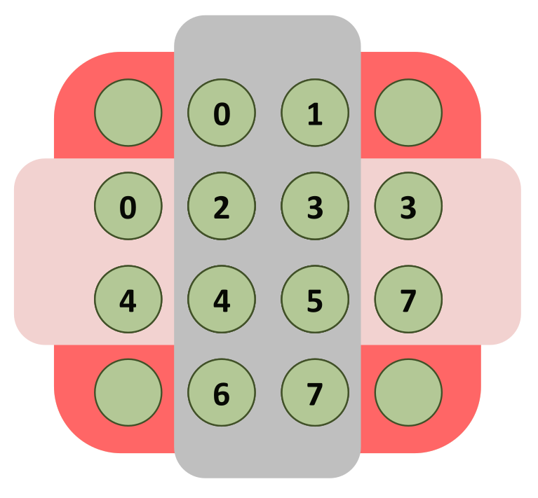

## Verteilter Speicher & Zustandsverwaltung

- **Shared Memory**: Komplexität durch **Shared State** (erfordert Locks, erzeugt Race Conditions).
- **Distributed Memory**: Jeder Prozess besitzt eigenen, physisch getrennten Speicher. Verbindung via **Interconnect Network**.
- **Lösungsansätze** (Vermeidung von geteiltem Zustand):
    - **Functional Programming**: Zustand strikt **unveränderlich (Immutable)** $\rightarrow$ keine Synchronisation nötig.
    - **Message Passing**: Zustand **isoliert und veränderbar (Isolated Mutable State)**.
- **Kommunikation im Message Passing**:
    - Kein Lesezugriff auf Variablen anderer Threads.
    - Kooperation exklusiv via **Nachrichten (Messages)**.
    - *Beispiel Verteilte Bank*: Jeder Thread führt lokales Budget, Überweisungen als Nachrichten.
    - **Performance**: Nachrichtenversand extrem teuer $\rightarrow$ Datenaustausch zwingend **grobgranular (coarse granularity)**.

## Grundlagen des Message Passing

- **Synchronous (Synchrones Senden)**:
    - Zwingende Blockierung des Senders bis zur kompletten Annahme durch Empfänger.
    - *Analogie*: Kühlschranklieferung (physische Übergabe nötig).
- **Asynchronous (Asynchrones Senden)**:
    - Sofortiges Weiterarbeiten nach Versand (**fire-and-forget**).
    - Zwischenspeicherung in Puffer beim Empfänger.
    - *Analogie*: Postkarte einwerfen.

## Message Passing Interface (MPI)

- **Definition**: HPC-Standard-API/-Bibliothek (C, C++, Java, Python, seit 1990ern).
    - Verbirgt Hardware-/Netzwerkdetails, hochgradig portabel.
    - KI/Deep Learning nutzt exakt selbe Konzepte via **CCL / NCCL** (Nvidia).
- **Communicators**:
    - Objekt zur Prozess-Gruppierung (Kommunikationskontext).
    - **`MPI_COMM_WORLD`**: Vordefinierter Standard-Kommunikator mit initial **allen** Anwendungsprozessen.
- **Rank**:
    - Eindeutige Prozess-ID im Communicator ($0$ bis $p-1$).
    - **Zentrale Eigenschaft**: Ein Prozess kann in mehreren Communicators mit **völlig unterschiedlichen Ranks** existieren.
- **SPMD (Single Program Multiple Data)**:
    - Ausführung desselben kompilierten Quellcodes auf allen Prozessen.
    - Kontrollfluss-Steuerung (`if/else`) basierend auf eigener **Rank-ID**.
- **Basisfunktionen**: Viele parallele Programme benötigen ausschliesslich diese Funktionen
	- **`MPI_INIT`**: Bibliotheks-Initialisierung (**zwingend erster Aufruf**).
	- **`MPI_COMM_SIZE`**: Liefert Gesamtanzahl Prozesse im Communicator.
	- **`MPI_COMM_RANK`**: Liefert eigene Prozess-ID im Communicator.
	- **`MPI_SEND`**: Blockierender Nachrichtenversand.
	- **`MPI_RECV`**: Blockierender Nachrichtenempfang.
	- **`MPI_FINALIZE`**: Internen Systemzustand aufräumen (**zwingend letzter Aufruf**).



## Senden & Empfangen in MPI

- **Argumente für `Send` / `Recv`**:
    - Speicherort (`buf`), Start-Index (`offset`) und Menge (`count`).
    - **Datentyp (`datatype`)**: Nur Basis-Typen (Int, Double). Keine komplexen Java-Objekte (manuelle Serialisierung nötig).
    - Ziel-Rank (`dest`) bzw. Quell-Rank (`src`).
    - **Message Tags**: ID zur Unterscheidung von Nachrichten zwischen gleichen Prozessen (z.B. Tag 1="Position", Tag 2="Farbe").
- **Funktions-Signatur (`Comm.Send`)**:

  ```java
  void Comm.Send(Object buf, int offset, int count, Datatype datatype, int dest, int tag)
  ```

- **Wildcards beim Empfangen**:
    - **`MPI_ANY_SOURCE`**: Empfängt nächste Nachricht von beliebigem Prozess.
    - **`MPI_ANY_TAG`**: Akzeptiert Nachricht unabhängig vom Tag.

## Blockierung

- **Begriffliche Trennung**:
    - **Synchronous / Asynchronous**: Globale Netzwerksicht $\rightarrow$ Synchronisation **zwischen Sender und Receiver**.
    - **Blocking / Non-blocking**: Lokale RAM-Sicht $\rightarrow$ Handhabung **zwischen Thread und lokalem Puffer**.
- **Verhalten lokaler Puffer-Synchronisation**:
    - **Blocking**: Rückkehr erst bei sicherem Überschreiben/Lesen des lokalen Puffers (Nachricht nicht zwingend beim Empfänger).
    - **Non-blocking** (**`Isend`** / **`Irecv`**): Sofortige Rückkehr (**immediate return**).
        - **Zwingende Regel**: Referenzierter Puffer während Übertragung **strikt unantastbar**.
        - Manuelle Abschlussprüfung zwingend (z.B. via **`Waitall`**).
- **Vorteil von Non-blocking**:
    - Erlaubt **Streaming / Pipelining** (Überlappung von Berechnung und Kommunikation).
    - Massive Laufzeitreduktion (essenziell für KI).

## Deadlocks & Best Practices in MPI

- **Gefahr von Default-Send (`MPI_Send`)**:
    - Synchronität ist **implementationsabhängig**!
    - Kleine Nachrichten: Asynchron (System puffert). Grosse Nachrichten: Zwingend synchron.
    - **Dringende Warnung**: Niemals auf Asynchronität von `MPI_Send` verlassen.
- **Zyklische Deadlocks**:
    - Code-Muster `Send(rechts); Recv(links)` auf allen Knoten $\rightarrow$ garantierter **Deadlock** bei grossen Nachrichten (Systempuffer voll, alle warten).
- **Lösungen & Best Practices**:
    - Code-Umordnung (Odd/Even) oder `MPI_Sendrecv` (kombiniert).
    - **Beste strukturelle Lösung**: Immer Non-blocking (**`Isend`** / **`Irecv`**) gepaart mit **`Waitall`** nutzen (verhindert Deadlocks architektonisch).
    - **Absolute Regel**: **`Bsend`** (Buffered Send) in der Praxis **niemals** nutzen.

## HPC-Kontext

- **Grenzen moderner Hardware (HPC)**:
    - **Dennard Scaling** beendet (Schmelzgefahr bei $>200$ Watt pro Chip).
    - Moore's Law drastisch verlangsamt.
    - Grösste Herausforderung: **Data Management** (Datenverschiebung als grösster Energiefresser).
- **Zukunft der Architekturen**:
    - Klassische Von-Neumann-Architekturen ineffizient ($70$ pJ pro Instruktion).
    - Fokus verlagert sich auf **Dataflow Architekturen** ($1-3$ pJ pro Instruktion) $\rightarrow$ Datenfluss statt Instruktionsfluss im Zentrum.
