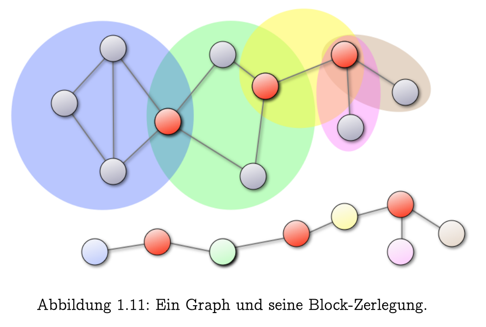
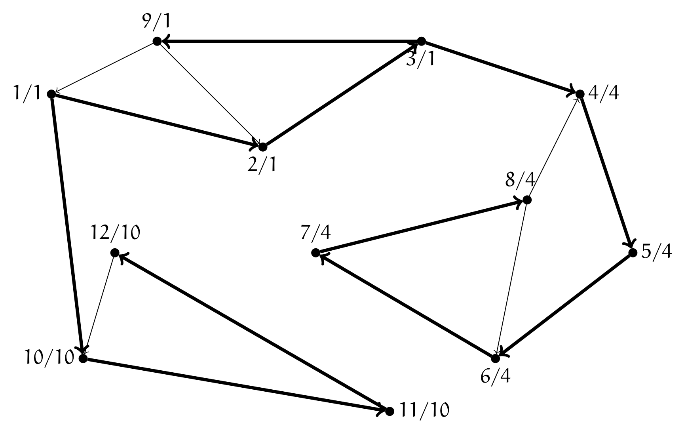

## Graphen-Zusammenhang und Separatoren

- **$u$-$v$-Separator**: Knotenmenge $X \subseteq V \setminus \{u,v\}$; Entfernung trennt $u$ und $v$ (verschiedene Zusammenhangskomponenten).
- **$k$-zusammenhängend** ($k$-connected): Entfernung von $\ge k$ Knoten nötig für Trennung des Graphen [^def1.23].
	- **Mindestgrösse**: $|V| \ge k+1$. (Verhindert Trivialfall: Vollständiger Graph $K_{k}$ kann durch Knotenlöschung nicht getrennt werden, da nicht genug Knoten existieren).
	- Existenz von Knoten mit $\deg(v) < k \implies$ Graph **nicht** $k$-zusammenhängend (Entfernung aller Nachbarn reicht zur Trennung).
- **$k$-kanten-zusammenhängend** ($k$-edge-connected): Entfernung von $\ge k$ Kanten nötig für Trennung des Graphen [^def1.24].
	- **$u$-$v$-Kanten-Separator**: Kantenmenge, deren Entfernung $u$ und $v$ trennt.

## Satz von Menger

- **Knoten-Version**: $u$-$v$-Separator der Mindestgrösse $k \iff$ $\ge k$ **intern-knotendisjunkte** $u$-$v$-Pfade [^satz1.25].
	- *Alle-Knoten-Version*: Graph $k$-zusammenhängend $\iff \ge k$ intern-knotendisjunkte Pfade zwischen *allen* Knotenpaaren.
- **Kanten-Version**: $u$-$v$-Kantenseparator der Mindestgrösse $k \iff$ $\ge k$ **kantendisjunkte** $u$-$v$-Pfade [^satz1.25].
- **Hierarchie-Ungleichung** (stets gültig):
	- **Knoten-Zusammenhang $\le$ Kanten-Zusammenhang $\le$ minimaler Knotengrad**
	- *Begründung*: Knotenlöschung eliminiert immer auch alle inzidenten Kanten.

## Artikulationsknoten und Brücken

- Fokus auf Spezialfall $k=1$.
- **Artikulationsknoten** (cut vertex): Knoten $v$; Löschung zerfällt Graph in mehr Komponenten.
- **Brücke** (cut edge): Kante $e$; Löschung zerfällt Graph in mehr Komponenten.
- **Zusammenhang**:
	- Kante $\{x,y\}$ ist Brücke $\implies x$ ist Artikulationsknoten **oder** $\deg(x) = 1$ (Blatt).
	- *Achtung*: Umkehrung falsch! Artikulationsknoten impliziert keine Brücke (z.B. zwei Dreiecke mit gemeinsamem Knoten).

## Block-Zerlegung

- **Äquivalenzrelation** (**KANTEN**): $e \sim f \iff e=f$ oder gemeinsamer Kreis durch $e$ und $f$ [^def1.29].
	- *Transitivitäts-Beweis*: Menger-Satz (Mittelknoten auf Kanten einfügen $\implies$ 2 disjunkte Pfade finden).
- **Block** (biconnected component): Äquivalenzklasse der Relation (einzelne Brücke oder 2-zusammenhängende Komponente).
- **Schnittpunkte**: Maximal **ein** Artikulationsknoten als Schnittmenge zweier Blöcke.
- **Block-Graph** $T$:
	- Bipartit: Knotenmengen $A$ (Artikulationsknoten) und $B$ (Blöcke).
	- Kanten: $a \in A$ verbunden mit $b \in B \iff a$ liegt in $b$.
	- *Eigenschaft*: Zusammenhängender Graph $\implies$ Block-Graph ist **immer ein Baum**.
	- *Anwendung*: Graph-Zerlegung (z.B. Tunnel als Brücken) für Divide-and-Conquer (z.B. kürzeste Wege).

## Tiefensuche (DFS) für Artikulationsknoten & Brücken (Algorithmus von Tarjan)

- **Grundlagen** (Depth-First Search): Stack-basiert (LIFO), nutzt Backtracking.
- **Kanten-Klassifikation** (ungerichtete Graphen):
	1. **Baumkanten** (tree edges): Führen zu unbesuchten Knoten (`dfs`-Nummer aufsteigend).
	2. **Restkanten** (back edges): Führen zu besuchten Vorfahren (`dfs`-Nummer absteigend). *Tipp*: Niemals Brücken!
- **Variablen**:
	- `dfs[v]`: Entdeckungszeitpunkt (fortlaufende Nummerierung).
	- `low[v]`: Kleinste `dfs`-Nummer, erreichbar via Baumkanten (abwärts) und **max. 1** Restkante (am Pfadende, aufwärts).
- **Algorithmus-Ablauf** (Pseudocode-Logik):
	- Globale Zeit `num = 0`.
	- Start `DFS-Visit(v)` für unbesuchte Knoten:
		1. `num++`, Zuweisung `dfs[v] = num` und Initialisierung `low[v] = num`.
		2. **Für alle Nachbarn $w$** von $v$:
			- **Fall A: $w$ unbesucht** (Baumkante):
				- Rekursiver Aufruf `DFS-Visit(w)`.
				- *Backtracking-Update*: `low[v] = min(low[v], low[w])`.
				- *Brücken-Test*: Falls `low[w] > dfs[v]` $\implies$ Baumkante $(v,w)$ ist **Brücke**!
				- *Artikulationsknoten-Test*: Falls $v \neq root$ und `low[w] >= dfs[v]` $\implies v$ ist **Artikulationsknoten**!
			- **Fall B: $w$ besucht & $w \neq$ Elternknoten** (Restkante):
				- *Restkanten-Update*: `low[v] = min(low[v], dfs[w])`.
		3. **Sonderfall Wurzel**: $root$ ist Artikulationsknoten $\iff \ge 2$ Kinder im DFS-Baum (wird separat am Ende geprüft).
- **Laufzeit**: Alle Artikulationsknoten und Brücken in linearer Zeit $O(|V|+|E|)$ bzw. $O(|E|)$ bei zusammenhängenden Graphen berechenbar [^satz1.27] [^satz1.28].

[^def1.23]: Definition 1.23. Ein Graph $G = (V, E)$ heisst $k$-zusammenhängend, falls $|V| \ge k + 1$ und für alle Teilmengen $X \subseteq V$ mit $|X| < k$ gilt: Der Graph $G[V \setminus X]$ ist zusammenhängend.
[^def1.24]: Definition 1.24. Ein Graph $G = (V, E)$ heisst $k$-kanten-zusammenhängend, falls für alle Teilmengen $X \subseteq E$ mit $|X| < k$ gilt: Der Graph $(V, E \setminus X)$ ist zusammenhängend.
[^satz1.25]: Satz 1.25 (Menger). Sei $G = (V, E)$ ein Graph und $u, v \in V, u \neq v$. Dann gilt: a) Jeder $u$-$v$-Knotenseparator hat Grösse mindestens $k \iff$ Es gibt mindestens $k$ intern-knotendisjunkte $u$-$v$-Pfade. b) Jeder $u$-$v$-Kantenseparator hat Grösse mindestens $k \iff$ Es gibt mindestens $k$ kantendisjunkte $u$-$v$-Pfade.
[^def1.29]: Definition/Proposition 1.29. Sei $G = (V, E)$ ein zusammenhängender Graph. Für $e, f \in E$ definieren wir eine Relation durch $e \sim f :\iff e = f$ oder es gibt einen gemeinsamen Kreis durch $e$ und $f$. Dann ist diese Relation eine Äquivalenzrelation. Wir nennen die Äquivalenzklassen Blöcke.
[^satz1.27]: Satz 1.27. Für zusammenhängende Graphen $G = (V, E)$, die mit Adjazenzlisten gespeichert sind, kann man in Zeit $O(|E|)$ alle Artikulationsknoten berechnen.
[^satz1.28]: Satz 1.28. Für zusammenhängende Graphen $G = (V, E)$, die mit Adjazenzlisten gespeichert sind, kann man in Zeit $O(|E|)$ alle Artikulationsknoten und alle Brücken berechnen.
