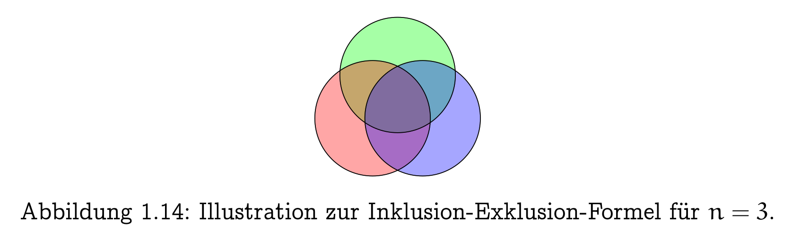
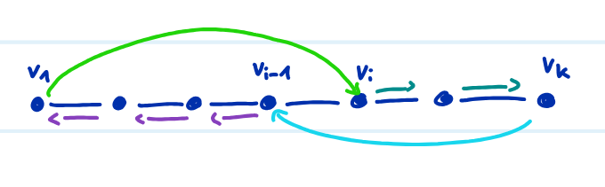
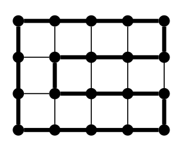
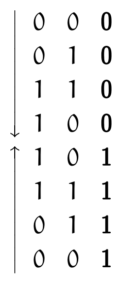
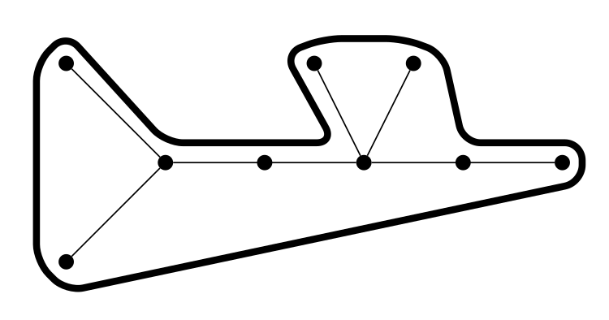

## Eulertouren

- **Grundkonzept**: Geschlossener Weg, der jede Kante exakt einmal besucht [^def1.30].
- **Charakterisierung**:
    - Ein zusammenhängender Graph ist exakt dann **eulersch** (enthält eine Eulertour), wenn der Grad **jedes** Knotens gerade ist [^satz1.31].
    - **Eulerweg** (Startknoten $\neq$ Endknoten): Existiert genau dann, wenn exakt 0 oder 2 Knoten einen ungeraden Grad aufweisen.
- **Algorithmus von Hierholzer (Schildkröte und Läufer)**:
    - Findet Eulertour in linearer Zeit $O(|E|)$ [^satz1.31].
    - **Läufer (schnell)**: Startet beliebig, wählt unbesuchte Kanten, löscht diese, stoppt in isoliertem Knoten $\implies$ bildet Kreis (wegen gerader Grade).
    - **Schildkröte (langsam)**: Läuft Kreis ab. Bei Knoten mit unbesuchten Kanten $\implies$ Läufer startet erneut für Unter-Kreis.
    - Unter-Kreise werden in Hauptkreis integriert.

## Siebformel (Inklusion/Exklusion)

- **Prinzip**: Kombinatorische Zählmethode für die Vereinigung von Mengen [^satz1.35].
- **Spezialfall $n=2$**: $|A_1 \cup A_2| = |A_1| + |A_2| - |A_1 \cap A_2|$.
- **Intuition**: Elemente in der Schnittmenge ($A_1 \cap A_2$) werden bei der simplen Addition doppelt gezählt und müssen daher einmal subtrahiert werden.

## Hamiltonkreise

- **Grundkonzept**: Kreis, der jeden Knoten des Graphen exakt einmal besucht [^def1.32].
    - Keine einfache Charakterisierung via Knotengrad.
    - **Ja-Instanz**: Zertifikat leicht (Kreis zeigen).
    - **Nein-Instanz**: Beweis meist extrem schwer (Bsp: Petersen-Graph = nein, Ikosaeder-Graph = ja).
- **Komplexität**: Finden ist **NP-vollständig**.
- **Satz von Dirac** (1952):
    - Graph mit $\ge 3$ Knoten und Minimalgrad $\delta(G) \ge |V|/2 \implies$ zwingend hamiltonsch [^satz1.40].
    - Schranke strikt bestmöglich (Gegenbeispiele bei $|V|/2 - 0.5$).
    - **Beweisidee**:
	    1. Nehme an kein Hamiltonkreis existiert.
	    2. Betrachte **längstem Pfad** $P = \langle v_1, \dots, v_k \rangle$
        3. **Fall A (Verlängerbar)**: Endknoten $v_1$ oder $v_k$ hat Nachbar ausserhalb von $P \implies$ Pfad verlängerbar (Widerspruch zur Maximalität).
        4. **Fall B (Kreisschluss - schwieriger Teil)**: Alle Nachbarn von $v_1$ und $v_k$ liegen zwingend auf $P$.
            1. Betrachte Nachbarn von $v_1$: $N(v_1)$.
            2. Betrachte **direkte Nachfolger** der Nachbarn von $v_k$ auf dem Pfad: $N_k^+ := \{v_{i+1} \mid v_i \in N(v_k)\}$.
            3. Mengen haben Grössen $|N(v_1)| \ge n/2$ und $|N_k^+| \ge n/2$. Summe ist $> n$.
            4. **Siebformel** ($n=2$): Schnittmenge $N(v_1) \cap N_k^+$ zwingend nicht leer. Es existiert gemeinsamer Knoten $v_j$.
            5. **Überkreuzung**: $v_1$ mit $v_j$ verbunden, $v_k$ mit Vorgänger $v_{j-1}$ verbunden.
            6. Schliesst den Pfad zu einem validen $k$-Kreis.
				
        5. Da Graph zusammenhängend: Aus $k$-Kreis ($k < n$ da sonst ein Hamiltonkreis) resultiert neuer $(k+1)$-Pfad $\implies$ Pfad verlängerbar (Widerspruch zur Maximalität).
        6. Da immer Widerspruch muss ein Hamiltonkreis existieren.

## Spezialfälle für Hamiltonkreise

- **Bipartite Graphen**: $|A| \neq |B| \implies$ prinzipiell kein Hamiltonkreis [^lemma1.38] (Kreis alterniert zwingend streng zwischen $A$ und $B$).
- **Gittergraphen $M_{m,n}$** ($m \times n$ Gitter):
    - Hamiltonkreis $\iff$ Knotenzahl $m \cdot n$ **gerade**.
    - **Beweis Nein**: Bipartit (Schachbrett). Ungerade Knotenzahl $\implies$ ungleiche Farbverteilung (unmöglich).
    - **Beweis Ja**: Konstruktiv via "Schlangenlinien"-Muster.
      
- **Hyperwürfel $H_d$**:
    - Hamiltonkreis für alle $d \ge 2$.
    - **Anwendung (Gray-Code)**: Binäres Zählsystem (z.B. Rotary Encoders). Benachbarte Codes unterscheiden sich in exakt $1$ Bit (entspricht Kante im $H_d$). Verhindert mechanische Auslesefehler, die bei simultanem Wechsel mehrerer Bits entstehen.
      

## Algorithmen für Hamiltonkreise

- **Brute-Force**: $\approx n!$ Prüfungen. Identität $O(n^n) \implies$ extrem ineffizient (Limit bei $n \approx 25$).
- **Dynamische Programmierung (DP)**:
    - **Tabelle $P_{S,x}$**: $=1$, falls Pfad von Start $1$ zu Ende $x$ existiert, der **exakt** Menge $S \subseteq V$ besucht, sonst $0$.
    - **Initialisierung**: Für $S=\{1, x\} \implies P_{S,x} = 1 \iff \{1, x\} \in E$.
    - **Rekursion**: $s = 3 \dots n \implies P_{S,x} = \max \{ P_{S \setminus \{x\}, y} \mid y \in N(x) \cap S, y \neq 1 \}$.
        - **Erklärung Formel**: Prüft Existenz einer gültigen Vorgänger-Teillösung ($P_{S \setminus \{x\}, y}$). Vorgänger $y$ muss direkter Nachbar von $x$ sein ($y \in N(x)$), bereits im Set liegen ($y \in S$) und darf nicht der Fix-Startknoten $1$ sein. $\max$ ergibt $1$, falls mindestens ein solcher Weg existiert.
    - **Laufzeit/Speicher**: Reduziert auf $\approx n^2 \cdot 2^n$ Zeit, $\approx n \cdot 2^n$ Speicher [^satz1.34] (machbar bis $n \approx 84$).
- **Speicher-Optimierung via Siebformel**:
    - **Anzahl Hamiltonkreise zählen** statt explizit Pfade speichern [^satz1.35].
    - Reduziert Speicherbedarf drastisch auf $O(n^2)$, erhöht Zeit leicht auf $O(n^{2.81} \log n \cdot 2^n)$ [^satz1.36].

## Travelling Salesman Problem (TSP)

- **Definition**: Vollständiger Graph $K_n$, Längenfunktion $\ell$ (Kantengewichte). Gesucht: Kürzeste Rundreise (Hamiltonkreis mit min. Gewicht).
- **Komplexität**: NP-vollständig.
    - **Reduktion von Hamiltonkreis**: Graph $G \to K_n$. Existente Kanten aus $G \to$ Gewicht $0$. Nicht-existente Kanten $\to$ Gewicht $1$.
    - $G$ hamiltonsch $\iff$ optimale TSP-Lösung hat Gewicht exakt $0$.
- **Inapproximierbarkeit**: Kein polynomieller $\alpha$-Approximationsalgorithmus ($\alpha > 1$) für allgemeines TSP möglich (ausser $P=NP$) [^satz1.42]. Grund: $\alpha \cdot 0 = 0 \implies$ würde Hamiltonkreis exakt entscheiden.

## Metrisches TSP

- **Bedingung**: Längenfunktion $\ell$ erfüllt **Dreiecksungleichung** ($\ell(x, z) \le \ell(x, y) + \ell(y, z)$). Direkter Weg $\le$ Umweg. (Bleibt NP-vollständig).
- **2-Approximation**: Findet polynomiell Rundreise $C$ mit $\ell(C) \le 2 \cdot \text{opt}(K_n, \ell)$ [^satz1.43].
- **Ablauf**:
    1. **MST berechnen**: Minimaler Spannbaum $T \implies \ell(T) \le \text{opt}$ (Opt. Kreis minus Kante = Spannbaum $\ge$ MST).
    2. **Kanten verdoppeln**: $T$ verdoppeln $\implies$ Gewicht $2\ell(T) \le 2\text{opt}$. Jeder Knoten hat nun **geraden Grad**.
    3. **Eulertour finden**: Wegen gerader Grade existiert Eulertour $W \implies \ell(W) = 2\ell(T) \le 2\text{opt}$.
    4. **Shortcutting (Abkürzungen)**: $W$ ablaufen. Bereits besuchte Knoten direkt zum nächsten unbesuchten Knoten überspringen. (Bei TSP Graph immer vollständig)
    5. **Fazit**: Resultierender Hamiltonkreis $C$ wird wegen Dreiecksungleichung durch Abkürzungen nie länger $\implies \ell(C) \le \ell(W) \le 2\text{opt}$.

[^def1.30]: Definition 1.30. Eine Eulertour in einem Graphen $G = (V, E)$ ist ein geschlossener Weg (Zyklus), der jede Kante des Graphen genau einmal enthält. Enthält ein Graph eine Eulertour, so nennt man ihn eulersch.
[^satz1.31]: Satz 1.31. a) Ein zusammenhängender Graph $G = (V, E)$ ist genau dann eulersch, wenn der Grad aller Knoten gerade ist. b) In einem zusammenhängenden, eulerschen Graphen kann man eine Eulertour in Zeit $O(|E|)$ finden.
[^satz1.35]: Satz 1.35. (Siebformel, Prinzip der Inklusion/Exklusion) Für endliche Mengen $A_1, \dots, A_n$ ($n \ge 2$) gilt: $|\bigcup_{i=1}^n A_i| = \sum_{l=1}^n (-1)^{l+1} \sum_{1 \le i_1 < \dots < i_l \le n} |A_{i_1} \cap \dots \cap A_{i_l}| = \sum_{i=1}^n |A_i| - \sum_{1 \le i_1 < i_2 \le n} |A_{i_1} \cap A_{i_2}| + \sum_{1 \le i_1 < i_2 < i_3 \le n} |A_{i_1} \cap A_{i_2} \cap A_{i_3}| - \dots + (-1)^{n+1} \cdot |A_1 \cap \dots \cap A_n|$.
[^def1.32]: Definition 1.32. Ein Hamiltonkreis in einem Graphen $G = (V, E)$ ist ein Kreis, der alle Knoten von $V$ genau einmal durchläuft. Enthält ein Graph einen Hamiltonkreis, so nennt man ihn hamiltonsch.
[^satz1.40]: Satz 1.40 (Dirac). Wenn $G = (V, E)$ ein Graph mit $|V| \ge 3$ Knoten ist, in dem jeder Knoten mindestens $|V|/2$ Nachbarn hat, dann ist $G$ hamiltonsch.
[^lemma1.38]: Lemma 1.38. Ist $G = (A \uplus B, E)$ ein bipartiter Graph mit $|A| \neq |B|$, so kann $G$ keinen Hamiltonkreis enthalten.
[^satz1.34]: Satz 1.34. Algorithmus Hamiltonkreis ist korrekt und benötigt Speicher $O(n \cdot 2^n)$ und Laufzeit $O(n^2 \cdot 2^n)$, wobei $n = |V|$.
[^satz1.36]: Satz 1.36. Der Algorithmus Zähle_Hamiltonkreise berechnet die Zahl der Hamiltonkreise in $G = (V, E)$ und benötigt Speicher $O(n^2)$ und Laufzeit $O(n^{2.81} \log n \cdot 2^n)$, wobei $n = |V|$.
[^satz1.42]: Satz 1.42. Gibt es für ein $\alpha > 1$ einen $\alpha$-Approximationsalgorithmus für das Travelling Salesman Problem mit Laufzeit $O(f(n))$, so gibt es auch einen Algorithmus, der für alle Graphen auf $n$ Knoten in Laufzeit $O(f(n))$ entscheidet, ob sie hamiltonsch sind.
[^satz1.43]: Satz 1.43. Für das Metrische Travelling Salesman Problem gibt es einen 2-Approximationsalgorithmus mit Laufzeit $O(n^2)$.
