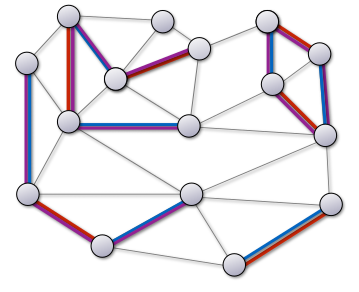
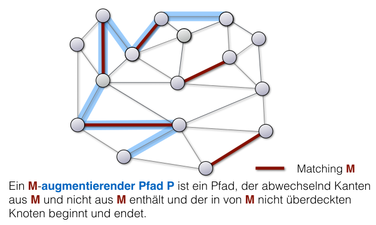
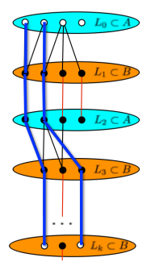

## Matchings: Grundlagen und Begriffe

- **Matching** $M$: Kanten-Teilmenge; kein Knoten zu $>1$ Kante inzident ($e \cap f = \emptyset$) [^def1.44].
- **Überdeckt** (covered): Knoten ist Teil einer Matching-Kante [^def1.44].
- **Perfektes Matching**: Alle Knoten überdeckt ($|M| = |V|/2$).
- **Arten der Maximalität**:
	- **Inklusionsmaximal** (maxim**al** matching): Keine Kante aus $E \setminus M$ konfliktfrei hinzufügbar [^def1.46].
	- **Kardinalitätsmaximal** (maxim**um** matching): Global grösstmögliches Matching ($|M| \ge |M'|$ für alle $M'$) [^def1.46].
	- *Hinweis*: kardinalitätsmaximal $\implies$ inklusionsmaximal (Umkehrung gilt nicht).

## Greedy-Algorithmus für Matchings

- **Ablauf**: Iterative Wahl beliebiger Kante $e \in E \to$ Aufnahme in $M \to$ Löschen aller inzidenten Kanten.
- **Eigenschaften** [^satz1.47]:
	- Laufzeit: $O(|E|)$.
	- Resultat: Zwingend **inklusionsmaximales** Matching $M_{Greedy}$.
	- **Güte-Schranke**: $|M_{Greedy}| \ge \frac{1}{2} |M_{max}|$.
- **Beweisidee Hilfsgraph** (Lecture 5, Slide 14):
	- Inklusionsmaximalität $\implies$ jeder $M_{max}$-Kante fehlt mindestens ein Endpunkt (bereits von $M_{Greedy}$ überdeckt).
	- Eine $M_{Greedy}$-Kante blockiert an ihren 2 Endpunkten max. 2 $M_{max}$-Kanten $\implies 2 |M_{Greedy}| \ge |M_{max}|$.

## Satz von Hall und Frobenius (Bipartite Graphen)

- **Satz von Hall (Heiratssatz)**: Bipartiter Graph $G = (A \uplus B, E)$ hat Matching der Grösse $|A| \iff$ jede Teilmenge $X \subseteq A$ hat min. $|X|$ Nachbarn ($|N(X)| \ge |X|$) [^satz1.52].
	- *Beweis $\implies$ (Notwendigkeit)*: Trivial (jeder Knoten in $X$ braucht exklusiven Partner in $B$).
	- *Beweis $\Longleftarrow$ (Induktion über $|A|$)* (Lecture 5, Slide 5-6):
		- **Fall 1**: $|N(X)| > |X|$ für alle echten Teilmengen. Kantenlöschung erhält Bedingung $\implies$ Induktion.
		- **Fall 2**: $\exists X_0$ mit exakt $|N(X_0)| = |X_0|$. Graph zerfällt in zwei separate Hall-Graphen ($X_0 \cup N(X_0)$ und Rest).
- **Korollar von Frobenius**: Jeder **$k$-reguläre bipartite Graph** enthält perfektes Matching [^satz1.53].
	- **Bipartit essenziell!** (Gegenbeispiel: 3-regulärer ungerader Zyklus enthält keines) (Lecture 5, Slide 11).
	- Graph exakt partitionierbar in $k$ disjunkte perfekte Matchings.
- **Berechnung in $2^k$-regulären bipartiten Graphen** [^satz1.54]:
	- Perfektes Matching in $O(|E|)$ findbar.
	- *Trick*: Eulertour berechnen $\to$ jede 2. Kante löschen $\to$ halbiert Knotengrade exakt ($k \to k-1$).
	- *Laufzeitanalyse (Geometrische Reihe)*: Eulertour-Suche kostet $O(|E_{aktuell}|)$. Da pro Iteration die Hälfte aller Kanten gelöscht wird, halbiert sich der Aufwand stetig. Die Summe konvergiert ($|E| + |E|/2 + |E|/4 \dots \le 2|E|$) $\implies$ Gesamtlaufzeit echt $O(|E|)$ (Lecture 5, Slide 12).

## Augmentierende Pfade

- **Exklusive Disjunktion (XOR) $M_1 \oplus M_2$**: Kanten in exakt **einem** der beiden Matchings.
  
	- **Überdeckung**: Jeder Knoten in $M_1 \oplus M_2$ hat Grad $\le 2$ (berührt max. 1 Kante aus $M_1$ und max. 1 Kante aus $M_2$).
	- Teilgraph zerfällt in knotendisjunkte **Pfade** und **Kreise** (Kreise zwingend von gerader Länge).
- **Augmentierender Pfad** $P$: Pfad, der in unüberdeckten Knoten startet/endet und strikt zwischen ungematchten/gematchten Kanten alterniert.
  
	- Länge zwingend **ungerade**.
	- **Vergrösserung**: Kanten-Tausch entlang $P$ ($M' := M \oplus P$) erhöht Matching-Grösse exakt um 1.
- **Satz von Berge**: Matching nicht kardinalitätsmaximal $\iff$ augmentierender Pfad existiert [^satz1.48].
	- *Beweis*: Bei $|M_2| > |M_1|$ enthält $M_1 \oplus M_2$ zwingend Pfade mit mehr $M_2$- als $M_1$-Kanten $\implies$ augmentierende Pfade für $M_1$.

## Algorithmen für Bipartite Matchings

- **BFS für alternierende Pfade** (Einzelpfad-Suche):
	- **Start**: Layer $L_0$ = alle **unüberdeckten Knoten aus $A$**.
	- **Layer-Aufbau**:
		- Ungerade Layer ($L_1, L_3 \dots$): via Kanten $\notin M$ ($A \to B$).
		- Gerade Layer ($L_2, L_4 \dots$): via Kanten $\in M$ ($B \to A$, Weg eindeutig).
	- **Abbruch**: Unüberdeckter Knoten in $L_i$ gefunden $\implies$ Backtracking liefert **kürzesten augmentierenden Pfad**.
	- Laufzeit: $O(|V| + |E|)$ (Lecture 5, Slide 21).
- **Algorithmus von Hopcroft und Karp** (Verbesserung):
	- **Ziel**: Reduzierte Augmentierungs-Durchläufe (mehrere disjunkte Pfade pro Iteration).
	- **Ablauf**:
		1. BFS findet Länge $k$ des kürzesten augmentierenden Pfades.
		2. **DFS** auf Layer-Graphen sucht **inklusionsmaximale Menge disjunkter Pfade** der Länge $k$ (Knoten sofort gelöscht $\implies$ lineare Zeit).
		3. $M$ simultan mit allen gefundenen Pfaden augmentieren.
	- **Pfadlängen-Zunahme** (Beweisidee) (Lecture 6, Slide 7):
		- Nach Augmentierung mit inklusionsmaximaler Menge kürzester Pfade muss nächster Pfad **strikt länger** sein.
		- Überschneidung neuer Pfade mit alten geschieht zwingend an **Kante** $\implies$ Pfadlänge wächst (XOR-Beweis).
	- **Laufzeit**: Max. $\sqrt{|V|}$ BFS-Durchläufe nötig [^satz1.49]. Gesamtlaufzeit extrem schnell in $O(\sqrt{|V|} \cdot (|V| + |E|))$ [^satz1.49].
	- *(Allgemeine Graphen: Micali-Vazirani / Gabow-Tarjan schrumpfen "Blossoms" in gleicher asymptotischer Zeit).*

## Christofides-Algorithmus (Metrisches TSP)

- **Problem**: Minimale Hamilton-Tour in $K_n$, Kantengewichte erfüllen **Dreiecksungleichung** (Abkürzung $\le$ Umweg).
- **Ergebnis**: **1.5-Approximation** [^satz1.51] (Lecture 6, Slide 17-29).
- **Ablauf**:
	1. **Minimaler Spannbaum (MST)** $T$ berechnen ($c(T) \le \text{opt}$).
	2. Knotenmenge $X$ mit **ungeradem Grad** in $T$ identifizieren (Nach **Handschlaglemma** $\sum \deg = 2|E|$ zwingend **gerade Anzahl**).
	3. **Minimales perfektes Matching** $M$ auf $X$-induziertem $K_n$ berechnen ($O(n^3)$ [^satz1.50]).
	4. Multigraph $T \uplus M$ bilden (alle Knoten haben nun **geraden Grad**).
	5. Eulertour finden und mit **Shortcuts** durchlaufen $\implies$ Hamiltonkreis $C$.
- **Beweis Güteschranke** $c(C) \le 1.5 \text{opt}$:
	- Optimale TSP-Tour auf $X$ kostet $\le \text{opt}$ (Dreiecksungleichung).
	- Kreis der Länge $|X|$ (gerade) zerfällt in exakt **zwei disjunkte Matchings**.
	- Summe beider Matchings $\le \text{opt} \implies$ das billigere kostet $\le 0.5 \text{opt}$.
	- Da Algorithmus minimales Matching wählt: $c(M) \le 0.5 \text{opt}$.
	- Gesamtkosten: $c(C) \le c(T) + c(M) \le 1.5 \text{opt}$.

[^def1.44]: Definition 1.44. Eine Kantenmenge $M \subseteq E$ heisst Matching in einem Graphen $G = (V, E)$, falls kein Knoten des Graphen zu mehr als einer Kante aus $M$ inzident ist, oder formal ausgedrückt, wenn $e \cap f = \emptyset$ für alle $e, f \in M$ mit $e \neq f$. Man sagt ein Knoten $v$ wird von $M$ überdeckt, falls es eine Kante $e \in M$ gibt, die $v$ enthält. Ein Matching $M$ heisst perfektes Matching, wenn jeder Knoten durch genau eine Kante aus $M$ überdeckt wird, oder, anders ausgedrückt, wenn $|M| = |V|/2$.
[^def1.46]: Definition 1.46. Sei $G = (V, E)$ ein Graph und $M$ ein Matching in $G$. $M$ heisst inklusionsmaximal, falls gilt $M \cup \{e\}$ ist kein Matching für alle Kanten $e \in E \setminus M$. $M$ heisst kardinalitätsmaximal, falls gilt $|M| \ge |M'|$ für alle Matchings $M'$ in $G$.
[^satz1.47]: Satz 1.47. Der Algorithmus Greedy-Matching bestimmt in Zeit $O(|E|)$ ein inklusionsmaximales Matching $M_{Greedy}$ für das gilt: $|M_{Greedy}| \ge \frac{1}{2} |M_{max}|$, wobei $M_{max}$ ein kardinalitätsmaximales Matching sei.
[^satz1.52]: Satz 1.52 (Satz von Hall, Heiratssatz). Für einen bipartiten Graphen $G = (A \uplus B, E)$ gibt es genau dann ein Matching $M$ der Kardinalität $|M| = |A|$, wenn gilt $|N(X)| \ge |X|$ für alle $X \subseteq A$.
[^satz1.53]: Satz 1.53. Sei $G = (A \uplus B, E)$ ein $k$-regulärer bipartiter Graph. Dann gibt es $M_1, \dots, M_k$ so dass $E = M_1 \uplus \dots \uplus M_k$ und alle $M_i, 1 \le i \le k$, perfekte Matchings in $G$ sind.
[^satz1.54]: Satz 1.54. Ist $G = (V, E)$ ein $2^k$-regulärer bipartiter Graph, so kann man in Zeit $O(|E|)$ ein perfektes Matching bestimmen.
[^satz1.48]: Satz 1.48 (Satz von Berge). Ist $M$ ein Matching in einem Graphen $G = (V, E)$, das nicht kardinalitätsmaximal ist, so existiert ein augmentierender Pfad zu $M$.
[^satz1.49]: Satz 1.49. Der Algorithmus von Hopcroft und Karp durchläuft die while-Schleife nur $O(\sqrt{|V|})$ Mal. Er berechnet daher ein maximales Matching in einem bipartiten Graphen in Zeit $O(\sqrt{|V|} \cdot (|V| + |E|))$.
[^satz1.51]: Satz 1.51. Für das Metrische Travelling Salesman Problem gibt es einen 3/2-Approximationsalgorithmus mit Laufzeit $O(n^3)$.
[^satz1.50]: Satz 1.50. Ist $n$ gerade und $\ell : \binom{[n]}{2} \to \mathbb{N}_0$ ein Gewichtsfunktion des vollständigen Graphen $K_n$, so kann man in Zeit $O(n^3)$ ein minimales perfektes Matching finden, also ein perfektes Matching $M$ mit $\sum_{e \in M} \ell(e) = \min \{ \sum_{e \in M'} \ell(e) \mid M' \text{ perfektes Matching in } K_n \}$.
