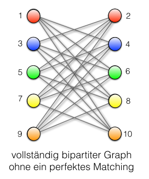

## Grundlagen & Definitionen

- **Formalia**:
    - **Knotenfärbung** (engl. *vertex colouring*): Abbildung $c: V \to [k]$, sodass $c(u) \neq c(v)$ für alle $\{u, v\} \in E$ [^def1.56].
    - **Chromatische Zahl** $\chi(G)$: Minimale Anzahl Farben für eine gültige Färbung [^def1.56].
- **Strukturelle Entsprechungen**:
    - **$k$-partit**: Graph mit $\chi(G) \le k$.
    - **Independent Set** (Stabile Menge): Knotenmenge ohne interne Kanten; jede Farbklasse bildet ein Independent Set.
    - **Gegenteil**: Matchings (benachbarte Knoten werden getrennt statt gekoppelt).
- **Anwendungen** (Lecture 7):
    - **Timetabling** (Prüfungsplan): Knoten = Kurse, Kanten = Konflikte (simultane Belegung).
    - **Registerallokation**: Knoten = Variablen, Kanten = gleichzeitige Nutzung im Prozessor.
    - **Funknetzwerke**: Knoten = Sender, Farben = Frequenzen (Vermeidung von Interferenz).

## Klassifizierung & Komplexität

- **Bipartite Graphen** ($\chi(G) \le 2$):
    - Äquivalent zu: Graph enthält keine **ungeraden Kreise** [^satz1.58].
    - Test: via **Breitensuche (BFS)** in $O(|V| + |E|)$ (alternierendes Färben).
- **Planare Graphen**:
    - Kreuzungsfrei in Ebene zeichenbar.
    - **Vierfarbensatz**: Immer mit $\le 4$ Farben färbbar [^satz1.59] (Beweis via massiver Computerhilfe).
    - Eigenschaft: Jeder induzierte Teilgraph enthält Knoten mit $\deg(v) \le 5$.
- **Theoretische Grenzen**:
    - **Komplexität**: $\chi(G) \le k$ prüfen ist für $k \ge 3$ **NP-vollständig**.
    - **Approximierbarkeit**: Keine effiziente $n^{1-\epsilon}$-Approximation möglich.
    - **Keine Lokalität**: Färbung ist globales Problem. **Mycielski-Konstruktion** zeigt: Es existieren dreiecksfreie Graphen mit beliebig hohem $\chi(G)$ [^satz1.66].

## Algorithmen & Heuristiken

- **Greedy-Algorithmus**:
    - Ablauf: Färbe Knoten in fixer Reihenfolge mit kleinster verfügbarer Farbe.
    - Güte: Benötigt maximal **$\Delta(G) + 1$** Farben [^satz1.60].
    - Pech-Fall: Ungünstige Reihenfolge in bipartiten Graphen kann zu $|V|/2$ Farben führen.
      
- **Min-Degree Heuristik** [^satz1.65]:
    - Strategie: Knoten mit kleinstem Grad zuletzt färben (iteratives Löschen).
    - Resultat: $\chi(G) \le \max_{H \subseteq G} \delta(H) + 1$.
    - Bäume: Findet immer 2-Färbung (da Blätter mit $\deg=1$ existieren).
    - Planare Graphen: Findet immer $\le 6$ Farben. (da planar $\implies$ ein Knoten mit Grad $\le 5$)
    - **BFS-Trick**: In zshgd. Graphen mit $\deg(v) < \Delta(G)$ liefert Färben in **umgekehrter Entdeckungsreihenfolge** (Startknoten $v$ zuletzt) eine $\Delta(G)$-Färbung.
- **Satz von Brooks** [^satz1.64]:
    - Jeder zshgd. Graph $G \notin \{K_n, C_{2n+1}\}$ ist mit **$\Delta(G)$** Farben färbbar.
    - Algorithmus nutzt Farbtausch an Artikulationsknoten oder identische Farben für unverbundene Nachbarn.
- **Farbtausch**:
    - Austausch zweier Farben in (Teil-)Komponente erhält Gültigkeit.
    - Anwendung: **Block-Graphen** konsistent färben durch Anpassung am Artikulationsknoten.

## Approximation für 3-färbbare Graphen

- **Konzept**: Reduktion des Maximalgrads durch Vorab-Färbung dichter Nachbarschaften [^satz1.67].
- **Algorithmus** ($O(|E|)$):
    1. Solange $\exists v$ mit $> \sqrt{|V|}$ unbesuchten Nachbarn:
        - Färbe $v$ mit neuer Farbe.
        - Färbe Nachbarschaft $N(v)$ mit 2 weiteren Farben (Gesamtgraph 3-färbbar $\implies N(v)$ bipartit).
        - Lösche $v \cup N(v)$.
    2. Restgraph: Hat Maximalgrad $\Delta \le \sqrt{|V|}$.
    3. Restfärbung: Greedy mit $\le \sqrt{|V|} + 1$ weiteren Farben.
- **Bilanz**:
    - Schleifendurchläufe: $\le \sqrt{|V|}$ (da jeweils $> \sqrt{|V|}$ Knoten entfernt).
    - Farben Schleife: $3 \sqrt{|V|}$.
    - Farben Rest: $\approx \sqrt{|V|}$.
    - **Gesamt**: $O(\sqrt{|V|})$ Farben (Lecture 8).

[^def1.56]: Definition 1.56. Eine (Knoten-)Färbung (engl. (vertex) colouring) eines Graphen G = (V, E) mit k Farben ist eine Abbildung c: V → \[k], sodass gilt c(u) \neq c(v) für alle Kanten \{u, v\} \in E. Die chromatische Zahl (engl. chromatic number) \chi(G) ist die minimale Anzahl Farben, die für eine Knotenfärbung von G benötigt wird.
[^satz1.58]: Satz 1.58. Ein Graph G = (V, E) ist genau dann bipartit, wenn er keinen Kreis ungerader Länge als Teilgraphen enthält.
[^satz1.59]: Satz 1.59 (Vierfarbensatz). Jede Landkarte lässt sich mit vier Farben färben.
[^satz1.66]: Satz 1.66 (Mycielski-Konstruktion). Für alle k \ge 2 gibt es einen dreiecksfreien Graphen G_k mit \chi(G_k) \ge k.
[^satz1.60]: Satz 1.60. Sei G ein zusammenhängender Graph. Für die Anzahl Farben C(G), die der Algorithmus GREEDY-FÄRBUNG benötigt, um die Knoten des Graphen G zu färben, gilt \chi(G) \le C(G) \le \Delta(G) + 1. Ist der Graph als Adjazenzliste gespeichert, findet der Algorithmus die Färbung in Zeit O(|E|).
[^satz1.65]: Satz 1.65. Ist G = (V, E) ein Graph und k \in \mathbb{N} eine natürliche Zahl mit der Eigenschaft, dass jeder induzierte Subgraph von G einen Knoten mit Grad höchstens k enthält, so gilt \chi(G) \le k + 1 und eine (k + 1)-Färbung lässt sich in Zeit O(|E|) finden.
[^satz1.64]: Satz 1.64 (Satz von Brooks). Ist G = (V, E) ein zusammenhängender Graph, der weder vollständig ist noch ein ungerader Kreis ist, also G \neq K_n und G \neq C_{2n+1}, so gilt \chi(G) \le \Delta(G) und es gibt einen Algorithmus, der die Knoten des Graphen in Zeit O(|E|) mit \Delta(G) Farben färbt.
[^satz1.67]: Satz 1.67. Jeden 3-färbbaren Graphen G = (V, E) kann man in Zeit O(|E|) mit O(\sqrt{|V|}) Farben färben.
