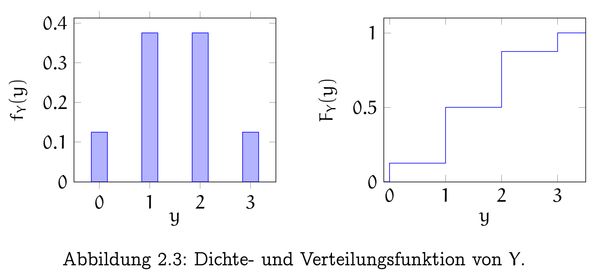

## Zufallsvariablen (Random Variables)

- **Zufallsvariable (Random Variable)**: Mathematische Funktion $X: \Omega \to \mathbb{R}$, Zuordnung Elementarereignis $\to$ reelle Zahl [^def2.25].
    - **Wertebereich $W_X$**: Menge aller durch $X$ tatsächlich angenommenen Zahlen.
- **Dichtefunktion (Probability Mass Function / Density)** $f_X(x)$:
    - Wahrscheinlichkeit für exakten Wert: $f_X(x) = \Pr[X=x]$.
- **Verteilungsfunktion (Cumulative Distribution Function)** $F_X(x)$:
    - Kumulierte Wahrscheinlichkeit bis Schwellenwert: $F_X(x) = \Pr[X \le x]$.

## Erwartungswert (Expected Value)

- **Erwartungswert $\mathbb{E}[X]$**: Erwarteter Durchschnittswert bei unendlich vielen Wiederholungen [^def2.27].
- **Absolute Konvergenz**:
    - Definition setzt **absolute Konvergenz** der Wahrscheinlichkeitssumme voraus.
    - Bei Nicht-Konvergenz (z.B. St. Petersburg Paradoxon): Erwartungswert **undefiniert**.
- **Berechnungsmethoden**:
    - Über **Wertebereich**: $\mathbb{E}[X] = \sum_{x \in W_X} x \cdot \Pr[X=x]$ [^def2.27].
    - Über **Elementarereignisse**: $\mathbb{E}[X] = \sum_{\omega \in \Omega} X(\omega) \cdot \Pr[\omega]$ [^lemma2.29].
    - Spezialfall **Natürliche Zahlen ($W_X \subseteq \mathbb{N}_0$)**: Hilfreich bei Zähl-Problemen: $\mathbb{E}[X] = \sum_{i=1}^\infty \Pr[X \ge i]$ [^satz2.30].
- **Bedingter Erwartungswert (Conditional Expectation)**:
    - Erwartungswert unter Bedingung $A$: $\mathbb{E}[X|A]$.
    - **Satz der totalen Erwartung (Law of Total Expectation)**: $\mathbb{E}[X] = \sum \mathbb{E}[X|A_i] \cdot \Pr[A_i]$ [^satz2.32]. (Ermöglicht Fallunterscheidungen).

## Indikatorvariablen (Indicator Variables)

- **Indikatorvariable $X_A$**: Werte: $1$ (Ereignis $A$ tritt ein) oder $0$ (sonst) [^beob2.35].
- **Zentrale Eigenschaft**: Erwartungswert = Wahrscheinlichkeit des Ereignisses ($\mathbb{E}[X_A] = \Pr[A]$).
- **Analytischer Zweck**: Vereinfachte Berechnung komplexer Variablen (z.B. überlappende Muster) durch Darstellung als Summe von simplen Indikatorvariablen.

## Linearität des Erwartungswerts (Linearity of Expectation)

- **Definition**: Erwartungswert einer Summe = Summe der Erwartungswerte: $\mathbb{E}[\sum a_i X_i + b] = \sum a_i \mathbb{E}[X_i] + b$ [^satz2.33].
    - Gilt **IMMER**, völlig **UNABHÄNGIG** von stochastischer Abhängigkeit der Variablen.
- **Anwendungsbeispiel: Verteiltes Rechnen (Stabile Menge)**:
    - **Problem**: Parallele Identifikation einer möglichst grossen kantenfreien Knoten-Teilmenge (Stabile Menge $S$) in einem Graphen ($n$ Knoten, $m$ Kanten) mittels lokalem Wissen.
    - **Algorithmus**:
        1. **Startauswahl**: Jeder Knoten setzt sich völlig unabhängig mit Wahrscheinlichkeit $p$ vorläufig in $S$.
        2. **Fehlerkorrektur**: Prüfung aller Kanten. Falls beide Endknoten in $S$ sind (Konflikt), wird mindestens einer davon aus $S$ entfernt.
    - **Analyse via Linearität**:
        - $X$: Anzahl Knoten nach Startauswahl. $\mathbb{E}[X] = n \cdot p$.
        - $Y$: Anzahl Konflikt-Kanten (beide Knoten initial in $S$). $\mathbb{E}[Y] = m \cdot p^2$ (Unabhängigkeit in Schritt 1 genutzt!).
        - Finale Grösse: $|S| \ge X - Y$ (pro verletzter Kante höchstens 1 Knoten entfernt).
        - $\mathbb{E}[|S|] \ge \mathbb{E}[X] - \mathbb{E}[Y] = np - mp^2$.
        - Maximierung (Ableitung nach $p$) liefert optimales $p = \frac{n}{2m} \implies \mathbb{E}[|S|] \ge \frac{n^2}{4m}$.
    - **Stochastik als Existenzbeweis (Probabilistic Method)**: Da der Zufallsalgorithmus im Erwartungswert eine Menge der Grösse $\ge \frac{n^2}{4m}$ liefert, ist mathematisch bewiesen, dass in jedem Graphen zwingend mindestens eine stabile Menge dieser Grösse **existieren muss**.

## Varianz, Standardabweichung und Momente

- **Momente (Moments)**:
    - Mathematische Verallgemeinerung zur Beschreibung von Verteilungs-Eigenschaften (konzeptionell analog zu physikalischen Momenten wie Schwerpunkt/Trägheitsmoment).
    - **$k$-tes Moment**: $\mathbb{E}[X^k]$ [^def2.42]. (1. Moment = Erwartungswert $\mu$).
    - **$k$-tes zentrales Moment**: $\mathbb{E}[(X-\mu)^k]$ [^def2.42].
    - 1. zentrales Moment = $0$ ($\mathbb{E}[X - \mathbb{E}[X]] = 0$). Positive und negative Abweichungen heben sich exakt auf.
- **Varianz $\text{Var}[X]$ (Variance)**:
    - Ist das **2. zentrale Moment**: $\text{Var}[X] = \mathbb{E}[(X-\mu)^2]$ [^def2.39].
    - **Sinn der Quadrierung**: Alle Terme positiv (kein Aufheben). Stärkere Gewichtung **grosser Ausreisser** im Vergleich zu ständigen kleinen Schwankungen.
- **Rechenregeln für die Varianz**:
    - **Alternative Formel**: $\text{Var}[X] = \mathbb{E}[X^2] - \mathbb{E}[X]^2$ [^satz2.40].
    - **Transformation**: $\text{Var}[aX + b] = a^2 \cdot \text{Var}[X]$ [^satz2.41].
    - Verschiebung $+b$: **Kein Einfluss** (Kurve verschiebt sich, Streuung um den Mittelwert bleibt identisch).
    - Skalierung $\times a$: Faktorisiert sich wegen Quadrierung in Definition als $a^2$ heraus.
- **Standardabweichung $\sigma$ (Standard Deviation)**:
    - Wurzel der Varianz: $\sigma = \sqrt{\text{Var}[X]}$ [^def2.39]. (Normiert Wert zurück auf Einheit der Zufallsvariable).

[^def2.25]: Definition 2.25. Eine Zufallsvariable ist ein Abbildung $X: \Omega \to \mathbb{R}$, wobei $\Omega$ die Ergebnismenge eines Wahrscheinlichkeitsraumes ist. Bei diskreten Wahrscheinlichkeitsräumen ist der Wertebereich einer Zufallsvariablen $W_X := X(\Omega) = \{x \in \mathbb{R} \mid \exists \omega \in \Omega \text{ mit } X(\omega) = x\}$ immer endlich oder abzählbar unendlich, je nach dem, ob $\Omega$ endlich oder abzählbar unendlich ist.
[^def2.27]: Definition 2.27. Zu einer Zufallsvariablen $X$ definieren wir den Erwartungswert $\mathbb{E}[X]$ durch $\mathbb{E}[X] := \sum_{x \in W_X} x \cdot \Pr[X = x]$, sofern die Summe absolut konvergiert. Ansonsten sagen wir, dass der Erwartungswert undefiniert ist.
[^lemma2.29]: Lemma 2.29. Ist $X$ eine Zufallsvariable, so gilt: $\mathbb{E}[X] = \sum_{\omega \in \Omega} X(\omega) \cdot \Pr[\omega]$.
[^satz2.30]: Satz 2.30. Sei $X$ eine Zufallsvariable mit $W_X \subseteq \mathbb{N}_0$. Dann gilt $\mathbb{E}[X] = \sum_{i=1}^\infty \Pr[X \ge i]$.
[^satz2.32]: Satz 2.32. Sei $X$ eine Zufallsvariable. Für paarweise disjunkte Ereignisse $A_1, \dots, A_n$ mit $A_1 \cup \dots \cup A_n = \Omega$ und $\Pr[A_1], \dots, \Pr[A_n] > 0$ gilt $\mathbb{E}[X] = \sum_{i=1}^n \mathbb{E}[X|A_i] \cdot \Pr[A_i]$. Für paarweise disjunkte Ereignisse $A_1, A_2, \dots$ mit $\bigcup_{i=1}^\infty A_i = \Omega$ und $\Pr[A_1], \Pr[A_2], \dots > 0$ gilt analog $\mathbb{E}[X] = \sum_{i=1}^\infty \mathbb{E}[X|A_i] \cdot \Pr[A_i]$.
[^beob2.35]: Beobachtung 2.35. Für ein Ereignis $A \subseteq \Omega$ ist die zugehörige Indikatorvariable $X_A$ definiert durch: $X_A(\omega) := 1, \text{ falls } \omega \in A$, und $0, \text{ sonst}$. Für den Erwartungswert von $X_A$ gilt: $\mathbb{E}[X_A] = \Pr[A]$.
[^satz2.33]: Satz 2.33. (Linearität des Erwartungswerts) Für Zufallsvariablen $X_1, \dots, X_n$ und $X := a_1X_1 + \dots + a_nX_n + b$ mit $a_1, \dots, a_n, b \in \mathbb{R}$ gilt $\mathbb{E}[X] = a_1\mathbb{E}[X_1] + \dots + a_n\mathbb{E}[X_n] + b$.
[^def2.42]: Definition 2.42. Für eine Zufallsvariable $X$ nennen wir $\mathbb{E}[X^k]$ das $k$-te Moment und $\mathbb{E}[(X - \mathbb{E}[X])^k]$ das $k$-te zentrale Moment.
[^def2.39]: Definition 2.39. Für eine Zufallsvariable $X$ mit $\mu = \mathbb{E}[X]$ definieren wir die Varianz $\text{Var}[X]$ durch $\text{Var}[X] := \mathbb{E}[(X - \mu)^2] = \sum_{x \in W_X} (x - \mu)^2 \cdot \Pr[X = x]$. Die Grösse $\sigma := \sqrt{\text{Var}[X]}$ heisst Standardabweichung von $X$.
[^satz2.40]: Satz 2.40. Für eine beliebige Zufallsvariable $X$ gilt $\text{Var}[X] = \mathbb{E}[X^2] - \mathbb{E}[X]^2$.
[^satz2.41]: Satz 2.41. Für eine beliebige Zufallsvariable $X$ und $a, b \in \mathbb{R}$ gilt $\text{Var}[a \cdot X + b] = a^2 \cdot \text{Var}[X]$.
