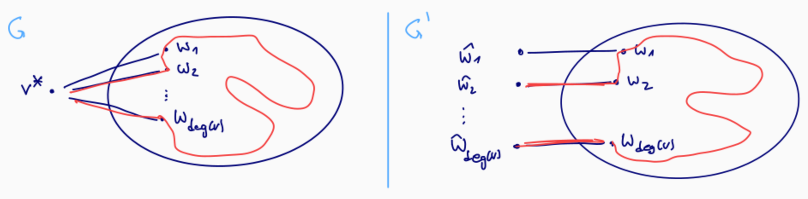

## Das Long-Path Problem

- **Problemstellung**: Existiert im Graph $G=(V, E)$ ein **Pfad** der Länge $B \in \mathbb{N}_0$?
    - **Pfad** strikt: Max. ein Besuch pro Knoten (keine Knotenwiederholung).
- **Spezialfall DAG (Directed Acyclic Graph)**: **Einfach lösbar**.
    - Ansatz: Kürzeste-Wege-Algorithmus mit Kantengewicht $-1$ (dank Zyklenfreiheit).
- **Motivation für kleine Pfade**:
    - Naive Suche testet alle Pfade $\implies$ **exponentielle Zeit** $O(n^{B+2})$.
        - Herleitung: Max. $O(n^{B+1})$ Pfade ($n$ Startknoten $\times \le n$ Kantenoptionen) $\times$ $O(n)$ Wiederholungs-Prüfung.
    - Ziel: Algorithmus mit Laufzeit $O(c^B \cdot \text{poly}(n))$ (Konstante $c \in \mathbb{R}^+$, z.B. $c = 2e$).
    - Resultat: Für kleines $B$ (z.B. $B = O(\log n)$) skaliert Algorithmus **polynomiell**.

## Schwere des Problems

- Für beliebig grosse $B$ (z.B. $B = O(n)$) **NP-schwer** via Reduktion vom **Hamiltonkreis-Problem** [^satz3.1].
- **Konstruktionsbeweis (Reduktion)**:
    1. Beliebigen Knoten $v^*$ in $G$ wählen und löschen.
    2. Alte Kanten $\{v^*, w_i\}$ durch Kanten zu **neuen "Dach-Knoten"** $\hat{w}_i$ ersetzen.
    - Neue Knoten $\hat{w}_i$ haben in $G'$ exakt **Grad 1**.
    - Resultierender Graph $G'$ hat $n' \le 2n-2$ Knoten.
        - Herleitung: $n-1$ verbleibende Knoten $+$ max. $n-1$ Dach-Knoten
- **Äquivalenz**: $G$ hat Hamiltonkreis $\iff$ $G'$ hat Pfad der Länge $n$.
    - $\implies$: Hamiltonkreis (Länge $n$) bei $v^*$ aufbrechen $\implies$ Endet an zwei Dach-Knoten in $G'$ $\implies$ Pfad mit $n+1$ Knoten (Länge $n$).
    - $\impliedby$: Pfad der Länge $n$ in $G'$ besucht $n+1$ Knoten. Nur $n-1$ innere Knoten existieren $\implies$ Enden zwingend Dach-Knoten $\implies$ Zusammenkleben in $v^*$ ergibt Hamiltonkreis.

## Color-Coding & Bunte Pfade

- **Color-Coding**: Randomisierte Methode zur effizienten Lösung für kleine $B$.
- **Zufallsfärbung**: Jedem Knoten $v \in V$ zufällig eine Farbe $\gamma(v) \in [k]$ ($k = B+1$) zuweisen.
- **Bunter Pfad** (*Colorful Path*): Pfad mit **paarweise verschiedenen Farben**.
- Kernidee: Suche nach *buntem* Pfad ist berechenbarkeitstheoretisch **einfacher** (polynomiell).

## Dynamisches Programm für Bunte Pfade

- **Ziel**: Existenzprüfung eines bunten Pfads der Länge $k-1$ in gefärbter Instanz.
- **Zustandsdefinition $P_i(v)$**: Menge aller Farbkombinationen $S \subseteq [k]$ ($|S| = i+1$), für die ein in $v$ endender bunter Pfad mit **exakt diesen Farben** existiert.
    - Ungerichtete Graphen: Start/Ende äquivalent.
- **Basisfall ($i=0$)**: $P_0(v) = \{\{\gamma(v)\}\}$ für alle $v \in V$.
- **Rekursionsschritt ($i \ge 1$)**:
    - $P_i(v) = \bigcup_{x \in N(v)} \{R \cup \{\gamma(v)\} \mid R \in P_{i-1}(x) \text{ und } \gamma(v) \notin R\}$
    - Verlängerung zu $v$ möglich, falls Nachbar $x$ bunten Pfad ohne Farbe $\gamma(v)$ besitzt.
- **Erfolgsprüfung**: Bunter Pfad existiert $\iff \bigcup_{v \in V} P_{k-1}(v) \neq \emptyset$.
- **Laufzeit der DP-Phase**:
    - Maximal $\binom{k}{i}$ Elemente in $P_{i-1}(x)$.
    - Arbeit pro Runde $i$: $\sum_{v \in V} \deg(v) \cdot \binom{k}{i} \cdot i = 2m \cdot \binom{k}{i} \cdot i$.
    - Summe über $k-1$ Runden: $2m \sum_{i=1}^{k-1} \binom{k}{i} i \le 2m \cdot k \sum_{i=0}^k \binom{k}{i} = 2m \cdot k \cdot 2^k$.
    - Resultat: $O(2^k \cdot k \cdot m)$ mit $m = |E|$.

## Wahrscheinlichkeitsanalyse & Monte-Carlo-Algorithmus

- **Wahrscheinlichkeit für bunten Pfad** [^satz3.2]:
    - Annahme: $G$ enthält Pfad $P$ der Länge $k-1$.
    - $k^k$ mögliche Gesamtfärbungen für $P$.
    - Exakt $k!$ Färbungen (Permutationen) machen $P$ bunt.
    - Wahrscheinlichkeit $p_{\text{Erfolg}} \ge \frac{k!}{k^k}$ (Worst-Case für exakt 1 Pfad).
- **Wichtige Identität**: $e^k = \sum_{i=0}^\infty \frac{k^i}{i!} \ge \frac{k^k}{k!} \implies p_{\text{Erfolg}} \ge e^{-k}$.
    - Exponentialfunktion-Potenzreihe liefert einfache exponentielle untere Schranke $e^{-k}$.
- **Monte-Carlo-Algorithmus Ablauf**:
    - Konstante $\lambda \ge 1$ wählen.
    - $N = \lceil \lambda e^k \rceil$ unabhängige Runden ausführen:
        1. Knoten uniform mit $k$ Farben färben.
        2. DP ausführen. Bei Erfolg $\implies$ Abbruch, Rückgabe **JA**.
    - Nach $N$ erfolglosen Iterationen $\implies$ Rückgabe **NEIN**.
- **Eigenschaften und Analyse** [^satz3.3]:
    - **Laufzeit**: $N \times$ DP-Laufzeit = $O(\lambda \cdot e^k \cdot 2^k \cdot k \cdot m) = O(\lambda(2e)^k k m)$.
    - **Einseitiger Fehler** (*One-Sided Error*): "JA" ist definitiver Beweis. "NEIN" potenziell falsch (Färbungs-Pech).
    - **Fehlerwahrscheinlichkeit**: Höchstens $e^{-\lambda}$.
        1. Misserfolg in Einzelrunde $\le (1 - e^{-k})$.
        2. Unabhängige Runden $\implies$ Gesamt-Misserfolg $\le (1 - e^{-k})^{\lceil \lambda e^k \rceil}$.
        3. Identität $1+x \le e^x \implies (e^{-e^{-k}})^{\lceil \lambda e^k \rceil} \ge e^{-e^{-k} \cdot \lambda e^k} \le e^{-\lambda}$.

[^satz3.1]: Satz 3.1. Falls wir LONG-PATH für Graphen mit $n$ Knoten in $t(n)$ Zeit entscheiden können, dann können wir in $t(2n - 2) + O(n^2)$ Zeit entscheiden, ob ein Graph mit $n$ Knoten einen Hamiltonkreis hat.
[^satz3.2]: Satz 3.2. Sei $G$ ein Graph mit einem Pfad der Länge $k - 1$. (1) Eine zufällige Färbung mit $k$ Farben erzeugt einen bunten Pfad der Länge $k - 1$ mit Wahrscheinlichkeit $p_{\text{Erfolg}} \ge e^{-k}$. (2) Bei wiederholten Färbungen mit $k$ Farben ist der Erwartungswert der Anzahl Versuche, bis man einen bunten Pfad der Länge $k - 1$ erhält $\frac{1}{p_{\text{Erfolg}}} \le e^k$.
[^satz3.3]: Satz 3.3. (1) Der Algorithmus hat eine Laufzeit von $O(\lambda(2e)^kkm)$. (2) Antwortet der Algorithmus mit JA, dann hat der Graph einen Pfad der Länge $k - 1$. (3) Hat der Graph einen Pfad der Länge $k - 1$, dann ist die Wahrscheinlichkeit, dass der Algorithmus mit NEIN antwortet, höchstens $e^{-\lambda}$.
