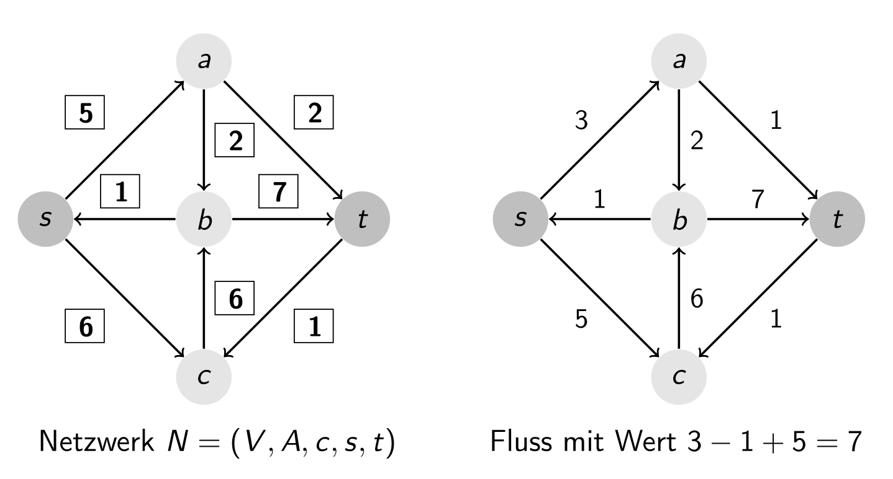
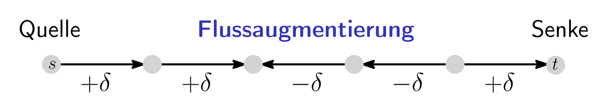
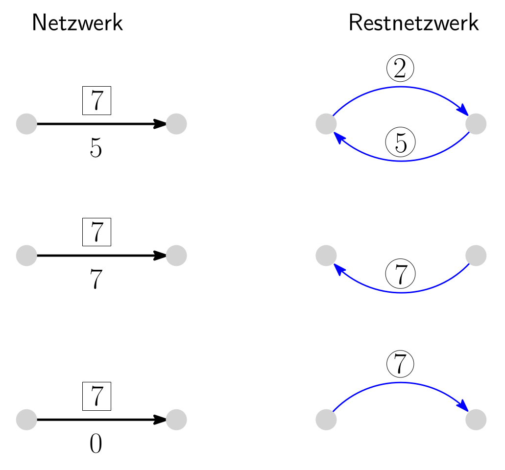
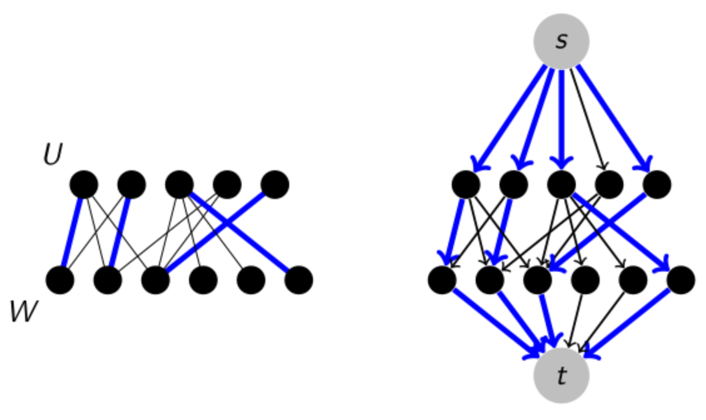
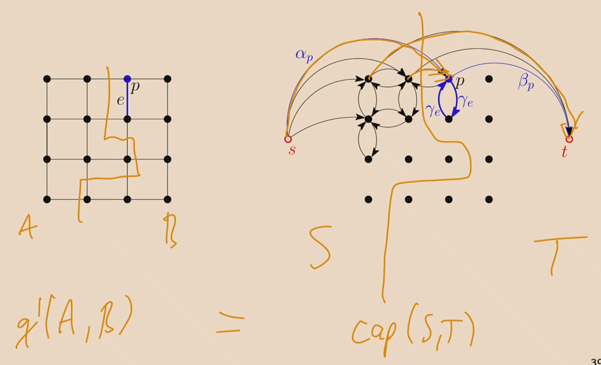

## Grundlagen

- **Netzwerk**: Gerichteter Graph, modelliert als Tupel $N = (V, A, c, s, t)$ [^def3.4]
    - $s$: **Quelle** (Source)
    - $t$: **Senke** (Target/Sink)
    - $c$: **Kapazitätsfunktion** $c: A \to \mathbb{R}_{\ge 0}^+$
    - Quelle/Senke ohne graphentheoretische Sonderrolle (Ein-/Ausgänge möglich)
- **Fluss** (Flow): Funktion $f: A \to \mathbb{R}$ mit zwei Kernbedingungen [^def3.5]:
    - **Zulässigkeit**: Keine negativen Werte, Kapazität nie überschritten ($0 \le f(e) \le c(e)$)
    - **Flusserhaltung** (Flow Conservation): Für alle inneren Knoten ($v \in V \setminus \{s,t\}$) gilt strikt: Eingehender Fluss = Ausgehender Fluss
- **Wert eines Flusses** ($\text{val}(f)$): Exakt der **Netto-Ausfluss** an Quelle $s$ [^def3.5]
- **Nettozufluss an der Senke $t$**: Entspricht exakt dem Wert $\text{val}(f)$ (da im System weder Fluss entsteht noch versickert) [^lemma3.6]

## Schnitte in Netzwerken (Cuts)

- **$s$-$t$-Schnitt** (Cut): Disjunkte Knoten-Partition $S \uplus T = V$ (mit $s \in S$, $t \in T$) [^def3.7]
- **Kapazität eines Schnitts** ($\text{cap}(S,T)$): Summe der Kanten-Kapazitäten **von $S$ nach $T$** [^def3.7]
    - **Achtung**: Kanten $T \to S$ werden bei der Kapazitätsberechnung **komplett ignoriert**!
- **Fluss vs. Schnitt (Schwache Dualität)**: Für jeden Fluss $f$ und $s$-$t$-Schnitt gilt $\text{val}(f) \le \text{cap}(S,T)$ [^lemma3.8]
    - Flaschenhals-Prinzip: Fluss übersteigt nie Schnittkapazität
    - Gilt $\text{val}(f) = \text{cap}(S,T)$, dient der Schnitt als **einfaches Zertifikat** für Maximalität von $f$
- **Maxflow-Mincut Theorem**: Maximaler Flusswert entspricht exakt minimaler Schnittkapazität [^satz3.9]
	- Konstruktiv bewiesen durch Terminierung des Ford-Fulkerson-Algorithmus (liefert resultierenden Schnitt im Restnetzwerk als Zertifikat)

## Restnetzwerke und Augmentierende Pfade

- **Ziel**: Lokale Verbesserung (Augmentierung) eines Flusses $f$
- **Augmentierender Pfad**: Ungerichteter $s$-$t$-Pfad zur Flusssteigerung:
  
    - Vorwärtskanten: Fluss erhöhen (falls $f(e) < c(e)$)
    - Rückwärtskanten: Fluss **verringern** (falls $f(e) > 0$). Flussreduktion auf Rückwärtskante wirkt effektiv wie Flusssteigerung vorwärts
- **Restnetzwerk** (Residual Network) $N_f$: Gerichteter Hilfsgraph zur einfachen Identifikation von augmentierenden Pfaden [^def3.10]
  
    - Vereinfachungs-Annahme: Originalgraph ohne entgegengerichtete Kanten
    - **Vorwärtskanten** in $N_f$: Bei Spielraum nach oben ($f(e) < c(e)$) $\to$ Kante $e$ mit **Restkapazität** $c(e) - f(e)$
    - **Rückwärtskanten** in $N_f$: Bei Spielraum nach unten ($f(e) > 0$) $\to$ Kante $e^{opp}$ mit **Restkapazität** $f(e)$
- **Charakterisierung maximaler Fluss**: Fluss $f$ ist exakt dann maximal, wenn in $N_f$ **kein gerichteter $s$-$t$-Pfad** existiert [^satz3.11]
    - **Schnitt-Extraktion**: Bei Max-Flow bilden alle in $N_f$ von $s$ aus **erreichbaren Knoten** die Menge $S$ für den minimalen Schnitt

## Der Ford-Fulkerson Algorithmus

- **Algorithmus-Ablauf**:
    1. Initialisiere Fluss $f = 0$ (alle Kanten)
    2. Solange $s$-$t$-Pfad $P$ in $N_f$ existiert:
    3. Finde minimale Restkapazität $\delta$ auf $P$
    4. Augmentiere (erhöhe/verringere) Fluss im Originalnetzwerk gemäss $P$ um $\delta$
- **Terminierung und Laufzeit**:
    - Bei $\mathbb{R}$-Kapazitäten: **Keine Terminierungsgarantie**, Konvergenz gegen suboptimale Werte möglich
    - Bei $\mathbb{N}_0$-Kapazitäten (Ganzzahlen):
        - Flusserhöhung pro Schritt mindestens 1
        - Maximaler Fluss ist beschränkt (z.B. $\le (n-1)U$, $U$ = max. Kapazität)
        - Laufzeit: $O(m \cdot n \cdot U)$ [^satz3.12]
        - **Nicht strikt polynomiell** (da Laufzeit von Zahlwert $U$, nicht Bit-Länge $\log(U)$ abhängt)
- **Schnellere (fortgeschrittene) Algorithmen**:
    - **Capacity-Scaling**: Laufzeit $O(mn(1+\log U))$ [^prop3.13]
    - **Dynamic Trees**: Laufzeit $O(mn \log n)$ [^prop3.14]
- **Praxis-Tipp (Vorlesung)**: Niemals eigene Max-Flow Solver schreiben, stattdessen etablierte, hochoptimierte Bibliotheken nutzen.

## Geometrische Interpretation (Konvexe Mengen)

- **Linearitäts-Eigenschaft**: Sind $f_0, f_1$ gültige Flüsse, ist jede gewichtete Kombination (Faktor $\lambda \in (0,1)$) ein gültiger Fluss [^lemma3.16]
- **Anzahl Flüsse**: Netzwerk besitzt stets entweder exakt einen Fluss (Null-Fluss) oder **unendlich viele** [^kor3.17] (analog für die Anzahl maximaler Flüsse)
- **Geometrie**: Als Vektoren im $\mathbb{R}^m$ interpretiert, bildet die Menge aller Flüsse (sowie aller maximalen Flüsse) eine **konvexe Teilmenge** [^def3.18] [^satz3.19]

## Anwendungen von Netzwerkflüssen

### Bipartites Matching

- **Problem**: Finde grösstes **Matching** (Kantenmenge ohne gemeinsame Endknoten) in bipartitem Graph $G = U \uplus W$
    - Naiver Greedy-Ansatz blockiert Kanten und liefert oft suboptimale Resultate
- **Reduktion auf Max-Flow**:
    - Neue Quelle $s$ mit allen Knoten in $U$ verbinden (Kapazität 1)
    - Alle Original-Kanten von $U$ nach $W$ richten (Kapazität 1)
    - Alle Knoten in $W$ mit neuer Senke $t$ verbinden (Kapazität 1)
- **Resultat**: Ein ganzzahliger maximaler Fluss entspricht exakt einem Maximum Bipartite Matching [^lemma3.15] (Laufzeit $O(nm)$ via Ford-Fulkerson, da $U=1$)

### Kanten- und knotendisjunkte Pfade

- **Kantendisjunkte Pfade**:
    - Ungerichtete Kanten $\{x,y\}$ durch **zwei entgegengerichtete Kanten** $(x,y), (y,x)$ mit Kapazität 1 ersetzen
    - Quelle $s$ auf Startknoten, Senke $t$ auf Zielknoten
    - Max-Flow entspricht exakt Anzahl disjunkter Pfade
    - Beweist den **Satz von Menger** konstruktiv: Max. Anzahl kantendisjunkter Pfade = min. Anzahl Kanten zur Trennung beider Knoten (= Min-Cut) [^satz1.25]:
    - **Pfad-Extraktion**: Starte bei $s$, folge ungebrauchten Kanten mit Fluss 1 bis $t$. Evtl. entstehende Kreise einfach entfernen.
- **Knotendisjunkte Pfade**:
    - Trick (Node Splitting): Ersetze jeden inneren Knoten $x$ durch zwei Knoten $x_{in}$ und $x_{out}$
    - Verbinde $x_{in} \to x_{out}$ mit **Kapazität 1** (zwingt Max-Flow, jeden Originalknoten nur 1x zu durchqueren)
    - Eingehende Kanten an $x_{in}$, ausgehende an $x_{out}$

### Bildsegmentierung (Image Segmentation)

- **Problem**: Partitioniere Pixelgitter $P$ in **Vordergrund** $A$ und **Hintergrund** $B$
- **Formale Qualitätsfunktion $q(A,B)$** (zu maximieren):
    - $q(A,B) := \sum_{p \in A} \alpha_p + \sum_{p \in B} \beta_p - \sum_{e \in E, |e \cap A|=1} \gamma_e$
    - $\alpha_p$: Belohnung für $p$ in Vordergrund
    - $\beta_p$: Belohnung für $p$ in Hintergrund
    - $\gamma_e$: Abzug (Strafzoll), falls benachbarte Pixel getrennt werden (verhindert Rauschen)
- **Modellierung & Umformung**:
    - Min-Cut kann nur minimieren und erlaubt keine negativen Kanten.
    - Mathematischer Trick: Konstante Gesamtsumme $S := \sum(\alpha_p + \beta_p)$ nutzen. $q(A,B)$ maximieren ist äquivalent zur **Minimierung** des Rests $q'(A,B)$:
    - $q'(A,B) := \sum_{p \in A} \beta_p + \sum_{p \in B} \alpha_p + \sum_{e \in E, |e \cap A|=1} \gamma_e$ (Ausschliesslich positive Terme!)
- **Graph-Konstruktion** (Spiegelt $q'$ exakt als Schnittkosten wider):
    - Knotenmenge $P \cup \{s, t\}$
    - Kante $s \to p$ mit Kapazität $\alpha_p$ (Zerschnitten, falls $p \in B \implies$ kostet $\alpha_p$)
    - Kante $p \to t$ mit Kapazität $\beta_p$ (Zerschnitten, falls $p \in A \implies$ kostet $\beta_p$)
    - Zwei gerichtete Gitterkanten $(p, p'), (p', p)$ mit Kapazität $\gamma_e$ (Zerschnitten, falls getrennt $\implies$ kostet $\gamma_e$)
- **Resultat**: Die Schnittkapazität $\text{cap}(A \cup \{s\}, B \cup \{t\})$ entspricht exakt dem Wert von $q'(A,B)$. Ein Min-Cut Algorithmus (via Max-Flow) liefert beweisbar die optimale Segmentierung.

[^def3.4]: Definition 3.4. Ein Netzwerk ist ein Tupel $N = (V, A, c, s, t)$, wobei gilt: $(V, A)$ ist ein gerichteter Graph, $s \in V$, die Quelle (engl.: source), $t \in V \setminus \{s\}$, die Senke (engl.: target), und $c : A \to \mathbb{R}_{\ge 0}^+$, die Kapazitätsfunktion (engl.: capacity function).
[^def3.5]: Definition 3.5. Gegeben sei ein Netzwerk $N = (V, A, c, s, t)$. Ein Fluss in $N$ ist eine Funktion $f : A \to \mathbb{R}$ mit den Bedingungen $0 \le f(e) \le c(e)$ für alle $e \in A$, die Zulässigkeit, und für alle $v \in V \setminus \{s, t\}$ gilt $\sum_{u \in V : (u,v) \in A} f(u, v) = \sum_{u \in V : (v,u) \in A} f(v, u)$ die Flusserhaltung. Der Wert (engl.: value) eines Flusses $f$ ist durch $\text{val}(f) := \text{netoutflow}(s) := \sum_{u \in V : (s,u) \in A} f(s, u) - \sum_{u \in V : (u,s) \in A} f(u, s)$ definiert. Wir nennen $f$ ganzzahlig, wenn $f(e) \in \mathbb{Z} \ \forall e \in A$.
[^lemma3.6]: Lemma 3.6. Der Nettozufluss der Senke gleicht dem Wert des Flusses, d.h. $\text{netinflow}(t) := \sum_{u \in V : (u,t) \in A} f(u, t) - \sum_{u \in V : (t,u) \in A} f(t, u) = \text{val}(f)$.
[^def3.7]: Definition 3.7. Ein $s$-$t$-Schnitt für ein Netzwerk $(V, A, c, s, t)$ ist eine Partition $(S, T)$ von $V$ (d.h. $S \cup T = V$ und $S \cap T = \emptyset$) mit $s \in S$ und $t \in T$. Die Kapazität eines $s$-$t$-Schnitts $(S, T)$ ist durch $\text{cap}(S, T) := \sum_{(u,w) \in (S \times T) \cap A} c(u, w)$ definiert.
[^lemma3.8]: Lemma 3.8. Ist $f$ ein Fluss und $(S, T)$ ein $s$-$t$-Schnitt in einem Netzwerk $(V, A, c, s, t)$, so gilt $\text{val}(f) \le \text{cap}(S, T)$.
[^satz3.9]: Satz 3.9 ("Maxflow-Mincut Theorem"). Jedes Netzwerk $N = (V, A, c, s, t)$ erfüllt $\max_{f \text{ Fluss in } N} \text{val}(f) = \min_{(S,T) \text{ } s\text{-}t\text{-Schnitt in } N} \text{cap}(S, T)$
[^def3.10]: Definition 3.10. Sei $N = (V, A, c, s, t)$ ein Netzwerk ohne entgegen gerichtete Kanten und sei $f$ ein Fluss in $N$. Das Restnetzwerk $N_f := (V, A_f, r_f, s, t)$ ist wie folgt definiert: (1) Ist $e \in A$ mit $f(e) < c(e)$, dann ist $e$ auch eine Kante in $A_f$, mit $r_f(e) := c(e) - f(e)$. (2) Ist $e \in A$ mit $f(e) > 0$, dann ist $e^{opp}$ in $A_f$, mit $r_f(e^{opp}) = f(e)$. (3) Nur Kanten wie in (1) und (2) beschrieben finden sich in $A_f$. $r_f(e), e \in A_f$, nennen wir die Restkapazität der Kante $e$.
[^satz3.11]: Satz 3.11. Ein Fluss $f$ in einem Netzwerk $N$ ist ein maximaler Fluss gdw. es im Restnetzwerk $N_f$ keinen gerichteten Pfad von der Quelle $s$ zur Senke $t$ gibt. Für jeden solchen maximalen Fluss gibt es einen $s$-$t$-Schnitt $(S, T)$ mit $\text{val}(f) = \text{cap}(S, T)$.
[^satz3.12]: Satz 3.12. Sind in einem Netzwerk ohne entgegen gerichtete Kanten alle Kapazitäten ganzzahlig und höchstens $U$, so gibt es einen ganzzahligen maximalen Fluss, der in Zeit $O(mnU)$ berechnet werden kann ($m$ ist die Anzahl Kanten, $n$ die Anzahl Knoten im Netzwerk).
[^prop3.13]: Proposition 3.13 (Capacity-Scaling, Dinitz-Gabow, 1973). Sind in einem Netzwerk alle Kapazitäten ganzzahlig und höchstens $U$, so gibt es einen ganzzahligen maximalen Fluss, der in Zeit $O(mn(1 + \log U))$ berechnet werden kann ($m$ Anzahl Kanten, $n$ Anzahl Knoten).
[^prop3.14]: Proposition 3.14 (Dynamic Trees, Sleator-Tarjan, 1983). Der maximale Fluss eines Netzwerks kann in Zeit $O(mn \log n)$ berechnet werden ($m$ Anzahl Kanten, $n$ Anzahl Knoten).
[^lemma3.16]: Lemma 3.16. Sind $f_0$ und $f_1$ Flüsse in einem Netzwerk $N$ und $\lambda \in \mathbb{R}$, $0 < \lambda < 1$, dann ist der Fluss $f_\lambda$, definiert durch $\forall e \in A : f_\lambda(e) := (1 - \lambda)f_0(e) + \lambda f_1(e)$, ebenfalls ein Fluss in $N$. Es gilt $\text{val}(f_\lambda) = (1 - \lambda) \cdot \text{val}(f_0) + \lambda \cdot \text{val}(f_1)$.
[^kor3.17]: Korollar 3.17. Es gilt: (i) Ein Netzwerk $N$ hat entweder genau einen Fluss (den Fluss $0$) oder unendlich viele Flüsse. (ii) Ein Netzwerk hat entweder genau einen maximalen Fluss, oder unendlich viele maximale Flüsse.
[^def3.18]: Definition 3.18. Sei $m \in \mathbb{N}$. (i) Für $v_0, v_1 \in \mathbb{R}^m$ sei $\overline{v_0v_1} := \{(1 - \lambda)v_0 + \lambda v_1 \mid \lambda \in \mathbb{R}, 0 \le \lambda \le 1\}$, das $v_0$ und $v_1$ verbindende Liniensegment. (ii) Eine Menge $C \subseteq \mathbb{R}^m$ heisst konvex, falls für alle $v_0, v_1 \in C$ das ganze Liniensegment $\overline{v_0v_1}$ in $C$ enthalten ist.
[^satz3.19]: Satz 3.19. Die Menge der Flüsse eines Netzwerks mit $m$ Kanten, interpretiert als Vektoren, ist eine konvexe Teilmenge des $\mathbb{R}^m$. Ebenso bildet die Menge der maximalen Flüsse eine konvexe Teilmenge des $\mathbb{R}^m$.
[^lemma3.15]: Lemma 3.15. Die maximale Grösse eines Matchings im bipartiten Graph $G$ ist gleich dem Wert eines maximalen Flusses im Netzwerk $N$.
[^satz1.25]: Satz 1.25 (Menger). Sei $G = (V, E)$ ein Graph und $u, v \in V, u \neq v$. Dann gilt: a) Jeder $u$-$v$-Knotenseparator hat Grösse mindestens $k \iff$ Es gibt mindestens $k$ intern-knotendisjunkte $u$-$v$-Pfade. b) Jeder $u$-$v$-Kantenseparator hat Grösse mindestens $k \iff$ Es gibt mindestens $k$ kantendisjunkte $u$-$v$-Pfade.
