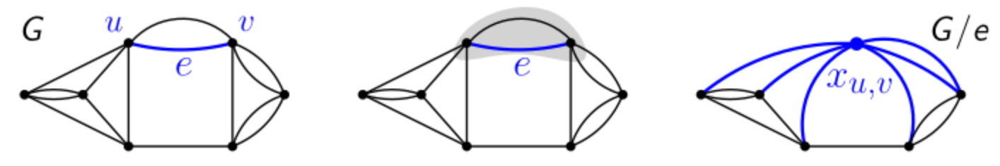

## Problemstellung & Grundlagen

- **MIN-CUT Problem**: Kardinalität $\mu(G)$ eines **minimalen Kantenschnitts** (Minimum Cut) in **Multigraph** $G = (V, E)$ finden.
    - *Abgrenzung zu Flüssen*: Keine Start-/Zielknoten ($s, t$). Beliebige Trennung in zwei nicht-leere Komponenten $S \uplus T = V$.
- **Multigraph**: Ungerichtet, ungewichtet, schleifenfrei. Erlaubt **Mehrfachkanten** (parallele Kanten).
    - **Knotengrad** $\deg(v)$: Anzahl **inzidenter Kanten** (nicht Anzahl Nachbarknoten!).
    - *Summensatz*: $|E| = \frac{1}{2} \sum_{v \in V} \deg(v)$.
- **Eigenschaften und Schranken**:
    - Unzusammenhängender Graph: $\mu(G) = 0$.
    - **Obere Schranke**: $\mu(G) \le \min_{v \in V} \deg(v)$ (Entfernung aller Kanten eines Knotens isoliert diesen garantiert).

## Deterministischer Lösungsansatz (Baseline)

- **Reduktion auf $s$-$t$-Schnitt**:
    - Fixiere beliebigen Knoten $s \in V$.
    - Iteriere über alle verbleibenden $t \in V \setminus \{s\}$.
    - Mindestens ein $t$ liegt garantiert auf der anderen Seite des globalen minimalen Schnitts.
- **Laufzeit**:
    - $n-1$ Ausführungen nötig.
    - Mit existierendem Algorithmus ($O(mn \log n)$) $\implies$ Gesamtzeit $O(n^4 \log n)$.
    - Dient als zu unterbietende **Messlatte**.

## Kantenkontraktion (Edge Contraction)

- **Mechanismus** $G/e$:
    - Kontraktion von $e = \{u, v\}$ verschmilzt $u, v$ zu neuem Knoten $x_{u,v}$.
    - Kanten *zwischen* $u, v$ verschwinden ($k$ Stück).
    - Restliche Kanten bleiben; gemeinsame Nachbarn erzeugen **Mehrfachkanten**.
    - Neuer Grad: $\deg_{G/e}(x_{u,v}) = \deg_G(u) + \deg_G(v) - 2k$.
- **Auswirkung auf Schnitte**:
    - Natürliche Bijektion zwischen Schnitten in $G$ (ohne $e$) und allen Schnitten in $G/e$.
    - Schnitte durch $e$ verschwinden in $G/e$.
- **Erhaltung des minimalen Schnitts**:
    - Grösse fällt durch Kontraktion nie: $\mu(G/e) \ge \mu(G)$ [^lemma3.20].
    - Bleibt exakt erhalten ($\mu(G/e) = \mu(G)$), falls $e$ **nicht** im minimalen Schnitt $C$ liegt [^lemma3.20].

## Randomisierter Algorithmus (Karger's Algorithmus)

- **Algorithmus `Cut(G)`**:
    1. Solange $> 2$ Knoten: Wähle **gleichverteilt zufällig** Kante $e \in E$.
    2. Kontrahiere $G \leftarrow G/e$.
    3. Bei 2 Knoten: Verbleibende Kanten bilden den Schnitt.
- **Implementierungs-Details & Fallstricke**:
    - Einzelschritt in $O(n)$ $\implies$ Gesamtlaufzeit $O(n^2)$.
    - Mehrfachkanten zwingend als **Kantengewichte** modellieren (Speicherplatz).
    - **Fataler Fehler**: Zufällige Knotenwahl zerstört Gleichverteilung! Kanten zwingend **proportional zum Gewicht** (Multiplizität) ziehen.

## Erfolgswahrscheinlichkeit & Fehlerreduktion

- **Erfolgswahrscheinlichkeit Einzelschritt**:
    - Chance auf "gute" Kante ($e \notin C$): $\Pr[e \notin C] \ge 1 - \frac{2}{n}$ [^lemma3.21].
    - *Beweis*: $\mu(G) = k \implies \forall v: \deg(v) \ge k \implies |E| \ge \frac{kn}{2}$. Trefferwahrscheinlichkeit auf $C$: $\frac{k}{|E|} \le \frac{k}{kn/2} = \frac{2}{n}$.
- **Gesamtwahrscheinlichkeit** $\hat{p}(n)$:
    - Erfolg erfordert *ausschliesslich* gute Kanten-Ziehungen.
    - Rekursion: $\hat{p}(n) \ge (1 - \frac{2}{n}) \cdot \hat{p}(n-1)$ [^lemma3.22].
    - Teleskopierendes Produkt liefert $\hat{p}(n) \ge \frac{2}{n(n-1)} = 1/\binom{n}{2}$ [^lemma3.23].
- **Fehlerreduktion (Boosten)**:
    - **Einseitiger Fehler** (Resultat nie zu klein).
    - Ausführung $N = \lambda \binom{n}{2}$ mal, Minimum ausgeben $\implies$ Laufzeit $O(\lambda n^4)$ [^satz3.24].
    - Fehlerrate $e^{-\lambda}$ [^satz3.24]:
        - Wahrscheinlichkeit für Fehler in 1 Versuch: $\le 1 - 1/\binom{n}{2}$.
        - Fehler in allen $N$ Versuchen: $\le (1 - 1/\binom{n}{2})^{\lambda \binom{n}{2}}$.
        - Mit Identität $1-x \le e^{-x}$ folgt: Fehlerrate $\le (e^{-1/\binom{n}{2}})^{\lambda \binom{n}{2}} = e^{-\lambda}$.
    - *Ernüchterung*: Mit $\lambda = \ln n$ folgt Laufzeit $O(n^4 \log n)$ bei Fehler $\le 1/n$. Deterministische Messlatte nicht unterboten.

## Bootstrapping & Karger-Stein-Algorithmus

- **Kritische Phase**:
    - Fehlerrate explodiert am Ende der Ausführung.
    - Schritt $4 \to 3$ Knoten: $50\%$ Fehler. Schritt $3 \to 2$ Knoten: **$\sim 66\%$ Fehler**.
- **Bootstrapping-Idee**:
    - `Cut(G)` bei $t$ Knoten frühzeitig abbrechen.
    - Restgraph deterministisch (oder geboostet) in $O(t^4)$ lösen.
- **Laufzeit-Optimierung**:
    - Erfolgswahrscheinlichkeit bis $t$ ist $\approx \frac{t^2}{n^2}$. Benötigte Wiederholungen $\approx \frac{n^2}{t^2}$.
    - Gesamtlaufzeit: $O\left(\lambda \left(\frac{n^4}{t^2} + n^2 t^2\right)\right)$ (Rest-Algorithmus + Kontraktionsphase).
    - Ableitung/Minimierung liefert optimales $t = n^{1/2}$ ($\sqrt{n}$) $\implies$ verbesserte Laufzeit **$O(n^3)$**.
- **Karger-Stein im Limit**:
    - Neuen $O(n^3)$-Algorithmus wiederum für den Restgraphen ($t$) einsetzen.
    - Algorithmus in $O(n^c) \implies$ optimales $t = n^{2/c} \implies$ neue Laufzeit $O(n^{4 - 4/c})$.
    - Iteration ($c=4 \to 3 \to 2.66 \dots$) konvergiert gegen **$O(n^2 \text{polylog}(n))$**.

[^lemma3.20]: Lemma 3.20. Sei $G$ ein Graph und $e$ eine Kante in $G$. Dann gilt $\mu(G/e) \ge \mu(G)$ und falls es in $G$ einen minimalen Schnitt $C$ mit $e \notin C$ gibt, dann gilt $\mu(G/e) = \mu(G)$.
[^lemma3.21]: Lemma 3.21. Sei $G = (V, E)$ ein Multigraph mit $n$ Knoten. Falls $e$ gleichverteilt zufällig unter den Kanten in $G$ gewählt wird, dann gilt $\Pr[\mu(G) = \mu(G/e)] \ge 1 - \frac{2}{n}$.
[^lemma3.22]: Lemma 3.22. Es gilt für alle $n \ge 3$: $\hat{p}(n) \ge (1 - 2/n) \cdot \hat{p}(n - 1)$.
[^lemma3.23]: Lemma 3.23. Es gilt $\hat{p}(n) \ge \frac{2}{n(n-1)} = 1/\binom{n}{2}$ für alle $n \ge 2$.
[^satz3.24]: Satz 3.24. Für den Algorithmus der $\lambda \binom{n}{2}$-maligen Wiederholung von $\text{Cut}(G)$ gilt: (1) Der Algorithmus hat eine Laufzeit von $O(\lambda n^4)$. (2) Der kleinste angetroffene Wert ist mit einer Wahrscheinlichkeit von mindestens $1 - e^{-\lambda}$ gleich $\mu(G)$.
